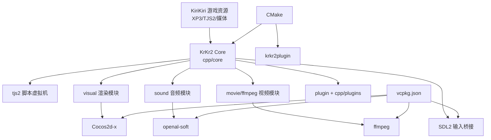

# KrKr2 模拟器定位

> **所属模块：** M01-项目导览与环境搭建
> **前置知识：** [01-KiriKiri历史与生态.md](./01-KiriKiri历史与生态.md)
> **预计阅读时间：** 40 分钟

## 本节目标

读完本节后，你将能够：

1. 用工程化视角说明 KrKr2 在 KiriKiri 生态中的角色与边界。
2. 解释 KrKr2 为什么选择“重实现”而不是直接移植原版代码。
3. 根据仓库内的 CMake 与 vcpkg 配置，描述项目技术栈与依赖分层。
4. 说清楚 Windows/Linux/macOS/Android 四平台当前适配方式与限制。
5. 独立定位“应去哪里看源码”来验证一个功能是否已经实现。

## 1. 为什么我们需要 KrKr2 模拟器？

KiriKiri2 引擎虽然强大且经典，但它诞生于 20 世纪初的 Windows 平台。这意味着它存在一个致命的局限：**原生仅支持 Windows**。

在当今多元化的设备环境中，玩家不仅在 PC 上玩游戏，还在 Android 手机、iPhone、macOS 笔记本，甚至是运行 Linux 的 Steam Deck 上进行娱乐。
- **用户需求**：希望在移动平台或非 Windows 电脑上体验经典的 Galgame。
- **历史包袱**：大量的 KiriKiri 游戏代码库（TJS2/KAG）都是为旧版 Windows 编写的。
- **跨平台难题**：要让这些游戏运行在手机上，不可能要求当年的游戏公司（许多已经解散）回来重写代码。

于是，**KrKr2 模拟器**应运而生。它的任务是：**提供一个兼容环境，让原本为 Windows 开发的 KiriKiri 游戏无需修改即可在多平台上运行。**

### 1.1 问题本质：不是“跑起来”这么简单

很多同学第一次接触模拟器，会把目标理解为“能启动 EXE 或脚本就行”。在 KiriKiri 生态里，这个理解不够。

KrKr2 实际要解决的是三层兼容性：

1. **脚本层兼容**：TJS2 语义、对象模型、异常行为尽量贴近原引擎。
2. **资源层兼容**：XP3/ZIP/TAR/7z 等封包读取、图片/音频/视频解码一致。
3. **插件层兼容**：历史 `.dll` 插件行为复现，或通过替代实现提供同等能力。

这三层只要有一层偏差，游戏就可能出现脚本报错、立绘错位、音画不同步、存档损坏等问题。

### 1.2 KrKr2 的边界：它是“兼容运行时”，不是游戏重制工具

KrKr2 的定位是“兼容运行时（Compatibility Runtime）”，而不是：

- 给老游戏自动高清重制；
- 把所有 KiriKiri 历史分支一次性做满；
- 面向所有视觉小说引擎做通用适配。

这种边界非常重要：它让团队可以把精力集中在可验证、可迭代的兼容目标上，而不是陷入“功能清单无限膨胀”。

---

## 2. 项目目标与定位

### 重新实现，而非 Fork
KrKr2 不是简单的代码移植（Fork），而是一次**彻底的重新实现**。
- **原版**：深度依赖 Windows 的 API（如 GDI+, DirectShow, COM 组件）。
- **KrKr2**：使用现代跨平台框架和标准 C++，模拟原版 KiriKiri2 的所有行为。

### 支持的平台
为了覆盖最广泛的用户，KrKr2 目标支持：
- **Windows x64**：提供现代化的运行环境。
- **Linux x64**：适配国产系统和 Steam Deck。
- **macOS arm64**：支持苹果 M 系列芯片。
- **Android arm64/x86_64**：满足手机和平板玩家的需求。

### 当前支持的游戏：唯一的目标
由于 KiriKiri 引擎极其复杂且插件繁多，KrKr2 模拟器目前的开发策略是“按需适配”。
目前，本项目完美支持的游戏仅有 1 款：
- **名称**：天神乱漫 - LUCKY or UNLUCKY!?
- **发行日期**：2009 年 5 月 29 日
- **意义**：这款游戏使用了 KiriKiri2 的典型功能（XP3 打包、大量 TJS2 逻辑、音频/视频插件），是检验模拟器兼容性的最佳标杆。

### 2.1 愿景：用现代工程能力延续 KiriKiri 内容资产

从仓库结构和构建配置可以看出，KrKr2 的目标不是“临时补丁式移植”，而是建立一套可持续维护的跨平台运行时。

它的长期价值体现在三点：

- **资产延寿**：让历史 KiriKiri 游戏在新硬件和新系统继续可玩。
- **开发可持续**：采用 C++17 + CMake + vcpkg，降低“只有原作者能维护”的风险。
- **社区协作**：MIT 协议降低二次开发门槛，便于社区补齐插件和平台适配。

### 2.2 非目标（避免误解）

为了保持节奏，当前阶段 KrKr2 明确不把以下内容作为短期承诺：

1. iOS 完整发布链路（根 CMake 中 iOS 段仍被注释）。
2. 所有历史第三方插件一次性全量兼容。
3. 对每款游戏都做“零差异像素级复刻”。

---

## 3. 技术选型：现代 C++ 的力量

为了在不同平台上实现高性能且一致的表现，KrKr2 选择了以下技术栈：

### 开发语言：C++17
C++17 提供了优秀的类型系统和内存管理机制，适合处理游戏引擎这种底层任务。

### 渲染引擎：Cocos2d-x
虽然 Cocos2d-x 多用于手游开发，但其优秀的 2D 渲染管线非常适合模拟 KiriKiri 的“多层绘图”逻辑。它可以跨平台处理图片、位移、缩放和转场特效。

### 其他依赖组件
- **SDL2**：处理跨平台的键盘、鼠标和触摸输入。
- **OpenAL**：提供沉浸式的 3D 音频定位和环绕声效果。
- **vcpkg**：用于管理庞大的第三方库（如 FFmpeg, spdlog 等）。
- **CMake + Ninja**：提供快速且统一的构建系统。

### 3.1 从 `vcpkg.json` 反推技术栈全景

项目不是“口头说用了哪些库”，而是把依赖写进 `vcpkg.json`。这意味着技术路线可审计、可复现。

| 领域 | 关键依赖 | 作用 |
|---|---|---|
| 渲染/引擎壳层 | `cocos2dx` | 提供跨平台窗口、场景、渲染循环、资源系统 |
| 音视频 | `ffmpeg`、`openal-soft`、`libvorbis`、`opus/opusfile` | 负责媒体解码与播放链路 |
| 输入/窗口辅助 | `sdl2`、`glfw3` | 输入事件与平台抽象协同 |
| 图像/资源格式 | `libjpeg-turbo`、`libwebp`、`jxrlib`、`libarchive`、`7zip`、`unrar`、`zstd`、`lz4` | 处理图片与压缩封包格式 |
| 脚本与文本生态 | `oniguruma`、`uchardet`、`boost-*` | 正则、编码探测、文本与解析能力 |
| 工程工具 | `fmt`、`spdlog`、`catch2`、`vcpkg-cmake` | 日志、格式化、测试、构建集成 |
| 平台特化 | `breakpad`(Android)、`dirent`(Windows)、`libgdiplus`(非 Windows) | 平台差异补齐 |

### 3.2 为什么是 Cocos2d-x 而不是“从零写渲染层”

KiriKiri 游戏的核心是 2D 分层渲染、文本框、转场、UI 控件与输入协作。Cocos2d-x 的优势是：

1. **跨平台能力成熟**：Windows/Linux/macOS/Android 路径现成，减少平台起步成本。
2. **渲染主循环稳定**：`AppDelegate` + `Director` 生命周期模型清晰。
3. **生态配套完整**：资源加载、事件分发、调度器、OpenGL 上下文管理现成。

代价是：引擎体量偏大、部分子系统历史包袱重。这也是项目未来考虑 UI 层替换的原因之一。

### 3.3 为什么是 FFmpeg

原版 KiriKiri 在 Windows 上常依赖 DirectShow 一类系统多媒体能力。跨平台项目要避免被某平台系统 API 绑定，FFmpeg 是更稳妥选择：

- **解码格式覆盖广**，适配历史资源时成功率高；
- **跨平台一致性好**，行为可控；
- 与项目的 C++ 代码协作成熟，便于调试与性能优化。

### 3.4 为什么是 vcpkg + CMake

KrKr2 同时覆盖桌面与移动平台，依赖多且平台差异大。vcpkg + CMake 组合在这个场景下收益明显：

1. **依赖声明化**：依赖版本、平台条件在 `vcpkg.json` 可追踪。
2. **构建可迁移**：新成员按同一清单拉依赖，减少“我机子能编你机子不能编”。
3. **跨平台条件表达清晰**：如 `breakpad` 仅 Android、`catch2` 排除 Android/iOS。

### 3.5 技术栈关系图（Mermaid）



## 4. KrKr2 与原版的关系

虽然目标是“模拟”，但 KrKr2 的授权方式非常友好。

### 许可证：MIT
这意味着任何人都可以自由地使用、修改、分发 KrKr2 的源代码，甚至用于商业用途，只要保留原始的版权声明即可。

### 不是 Fork
再次强调，KrKr2 是对 KiriKiri 行为的再创造。原版 KiriKiri 的核心是由渡邊哲也使用 Pascal (Delphi) 和 C++ 编写的。而 KrKr2 的核心是全新的 C++17 代码。这种独立性使得 KrKr2 能够更容易地绕过原版的 Windows 历史遗留问题。

### 4.1 功能对比：KiriKiri2 / KiriKiriZ / KrKr2

> 说明：下表基于当前仓库文档与构建配置梳理，状态使用“已实现 / 部分实现 / 未实现（或未启用）”。

| 能力项 | KiriKiri2（历史） | KiriKiriZ（分支） | KrKr2（本仓库） | 说明 |
|---|---|---|---|---|
| TJS2 运行时 | 已实现 | 已实现 | 已实现 | `cpp/core/tjs2` 为独立模块 |
| XP3 资源封包 | 已实现 | 已实现 | 已实现 | `cpp/core/base` 含 XP3 处理 |
| 多平台运行 | 主要 Windows | 主要 Windows | Win/Linux/macOS/Android | 根 CMake 含四平台入口 |
| 视频播放 | Windows 生态依赖 | 分支实现不一 | 已实现（FFmpeg 路线） | `cpp/core/movie/ffmpeg` |
| 插件生态兼容 | 丰富 | 丰富 | 部分实现 | `doc/krkr2_plugins.md` 可见大量待补项 |
| Android 原生支持 | 非主线 | 非主线 | 已实现 | `platforms/android` JNI 桥接 |
| iOS 支持 | 无 | 无 | 未完成 | 根 CMake iOS 段为注释状态 |
| 测试体系 | 历史项目不统一 | 不统一 | 有（Catch2） | `ENABLE_TESTS` + `tests/` |

### 4.2 关于“兼容”要避免的两个误区

1. **误区一：兼容等于 100% 行为一致**
   - 工程上追求的是“对目标游戏可用且稳定”，不是理论上的全域完美模拟。
2. **误区二：只要核心引擎好，插件可忽略**
   - KiriKiri 生态中，插件承担了大量扩展功能；插件不通，很多游戏就无法进入主流程。

### 4.3 插件现状的现实意义

`doc/krkr2_plugins.md` 共列出约 54 个 DLL 项。部分有公开源码来源，部分标记为 `nan`。这会直接影响技术路线：

- 对有源码插件：优先做“行为对齐 + 跨平台改造”；
- 对无源码插件：需要逆向分析、样本测试、行为复刻；
- 对高频插件：优先级更高，因为它决定兼容游戏面。

---

## 5. 开发现状与未来挑战

### 插件逆向难题
KiriKiri 的生态系统中有大量的 `.dll` 插件。
- **现状**：KiriKiri 官方支持约 54 个核心插件。
- **难题**：在这 54 个插件中，约有 10 个左右被标记为 `nan`（无源码）。这意味着开发者无法通过阅读源代码来复现其功能，必须通过**逆向工程（Reverse Engineering）**来推导其逻辑并重新实现。

### 未来方向
1. **扩大兼容性**：在完美支持《天神乱漫》后，逐步扩展到其他主流 Galgame。
2. **UI 框架替换**：由于 Cocos2d-x 逐渐停止维护且体量庞大，未来考虑使用更轻量级的 UI 框架（如 ImGui 或自研框架）。
3. **性能极致优化**：在移动端提供更低的功耗和更流畅的转场特效。

### 5.1 架构设计哲学：模块化 + 抽象层 + 可替换实现

从 `cpp/core/CMakeLists.txt` 可以看到，`krkr2core` 是一个聚合性 INTERFACE 目标，向下组织了多个核心模块：

- `tjs2`（脚本）
- `core_base_module`（封包/基础 I/O）
- `core_environ_module`（平台抽象与 UI 桥接）
- `core_movie_module`（视频）
- `core_sound_module`（音频）
- `core_visual_module`（渲染）
- `core_plugin_module`（插件系统）
- `core_utils_module`（通用工具）

这种组织方式带来两个收益：

1. **边界清晰**：问题定位时可先锁定模块，再深入文件级排查。
2. **替换成本可控**：例如未来替换某个子系统，不必整体推倒重来。

### 5.2 启动链路：多平台入口统一汇聚到 AppDelegate

四个平台入口文件不同，但核心汇聚点一致：创建 `TVPAppDelegate` 并运行。

```text
Windows: platforms/windows/main.cpp        -> TVPAppDelegate::run()
Linux:   platforms/linux/main.cpp          -> TVPAppDelegate::run()
macOS:   platforms/apple/macos/main.cpp    -> TVPAppDelegate::run()
Android: platforms/android/cpp/krkr2_android.cpp
         -> cocos_android_app_init()
         -> 创建 TVPAppDelegate
```

这说明 KrKr2 的平台策略是“薄入口 + 厚核心”：

- 平台目录负责启动、日志初始化、少量参数桥接；
- 真正行为落在 `cpp/core/environ/cocos2d/AppDelegate.cpp` 与核心模块。

### 5.3 平台适配现状与限制（四平台对照）

| 平台 | 入口文件 | 现状 | 主要限制/注意点 |
|---|---|---|---|
| Windows x64 | `platforms/windows/main.cpp` | 可构建可运行 | 依赖 Windows 资源脚本与窗口细节处理 |
| Linux x64 | `platforms/linux/main.cpp` | 可构建可运行 | 启动前调用 `gtk_init`，需系统 GTK 环境 |
| macOS arm64 | `platforms/apple/macos/main.cpp` | 可构建可运行 | Bundle 资源与 plist 配置需要保持一致 |
| Android arm64/x86_64 | `platforms/android/cpp/krkr2_android.cpp` | 可构建可运行 | JNI 输入桥接复杂，含 breakpad 与 SDL 动态加载 |

补充说明：

- iOS 相关构建段在根 CMake 里存在但注释，说明当前不在稳定支持范围。
- Android 端有较多 JNI 事件转发代码，后续排错优先看此处。

### 5.4 项目当前状态（基于文档与配置）

1. **已明确支持的游戏**：`doc/support_games.txt` 仅列《天神乱漫LUCKY or UNLUCKY!?》。
2. **插件实现仍在推进**：插件清单显示部分来源缺失（`nan`），存在逆向压力。
3. **测试基础已搭好**：`ENABLE_TESTS` 默认开启（非 Android/iOS），测试框架为 Catch2。
4. **工具链工程化较完整**：vcpkg manifest、CMake 预设、平台入口分离。

### 5.5 路线图建议（面向贡献者）

结合当前仓库状态，可把路线拆为三层：

- **短期（兼容优先）**：围绕高频插件与目标游戏做行为闭环。
- **中期（架构演进）**：优化 UI 层技术债，降低 Cocos2d-x 绑定深度。
- **长期（生态扩展）**：完善插件 API 覆盖，扩大可验证游戏列表。

### 5.6 与相近项目的对比思路
社区里存在 Kirikiroid2、部分 krkrz 分支等相关实践。KrKr2 的区别在于：
1. **仓库结构完整、目标明确**：核心模块/插件/平台入口/测试目录齐备。
2. **构建链路标准化**：CMake + vcpkg 对多平台团队协作更友好。
3. **教程化推进**：`docs/` 明确面向开发者学习与贡献路径。
这并不意味着“谁绝对更好”，而是代表 KrKr2 当前采取的是“工程化协作优先”的路线。

### 5.7 功能实现状态表（按仓库可验证信息）

| 功能域 | 当前状态 | 验证依据 | 备注 |
|---|---|---|---|
| 多平台入口 | 已实现 | `platforms/windows/main.cpp`、`platforms/linux/main.cpp`、`platforms/apple/macos/main.cpp`、`platforms/android/cpp/krkr2_android.cpp` | 四端入口均存在并汇聚到 `TVPAppDelegate` |
| 测试体系 | 已实现 | 根 `CMakeLists.txt` 中 `ENABLE_TESTS` 默认 `ON`（排除 Android/iOS） | 测试目录位于 `tests/` |
| 插件框架 | 已实现（兼容面部分） | `cpp/plugins/` + `doc/krkr2_plugins.md` | 清单中存在多个 `nan`，说明仍在推进 |
| iOS 发布链路 | 未启用 | 根 `CMakeLists.txt` 中 iOS 相关段落被注释 | 目前不在稳定支持范围 |
| 已验证支持游戏 | 范围较小 | `doc/support_games.txt`（文档已注明） | 当前以单游戏深度兼容为策略 |

## 常见错误

### 错误 1：把"模拟器"理解为"虚拟机"

KrKr2 不是像 QEMU 或 Bochs 那样的硬件虚拟化工具。它是一个功能等价的运行时重实现——用现代 C++17 + 跨平台框架重写原版 KiriKiri2 的行为，使其能在非 Windows 平台运行。理解错误会导致设计方向偏差。

### 错误 2：认为跨平台只是"换个编译器"

跨平台不仅仅是代码能编译通过。原版 KiriKiri2 深度依赖 GDI+、DirectShow、COM 等 Windows 专有 API。KrKr2 需要用 Cocos2d-x、FFmpeg、OpenAL 等跨平台库逐一替代这些能力，并确保行为一致。如果只关注编译通过而忽略运行时行为差异，会产生大量"能跑但不对"的 bug。

### 错误 3：跳过文档验证直接信结论

本节反复强调"文档结论→源码证据→构建配置"三步验证法。新手常犯的错误是只看文字描述就相信某功能"已实现"。正确做法是每次都到 `CMakeLists.txt`、`vcpkg.json`、对应源文件中确认代码确实存在且被启用。

---

## 动手实践
本节实践目标：你将用“只读验证”的方式，快速确认 KrKr2 的定位不是口号，而是能从源码和构建脚本直接证实的工程事实。

### 实践 1：读取依赖清单，确认跨平台媒体链路
```json
{
  "name": "krkr2",
  "dependencies": [
    "cocos2dx",
    "ffmpeg",
    "openal-soft",
    { "name": "breakpad", "platform": "android" },
    { "name": "catch2", "platform": "!android & !ios" }
  ]
}
```

你可以把这段和 `vcpkg.json` 对照阅读：它直接体现了“桌面 + Android”并行支持、并且测试与崩溃上报带有平台条件。

### 实践 2：读取根 CMake，确认平台分支与测试开关
```cmake
option(ENABLE_TESTS "enable tests execute build(exclude android)" ON)
if(ANDROID)
    add_library(${PROJECT_NAME} SHARED platforms/android/cpp/krkr2_android.cpp)
elseif(LINUX)
    add_executable(${PROJECT_NAME} platforms/linux/main.cpp)
elseif(WINDOWS)
    add_executable(${PROJECT_NAME} platforms/windows/main.cpp)
elseif(MACOS)
    add_executable(${PROJECT_NAME} platforms/apple/macos/main.cpp)
endif()
if(ENABLE_TESTS AND NOT (IOS OR ANDROID))
    enable_testing()
    add_subdirectory(tests)
endif()
```

## 对照项目源码

- `vcpkg.json` 第 5-87 行：依赖清单与平台条件（Android/桌面差异）。
- `CMakeLists.txt` 第 46-84 行：四平台入口目标定义；iOS 段处于注释状态。
- `CMakeLists.txt` 第 136-139 行：测试仅在非 Android/iOS 平台启用。
- `platforms/windows/main.cpp` 第 21-30 行：命令行 XP3 路径传递。
- `platforms/linux/main.cpp` 第 12-25 行：GTK 初始化与统一 AppDelegate 启动。
- `platforms/apple/macos/main.cpp` 第 11-23 行：macOS 入口最小化封装。
- `platforms/android/cpp/krkr2_android.cpp` 第 37-67、232-276 行：JNI 初始化与按键桥接。
- `doc/krkr2_plugins.md` 第 1-54 行：插件来源与 `nan` 缺口现状。

## 本节小结
- KrKr2 的核心定位是“兼容运行时”，重点是可验证的跨平台可运行能力。
- 技术选型不是抽象口号，而是可从 `vcpkg.json` 与 `CMakeLists.txt` 直接验证。
- 当前四平台入口可见、测试体系存在、插件兼容仍是主要增量空间。
- 后续阅读建议始终采用“文档结论 -> 源码证据 -> 构建配置”三步法。
---
## 练习题与答案

1. **KrKr2 模拟器为什么不选择直接 Fork 原版 KiriKiri2 的源代码进行修改？**
<details>
<summary>查看答案</summary>
因为原版 KiriKiri2 深度依赖 Windows API（如 GDI+、DirectShow、COM），直接 Fork 的跨平台改造成本极高。KrKr2 采用 C++17 + Cocos2d-x + FFmpeg 重实现，从底层就面向 Windows/Linux/macOS/Android 统一行为。
</details>

2. **在 KrKr2 项目中，FFmpeg 和 SDL2 分别扮演什么角色？**
<details>
<summary>查看答案</summary>
- **FFmpeg**：负责游戏中视频文件和音频文件的解码。它取代了原版 KiriKiri 中依赖 Windows 的多媒体框架，实现了跨平台的高性能影音播放。
- **SDL2**：负责处理底层的输入响应，包括鼠标点击、键盘按键以及移动设备上的触摸手势，确保玩家在不同平台上都能有顺畅的交互体验。
</details>

3. **KrKr2 目前面临的最大技术挑战之一是什么？它是如何解决的？**
<details>
<summary>查看答案</summary>
最大的挑战之一是那些没有源码（标记为 nan）的原版 DLL 插件。由于没有源码，开发者无法直接了解这些插件的实现细节。为了解决这个问题，需要通过逆向工程（分析反汇编代码或观察运行行为）来推导这些插件的逻辑，然后用 C++17 重新编写功能等价的代码。
</details>

4. **阅读下面这段 CMake 代码，说明它对跨平台构建的影响。**
```cmake
if(ENABLE_TESTS AND NOT (IOS OR ANDROID))
    enable_testing()
    add_subdirectory(tests)
endif()
```

<details>
<summary>查看答案</summary>
这段代码说明测试默认是工程的一部分，但在 iOS/Android 构建中被排除。工程收益有两点：
1. 桌面平台（Windows/Linux/macOS）可以持续运行单元测试，提高重构安全性。
2. 移动端构建链路保持精简，避免把测试目标与移动打包流程耦合，降低构建复杂度。
换句话说，这是“开发效率与平台约束平衡”的体现：不是不重视测试，而是按平台场景进行差异化启用。
</details>

## 下一步
进入下一节：[`../02-项目架构总览/01-目录结构与模块职责.md`](../02-项目架构总览/01-目录结构与模块职责.md)
下一节将继续建立目录级别心智模型，并训练“功能 -> 模块 -> 文件”的源码定位能力。
