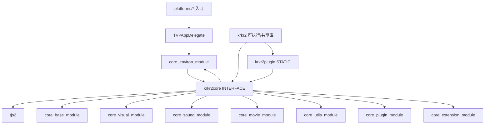

# 目录结构与模块职责

> **所属模块：** M01-项目导览与环境搭建  
> **前置知识：** [01-项目分层设计与总体架构.md](../01-项目分层设计与总体架构/01-项目分层设计与总体架构.md)  
> **预计阅读时间：** 45 分钟

在深入 KrKr2 源码之前，先建立“目录即架构”的认知。
你会看到：同一个目录结构同时表达了构建关系、运行时关系、维护边界。
这也是后续学习 CMake 目标图和启动流程的基础。

## 本节目标

读完本节后，你将能够：

1. 用“顶层目录 + Core 子模块 + 平台入口”三层视角解释 KrKr2 结构。
2. 准确说出 `tjs2/base/visual/environ/sound/movie/utils/plugin/extension` 九个模块的职责边界。
3. 根据 `CMakeLists.txt` 判断哪些目录参与主程序链接，哪些目录只在测试或工具阶段生效。
4. 快速定位跨平台入口（Windows/Linux/macOS/Android）并理解差异点。
5. 在不修改业务代码的前提下，完成一次目录巡检与依赖巡检。

## 1. 完整目录结构树（从源码实测）

以下结构基于仓库真实目录读取，不是示意图。

```text
krkr2/
├── CMakeLists.txt
├── cpp/
│   ├── core/
│   │   ├── base/
│   │   ├── common/
│   │   ├── environ/
│   │   ├── extension/
│   │   ├── movie/
│   │   ├── plugin/
│   │   ├── sound/
│   │   ├── tjs2/
│   │   ├── utils/
│   │   └── visual/
│   ├── external/
│   └── plugins/
├── platforms/
│   ├── android/
│   ├── apple/
│   ├── linux/
│   └── windows/
├── tests/
│   ├── test_files/
│   └── unit-tests/
├── cmake/
├── scripts/
├── tools/
├── ui/
└── vcpkg/
```

这个树可以先记住三个事实。
第一，`cpp/core` 是“引擎内核”，`cpp/plugins` 是“功能插件集合”。
第二，`platforms` 只放入口与桥接，不放引擎主逻辑。
第三，`tests/cmake/scripts/vcpkg` 共同决定“可持续开发能力”。

## 2. 顶层目录职责说明（增强版）

### 2.1 `cpp/`：引擎实现主体

`cpp/core` 在 CMake 中汇总为 `krkr2core`（INTERFACE），并联动 9 个子目标。
`cpp/plugins` 在 CMake 中汇总为 `krkr2plugin`（STATIC）。
根 CMake 会把 `krkr2plugin` 与 `krkr2core` 一起链接到最终程序 `krkr2`。
这意味着插件并不是运行时动态下载，而是构建期静态并入。
对新人来说，这个决策非常重要：调试插件问题时应直接走主程序断点。

### 2.2 `platforms/`：各平台入口与启动胶水

Windows 入口是 `_tWinMain`，Linux 与 macOS 是 `main`，Android 走 JNI 初始化函数。
四个平台都把控制流导向 `TVPAppDelegate`，保持引擎主生命周期一致。
因此平台差异主要体现在参数解析、日志后端、事件注入和系统 API。
如果你要做跨平台排障，优先比较 `platforms/*` 的入口差异即可。

### 2.3 `tests/`：按模块拆分的 Catch2 测试

`tests/CMakeLists.txt` 明确引入 Catch2 v3。
`unit-tests/core` 下按 `movie/tjs2/visual` 分目录。
`unit-tests/plugins` 独立覆盖插件相关行为。
`test_files` 提供 `.tjs` 与二进制样本，避免把测试数据散落在源码目录。

### 2.4 `cmake/`：构建辅助逻辑

`cmake/CocosBuildHelpers.cmake` 被根 CMake 用于资源拷贝与打包。
`cmake/vcpkg_android.cmake` 只在 Android 分支被 include。
`cmake/scripts/` 目录存在于仓库中，用于放置辅助脚本。
这类目录的价值不在“功能逻辑”，而在“把复杂构建流程标准化”。
当你新增平台或新增第三方依赖时，常常要同时修改这里。

### 2.5 `scripts/`：一键构建入口

当前可见两个脚本：`build-linux.sh` 与 `build-windows.bat`。
它们让新人不用先记忆完整 CMake preset 命令。
CI 排障时，也能用脚本复现本地构建行为。
如果脚本与文档不一致，以脚本为准并回写文档。
这也是工程化里“可执行文档”的典型实践。

### 2.6 `vcpkg/`：依赖定制层

`vcpkg/ports` 表示自定义或覆盖上游端口。
`vcpkg/triplets` 表示平台/架构/编译选项组合。
KrKr2 跨平台依赖多，直接使用默认三方配置通常不够。
所以这里是“项目可构建性”的关键资产之一。
阅读模块源码前，建议先知道依赖是如何被固化的。

### 2.7 `tools/` 与 `ui/`：开发效率与资源层

`tools/` 放命令行工具（例如 XP3 相关工具链）。
`ui/` 放 Cocos Studio 资源，运行期通过资源复制进入目标目录。
在根 CMake 的资源处理分支里，`ui/cocos-studio` 会被拷贝到运行目录。
这解释了为什么只编译通过还不够，运行也需要资源就位。

## 3. `cpp/core` 九大模块职责（深度版）

`cpp/core/CMakeLists.txt` 把九个子模块统一链接进 `krkr2core`。
换句话说，九个模块不是并列文档概念，而是实际构建目标。
下面逐个讲清职责、边界和关键文件。

### 3.1 `tjs2`：脚本语言实现与虚拟机执行核心

`tjs2` 是引擎“可编程性”的根基。
它不只是脚本解析器，而是完整语言实现：词法、语法、字节码、运行时对象系统。
`tjs2/CMakeLists.txt` 会调用 Bison 生成 `*.tab.cpp`，说明语法层是自动生成流程的一部分。
模块还调用 Python 脚本生成日期词表（`script/create_world_map.py`），体现了构建期代码生成。
在运行时，`tjsInterCodeGen.cpp` 与 `tjsInterCodeExec.cpp` 分别承担“编译阶段”和“执行阶段”。
`tjsVariant.*`、`tjsObject.*`、`tjsString.*` 构成动态类型与对象模型基础。
如果脚本报错、解释行为异常或对象绑定异常，排障几乎都要回到本模块。

**关键文件（示例）**

- `cpp/core/tjs2/CMakeLists.txt`
- `cpp/core/tjs2/bison/tjs.y`
- `cpp/core/tjs2/tjsLex.cpp`
- `cpp/core/tjs2/tjsInterCodeGen.cpp`
- `cpp/core/tjs2/tjsInterCodeExec.cpp`
- `cpp/core/tjs2/tjsVariant.h`
- `cpp/core/tjs2/tjsObject.cpp`
- `cpp/core/tjs2/tjsScriptCache.cpp`

### 3.2 `base`：存储抽象、归档系统与事件基础设施

`base` 是“资源进引擎”的入口层。
它负责把 XP3/ZIP/TAR/7z 等归档统一为可访问的存储抽象。
`StorageIntf.*` 管路径解析、媒体注册、搜索策略；`BinaryStream.*` 和 `TextStream.*` 管数据读取。
`KAGParser.*` 让 KAG 剧本可以被解析进入执行流程。
`EventIntf.*` 负责事件投递，给上层脚本与系统模块提供统一事件机制。
构建层面，`core_base_module` 私有依赖 visual/plugin/environ/extension/sound/utils，说明它是多模块协作枢纽。
所以 base 既是“基础层”，也是一个“协调层”。

**关键文件（示例）**

- `cpp/core/base/CMakeLists.txt`
- `cpp/core/base/XP3Archive.cpp`
- `cpp/core/base/ZIPArchive.cpp`
- `cpp/core/base/TARArchive.cpp`
- `cpp/core/base/7zArchive.cpp`
- `cpp/core/base/StorageIntf.h`
- `cpp/core/base/KAGParser.cpp`
- `cpp/core/base/EventIntf.cpp`

### 3.3 `visual`：渲染管线、图像解码与图层系统

`visual` 是最直接影响“画面结果”的模块。
它覆盖图层（Layer）、位图（Bitmap）、过渡（Transition）、窗口接口与渲染管理器。
`LoadPNG/LoadJPEG/LoadTLG/LoadWEBP/LoadBPG/LoadJXR/LoadPVRv3.cpp` 体现“按格式拆 loader”的清晰组织。
`ogl/` 子目录包含 `RenderManager_ogl.cpp`、纹理压缩相关实现，面向 GPU 渲染路径。
`gl/` 与 `tvpgl.cpp` 则更偏底层像素处理与图像运算。
从 CMake 依赖看，`visual` 私有依赖 base/environ/plugin/sound/utils，并连接 OpenCV、WebP、JXR、jpeg-turbo、lz4。
这说明视觉模块不仅是“画图”，还是多媒体格式中枢。

**关键文件（示例）**

- `cpp/core/visual/CMakeLists.txt`
- `cpp/core/visual/LayerIntf.cpp`
- `cpp/core/visual/LayerManager.cpp`
- `cpp/core/visual/BitmapIntf.cpp`
- `cpp/core/visual/RenderManager.cpp`
- `cpp/core/visual/ogl/RenderManager_ogl.cpp`
- `cpp/core/visual/LoadTLG.cpp`
- `cpp/core/visual/tvpgl.cpp`

### 3.4 `environ`：平台抽象、AppDelegate 与 UI 表单系统

`environ` 负责把“平台差异”封装成统一行为。
`cocos2d/AppDelegate.cpp` 是启动生命周期关键点，平台入口最终都汇合到这里。
`ConfigManager` 下有 Global/Individual/Locale 三类配置管理器，职责拆分明确。
`ui/` 包含文件选择、偏好设置、游戏菜单、消息框等界面逻辑。
`android/linux/win32/apple/sdl` 子目录放平台实现代码，避免把平台 `#ifdef` 污染到上层。
`Application.cpp`、`DetectCPU.cpp`、`XP3ArchiveRepack.cpp` 表明这里还承接应用环境能力。
从学习顺序看，本模块建议与 `platforms/*` 对照阅读。

**关键文件（示例）**

- `cpp/core/environ/CMakeLists.txt`
- `cpp/core/environ/cocos2d/AppDelegate.cpp`
- `cpp/core/environ/cocos2d/MainScene.cpp`
- `cpp/core/environ/ConfigManager/GlobalConfigManager.cpp`
- `cpp/core/environ/ui/MainFileSelectorForm.cpp`
- `cpp/core/environ/win32/Platform.cpp`
- `cpp/core/environ/linux/Platform.cpp`
- `cpp/core/environ/apple/macos/platform.mm`

### 3.5 `sound`：解码、混音、DSP 与回放控制

`sound` 模块负责“声音从文件到扬声器”的全过程。
`FFWaveDecoder.cpp` 负责 FFmpeg 通路，`VorbisWaveDecoder.cpp` 覆盖 Vorbis/Opus 系列能力。
`WaveIntf.*` 抽象解码器接口，`SoundBufferBaseIntf.*` 管播放状态、音量、淡入淡出。
`PhaseVocoderDSP.cpp` 与 `PhaseVocoderFilter.cpp` 提供时域/频域处理能力。
`WaveLoopManager.cpp`、`WaveSegmentQueue.cpp` 用于循环点与分段播放管理。
构建层连接 Vorbis、Opus、OpenAL，Android 额外链接 Oboe。
因此 sound 是跨平台音频统一层，而不是某个单平台 API 的封装壳。

**关键文件（示例）**

- `cpp/core/sound/CMakeLists.txt`
- `cpp/core/sound/WaveIntf.cpp`
- `cpp/core/sound/SoundBufferBaseIntf.cpp`
- `cpp/core/sound/FFWaveDecoder.cpp`
- `cpp/core/sound/VorbisWaveDecoder.cpp`
- `cpp/core/sound/PhaseVocoderDSP.cpp`
- `cpp/core/sound/WaveLoopManager.cpp`
- `cpp/core/sound/win32/WaveImpl.cpp`

### 3.6 `movie`：FFmpeg 视频播放栈

`movie` 目录非常聚焦：几乎全部内容都在 `ffmpeg/` 子目录。
这不是简单调用 FFmpeg API，而是具备分层结构：解复用、解码、时钟、渲染、消息队列。
从 `CMakeLists.txt` 可以看到 `DemuxFFmpeg.cpp`、`VideoCodecFFmpeg.cpp`、`VideoPlayer*.cpp`、`VideoRenderer.cpp` 等核心文件。
`KRMoviePlayer.cpp` 与 `KRMovieLayer.cpp` 负责把视频能力接入引擎图层系统。
模块依赖 base/sound/utils/environ/visual，说明视频播放天然跨越多个子系统。
如果你遇到“有声音没画面”或“音画不同步”，这层是第一排障现场。
因为它已经内建时钟与消息机制，不建议在上层重复实现播放调度。

**关键文件（示例）**

- `cpp/core/movie/CMakeLists.txt`
- `cpp/core/movie/ffmpeg/DemuxFFmpeg.cpp`
- `cpp/core/movie/ffmpeg/AudioCodecFFmpeg.cpp`
- `cpp/core/movie/ffmpeg/VideoCodecFFmpeg.cpp`
- `cpp/core/movie/ffmpeg/VideoPlayer.cpp`
- `cpp/core/movie/ffmpeg/VideoPlayerAudio.cpp`
- `cpp/core/movie/ffmpeg/VideoPlayerVideo.cpp`
- `cpp/core/movie/ffmpeg/KRMoviePlayer.cpp`

### 3.7 `utils`：跨模块通用能力库

`utils` 是高复用低耦合的通用层。
它提供随机数、计时器、线程、调试接口、剪贴板、输入设备、MD5、字符串与数学工具。
注意目录中存在 `encoding/` 与 `iconv/`，说明字符编码问题被显式纳入基础能力。
`win32/` 下的实现文件被多平台复用，这在历史项目中很常见。
`core_utils_module` 只私有依赖 base/environ，避免了额外循环依赖。
当你不确定某个“工具函数”应该放哪里时，先问它是否具有模块无关性。
如果答案是“是”，才考虑进入 utils。

**关键文件（示例）**

- `cpp/core/utils/CMakeLists.txt`
- `cpp/core/utils/ThreadIntf.cpp`
- `cpp/core/utils/TimerIntf.cpp`
- `cpp/core/utils/TickCount.cpp`
- `cpp/core/utils/Random.cpp`
- `cpp/core/utils/VelocityTracker.cpp`
- `cpp/core/utils/MiscUtility.cpp`
- `cpp/core/utils/win32/ThreadImpl.cpp`

### 3.8 `plugin`：插件加载与脚本绑定桥

`core/plugin` 不是插件实现本体，而是插件机制底座。
它提供 `PluginIntf.*`、`PluginImpl.*` 与 `ncbind.*`，负责把 C++ 能力绑定给 TJS2。
这种设计把“插件协议层”与“具体插件代码”分开，便于扩展和维护。
在 CMake 中它是 `core_plugin_module`，由其他模块复用。
`ncbind.hpp`、`ncb_invoke.hpp`、`ncb_foreach.inc` 反映了模板与宏结合的绑定系统。
如果你要新增插件 API，通常先看这里的绑定套路，再落到 `cpp/plugins`。
因此 plugin 模块是“接口稳定层”，不是“功能堆叠层”。

**关键文件（示例）**

- `cpp/core/plugin/CMakeLists.txt`
- `cpp/core/plugin/ncbind.hpp`
- `cpp/core/plugin/ncbind.cpp`
- `cpp/core/plugin/PluginIntf.h`
- `cpp/core/plugin/PluginIntf.cpp`
- `cpp/core/plugin/PluginImpl.cpp`

### 3.9 `extension`：扩展 API 的收口点

`extension` 目录很小，但职责清晰：承接扩展接口。
当前构建源主要是 `Extension.cpp` 与 `Extension.h`。
它被独立成 `core_extension_module`，避免扩展逻辑直接散落到其他模块。
这种设计适合后续做增量能力，而不打破核心模块稳定性。
你可以把它理解为“官方保留的扩展插槽”。
目录小并不表示不重要，它是架构预留能力的体现。
学习时建议把它与 `core/plugin` 对比：前者偏引擎扩展，后者偏脚本绑定。

**关键文件（示例）**

- `cpp/core/extension/CMakeLists.txt`
- `cpp/core/extension/Extension.h`
- `cpp/core/extension/Extension.cpp`

## 4. `cpp/plugins`：插件实现层（与 core/plugin 的分工）

`cpp/plugins/CMakeLists.txt` 定义 `krkr2plugin` 静态库。
根目录下有大量“单文件插件”，例如 `csvParser.cpp`、`xp3filter.cpp`、`windowEx.cpp`。
同时还有子目录插件：`psdfile/`、`psbfile/`、`motionplayer/`、`layerex_draw/`、`fstat/`。
其中 `steam/`、`DrawDeviceForSteam/`、`json/` 目前在 CMake 中被注释，不参与默认构建。
这提醒我们：目录中“存在”不代表“默认产物包含”。
`krkr2plugin` 最终会链接到主程序，因此插件调试可直接在主工程完成。
你扩展插件时，要同步维护 CMake 的 `target_sources/add_subdirectory/target_link_libraries` 三处。

### 4.1 代表性插件文件清单

- 根目录插件：`scriptsEx.cpp`、`dirlist.cpp`、`csvParser.cpp`、`saveStruct.cpp`、`varfile.cpp`
- 资源类：`xp3filter.cpp`、`addFont.cpp`
- 窗口与交互：`windowEx.cpp`、`win32dialog.cpp`
- 子模块：`psdfile/`、`psbfile/`、`motionplayer/`、`layerex_draw/`、`fstat/`
- 绑定辅助：`simplebinder/simplebinder.hpp`、`PluginStub.h`、`tp_stub.h`

## 5. 模块依赖关系（Mermaid）

你可以把 KrKr2 理解为“脚本驱动 + 多媒体引擎 + 平台胶水”。
下面的关系图不是 100% 展开所有边，而是突出主干依赖。



这个图有三个重点。
第一，`krkr2core` 是聚合目标，不是独立源码目录。
第二，`krkr2plugin` 与 `krkr2core` 在最终产物中并列被链接。
第三，平台入口不是业务逻辑中心，它只是引导到 AppDelegate。

## 6. 四平台入口对照（Win/Linux/macOS/Android）

### 6.1 共同点

四个平台都设置日志器（core/tjs2/plugin）并创建 `TVPAppDelegate`。
这保证了跨平台主流程一致，便于统一维护。
在架构上，入口层尽量薄，真正逻辑在 `cpp/core/environ`。

### 6.2 差异点总表

| 平台 | 入口文件 | 入口函数 | 关键差异 |
|---|---|---|---|
| Windows | `platforms/windows/main.cpp` | `_tWinMain` | 用 `CommandLineToArgvW` 取拖拽参数并做 UTF 转换 |
| Linux | `platforms/linux/main.cpp` | `main` | 启动时调用 `gtk_init`，参数可直接赋给文件选择表单 |
| macOS | `platforms/apple/macos/main.cpp` | `main` | 入口最精简，重点在 bundle 资源与 plist 配置 |
| Android | `platforms/android/cpp/krkr2_android.cpp` | `cocos_android_app_init` + JNI 导出 | 需要 Java/JNI 桥、触摸事件推送、Breakpad dump、SDL2 动态加载 |

### 6.3 Android 入口为何更重

Android 没有传统 `main` 作为主入口。
它通过 Java Activity 调 JNI，再由 `cocos_android_app_init` 进入 C++ 世界。
同时还要处理触摸、键盘、文本输入、低内存回调等系统事件。
`krkr2_android.cpp` 因此体量显著大于其他平台入口。
这不是“代码风格差”，而是平台运行模型差异导致。

## 7. tests 目录结构与职责

`tests/CMakeLists.txt` 先 `find_package(Catch2 3 REQUIRED)`，再引入各测试子目录。
它还通过 `configure_file(test_config.h.in test_config.h)` 生成测试配置头。
这样测试代码可通过 `TEST_FILES_PATH` 稳定访问样本数据。

### 7.1 测试子目录说明

- `tests/unit-tests/core/movie/`：当前有 `ffmpeg.cpp` 测试入口。
- `tests/unit-tests/core/tjs2/`：包含 `tjs.cpp`、`tjsString.cpp`。
- `tests/unit-tests/core/visual/`：结构已建好，当前 `SOURCES` 为空。
- `tests/unit-tests/plugins/`：当前覆盖 `psbfile-dll.cpp`。
- `tests/test_files/tjs2/`、`tests/test_files/emote/`：测试夹具。

### 7.2 测试构建模式

每个子目录采用“每个 `.cpp` 生成一个可执行测试程序”的 CMake 模式。
`string(REPLACE ".cpp" "" BASENAMES_SOURCES ...)` 是关键步骤。
然后统一链接 `Catch2::Catch2` 与对应模块库，并调用 `catch_discover_tests`。
这种模式便于按文件粒度运行和定位失败用例。

## 8. CMake 目标视角理解目录结构

如果只看目录，容易误判“谁依赖谁”。
正确做法是同时看根 CMake + 模块 CMake。

### 8.1 根 CMake 的关键决策

- 项目目标名：`krkr2`。
- 平台分支：Android 产物是 SHARED，其余主要是可执行程序。
- 子目录引入顺序：`cpp/external` → `cpp/core` → `cpp/plugins`。
- 最终链接：`target_link_libraries(krkr2 PUBLIC krkr2plugin krkr2core)`。
- 测试与工具可开关：`ENABLE_TESTS`、`BUILD_TOOLS`。

### 8.2 core 聚合方式

`cpp/core/CMakeLists.txt` 用 INTERFACE 目标 `krkr2core` 聚合九模块。
INTERFACE 的好处是：对外暴露统一链接点，内部仍可模块化演进。
这使得新增模块时，不必让上层逐个链接子库。
从维护体验看，这是一种“内部解耦，对外统一”的成熟做法。

### 8.3 plugins 聚合方式

`cpp/plugins/CMakeLists.txt` 用 STATIC 目标 `krkr2plugin` 聚合插件。
根目录插件以 `target_sources` 方式加入。
子目录插件以 `add_subdirectory` + `target_link_libraries` 方式加入。
这两种方式并存，兼顾小插件和大插件的组织效率。
