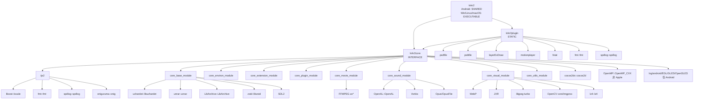

# CMake 目标关系图

> **所属模块：** M01-项目导览与环境搭建
> **前置知识：** [01-目录结构与模块职责.md](./01-目录结构与模块职责.md)、P01 现代 CMake 基础
> **预计阅读时间：** 45 分钟

## 本节目标

读完本节后，你将能够：
1. 说清 KrKr2 主目标 `krkr2`、`krkr2core`、`krkr2plugin` 的角色分工。
2. 理解 INTERFACE/STATIC/SHARED 三类库在本项目中的具体用途。
3. 读懂 `target_link_libraries` 中 PUBLIC/PRIVATE/INTERFACE 的传播规则。
4. 根据源码定位每个目标来自哪个 `CMakeLists.txt`。
5. 自己生成 Graphviz 依赖图，并用图反查构建问题。

## 1. 核心目标全貌（保留原结构并增强）

KrKr2 的构建系统可以先记成三层：

- 顶层产物：`krkr2`
- 聚合层：`krkr2core` 与 `krkr2plugin`
- 子模块层：`tjs2`、`core_*_module`、插件子库与第三方库

三个关键目标：

- **krkr2**：最终产物。Android 下是 `SHARED`（JNI `.so`），其余平台是 `EXECUTABLE`。
- **krkr2plugin**：`STATIC` 静态库，统一承载 `cpp/plugins/` 插件实现。
- **krkr2core**：`INTERFACE` 接口库，不产出 `.a/.lib/.so`，仅传播“依赖合同”。

先看最小心智模型：

```text
krkr2
├─ krkr2plugin (STATIC)
└─ krkr2core   (INTERFACE)
```

这个模型非常重要：**你调试启动问题看 `krkr2`，调试模块依赖看 `krkr2core`，调试插件编译看 `krkr2plugin`。**

## 2. 完整目标依赖图（Mermaid）

下面这张图基于实际 `CMakeLists.txt` 整理，覆盖主目标、核心模块、插件子库与关键第三方依赖。



阅读技巧：从 `krkr2` 向下看是“最终链接链路”，从某个模块向上看是“能力被谁消费”。

## 3. CMake 目标类型速通：INTERFACE / STATIC / SHARED

这是 C++ 开发者最容易混淆的部分。你可以把它理解成“产物类型 + 传播行为”的组合。

| 类型 | 是否产出二进制文件 | 是否包含源码编译 | 典型用途 | KrKr2 示例 |
|---|---|---|---|---|
| `INTERFACE` | 否 | 否 | 传播头文件、宏、链接依赖 | `krkr2core` |
| `STATIC` | 是（`.a/.lib`） | 是 | 模块封装、加速增量编译 | `krkr2plugin`、`tjs2`、`core_*_module` |
| `SHARED` | 是（`.so/.dll/.dylib`） | 是 | 动态加载或平台要求 | Android 下 `krkr2` |

### 3.1 INTERFACE（接口库）到底在“做什么”

`INTERFACE` 目标不编译 `.cpp`。它更像“规则集合”或“依赖清单”：

- 我需要哪些头文件目录（`target_include_directories(... INTERFACE ...)`）
- 我要求哪些编译宏（`target_compile_definitions(... INTERFACE ...)`）
- 我依赖哪些目标（`target_link_libraries(... INTERFACE ...)`）

当 `krkr2` 链接 `krkr2core` 后，`krkr2core` 声明的依赖会继续向上传播，等价于“把九个核心模块一次性打包成一个可复用依赖入口”。

### 3.2 STATIC（静态库）在 KrKr2 里的意义

`STATIC` 库会编译出对象集合，链接时合入最终产物。KrKr2 把绝大部分业务模块做成静态库，有三个直接收益：

1. 模块边界清晰：每个 `core_*_module` 单独维护。
2. 增量构建快：改一个模块只重编该模块。
3. 跨平台稳定：减少动态装载差异带来的运行时问题。

### 3.3 SHARED（共享库）为何只在 Android 作为主目标

Android App 通过 JNI 加载 native 层，所以根目标 `krkr2` 在 Android 分支被定义为：

```cmake
if(ANDROID)
    add_library(${PROJECT_NAME} SHARED platforms/android/cpp/krkr2_android.cpp)
endif()
```

这不是“风格选择”，是平台集成方式决定：Java/Kotlin 侧通常 `System.loadLibrary("krkr2")` 加载 `.so`。

## 4. `target_link_libraries` 传播规则：PUBLIC / PRIVATE / INTERFACE

这一节是“读懂任何 CMake 工程”的关键。很多“为什么我 include 不到头文件”问题都出在这里。

### 4.1 三个关键字的语义

- `PRIVATE`：只对当前目标生效，不向依赖者传播。
- `PUBLIC`：当前目标生效，同时向依赖者传播。
- `INTERFACE`：不用于当前目标编译，只向依赖者传播。

### 4.2 结合 KrKr2 实例理解

`krkr2` 链接时使用：

```cmake
target_link_libraries(${PROJECT_NAME} PUBLIC
    krkr2plugin krkr2core
)
```

解释：

1. `krkr2` 自己要链接 `krkr2plugin` 和 `krkr2core`。
2. 如果未来有别的目标再链接 `krkr2`，这些依赖关系也可继续传播。

再看 `krkr2core`：

```cmake
target_link_libraries(${PROJECT_NAME} INTERFACE
    tjs2
    core_base_module
    core_environ_module
    core_extension_module
    core_plugin_module
    core_movie_module
    core_sound_module
    core_visual_module
    core_utils_module
)
```

这是典型“接口聚合器”：`krkr2core` 自己不编译源码，所以用 `INTERFACE` 合理且高效。

### 4.3 一个常见误区

很多人会把 `INTERFACE` 误认为“头文件库”。其实它可以传播的不只有头文件，还有：

- 编译宏（如 `TJS_TEXT_OUT_CRLF`）
- 编译选项（如 OpenMP flags）
- 链接依赖（比如 `cocos2dx::cocos2d`）

因此在 KrKr2 中，`krkr2core` 是“构建策略中枢”，不是单纯“include 集合”。

## 5. 主目标 `krkr2`：跨平台产物分支

根 `CMakeLists.txt` 的主目标逻辑非常清晰：按平台切换入口文件和目标类型。

```cmake
if(ANDROID)
    add_library(${PROJECT_NAME} SHARED platforms/android/cpp/krkr2_android.cpp)
elseif(LINUX)
    add_executable(${PROJECT_NAME} platforms/linux/main.cpp)
elseif(WINDOWS)
    add_executable(${PROJECT_NAME}
        platforms/windows/main.cpp
        platforms/windows/game.rc
    )
elseif(MACOS)
    add_executable(${PROJECT_NAME}
        platforms/apple/macos/main.cpp
        platforms/apple/macos/Prefix.pch
        ${APP_UI_RES}
    )
endif()
```

### 5.1 平台差异对照

| 平台 | 目标类型 | 入口源文件 | 典型产物 |
|---|---|---|---|
| Android | `SHARED` | `platforms/android/cpp/krkr2_android.cpp` | `libkrkr2.so` |
| Windows | `EXECUTABLE` | `platforms/windows/main.cpp` + `game.rc` | `krkr2.exe` |
| Linux | `EXECUTABLE` | `platforms/linux/main.cpp` | `krkr2` |
| macOS | `EXECUTABLE`（Bundle 配置） | `platforms/apple/macos/main.cpp` | `.app` 内可执行文件 |

### 5.2 为什么文档里常说“krkr2 是最终链接汇点”

因为它最终链接了：

- 项目插件聚合库 `krkr2plugin`
- 项目核心聚合库 `krkr2core`
- 通过以上两个入口传播来的所有核心模块和第三方库

你可以把它理解为“构建图的根节点（root of link graph）”。

## 6. `krkr2core`：INTERFACE 聚合器如何整合九大核心模块

`cpp/core/CMakeLists.txt` 中先声明：

```cmake
add_library(${PROJECT_NAME} INTERFACE)
```

然后把 9 个子模块通过 `add_subdirectory` 引入，再统一 `target_link_libraries(... INTERFACE ...)`。

### 6.1 九个核心模块一览（来自实际目标名）

1. `tjs2`：脚本引擎
2. `core_base_module`：归档、流、事件、KAG 解析
3. `core_environ_module`：平台抽象、AppDelegate、UI
4. `core_extension_module`：扩展接口
5. `core_plugin_module`：插件桥接与绑定
6. `core_movie_module`：FFmpeg 视频链路
7. `core_sound_module`：音频解码与播放
8. `core_visual_module`：图像与渲染
9. `core_utils_module`：线程、计时、随机等工具

### 6.2 传播给上层的不仅是模块依赖

`krkr2core` 还传播：

- include 路径：`${CMAKE_CURRENT_SOURCE_DIR}`
- 编译宏：`TJS_TEXT_OUT_CRLF`、`__STDC_CONSTANT_MACROS`、`USE_UNICODE_FSTRING`
- 平台附加依赖：Android 系统库、非 Apple 的 OpenMP
- 图形底座：`cocos2dx::cocos2d`

### 6.3 这套设计带来的工程收益

- 根目标更干净：`krkr2` 不必列出 9 个模块。
- 模块替换更低成本：新增/移除核心模块只改 `cpp/core/CMakeLists.txt`。
- 教学可解释性强：读者通过一个目标就能掌握核心体系。

## 7. `krkr2plugin`：插件聚合目标的构建方式

`cpp/plugins/CMakeLists.txt` 定义了：

```cmake
project(krkr2plugin)
add_library(${PROJECT_NAME} STATIC)
```

之后分两类收集插件代码：

1. **根目录直接源文件**：通过 `target_sources(krkr2plugin ...)` 加入。
2. **子目录插件目标**：先 `add_subdirectory` 生成子库，再链接到 `krkr2plugin`。

### 7.1 当前启用的子插件目标

- `psdfile`
- `psbfile`
- `layerExDraw`
- `motionplayer`
- `fstat`

被注释（未启用）的有 `json`、`steam`、`DrawDeviceForSteam`。

### 7.2 一个容易忽略的结构特点

子插件（例如 `psdfile`）会 `target_link_libraries(... PRIVATE krkr2plugin)`；
同时父插件聚合库又链接这些子插件。初看像循环，但在静态库场景中它更多体现为“共享编译上下文 + 最终由主程序统一链接”。

### 7.3 与核心层的关系

`krkr2plugin` 通过：

```cmake
target_link_libraries(${PROJECT_NAME} PUBLIC krkr2core)
```

获得核心 API 与头文件传播能力。换句话说：插件层是“功能扩展层”，核心层是“运行时能力层”。

## 8. 从核心子模块看“依赖网络”而非“单向链”

很多入门文档只画树状结构，但 KrKr2 的核心模块之间存在交叉引用。下面用“职责 + 主要依赖”方式快速建立全局认知。

### 8.1 `tjs2`（脚本引擎基石）

- 类型：`STATIC`
- 职责：词法/语法、字节码、对象系统、正则
- 三方依赖：Boost::locale、fmt、spdlog、oniguruma

### 8.2 `core_base_module`

- 类型：`STATIC`
- 职责：归档格式（XP3/ZIP/TAR/7z）、流系统、事件、脚本管理
- 典型依赖：`tjs2`（PUBLIC），以及视觉/插件/环境等（PRIVATE）

### 8.3 `core_environ_module`

- 类型：`STATIC`
- 职责：平台层（android/linux/win32/macos）+ Cocos AppDelegate + UI
- 典型依赖：`tjs2`（PUBLIC），`cocos2dx::cocos2d`、`7zip::7zip`、`minizip`

### 8.4 `core_movie_module` 与 `core_sound_module`

- `core_movie_module`：FFmpeg 视频解复用与渲染链路
- `core_sound_module`：OpenAL + Vorbis/Opus 音频链路
- 二者存在交叉依赖关系（一个处理视频，一个处理音频，运行时协同）

### 8.5 `core_visual_module`

- 类型：`STATIC`
- 职责：图像解码、图层管理、渲染
- 依赖多：WebP、JXR、libjpeg-turbo、OpenCV、lz4、libbpg

### 8.6 `core_utils_module` 与 `core_extension_module`

- `core_utils_module`：线程、定时器、剪贴板、随机数等基础设施
- `core_extension_module`：扩展接口实现（体量小，但在架构上承担可扩展入口）

---

## 动手实践

### 实践 1：用 CMake 导出目标图

在构建目录下执行以下命令，生成 Graphviz 格式的目标依赖图：

```bash
cmake --graphviz=targets.dot --preset="Linux Debug Config"
# 或 Windows:
cmake --graphviz=targets.dot --preset="Windows Debug Config"
```

然后用 Graphviz 工具渲染：

```bash
dot -Tpng targets.dot -o targets.png
```

打开 `targets.png`，对照本节描述的目标关系，验证 `krkr2` → `krkr2plugin` → `krkr2core` → 子模块的链路。

### 实践 2：手动追踪一条链接链

选择 `core_movie_module`，在 `cpp/core/movie/CMakeLists.txt` 中找到它的 `target_link_libraries`，记录它依赖了哪些三方库（FFmpeg 系列）。再到 `vcpkg.json` 中确认这些库是否被声明为依赖。

---

## 对照项目源码

相关文件：
- `CMakeLists.txt` 第 88-92 行：`target_link_libraries(krkr2 PUBLIC krkr2plugin krkr2core)` — 根级链接。
- `cpp/core/CMakeLists.txt` 全文：INTERFACE 聚合所有子模块。
- `cpp/plugins/CMakeLists.txt` 全文：STATIC 聚合所有插件。
- `cpp/core/tjs2/CMakeLists.txt`：TJS2 模块的三方依赖声明。
- `cpp/core/movie/CMakeLists.txt`：FFmpeg 相关依赖声明。
- `cpp/core/visual/CMakeLists.txt`：图像解码库依赖声明。

---

## 常见错误

### 错误 1：以为 PUBLIC/PRIVATE/INTERFACE 只是"风格选择"

CMake 的链接可见性直接影响编译行为。`PUBLIC` 意味着链接关系和头文件路径会传播给上游目标；`PRIVATE` 只在当前目标内部可见。如果把本该是 `PUBLIC` 的依赖设为 `PRIVATE`，上游目标会在编译时找不到头文件。

### 错误 2：修改子模块 CMakeLists 但忘记重新 configure

CMake 的 `target_link_libraries` 是在 configure 阶段解析的。如果你修改了某个子模块的依赖关系，必须重新运行 `cmake --preset=...` 才能生效，仅执行 `cmake --build` 不会重新解析依赖图。

### 错误 3：把 `krkr2core` 和 `krkr2plugin` 的依赖方向搞反

`krkr2plugin` 依赖 `krkr2core`（插件层使用核心 API），而不是反过来。如果在核心层引入了对插件层的依赖，会造成循环依赖，CMake 可能不报错但链接行为不可预测。

---

## 本节小结

- KrKr2 的 CMake 目标分三层：`krkr2`（可执行/SO）→ `krkr2plugin`（STATIC）→ `krkr2core`（INTERFACE）→ 9 个子模块（STATIC）。
- INTERFACE 聚合是"对外统一、内部解耦"的成熟模式。
- 核心子模块之间存在交叉依赖，不是简单的树状结构。
- `PUBLIC`/`PRIVATE`/`INTERFACE` 可见性直接影响头文件传播和链接行为。

---

## 练习题与答案

### 题目 1：为什么 `krkr2core` 用 INTERFACE 而不是 STATIC？

<details>
<summary>查看答案</summary>

因为 `krkr2core` 本身不包含源文件，它的职责是把 9 个 STATIC 子模块聚合到一个统一入口。INTERFACE 库不生成 `.a`/`.lib` 文件，只传播链接关系和头文件路径。这样上游只需 `target_link_libraries(krkr2 PUBLIC krkr2core)` 就能获得所有核心模块。

</details>

### 题目 2：`tjs2` 模块依赖了哪些三方库？在哪里声明的？

<details>
<summary>查看答案</summary>

`tjs2` 依赖 Boost::locale、fmt、spdlog、oniguruma。声明在 `cpp/core/tjs2/CMakeLists.txt` 的 `target_link_libraries` 中。这些库通过 vcpkg 管理，在 `vcpkg.json` 中有对应条目。

</details>

### 题目 3：如果在 `core_visual_module` 的 CMakeLists 中把 `libjpeg-turbo` 从 PUBLIC 改为 PRIVATE，会影响什么？

<details>
<summary>查看答案</summary>

如果其他模块（如 `core_base_module`）的源码中 `#include` 了 libjpeg-turbo 的头文件，改为 PRIVATE 后这些模块将无法编译，因为头文件路径不再通过 `krkr2core` 传播。如果没有其他模块直接使用 libjpeg-turbo 的头文件，则改为 PRIVATE 是安全的，还能减少不必要的头文件暴露。

</details>

---

## 下一步

进入下一节：[`03-启动流程全链路.md`](./03-启动流程全链路.md)。你将把 CMake 目标图映射到运行时的实际执行流程，理解从 `main()` 到游戏画面出现的完整链路。
