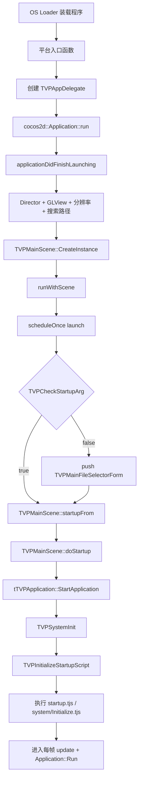

# 启动流程全链路

> **所属模块：** M01-项目导览与环境搭建  
> **前置知识：** [01-目录结构与模块职责](./01-目录结构与模块职责.md)、[02-CMake目标关系图](./02-CMake目标关系图.md)  
> **预计阅读时间：** 30 分钟

## 元数据块

- **文档版本：** v2.1  
- **范围：** 从 OS 装载进程到游戏画面可交互  
- **核心源码：** `platforms/*/main.cpp`、`AppDelegate.cpp`、`MainScene.cpp`、`Application.cpp`、`SysInitIntf.cpp`、`ScriptMgnIntf.cpp`

## 本节目标

读完本节后，你将能够：

1. 用一条完整链路描述 KrKr2 从入口到脚本启动的过程。  
2. 解释 Win/Linux/macOS/Android 四平台入口差异。  
3. 说清 Cocos2d-x 的 Director / Scene / Scheduler 在启动期的职责。  
4. 定位 TJS2 初始化、startup 脚本执行、资源挂载相关函数。  
5. 通过断点快速定位“能开窗但不进游戏”类问题。

## 1. 全链路总览

KrKr2 的启动不是单函数完成，而是“平台胶水层 + Cocos2d 场景层 + TVP 系统层 + TJS2 脚本层”的级联过程。  
你在入口看到的 `main` 或 `_tWinMain`，只负责把控制权交给 `TVPAppDelegate`。  
真正决定游戏是否启动成功的关键点，集中在 `applicationDidFinishLaunching`、`TVPMainScene::doStartup`、`tTVPApplication::StartApplication` 三段。

## 2. 平台入口对比

### 2.1 Windows：`_tWinMain`

文件：`platforms/windows/main.cpp`（第 15-44 行）

- 入口函数为 `_tWinMain`（第 15 行）。
- 使用 `CommandLineToArgvW` 解析命令行（第 22 行）。
- 若存在参数，将路径写入 `TVPMainFileSelectorForm::filePath`（第 29 行）。
- 初始化 `core/tjs2/plugin` 三个日志器（第 36-38 行）。
- 构造 `TVPAppDelegate` 并 `run()`（第 42-43 行）。

这个设计使“拖拽 xp3 到 exe 上运行”在入口层就能打通。

### 2.2 Linux：`main`

文件：`platforms/linux/main.cpp`（第 11-26 行）

- 标准 `main(argc, argv)`（第 11 行）。
- 先做 `gtk_init`（第 12 行）。
- 把 `argv[1]` 透传到 `TVPMainFileSelectorForm::filePath`（第 19-20 行）。
- 构造 `TVPAppDelegate` 并 `run()`（第 24-25 行）。

Linux 路径与 Windows 类似，但参数解析更直接。

### 2.3 macOS：`main`

文件：`platforms/apple/macos/main.cpp`（第 11-23 行）

- 入口也是 `main`（第 11 行）。
- 初始化日志器（第 14-16 行）。
- 构造 `TVPAppDelegate` 并 `run()`（第 20-22 行）。

### 2.4 Android：Activity + JNI

主要文件：

- `platforms/android/app/java/org/tvp/kirikiri2/KR2Activity.java`
- `platforms/android/cpp/krkr2_android.cpp`

关键点：

- Java `onCreate()` 调 `initDump`（`KR2Activity.java` 第 99-103 行）。
- Java 输入事件通过 `nativeTouches*`、`nativeKeyAction` 进入 native（第 167-187、255-312 行）。
- native 入口 `cocos_android_app_init(JNIEnv*)` 做日志初始化与 SDL2 JNI 加载（`krkr2_android.cpp` 第 37-67 行）。
- 输入通过 `Android_PushEvents` 转发到 Cocos 线程再分发（如第 107-123、232-275 行）。

Android 没有显式 C++ `main`，但逻辑上仍有统一入口收束到 `TVPAppDelegate`。

## 3. AppDelegate 启动门详解

文件：`cpp/core/environ/cocos2d/AppDelegate.cpp`

`TVPAppDelegate::applicationDidFinishLaunching()`（第 31-109 行）是跨平台统一引导点。

### 3.1 初始化顺序

1. `SDL_SetMainReady()`（第 32 行）  
2. 记录主线程 `TVPMainThreadID`（第 33 行）  
3. 获取 `Director` 与 `GLView`（第 36-37 行）  
4. 若无 `GLView` 则创建并绑定（第 38-40 行）

### 3.2 平台差异

- **Windows：** 修改窗口样式，启用缩放和最大化（第 42-47 行）。
- **Android/iOS：** 使用 `EXACT_FIT` 并按屏幕比例重算设计尺寸（第 52-63 行）。
- **其他平台：** 使用 `FIXED_WIDTH` 和固定设计分辨率（第 64-65 行）。

### 3.3 资源、帧率、语言、首场景

- 搜索路径设为 `res`（第 76-79 行）。
- 默认帧率 60 FPS（第 85 行）。
- 初始化 UI 扩展与语言配置（第 87、90 行）。
- 创建 `TVPMainScene` 并 `runWithScene`（第 92、95 行）。

### 3.4 `launch` 延迟任务

`scene->scheduleOnce(..., 0, "launch")`（第 97-106 行）会：

- 初始化 `TVPGlobalPreferenceForm`（第 100 行）。
- 若启动参数未命中，则弹出 `TVPMainFileSelectorForm`（第 101-104 行）。

这一步解释了“为什么文件选择器不是 main 直接创建的”。

## 4. Cocos2d-x 启动三件套

### 4.1 Director：全局调度器

你在启动链上至少能看到这些调用：

- `Director::getInstance()`（`AppDelegate.cpp` 第 36 行）
- `runWithScene(scene)`（第 95 行）
- `setAnimationInterval(...)`（第 85 行，后续 `MainScene.cpp` 第 2012 行也会按配置重设）

Director 负责全局帧循环、场景切换、事件分发。  
KrKr2 并没有自建主循环，而是把自身逻辑挂在 Director 的帧节奏上。

### 4.2 Scene：`TVPMainScene` 作为桥接容器

文件：`cpp/core/environ/cocos2d/MainScene.cpp`

- 单例存储 `_instance`（第 1753 行）
- `CreateInstance()`（第 1757-1760 行）
- `initialize()` 初始化 `GameNode` 和 `UINode`（第 1771、1775 行）

职责分层：

- `GameNode`：承载游戏窗口层、游戏菜单、FPS 标签
- `UINode`：承载文件选择器、设置面板等 UI 表单

### 4.3 Scheduler：启动阶段的安全时序

两处关键 `scheduleOnce`：

1. `AppDelegate` 的 `launch`（第 97-106 行）
2. `TVPMainScene::startupFrom` 安排 `doStartup`（第 1959-1960 行）

这样做避免了在输入回调栈中直接重负载初始化，减少重入风险。

## 5. 从 `TVPMainScene` 到 `StartApplication`

### 5.1 `startupFrom(path)`

函数：`TVPMainScene::startupFrom(const std::string &path)`（第 1926-1963 行）

主要动作：

- 校验路径 `TVPCheckStartupPath(path)`（第 1928 行）
- 应用局部配置 `UsePreferenceAt(...)`（第 1932-1935 行）
- 必要时清理 UI（第 1936-1938 行）
- 初始化键位映射（第 1945-1954 行）
- 通过 `scheduleOnce` 触发 `doStartup`（第 1959 行）

### 5.2 `doStartup`

函数：`TVPMainScene::doStartup(float dt, std::string path)`（第 1965-2013 行）

关键语句：`::Application->StartApplication(path)`（第 1977 行）。

围绕它还会做控制台窗口建立与移除（第 1969、1986-1989 行）、创建游戏菜单（第 1983 行）、显示窗口层（第 1996-2000 行）并按配置动态改 FPS（第 2011-2012 行）。

## 6. `tTVPApplication::StartApplication` 内部流程

文件：`cpp/core/environ/Application.cpp`

函数：`bool tTVPApplication::StartApplication(ttstr path)`（第 296-395 行）

核心顺序：

1. `TVPNativeProjectDir = path`（第 307 行）
2. `TVPProjectDir = TVPNormalizeStorageName(path)`（第 317 行）
3. `TVPInitScriptEngine()`（第 319 行）
4. `TVPInitializeBaseSystems()`（第 327 行）
5. `tvpLoadPlugins()`（第 338 行）
6. `TVPSystemInit()`（第 339 行）
7. `TVPInitializeStartupScript()`（第 352 行）

KrKr2 不是先跑 startup.tjs 再建系统，而是先把系统骨架搭完，再交给脚本。

## 7. TVPSystemInit 与系统层初始化
文件：`cpp/core/base/SysInitIntf.cpp`

函数：`TVPSystemInit()`（第 34-56 行）

顺序如下：

1. 授权/保护逻辑（平台条件，第 35-46 行）
2. `TVPBeforeSystemInit()`（第 48 行）
3. `TVPInitScriptEngine()`（第 50 行）
4. `TVPInitTVPGL()`（第 52 行）
5. `TVPAfterSystemInit()`（第 55 行）

注意这里会再次触发 `TVPInitScriptEngine()`，但脚本层有防重入，不会重复创建引擎。

`TVPBeforeSystemInit/TVPAfterSystemInit` 的实现重点在：

- `cpp/core/base/impl/SysInitImpl.cpp` 第 149-217 行：路径、随机源、内存策略
- 同文件第 233-369 行：图形缓存、渲染相关参数、定时精度

## 8. TJS2 脚本引擎初始化

文件：`cpp/core/base/ScriptMgnIntf.cpp`

### 8.1 `TVPInitScriptEngine`

函数体起始：第 396 行。

关键节点：

- 防重入检查 `TVPScriptEngineInit`（第 394、397-399 行）
- 创建脚本引擎对象 `TVPScriptEngine = new tTJS()`（第 449 行）
- 执行内置初始化脚本 `TVPInitTJSScript`（第 458 行）
- 绑定文本/二进制流回调（第 464-469 行）
- 注册脚本可见类（`System/Storages/Plugins/Scripts/Window/Layer/...`，第 483-543 行）
- 注册 compact 事件以驱动 GC（第 548 行）

### 8.2 启动脚本执行

函数：`TVPExecuteStartupScript()`（第 900-979 行）

流程：

1. 尝试执行 `patch.tjs`（第 903-906 行）
2. 主启动脚本 `startup.tjs`（第 949-956 行）
3. 失败时回退到 `system/Initialize.tjs`（第 958-966 行）
4. 启动后可执行 `AfterStartup.tjs`（第 970-972 行）

### 8.3 `TVPInitializeStartupScript`

函数：`TVPInitializeStartupScript()`（第 1283-1291 行）

- 调 `TVPExecuteStartupScript()` 执行脚本（第 1286 行）
- 若配置要求且未创建窗口，则终止应用（第 1287-1290 行）

## 9. 资源加载与数据挂载

文件：`cpp/core/base/StorageIntf.cpp`

### 9.1 统一存储入口

- `TVPNormalizeStorageName`（第 527-531 行）
- `TVPSearchPlacedPath`（第 1111-1116 行）
- `TVPCreateStream`（第 1189-1220 行）

### 9.2 XP3 归档读取机制

在 `_TVPCreateStream`（第 1130 行起）中，若路径包含 archive 分隔符 `>`（第 1149 行）：

- 拆分归档路径和归档内路径（第 1155-1163 行）
- 通过 `TVPArchiveCache` 获取归档对象并创建流（第 1157-1173 行）

这就是脚本、图片、音频可以从 xp3 包内直接读取的基础。

### 9.3 自动搜索路径

`TVPAutoPathList` 和缓存位于第 893 行起。  
`TVPGetPlacedPath` 会先查缓存，再查当前目录，再查 AutoPath 表（第 1061-1105 行）。

## 10. 生命周期回调与暂停恢复

文件：`AppDelegate.cpp`、`Application.cpp`

- `applicationDidEnterBackground`（`AppDelegate.cpp` 第 26-29 行）
  - 调 `Application->OnDeactivate()`
  - `Director::stopAnimation()` 暂停渲染循环
- `applicationWillEnterForeground`（第 21-24 行）
  - 调 `Application->OnActivate()`
  - `Director::startAnimation()` 恢复渲染循环

`OnDeactivate`（`Application.cpp` 第 754-773 行）会触发 compact、声音策略、脚本事件广播。

## 11. 对照项目源码

相关文件与行号（本节重点）：

- `platforms/windows/main.cpp` 第 15-44 行 — Windows 入口与参数透传
- `platforms/linux/main.cpp` 第 11-26 行 — Linux 入口与 gtk 初始化
- `platforms/apple/macos/main.cpp` 第 11-23 行 — macOS 入口
- `platforms/android/cpp/krkr2_android.cpp` 第 37-67、107-123、232-275、386-393 行 — Android native 初始化与输入桥
- `platforms/android/app/java/org/tvp/kirikiri2/KR2Activity.java` 第 99-113、167-187、255-312 行 — Java 入口与事件桥
- `cpp/core/environ/cocos2d/AppDelegate.cpp` 第 31-109 行 — 全平台统一启动门
- `cpp/core/environ/cocos2d/MainScene.cpp` 第 1757-1760、1926-1963、1965-2013、2021-2028 行 — 场景创建、项目启动、帧循环
- `cpp/core/environ/Application.cpp` 第 296-353、491-501、739-773 行 — 系统业务启动、消息循环、生命周期
- `cpp/core/base/SysInitIntf.cpp` 第 34-56 行 — TVPSystemInit 主流程
- `cpp/core/base/impl/SysInitImpl.cpp` 第 149-217、233-369 行 — 基础系统参数与缓存策略
- `cpp/core/base/ScriptMgnIntf.cpp` 第 396-549、900-979、1283-1291 行 — TJS2 初始化与 startup 执行
- `cpp/core/base/StorageIntf.cpp` 第 527-531、1111-1116、1130-1173 行 — 路径解析与归档流读取

## 12. 常见错误

### 错误 1：在平台入口里排查业务逻辑问题

`platforms/*/main.cpp` 只负责"交棒"给 `TVPAppDelegate`，几乎不包含业务逻辑。如果游戏启动后行为异常，不要在平台入口里加日志或断点，而应该直奔 `AppDelegate::applicationDidFinishLaunching` 和 `MainScene::doStartup`。

### 错误 2：忽略 Android 入口的 JNI 桥接差异

Android 平台入口是 `.so` 共享库而非可执行文件，启动流程经过 Java Activity → JNI → Cocos2d-x。很多桌面端正常但 Android 端崩溃的问题，根因在 JNI 层的生命周期回调时序与桌面端不同。排查时必须同时看 `KR2Activity.java` 和 `krkr2_android.cpp`。

### 错误 3：把 TJS2 初始化失败当成渲染问题

`startup.tjs` 执行失败时，表现可能是黑屏或闪退，容易被误判为渲染问题。正确做法是先检查 `ScriptMgnIntf.cpp` 中的脚本加载日志（日志标签 `tjs2`），确认脚本是否成功加载和执行，再考虑渲染链路。

---

## 13. 动手实践

> 目标：在本地调试器中完整走一次启动链路。

### 步骤 1：设置断点

建议至少设置以下断点：

1. 平台入口（`main` 或 `_tWinMain`）
2. `TVPAppDelegate::applicationDidFinishLaunching`
3. `TVPMainScene::startupFrom`
4. `TVPMainScene::doStartup`
5. `tTVPApplication::StartApplication`
6. `TVPSystemInit`
7. `TVPExecuteStartupScript`

### 步骤 2：带路径参数运行

使用可启动目录（包含 `startup.tjs` 或可识别资源）运行，确认是否跳过文件选择器。

### 步骤 3：无参数运行

清空参数再次运行，观察流程进入 `launch` 回调后推送 `TVPMainFileSelectorForm`。

### 步骤 4：验证回退机制

准备只含 `system/Initialize.tjs` 的目录，确认 `startup.tjs` 失败后回退分支会命中。

## 14. 练习题与答案

### 题目 1（调用链）

写出从 Windows 入口到 startup 脚本执行的关键链路（不少于 8 个函数）。

查看答案

示例链路：

`_tWinMain` → `TVPAppDelegate::run` → `applicationDidFinishLaunching` → `TVPMainScene::CreateInstance` → `runWithScene` → `TVPMainScene::startupFrom` → `TVPMainScene::doStartup` → `tTVPApplication::StartApplication` → `TVPSystemInit` → `TVPInitializeStartupScript` → `TVPExecuteStartupScript`。

### 题目 2（判断题）

“`TVPSystemInit` 一定会重复创建脚本引擎对象。”

查看答案

错误。`TVPInitScriptEngine` 有 `TVPScriptEngineInit` 防重入标志，已初始化后会直接返回。

### 题目 3（定位题）

Android 按键事件从 Java 进入 Cocos 事件系统的核心函数是什么？位于哪两个文件？

查看答案

- Java：`KR2Activity.KR2GLSurfaceView.onKeyDown/onKeyUp`（`KR2Activity.java`）
- C++：`Java_org_tvp_kirikiri2_KR2Activity_nativeKeyAction`（`platforms/android/cpp/krkr2_android.cpp`）

## 15. 本节小结

- 平台入口负责“交棒”，不是业务启动终点。  
- 统一启动门在 `AppDelegate::applicationDidFinishLaunching`。  
- 真实业务启动发生在 `MainScene::doStartup -> Application::StartApplication`。  
- TJS2 初始化与 startup 脚本执行在 `ScriptMgnIntf.cpp`。  
- 资源挂载与归档读取关键在 `StorageIntf.cpp` 的统一存储系统。

## 16. 下一步

继续阅读环境搭建章节：

- [../03-环境搭建/01-Windows环境搭建.md](../03-环境搭建/01-Windows环境搭建.md)

你将把本节“源码层启动链路”映射到“可构建、可运行、可调试”的实操流程。
