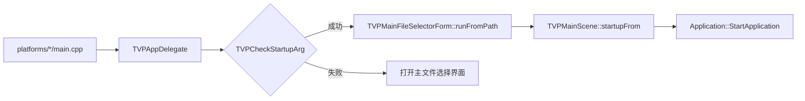

# 运行游戏

> **所属模块：** M01-项目导览与环境搭建  
> **前置知识：** [01-编译项目](01-编译项目.md)  
> **预计阅读时间：** 40 分钟

完成项目编译后，我们已经拿到了 KR2 的可执行产物。
接下来真正关键的是：把它稳定地跑起来，并且知道它为什么能跑、为什么会失败。

## 本节目标

读完本节后，你将能够：
1. 在 Windows/Linux/macOS/Android 上启动 KR2。
2. 判断一个游戏目录是否满足启动条件。
3. 基于源码理解启动链路、参数解析与配置来源。
4. 通过日志完成第一次运行排错。
5. 做基础兼容性与性能观察。

## 获取游戏文件

KR2 本身不提供游戏数据，你需要准备合法授权的 KiriKiri 游戏副本。

### 当前支持的游戏

根据 `doc/support_games.txt`，当前明确支持：
- 天神乱漫LUCKY or UNLUCKY!?（2009-5-29）

这意味着它是当前主验证对象；其他游戏可能可运行，但不要默认“完整兼容”。

### 常见目录结构

一个常见的 KiriKiri 游戏目录通常包含：
- `startup.tjs`：入口脚本（目录模式启动关键）
- `data.xp3`：核心归档
- 其他归档：例如 `bgm.xp3`、`voice.xp3`
- `plugin/`：插件目录
- `config.ksc`：部分游戏存在

## 启动流程总览

从源码看，启动并不是“main 直接执行脚本”，而是先走平台入口和文件选择/路径检查。



## 各平台运行方式详解

### Windows（`.exe`）

入口文件：`platforms/windows/main.cpp`

关键行为：
- 使用 `CommandLineToArgvW` 读取参数。
- 如果 `argc > 1`，把第一个参数写入 `TVPMainFileSelectorForm::filePath`。

推荐命令：

```cmd
out\windows\debug\bin\krkr2\krkr2.exe "D:\Games\TenshinRanman"
```

建议：
- 首次调试尽量用终端启动，不要只双击。
- 终端能直接看到日志，便于定位路径或脚本报错。

### Linux（binary）

入口文件：`platforms/linux/main.cpp`

关键行为：
- `argc > 1` 时读取 `argv[1]` 并写入 `TVPMainFileSelectorForm::filePath`。

推荐命令：

```bash
./out/linux/debug/bin/krkr2/krkr2 "/home/user/games/TenshinRanman"
```

建议：
- 始终在终端运行。
- 失败时先保存终端日志，再做任何调整。

### macOS（`.app`）

入口文件：`platforms/apple/macos/main.cpp`

运行方式：
- Finder 双击 `.app`。
- 或使用终端传参。

推荐命令：

```bash
open out/macos/debug/bin/krkr2/krkr2.app --args "/Users/name/Games/TenshinRanman"
```

建议：
- 调试阶段优先使用 `open ... --args`。
- 这样更容易复现实验路径。

### Android（APK）

入口文件：`platforms/android/cpp/krkr2_android.cpp`

关键行为：
- `cocos_android_app_init` 初始化日志器、SDL 与 AppDelegate。
- JNI 层处理触摸、按键与文本输入。

安装 APK：

```bash
adb install platforms/android/out/android/app/outputs/apk/debug/app-debug.apk
```

运行建议：
- 先把游戏目录放到设备可访问位置。
- 启动 KR2 后用文件选择界面选择目录。
- 使用 logcat 观察运行日志。

## 游戏数据目录结构说明

### 目录模式与归档模式

从 `MainFileSelectorForm.cpp` 可见：
- 目录模式：`checkStartupTjsScript` 检查目录中是否存在 `startup.tjs`。
- 归档模式：`runFromPath` 调用 `TVPCheckArchive`，检查归档是否可读且包含入口脚本。

### 典型结构（目录入口）

```text
TenshinRanman/
├─ startup.tjs
├─ data.xp3
├─ bgm.xp3
├─ voice.xp3
└─ plugin/
```

### 典型结构（归档入口）

```text
TenshinRanman/
├─ data.xp3
├─ patch.xp3
└─ plugin/
```

如果选择的是 `data.xp3` 且归档内含 `startup.tjs`，仍可能启动成功。

## 命令行参数和配置选项

参数解析在 `cpp/core/base/impl/SysInitImpl.cpp` 的 `TVPGetCommandLine`。

参数格式为 `-name=value`。

源码中可确认的参数包括：
- `-arcdelim=<char>`
- `-gclim=<num|auto>`
- `-autosave=yes`
- `-gsplit=<no|int|yes|simple|bidi>`
- `-holdalpha=<yes|true|no>`
- `-jpegdec=<normal|low|high>`
- `-timerprec=<high|higher|normal>`
- `-drawthread=<auto|n>`

### 配置文件位置

根据配置管理源码：
- 全局配置：`GlobalPreference.xml`
- 单游戏配置：`Kirikiroid2Preference.xml`
- 历史路径：`recentpath.xml`

### 常见运行配置项

`PreferenceConfig.h` 中能看到这些高频项：
- `showfps`
- `fps_limit`
- `renderer`
- `keep_screen_alive`
- `remember_last_path`
- `hide_android_sys_btn`（Android）

## 运行时日志查看和分析

### 日志器来源

- Windows/Linux/macOS：平台 `main.cpp` 初始化 `core/tjs2/plugin`。
- Android：`krkr2_android.cpp` 初始化 `KrKr2NativeCore`、`KrKr2NativeTjs2`、`KrKr2NativePlugin`。

### 建议阅读顺序

1. `core`：启动流程、路径、系统行为。
2. `plugin`：插件加载异常。
3. `tjs2`：脚本报错、行号、trace。

### Android 日志命令

```bash
adb logcat | grep KrKr2Native
```

### 判断技巧

- 有路径日志但无脚本日志：多见于入口检查或资源读取失败。
- 出现脚本 trace：说明已经进入脚本执行阶段。

## 调试模式和开发者选项

### FPS 与内存显示

`MainScene.cpp` 中，`showfps` 打开后会创建 FPS 标签，运行时输出：
- FPS
- draw calls
- 内存相关信息

`fps_limit` 会用于设置帧间隔：`setAnimationInterval(1.0f / fps)`。

### 渲染器切换建议

`renderer` 支持 software/opengl。

建议流程：
1. 先用默认配置确保能稳定跑通。
2. 再切渲染器做性能与兼容对照。

### Android 崩溃转储

`KR2Activity_initDump` 初始化 Breakpad。
出现 native 崩溃时，请保存 dump 与 logcat。

## 游戏兼容性测试方法

不要只验证“能进标题”。

建议至少完成：
1. 冷启动到标题。
2. 新开剧情推进 1 分钟。
3. 菜单交互。
4. 读档或快进。
5. 退出并再次启动。

## 性能分析基础（FPS、内存使用）

第一次性能分析先看三项：
1. FPS 是否稳定。
2. draw calls 在场景切换时是否异常飙升。
3. 内存是否持续上涨且不回落。

建议固定 `fps_limit=60` 连续运行 10 分钟，每 2 分钟记录一次指标，并在切回标题后观察内存回落趋势。

## 常见运行时错误及解决

### 1) 动态库缺失（DLL/so/dylib）

症状：启动即退出，或系统提示缺库。

处理：
1. 不要只拷贝单个可执行文件。
2. 从完整构建输出目录运行。
3. 对照构建结果检查依赖是否齐全。

### 2) 资源找不到

症状：窗口能开，但很快报脚本/资源缺失。

处理：
1. 确认选择的是游戏根目录。
2. 确认 `startup.tjs` 或归档入口有效。
3. 使用绝对路径复测。

### 3) TJS2 报错

症状：日志出现 line、block、trace。

处理：
1. 保留完整报错文本。
2. 区分路径问题与脚本兼容问题。
3. 记录触发步骤用于回归。

### 4) Android 输入异常

症状：触摸偏移、返回键异常。

处理：
1. 检查 `nativeTouches*` 和 `nativeKeyAction` 是否触发。
2. 结合分辨率与缩放检查坐标转换链路。

## 动手实践

按下面步骤完成一次可复现运行：

### 步骤 1：准备目录

准备合法游戏目录，并确认满足以下之一：
- 目录内存在 `startup.tjs`
- 或可识别归档内存在 `startup.tjs`

### 步骤 2：执行启动

按“各平台运行方式详解”中的对应命令启动即可。

### 步骤 3：核对日志

确认至少满足：
- 有 `core` 启动日志。
- 没有立即致命错误。
- 能进入标题或可交互界面。

### 步骤 4：最小可玩验证

执行：
1. 新开剧情 1 分钟。
2. 打开菜单或设置。
3. 退出并二次启动。

全部通过，说明当前构建可运行且可重复。

## 对照项目源码

建议重点对照：
- `platforms/windows/main.cpp` 第 20-31 行：Windows 参数读取。
- `platforms/linux/main.cpp` 第 19-21 行：Linux 参数透传。
- `platforms/apple/macos/main.cpp` 第 11-23 行：macOS 入口。
- `platforms/android/cpp/krkr2_android.cpp` 第 37-67 行：Android 初始化。
- `cpp/core/environ/cocos2d/AppDelegate.cpp` 第 97-106 行：启动参数检查失败后打开选择器。
- `cpp/core/environ/ui/MainFileSelectorForm.cpp` 第 137-150 行：路径分支。
- `cpp/core/environ/ui/MainFileSelectorForm.cpp` 第 177-190 行：目录入口脚本检查。
- `cpp/core/base/impl/StorageImpl.cpp` 第 587-625 行：归档入口脚本检查。
- `cpp/core/environ/cocos2d/MainScene.cpp` 第 1926-2013 行：`startupFrom` 与 `doStartup`。
- `cpp/core/base/impl/SysInitImpl.cpp` 第 584-605 行：参数解析。
- `cpp/core/environ/ui/PreferenceConfig.h` 第 300-345 行：运行配置项。
- `cpp/core/environ/ConfigManager/GlobalConfigManager.cpp` 第 128-130 行：全局配置路径。
- `cpp/core/environ/ConfigManager/IndividualConfigManager.cpp` 第 6、22-29 行：单游戏配置。

## 本节小结

- 第一次运行的本质是“路径检查 + 资源可读 + 启动链路可达”。
- 四个平台入口不同，但最终汇入同一核心流程。
- 配置项会直接影响帧率、渲染器、输入行为与可观测日志。
- 日志排查建议顺序：`core -> plugin -> tjs2`。

## 练习题与答案

### 题目 1：为什么 Windows 和 Linux 都可以通过首个参数直接启动？

<details>
<summary>查看答案</summary>

因为两个平台入口都把首个参数写入 `TVPMainFileSelectorForm::filePath`：
- Windows：`CommandLineToArgvW` 获取参数。
- Linux：直接读取 `argv[1]`。

`filePath` 非空后，`MainFileSelectorForm::onEnter` 会直接走 `runFromPath`。

</details>

### 题目 2：目录里没有 `startup.tjs` 就一定不能启动吗？

<details>
<summary>查看答案</summary>

不一定。
目录模式通常会失败；
但如果你直接选择归档文件，且归档内有 `startup.tjs`，仍可启动。

</details>

### 题目 3：`showfps` 与 `fps_limit` 的区别是什么？

<details>
<summary>查看答案</summary>

- `showfps`：是否显示 FPS/内存等观测信息。
- `fps_limit`：目标帧率限制，影响 `setAnimationInterval`。

</details>

## 下一步

继续阅读：[03-常见问题排查](03-常见问题排查.md)。

下一节会把本节提到的常见错误（路径、动态库、脚本、平台差异）整理成可执行排查清单。
