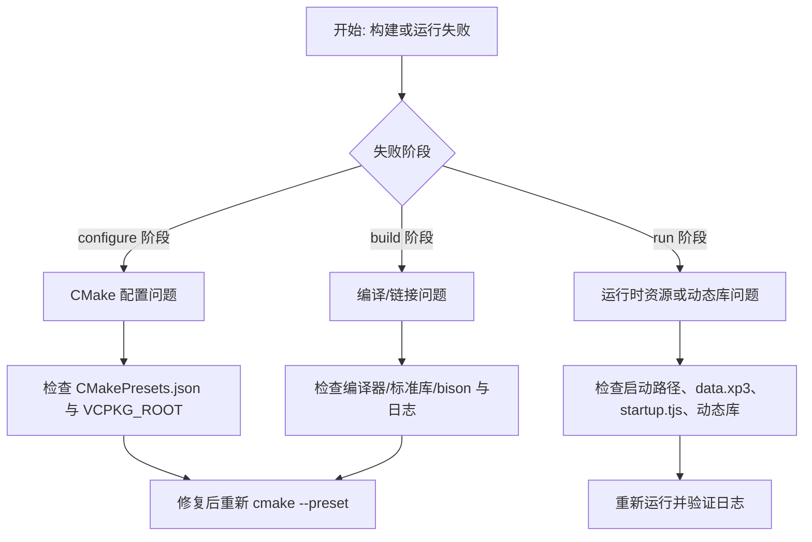

# 常见问题排查

> **所属模块：** M01-项目导览与环境搭建
> **前置知识：** [01-编译项目](01-编译项目.md)、[02-运行游戏](02-运行游戏.md)、[03-环境搭建总览](../03-环境搭建/README.md)
> **预计阅读时间：** 45 分钟

KR2 首次构建最常见的问题，集中在三条链路：`vcpkg 依赖解析`、`CMake 生成工程`、`最终运行时资源与动态库加载`。
本节不是只给“一个命令”，而是给你一套可复用的排查框架：先定位阶段，再收敛日志，再按平台修复。

## 本节目标

读完本节后，你将能够：
1. 根据报错快速判断问题属于 vcpkg、CMake、编译器还是运行时。
2. 针对 Windows/Linux/macOS/Android 四个平台执行对应的排查命令。
3. 处理第一次构建中的高频错误：`VCPKG_ROOT`、Ninja、编译器版本、`find_package`、DLL/so 缺失、NDK 版本冲突。
4. 对照项目真实配置文件，避免“看起来正确但实际不匹配”的修复方式。

## 排查总流程：先分层，再定位



建议你始终保存三类日志：
- CMake 日志：`out/<platform>/<config>/CMakeFiles/CMakeError.log`
- vcpkg 日志：`$VCPKG_ROOT/buildtrees/<port>/` 下的 `*-out.log` 与 `*-err.log`
- 运行日志：终端中的 `core/tjs2/plugin` 三类 spdlog 输出

## vcpkg 相关问题

### 1) `VCPKG_ROOT` 未设置或路径错误

**错误信息示例**
```text
CMake Error at CMakeLists.txt:23 (set):
  CMAKE_TOOLCHAIN_FILE is not a full path to an existing file:
  /scripts/buildsystems/vcpkg.cmake
```

**原因分析**
- 根 `CMakeLists.txt` 在非 Android 分支直接使用：`$ENV{VCPKG_ROOT}/scripts/buildsystems/vcpkg.cmake`。
- 如果环境变量未设置，拼接后就是无效路径。
- 路径包含中文或空格时，部分 shell/批处理参数转义会失败。

**解决步骤**
1. 先确认变量存在：
```bash
echo $VCPKG_ROOT
```
2. 确认工具链文件存在：
```bash
ls "$VCPKG_ROOT/scripts/buildsystems/vcpkg.cmake"
```
3. 重新配置：
```bash
cmake --preset="Windows Debug Config"
```

### 2) vcpkg 安装失败（端口编译失败）

**错误信息示例**
```text
error: building ffmpeg:x64-windows-static-md failed with: BUILD_FAILED
```

**原因分析**
- `vcpkg.json` 依赖较多，含 `ffmpeg`、`opencv4`、`cocos2dx`，首次构建链条长。
- 任一端口失败都会让总构建终止。
- 旧的缓存工件可能与当前 triplet 不兼容。

**解决步骤**
1. 打开失败端口日志目录：`$VCPKG_ROOT/buildtrees/<port>/`。
2. 先看 `*-err.log`，再看 `*-out.log` 的最后一次失败命令。
3. 清理该端口后重试：
```bash
vcpkg remove <port>:<triplet>
vcpkg install --triplet <triplet>
```
4. 若依旧失败，删除 `buildtrees/<port>` 与 `packages/<port>_<triplet>` 后重跑 CMake。

### 3) 网络问题导致依赖下载超时

**错误信息示例**
```text
curl: (28) Failed to connect ... Connection timed out
```

**原因分析**
- 源码包下载依赖外网镜像。
- CI 通过 NuGet 二进制缓存缓解此问题，本地默认没有这层缓存。

**解决步骤**
1. 配置代理环境变量（当前终端会话生效）。
2. 手动下载失败 URL 的压缩包到 `$VCPKG_ROOT/downloads`。
3. 重新执行 preset 配置，触发断点续下。

### 4) overlay-ports 与官方端口冲突

**错误信息示例**
```text
error: while loading port cocos2dx: no version database entry
```

**原因分析**
- 项目 `vcpkg-configuration.json` 显式启用了 `./vcpkg/ports`。
- 若你本地复制了其他 overlay，可能覆盖项目端口。

**解决步骤**
1. 检查 `vcpkg-configuration.json` 仅包含项目自带 overlay。
2. 禁用全局 vcpkg 额外 overlay 设置。
3. 删除 `installed/vcpkg/info/cocos2dx*` 后重新安装。

### 5) 二进制缓存污染或不可用

**错误信息示例**
```text
error: failed to fetch from nuget source
```

**原因分析**
- CI 使用 `VCPKG_BINARY_SOURCES` 指向 GitHub Packages。
- 本地若照抄 CI 变量但无 `NUGET_API_KEY`，会出现拉取失败。

**解决步骤**
1. 本地优先清理该变量，回退源码构建。
2. 若要启用缓存，先验证 NuGet 源可访问、凭据正确。
3. 缓存异常时先 `clear`，避免反复命中坏包。

## CMake 配置问题

### 1) preset 找不到

**错误信息示例**
```text
Could not read presets from CMakePresets.json: Invalid "configurePreset"
```

**原因分析**
- 命令里的 preset 名必须与 `CMakePresets.json` 完全一致。
- 项目使用了带空格名称，如 `Windows Debug Config`。

**解决步骤**
1. 先列出可用 preset：
```bash
cmake --list-presets
```
2. 复制名称原样执行，包含引号：
```bash
cmake --preset="Linux Debug Config"
```

### 2) 生成器不匹配或 Ninja 未安装

**错误信息示例**
```text
CMake Error: CMake was unable to find a build program corresponding to "Ninja"
```

**原因分析**
- 预设统一使用 `generator: Ninja`。
- 系统未安装 Ninja，或 PATH 不可见。

**解决步骤**
1. 执行 `ninja --version` 验证可执行。
2. Windows 可通过 VS Installer 勾选 Ninja，Linux 用包管理器安装。
3. 重新进入新终端，确认 PATH 生效。

### 3) 编译器版本不满足 C++17

**错误信息示例**
```text
error: 'filesystem' is not a member of 'std'
```

**原因分析**
- 项目强制 `CMAKE_CXX_STANDARD 17`。
- 旧 GCC/Clang/MSVC 对 C++17 支持不完整。

**解决步骤**
1. 检查编译器版本：`cl` / `g++ --version` / `clang++ --version`。
2. Windows 使用 VS2022 工具链；Linux 建议 GCC 11+；macOS 使用 Xcode 15+ 工具链。
3. 删除旧构建目录后重新配置，避免缓存旧编译器路径。

### 4) `find_package` 失败

**错误信息示例**
```text
Could not find a package configuration file provided by "spdlog"
```

**原因分析**
- 项目多个模块依赖 `find_package(... CONFIG REQUIRED)`。
- vcpkg 工具链未被 CMake 接管时，包路径不会注入。

**解决步骤**
1. 先解决 `VCPKG_ROOT` 与 toolchain 路径。
2. 确认 `vcpkg install` 已安装当前 triplet 所需包。
3. 保证 configure 使用 preset，不要混用手写 toolchain 参数和 preset。

### 5) 主机系统与 preset 条件不匹配

**错误信息示例**
```text
No configure preset named "MacOS Debug Config"
```

**原因分析**
- 预设含 `condition`：Windows/Linux/macOS 只在对应 host 生效。
- 在 Linux 主机看不到 macOS preset 是预期行为。

**解决步骤**
1. 先确认 `cmake --list-presets` 输出。
2. 需要跨平台构建时，改用对应平台机器或容器，不要直接强行套用本机不可见 preset。

## 编译与链接错误

### 1) C++17 特性不支持

**错误信息示例**
```text
error C2039: 'optional': is not a member of 'std'
```

**原因分析**
- 这通常不是代码问题，而是编译器太旧或未进入正确开发者环境。
- Windows 下最常见是没在 VS 开发者命令行中运行 cmake。

**解决步骤**
1. 使用 “x64 Native Tools Command Prompt for VS 2022”。
2. 删除 `out/<platform>/<config>` 后重建，确保缓存刷新。

### 2) 头文件找不到（依赖已声明但未解析）

**错误信息示例**
```text
fatal error: spdlog/spdlog.h: No such file or directory
```

**原因分析**
- `find_package(spdlog CONFIG REQUIRED)` 失败后继续编译会触发连锁报错。
- 或者你手动改了构建参数，绕开了 vcpkg toolchain。

**解决步骤**
1. 回到 configure 阶段修复 `find_package`。
2. 确保使用 preset，而不是裸 `cmake -S . -B build`。

### 3) 链接错误（undefined reference / LNK2019）

**错误信息示例**
```text
undefined reference to `fmt::vformat`
```

**原因分析**
- 依赖库版本不一致，或 triplet 混用（例如 x64-windows 与 x64-windows-static-md）。
- 根 preset 在 Windows 已固定 `VCPKG_TARGET_TRIPLET=x64-windows-static-md`。

**解决步骤**
1. 核对当前使用的 triplet 与 preset 一致。
2. 清理错装 triplet 的 installed 包并重装。
3. 全量重建链接阶段确认符号恢复。

### 4) bison/winflexbison 路径问题（Windows 特有）

**错误信息示例**
```text
BISON_EXECUTABLE-NOTFOUND
```

**原因分析**
- `cpp/core/tjs2/CMakeLists.txt` 使用 `find_program(BISON_EXECUTABLE NAMES win_bison.exe bison.exe bison)`。
- 未安装 winflexbison，或安装后未加入 PATH。

**解决步骤**
1. 安装 winflexbison（CI 使用 2.5.25 版本包）。
2. 将其目录加入 PATH，并开新终端。
3. `where win_bison` 验证可找到，再重新 configure。

### 5) Python3 未找到导致 tjs2 生成步骤失败

**错误信息示例**
```text
Could NOT find Python3 (missing: Python3_EXECUTABLE)
```

**原因分析**
- tjs2 模块执行 `create_world_map.py` 生成 `tjsDateWordMap.inc`。
- Python 不可用会导致生成代码步骤失败。

**解决步骤**
1. 安装 Python3 并确保命令行可调用。
2. 删除 tjs2 相关中间目录后重新配置，触发生成逻辑。

## 运行时问题

### 1) Windows 启动时报缺少 DLL

**错误信息示例**
```text
The code execution cannot proceed because xxx.dll was not found
```

**原因分析**
- KR2 链接了大量三方库，运行目录必须带齐依赖。
- 直接拷贝 `krkr2.exe` 到其他目录常导致 DLL 丢失。

**解决步骤**
1. 在 `out/windows/debug/bin/krkr2/` 原目录直接运行。
2. 若必须分发，连同同目录 DLL 一起复制。
3. 重新执行构建，确认 `cocos_copy_target_dll` 步骤已执行。

### 2) Linux 缺少 `libfmod.so`

**错误信息示例**
```text
error while loading shared libraries: libfmod.so.6: cannot open shared object file
```

**原因分析**
- `scripts/build-linux.sh` 会复制 `libfmod.so` 和 `libfmodL.so` 到 `/usr/lib` 并创建软链接。
- 若你跳过脚本、只手动 cmake build，就会缺这一步。

**解决步骤**
1. 直接重跑 `./scripts/build-linux.sh`。
2. 或手动复制并建立软链接后执行 `ldconfig`。

### 3) 游戏资源路径错误（黑屏或文件不存在）

**错误信息示例**
```text
[core] [error] cannot find startup script
```

**原因分析**
- 启动入口会检查目录中 `startup.tjs`，或检查归档中是否包含 `startup.tjs`。
- 仅有 `data.xp3` 但路径指向错误目录，也会失败。

**解决步骤**
1. 先确认你选的是“游戏根目录”而不是子目录。
2. 确认目录中存在 `startup.tjs` 或可识别归档。
3. 参考上一节 `02-运行游戏.md` 的目录结构重新核对。

### 4) TJS2 脚本报错

**错误信息示例**
```text
[tjs2] [error] script exception at line xxx
```

**原因分析**
- 兼容性尚在推进，某些游戏脚本/插件调用路径与原版存在差异。
- 也可能是资源损坏或编码异常。

**解决步骤**
1. 记录报错脚本名、行号、调用栈。
2. 对照原始游戏资源完整性（哈希/文件大小）。
3. 若为稳定复现问题，提交 issue 时附上日志与平台信息。

### 5) 窗口不显示或闪退

**错误信息示例**
```text
[core] [info] KR2 Engine initializing...
(随后进程退出，无窗口)
```

**原因分析**
- 图形后端初始化失败、缺少运行时依赖、或资源路径导致启动流程中断。
- 在 AppDelegate 中，若启动参数检查失败会推入文件选择界面；若 UI 资源缺失可能出现空白。

**解决步骤**
1. 先在终端运行，不要双击，保留完整日志。
2. 检查 `ui/cocos-studio` 是否被复制到运行目录的资源路径。
3. 验证显卡驱动与 OpenGL 环境。

---

## 动手实践

### 实践 1：模拟一次 VCPKG_ROOT 缺失

临时清除 `VCPKG_ROOT` 环境变量，然后运行 CMake configure，观察报错信息：

```bash
# Linux/macOS
unset VCPKG_ROOT
cmake --preset="Linux Debug Config" 2>&1 | head -20

# Windows (PowerShell)
$env:VCPKG_ROOT = ""
cmake --preset="Windows Debug Config" 2>&1 | Select-Object -First 20
```

记录报错关键词，然后恢复环境变量重新 configure 成功。

### 实践 2：排查阶段分层练习

准备以下三条错误信息，判断各属于 configure/build/runtime 哪个阶段：
1. `CMake Error: CMAKE_C_COMPILER not set`
2. `error LNK2019: unresolved external symbol`
3. `[core] [error] cannot find startup script`

### 实践 3：日志级别验证

用 Debug 构建运行一次游戏（或直接启动无游戏），对照 spdlog 日志输出，识别 `[core]`、`[tjs2]`、`[plugin]` 三个 logger 分别对应哪些模块。

---

## 对照项目源码

相关文件：
- `CMakeLists.txt` 第 1-20 行：CMake 版本、项目名、C++ 标准设置。
- `CMakePresets.json` 全文：所有 preset 的 generator、toolchain、cache 变量定义。
- `vcpkg.json` 全文：依赖清单与平台条件。
- `cpp/core/environ/cocos2d/AppDelegate.cpp` 第 31-109 行：启动参数检查与 UI 初始化。
- `platforms/android/build.gradle`：Android 构建入口。
- `doc/FAQ.md`：已记录的构建常见问题。

---

## 常见错误

### 错误 1：反复删除 build 目录重新 configure

CMake 的增量 configure 是可靠的。大多数问题可以通过修改变量后重新 `cmake --preset=...` 解决，不需要删除整个 build 目录。频繁删除会导致 vcpkg 重新下载和编译所有依赖，浪费大量时间。

### 错误 2：在错误阶段排查问题

configure 阶段的错误不会出现 `LNK2019` 或 `undefined reference`——这些是 build 阶段（具体是 link 阶段）的错误。如果在 configure 阶段看到链接错误，说明你的判断有误，需要重新看日志确认失败发生在哪一步。

### 错误 3：Android 构建时忘记设置 NDK 版本

KrKr2 的 Android 构建依赖特定版本的 NDK。如果 `ANDROID_NDK` 指向了不兼容版本，可能在编译 C++ 时出现标准库不匹配的错误。应对照 `platforms/android/build.gradle` 中指定的 NDK 版本。

---

## 本节小结

- 首次构建问题集中在 vcpkg 依赖解析、CMake 工程生成、运行时资源加载三条链路。
- 排查的核心方法是"先分层、再定位"：确定问题属于 configure/build/runtime 哪个阶段。
- 四个平台各有高频问题：Windows 常见 Ninja 和 winflexbison，Linux 常见编译器版本，macOS 常见 SDK 路径，Android 常见 NDK 版本。
- 所有修复都应对照项目实际配置文件（CMakePresets.json、vcpkg.json）验证，不要凭经验猜测。

---

## 练习题与答案

### 题目 1：`find_package(FFmpeg REQUIRED)` 失败，你应该先检查什么？

<details>
<summary>查看答案</summary>

先检查 `VCPKG_ROOT` 是否正确设置，然后确认 `vcpkg.json` 中是否包含 `ffmpeg` 依赖声明。再检查 vcpkg 是否已成功安装 ffmpeg（查看 `$VCPKG_ROOT/installed/` 目录）。最后确认 CMake 的 toolchain 文件是否指向了 vcpkg 的 `vcpkg.cmake`。

</details>

### 题目 2：Linux 上编译报 `error: 'filesystem' is not a member of 'std'`，原因和解决方案？

<details>
<summary>查看答案</summary>

原因是 GCC 版本低于 8，不完整支持 C++17 的 `<filesystem>`。解决方案是升级 GCC 到 9 或更高版本，或者安装 GCC 9 后通过 `-DCMAKE_CXX_COMPILER=g++-9` 指定编译器。KrKr2 要求 C++17 支持。

</details>

### 题目 3：运行时报 `cannot find startup script`，排查步骤是什么？

<details>
<summary>查看答案</summary>

1. 确认你指定的是游戏根目录（包含 `data.xp3` 或 `startup.tjs` 的目录），而不是子目录。
2. 确认目录中确实存在 `startup.tjs` 文件，或者 `data.xp3` 归档中包含 `startup.tjs`。
3. 如果使用命令行参数传递路径，检查路径是否有空格未转义。
4. 参考 `02-运行游戏.md` 中的目录结构说明重新核对。

</details>

---

## 下一步

恭喜！你已经完成了 M01 的全部内容。现在你已经了解了 KiriKiri 的历史与生态、KrKr2 的项目架构、环境搭建、首次构建与运行。

接下来进入 [M02-项目构建系统深度解析](../../M02-项目构建系统深度解析/README.md)，你将深入理解 KrKr2 的 CMake 构建系统、预设配置、交叉编译、CI/CD 等工程化基础设施。
