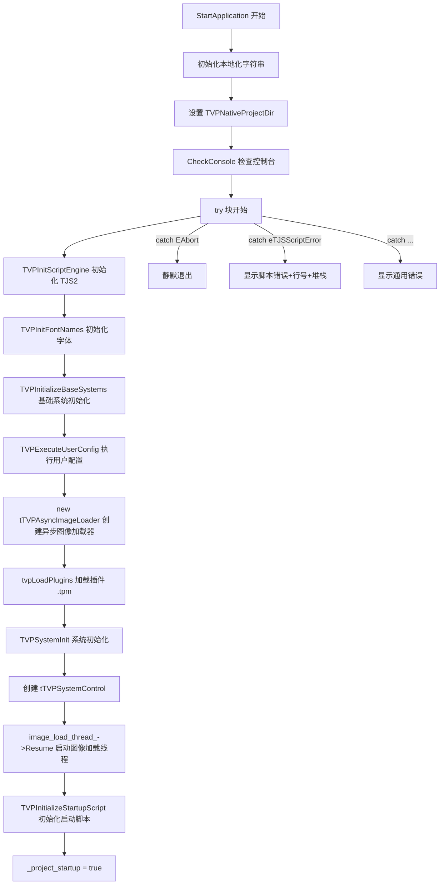
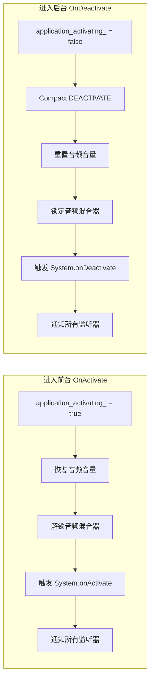

# Application 生命周期与消息系统

> **所属模块：** M03-平台抽象层解析
> **前置知识：** [01-environ模块总览与架构](./01-environ模块总览与架构.md)、[02-Platform接口与平台实现对比](./02-Platform接口与平台实现对比.md)、C++ 基础（std::mutex、std::function、std::tuple）
> **预计阅读时间：** 45 分钟（按每分钟 200 字估算）

## 本节目标

读完本节后，你将能够：

1. 理解 `tTVPApplication` 类的完整设计——成员变量、消息队列、活动事件注册表的作用
2. 掌握 KrKr2 从 `StartApplication()` 到 `Run()` 再到 `OnExit()` 的完整生命周期流程
3. 理解自定义消息队列（`PostUserMessage` / `ProcessMessages`）的线程安全实现
4. 理解 OOM（内存不足）恢复机制——预留内存 + Compact 事件 + 重试对话框
5. 能够对照项目源码，独立分析 Application 层的任何一个方法的执行逻辑
6. 理解活动/非活动事件如何驱动音频混合器锁定和 Compact 缓存清理

---

## 1. tTVPApplication 类总览

### 1.1 类的定位

`tTVPApplication` 是 KrKr2 引擎的**核心应用类**，承担以下职责：

| 职责 | 说明 |
|------|------|
| 生命周期管理 | 启动、运行主循环、退出 |
| 消息队列 | 跨线程的自定义消息投递与分发 |
| 活动状态管理 | 前后台切换时的音频/缓存控制 |
| 异步图像加载 | 管理 `tTVPAsyncImageLoader` 线程 |
| OOM 恢复 | 预留内存 + compact 事件 + 用户交互 |
| 控制台管理 | 日志输出通道的打开/关闭 |

全局单例在 `Application.cpp` 第 39 行直接构造：

```cpp
// cpp/core/environ/Application.cpp 第 39 行
tTVPApplication *Application = new tTVPApplication;  // 全局唯一实例
```

> **注意：** 这不是"懒加载单例"，而是在程序加载阶段（`main()` 之前）就被全局初始化器构造。这意味着构造函数中不能依赖任何运行时初始化的资源。

### 1.2 成员变量解析

下面逐一解读 `Application.h` 中 `tTVPApplication` 类的私有成员（第 72-203 行）：

```cpp
// cpp/core/environ/Application.h 第 72-204 行（关键摘录）
class tTVPApplication {
    ttstr title_;                    // 应用标题（显示在窗口/控制台）
    bool is_attach_console_;         // 是否已附加控制台输出
    ttstr console_title_;            // 控制台原始标题（用于恢复）
    bool tarminate_;                 // 终止标志（注意拼写：不是 terminate）
    bool application_activating_;    // 当前是否处于前台活动状态
    bool has_map_report_process_;    // 是否为 map 报告子进程
    class tTVPAsyncImageLoader *image_load_thread_;  // 异步图像加载线程

private:
    std::mutex m_msgQueueLock;       // 消息队列互斥锁
    // 消息队列：每个消息是 (宿主指针, 消息ID, 回调函数) 的三元组
    std::vector<std::tuple<void *, int, tMsg>> m_lstUserMsg;
    // 活动事件监听器注册表：宿主指针 → 回调函数
    std::map<void *, std::function<void(void *, eTVPActiveEvent)>> m_activeEvents;
};
```

关键点：

- **`tarminate_`** 的拼写是项目历史遗留（日文开发者拼写偏差），不要"修正"它
- **`application_activating_`** 默认为 `true`（构造函数中初始化），表示启动时默认为活动状态
- **`m_lstUserMsg`** 是自定义消息队列的核心数据结构，用 `std::vector` 而非 `std::queue`，这是为了支持 `FilterUserMessage()` 的随机访问过滤

### 1.3 消息类型定义

```cpp
// cpp/core/environ/Application.h 第 152 行
typedef std::function<void()> tMsg;  // 消息就是一个无参无返回值的回调函数
```

这个设计非常简洁——消息不是"数据"，而是"行为"。发送消息就是投递一个待执行的函数，接收消息就是调用这个函数。这种模式也被称为 **Command Pattern（命令模式）**。

### 1.4 枚举类型

```cpp
// cpp/core/environ/Application.h 第 19-39 行
// 对话框返回值
enum {
    mrOk,           // 用户点击确定
    mrAbort,        // 用户点击中止
    mrCancel,       // 用户点击取消
};

// 消息框图标类型（沿用 Windows MB_ICON* 数值）
enum {
    mtWarning      = 0x00000030L,  // 警告图标
    mtError        = 0x00000010L,  // 错误图标
    mtInformation  = 0x00000040L,  // 信息图标
    mtConfirmation = 0x00000020L,  // 询问图标
    mtStop         = 0x00000010L,  // 停止图标（与 Error 相同）
    mtCustom       = 0             // 自定义
};

// 活动事件类型
enum class eTVPActiveEvent {
    onActive,     // 应用进入前台
    onDeactive,   // 应用进入后台（注意拼写：不是 onDeactivate）
};
```

> **跨平台设计考量：** 虽然枚举数值沿用了 Windows `MB_ICON*` 的值，但这只是为了与原版 KiriKiri 保持兼容。实际的消息框显示由 `TVPShowSimpleMessageBox()` 实现，每个平台有自己的实现。

---

## 2. 启动流程：StartApplication() 深度解析

`StartApplication()` 是整个引擎的启动入口（第 296-396 行），由平台层调用。下面我们用流程图和逐段分析来完整理解它。

### 2.1 启动流程总览



### 2.2 第一阶段：环境准备（第 296-310 行）

```cpp
// cpp/core/environ/Application.cpp 第 296-310 行
bool tTVPApplication::StartApplication(ttstr path) {
    ArgC = 0;
    ArgV = nullptr;
    TVPTerminateCode = 0;                              // 退出码清零
    LocaleConfigManager *mgr = LocaleConfigManager::GetInstance();
    _retry = mgr->GetText("retry");                    // 从本地化配置获取"重试"文本
    _cancel = mgr->GetText("cancel");                  // 从本地化配置获取"取消"文本
    _msg = mgr->GetText("err_no_memory");              // OOM 错误消息文本
    _title = mgr->GetText("err_occured");              // 错误对话框标题文本
    TVPNativeProjectDir = path;                        // 设置项目根目录
    CheckConsole();                                    // 检查是否从控制台启动
```

这里可以看到，引擎启动的**第一步不是加载脚本或渲染**，而是准备好错误处理所需的本地化字符串。这是一个防御性编程的好实践——确保即使后续初始化失败，也能用正确的语言显示错误信息。

### 2.3 第二阶段：核心初始化（第 312-353 行）

```cpp
// cpp/core/environ/Application.cpp 第 312-353 行（简化注释版）
    try {
        TVPProjectDir = TVPNormalizeStorageName(path);  // 规范化存储路径
        TVPInitScriptEngine();        // 初始化 TJS2 脚本引擎（词法器/解析器/VM）
        TVPInitFontNames();           // 扫描系统可用字体

        // 打印启动日志横幅
        TVPAddImportantLog(TVPFormatMessage(
            TVPProgramStartedOn, TVPGetOSName(), TVPGetPlatformName()));

        TVPInitializeBaseSystems();   // 初始化基础子系统（存储、事件等）
        Initialize();                 // 空函数，预留给子类扩展

        if (TVPCheckPrintDataPath()) return true;   // 如果只是打印数据路径就退出
        if (TVPExecuteUserConfig()) return true;    // 执行用户配置脚本

        image_load_thread_ = new tTVPAsyncImageLoader();  // 创建异步图像加载器
        tvpLoadPlugins();             // 加载 .tpm 插件模块
        TVPSystemInit();              // 系统级初始化

        if (TVPCheckAbout()) return true;  // 如果只是显示版本信息就退出

        SetTitle(TVPKirikiri.operator const tjs_char *());  // 设置窗口标题
        TVPSystemControl = new tTVPSystemControl();         // 创建系统控制器
        CheckDigitizer();             // 检查触摸屏（仅 Windows 7+）

        image_load_thread_->Resume(); // 启动异步图像加载线程
        TVPInitializeStartupScript(); // 加载并执行 startup.tjs
        _project_startup = true;      // 标记项目已完成启动
```

### 2.4 初始化顺序的重要性

初始化顺序不是随意的，每一步都依赖前一步的结果：

| 顺序 | 函数 | 依赖 | 说明 |
|------|------|------|------|
| 1 | `TVPInitScriptEngine()` | 无 | TJS2 VM 必须最先就绪 |
| 2 | `TVPInitFontNames()` | 无 | 字体名称扫描独立运行 |
| 3 | `TVPInitializeBaseSystems()` | TJS2 | 存储系统需要脚本引擎注册存储媒体 |
| 4 | `TVPExecuteUserConfig()` | 基础系统 | 用户配置可能修改系统参数 |
| 5 | `new tTVPAsyncImageLoader()` | 无 | 创建加载器但还不启动线程 |
| 6 | `tvpLoadPlugins()` | 存储系统 | 插件从存储系统读取 .tpm 文件 |
| 7 | `TVPSystemInit()` | 插件 | 系统初始化可能依赖插件提供的功能 |
| 8 | `new tTVPSystemControl()` | 全部 | 系统控制器管理事件循环 |
| 9 | `image_load_thread_->Resume()` | 加载器创建完 | 线程创建和启动分离，确保系统就绪 |
| 10 | `TVPInitializeStartupScript()` | 所有子系统 | startup.tjs 可能使用任何子系统 |

> **关键设计：** 异步图像加载线程的**创建**（步骤 5）和**启动**（步骤 9）是分离的。这确保了线程启动时所有它可能依赖的子系统都已就绪。

### 2.5 异常处理体系（第 354-395 行）

`StartApplication()` 使用了多达 **8 个** catch 子句来覆盖所有可能的异常类型：

```cpp
// cpp/core/environ/Application.cpp 第 354-393 行
    } catch (const EAbort &) {
        // EAbort 异常表示用户主动中止，不需要显示错误
    } catch (const Exception &exception) {
        TVPOnError();                            // 触发错误处理钩子
        if (!TVPSystemUninitCalled)
            ShowException(exception.what());     // 显示标准异常消息
    } catch (const TJS::eTJSScriptError &e) {
        TVPOnError();
        if (!TVPSystemUninitCalled) {
            ttstr msg;
            if (!title_.IsEmpty()) {
                msg += title_;                   // 附加应用标题
                msg += "\n";
            }
            msg += e.GetMessage();               // 脚本错误消息
            const tjs_char *pszBlockName = e.GetBlockName();
            if (pszBlockName && *pszBlockName) {
                msg += TJS_W("\n@line(");
                tjs_char tmp[34];
                msg += TJS_int_to_str(e.GetSourceLine(), tmp);  // 错误行号
                msg += TJS_W(") ");
                msg += pszBlockName;             // 脚本块名称
            }
            msg += TJS_W("\n");
            msg += e.GetTrace();                 // 调用堆栈跟踪
            ShowException(msg);
        }
    } catch (const TJS::eTJS &e) {
        TVPOnError();
        if (!TVPSystemUninitCalled)
            ShowException(e.GetMessage());        // TJS 通用异常
    } catch (const std::exception &e) {
        ShowException(e.what());                  // C++ 标准异常
    } catch (const char *e) {
        ShowException(e);                         // C 字符串异常
    } catch (const tjs_char *e) {
        ShowException(e);                         // 宽字符串异常
    } catch (...) {
        ShowException((const tjs_char *)TVPUnknownError);  // 未知异常
    }
```

异常处理的层次结构：

```mermaid
flowchart TD
    E[异常抛出] --> A{类型判断}
    A -->|EAbort| B[静默退出 — 用户主动中止]
    A -->|Exception| C[显示通用错误消息]
    A -->|eTJSScriptError| D[显示脚本错误+行号+堆栈跟踪]
    A -->|eTJS| F[显示 TJS 引擎错误]
    A -->|std::exception| G[显示 C++ 标准异常]
    A -->|char*| H[显示 C 字符串错误]
    A -->|tjs_char*| I[显示宽字符串错误]
    A -->|...| J[显示"未知错误"]
    
    C --> K[TVPOnError 错误钩子]
    D --> K
    F --> K
    K --> L{TVPSystemUninitCalled?}
    L -->|否| M[ShowException 弹出错误对话框]
    L -->|是| N[跳过 — 系统已在析构]
```

> **为什么需要这么多 catch 子句？** 因为 KrKr2 混合了多种异常源：TJS2 脚本引擎有自己的异常体系（`eTJS`、`eTJSScriptError`），C++ 标准库使用 `std::exception`，而一些老代码直接抛出 C/宽字符串。引擎必须全部捕获，否则未处理的异常会导致静默崩溃。

---

## 3. 主循环：Run() 方法

### 3.1 Run() 的工作原理

`Run()` 方法（第 491-545 行）是引擎的**帧循环函数**，由 Cocos2d-x 的 `Director` 在每帧调用：

```cpp
// cpp/core/environ/Application.cpp 第 491-545 行
void tTVPApplication::Run() {
    try {
        // 检查是否已请求终止
        if (TVPTerminated) {
            TVPSystemUninit();                    // 反初始化系统
            TVPExitApplication(TVPTerminateCode);  // 退出应用
        }
        ProcessMessages();                        // 处理消息队列
        if (TVPSystemControl)
            TVPSystemControl->SystemWatchTimerTimer();  // 系统看门狗定时器
    } catch (const EAbort &) {
        // 用户主动中止，静默处理
    } catch (const Exception &exception) {
        // ... 与 StartApplication 相同的异常处理链 ...
    }
    // ... 其余 catch 子句省略，结构与 StartApplication 完全一致 ...
}
```

### 3.2 帧循环时序图

```
Cocos2d-x Director                  tTVPApplication              tTVPSystemControl
       |                                  |                             |
       |--- mainLoop() 每帧调用 --------->|                             |
       |                                  |                             |
       |                                  |-- 检查 TVPTerminated        |
       |                                  |                             |
       |                                  |-- ProcessMessages() ------->|
       |                                  |   (处理所有排队消息)         |
       |                                  |                             |
       |                                  |-- SystemWatchTimerTimer() ->|
       |                                  |                             |-- 事件分发
       |                                  |                             |-- Compact 检查
       |                                  |                             |-- Rehash 检查
       |                                  |<----------------------------|
       |<---------------------------------|                             |
       |                                  |                             |
       |--- 下一帧 mainLoop() ----------->|                             |
```

### 3.3 SystemWatchTimerTimer 的作用

`tTVPSystemControl`（定义在 `win32/SystemControl.h`）是系统级控制器：

```cpp
// cpp/core/environ/win32/SystemControl.h 第 17-55 行
class tTVPSystemControl {
    bool ContinuousEventCalling;       // 是否在进行连续事件调用
    bool EventEnable;                  // 事件分发是否启用
    uint32_t LastCompactedTick;        // 上次 Compact 时间戳
    uint32_t LastRehashedTick;         // 上次 Rehash 时间戳
    TVPTimer SystemWatchTimer;         // 系统看门狗定时器

public:
    void SystemWatchTimerTimer();      // 周期性系统检查
    void InvokeEvents();               // 触发事件分发
    bool ApplicationIdle();            // 空闲处理
};
```

`SystemWatchTimerTimer()` 在每帧被调用，执行以下检查：
- **事件分发**：调用 `TVPDeliverAllEvents()` 分发排队的脚本事件
- **Compact 检查**：定期触发内存紧缩（清理缓存）
- **Rehash 检查**：定期对内部哈希表进行再散列

---

## 4. 消息队列系统

### 4.1 设计动机

KrKr2 的消息队列解决的核心问题是：**如何让工作线程安全地在主线程上执行代码？**

在游戏引擎中，许多操作必须在主线程执行（UI 更新、OpenGL 调用、TJS 脚本执行），但图像加载、网络请求等耗时操作在工作线程完成后需要通知主线程。这就需要一个线程安全的消息投递机制。

### 4.2 PostUserMessage —— 投递消息

```cpp
// cpp/core/environ/Application.cpp 第 726-730 行
void tTVPApplication::PostUserMessage(
    const std::function<void()> &func,  // 要在主线程执行的函数
    void *host,                          // 消息宿主（用于过滤）
    int msg)                             // 消息标识（用于过滤）
{
    std::lock_guard<std::mutex> cs(m_msgQueueLock);  // 自动加锁/解锁
    m_lstUserMsg.emplace_back(host, msg, func);      // 追加到队列末尾
}
```

这是一个典型的**生产者**接口。任何线程都可以调用它来投递一个待执行函数。关键点：

1. **`std::lock_guard`** 确保线程安全——构造时自动上锁，析构时自动解锁
2. **`emplace_back`** 直接在 vector 末尾构造 tuple，避免拷贝
3. 三元组 `(host, msg, func)` 中的 `host` 和 `msg` 不影响执行，仅用于后续的 `FilterUserMessage()` 过滤

### 4.3 ProcessMessages —— 消费消息

```cpp
// cpp/core/environ/Application.cpp 第 547-557 行
void tTVPApplication::ProcessMessages() {
    std::vector<std::tuple<void *, int, tMsg>> lstUserMsg;  // 本地副本
    {
        std::lock_guard<std::mutex> cs(m_msgQueueLock);     // 加锁
        m_lstUserMsg.swap(lstUserMsg);                       // 交换！不是拷贝
    }
    // 锁已释放，安全地在主线程逐个执行消息回调
    for (std::tuple<void *, int, tMsg> &it : lstUserMsg) {
        std::get<2>(it)();   // 调用第三个元素（tMsg 回调函数）
    }
    TVPTimer::ProgressAllTimer();  // 推进所有定时器
}
```

这段代码包含一个精妙的设计——**swap 技巧**：

1. 创建一个空的本地 vector `lstUserMsg`
2. 在锁保护下，将成员变量 `m_lstUserMsg` 与本地变量**交换**
3. 交换后：成员变量变为空（可接收新消息），本地变量持有所有待处理消息
4. 释放锁
5. 在锁外遍历本地副本，逐个执行回调

**为什么用 swap 而不是 copy？**

| 方案 | 锁持有时间 | 内存开销 | 性能 |
|------|-----------|---------|------|
| copy + clear | 长（拷贝期间持锁） | 2 倍（原始+副本） | 慢 |
| **swap** | **极短（一次指针交换）** | **1 倍（只有副本）** | **快** |
| 直接遍历 | 最长（遍历期间持锁） | 1 倍 | 最慢，阻塞生产者 |

swap 方案将锁持有时间降到了最低——仅交换三个指针（vector 内部的 data、size、capacity），O(1) 操作。

### 4.4 FilterUserMessage —— 消息过滤

```cpp
// cpp/core/environ/Application.cpp 第 732-737 行
void tTVPApplication::FilterUserMessage(
    const std::function<void(std::vector<std::tuple<void *, int, tMsg>> &)>
        &func)
{
    std::lock_guard<std::mutex> cs(m_msgQueueLock);
    func(m_lstUserMsg);  // 直接将队列引用传给过滤函数
}
```

`FilterUserMessage()` 允许调用者直接操作消息队列——删除、修改或重排消息。典型用途：

- 当一个 UI 组件被销毁时，移除所有该组件的待处理消息
- 当事件被取消时，从队列中删除对应消息

```cpp
// 使用示例：移除所有宿主为 this 的消息
Application->FilterUserMessage([this](auto &queue) {
    queue.erase(
        std::remove_if(queue.begin(), queue.end(),
            [this](const auto &item) {
                return std::get<0>(item) == this;  // 匹配宿主指针
            }),
        queue.end()
    );
});
```

---

## 5. OOM 恢复机制

### 5.1 预留内存策略

KrKr2 实现了一套精巧的 OOM（Out of Memory）恢复机制。核心思想：**在内存还充足时预留一块缓冲区，OOM 发生时释放这块缓冲区，为恢复操作腾出空间。**

```cpp
// cpp/core/environ/Application.cpp 第 42 行
static void *_reservedMem = malloc(1024 * 1024 * 4);  // 预留 4MB 内存
```

### 5.2 OOM 回调处理

当内存分配失败时，`_no_memory_cb()` 被调用：

```cpp
// cpp/core/environ/Application.cpp 第 47-56 行
static void _no_memory_cb() {
    tTJSCSH lock(_NoMemCallBackCS);    // 临界区保护（防止多线程同时触发）
    free(_reservedMem);                 // 释放预留的 4MB
    if (TVPMainThreadID == std::this_thread::get_id()) {
        _do_compact();                  // 主线程直接执行 Compact
    } else {
        Application->PostUserMessage(_do_compact);  // 工作线程投递到主线程
    }
    _reservedMem = realloc(nullptr, 1024 * 1024 * 4);  // 重新预留 4MB
}
```

这里有一个重要的**线程区分**：

- **主线程**：直接调用 `_do_compact()`，触发 `TVPDeliverCompactEvent(TVP_COMPACT_LEVEL_MAX)` 清理所有缓存
- **工作线程**：不能直接调用 Compact（因为 Compact 操作涉及 UI 和脚本引擎，必须在主线程），所以通过 `PostUserMessage` 投递到消息队列

### 5.3 内存分配包装器

```cpp
// cpp/core/environ/Application.cpp 第 61-79 行
static void *__do_alloc_func(F_alloc_t *f, void *p, size_t c) {
    void *ptr = f(p, c);              // 第一次尝试分配

    if (!ptr) {
        _no_memory_cb();              // 分配失败 → 触发 OOM 回调
        ptr = f(p, c);                // 第二次尝试分配

        if (!ptr) {
            tTJSCSH lock(_cs);
            const char *btns[2] = { _retry.c_str(), _cancel.c_str() };
            // 弹出"重试/取消"对话框，让用户关闭其他程序释放内存
            while (!ptr &&
                   TVPShowSimpleMessageBox(_msg.c_str(), _title.c_str(),
                                          2, btns) == 0) {
                ptr = f(p, c);        // 用户点击"重试"后再次尝试
            }
        }
    }
    return ptr;
}
```

OOM 恢复的三级策略：

```
第 1 次分配 → 成功 → 返回
            → 失败 → 释放预留 4MB + Compact 缓存
                     ↓
第 2 次分配 → 成功 → 返回
            → 失败 → 弹出"重试/取消"对话框
                     ↓
用户点击重试 → 循环第 N 次分配
用户点击取消 → 返回 nullptr（调用者处理）
```

### 5.4 Compact 事件系统

`TVPDeliverCompactEvent` 是引擎的**内存紧缩通知机制**，定义在 `EventIntf.h`：

```cpp
// cpp/core/base/EventIntf.h 第 279-300 行
// Compact 事件级别（从轻到重）
#define TVP_COMPACT_LEVEL_IDLE       5    // 应用空闲
#define TVP_COMPACT_LEVEL_DEACTIVATE 10   // 应用进入后台
#define TVP_COMPACT_LEVEL_MINIMIZE   15   // 应用被最小化
#define TVP_COMPACT_LEVEL_MAX        100  // 最强级别 — 清除所有缓存

// Compact 事件回调接口
class tTVPCompactEventCallbackIntf {
public:
    virtual void OnCompact(tjs_int level) = 0;  // 接收 Compact 通知
};

// 注册/注销 Compact 回调
void TVPAddCompactEventHook(tTVPCompactEventCallbackIntf *cb);
void TVPRemoveCompactEventHook(tTVPCompactEventCallbackIntf *cb);

// 分发 Compact 事件（由平台层调用）
void TVPDeliverCompactEvent(tjs_int level);
```

各子系统（图像缓存、字体缓存、脚本缓存等）通过实现 `tTVPCompactEventCallbackIntf` 接口来接收 Compact 通知，并根据级别决定清理力度。

---

## 6. 活动状态管理

### 6.1 OnActivate —— 进入前台

```cpp
// cpp/core/environ/Application.cpp 第 739-752 行
void tTVPApplication::OnActivate() {
    application_activating_ = true;       // 标记为活动状态
    if (!_project_startup) return;        // 如果项目还没启动完成，忽略

    TVPResetVolumeToAllSoundBuffer();     // 恢复所有音频缓冲区的音量
    TVPUnlockSoundMixer();                // 解锁音频混合器

    // 触发 System.onActivate 脚本事件
    TVPPostApplicationActivateEvent();
    // 通知所有注册的活动事件监听器
    for (auto &it : m_activeEvents) {
        it.second(it.first, eTVPActiveEvent::onActive);
    }
}
```

### 6.2 OnDeactivate —— 进入后台

```cpp
// cpp/core/environ/Application.cpp 第 754-773 行
void tTVPApplication::OnDeactivate() {
    application_activating_ = false;      // 标记为非活动状态
    if (!_project_startup) return;

    // 触发 DEACTIVATE 级别的 Compact 事件
    TVPDeliverCompactEvent(TVP_COMPACT_LEVEL_DEACTIVATE);

    TVPResetVolumeToAllSoundBuffer();     // 重置音频音量（可能静音）
    TVPLockSoundMixer();                  // 锁定音频混合器（停止播放）

    // 触发 System.onDeactivate 脚本事件
    TVPPostApplicationDeactivateEvent();
    for (auto &it : m_activeEvents) {
        it.second(it.first, eTVPActiveEvent::onDeactive);
    }
}
```

### 6.3 前后台切换的联动效果



### 6.4 活动事件注册机制

```cpp
// cpp/core/environ/Application.cpp 第 827-835 行
void tTVPApplication::RegisterActiveEvent(
    void *host,
    const std::function<void(void *, eTVPActiveEvent)> &func)
{
    if (func)
        m_activeEvents.emplace(host, func);   // 非空函数 → 注册
    else
        m_activeEvents.erase(host);            // 空函数 → 注销
}
```

使用**空函数作为注销信号**的设计巧妙地将注册和注销统一到了同一个接口中，减少了 API 数量。

### 6.5 调用者：Cocos2d-x 桥接层

活动事件的实际触发来自 Cocos2d-x 的 `AppDelegate`：

```cpp
// cpp/core/environ/cocos2d/AppDelegate.cpp 第 21-29 行
void TVPAppDelegate::applicationWillEnterForeground() {
    ::Application->OnActivate();                       // 转发到 Application
    cocos2d::Director::getInstance()->startAnimation(); // 恢复渲染循环
}

void TVPAppDelegate::applicationDidEnterBackground() {
    ::Application->OnDeactivate();                     // 转发到 Application
    cocos2d::Director::getInstance()->stopAnimation();  // 暂停渲染循环
}
```

---

## 7. 退出与终止

### 7.1 Terminate —— 请求终止

```cpp
// cpp/core/environ/Application.cpp 第 611-615 行
void tTVPApplication::Terminate() {
    tarminate_ = true;        // 设置实例级终止标志
    TVPTerminated = true;     // 设置全局终止标志
}
```

`Terminate()` 只是设置标志，**不会立即退出**。实际退出发生在下一次 `Run()` 被调用时。

### 7.2 OnExit —— 执行清理

```cpp
// cpp/core/environ/Application.cpp 第 775-782 行
void tTVPApplication::OnExit() {
    TVPUninitScriptEngine();         // 反初始化 TJS2 脚本引擎
    delete TVPSystemControl;         // 销毁系统控制器
    TVPSystemControl = nullptr;
    CloseConsole();                  // 关闭控制台
}
```

### 7.3 完整的终止流程

```
脚本调用 System.terminate()
    ↓
tTVPApplication::Terminate()
    ├── tarminate_ = true
    └── TVPTerminated = true
    ↓
下一帧 Run() 被调用
    ↓
检测到 TVPTerminated == true
    ├── TVPSystemUninit()     // 系统反初始化
    └── TVPExitApplication()  // 平台退出
    ↓
AppDelegate 收到退出通知
    ↓
tTVPApplication::OnExit()
    ├── TVPUninitScriptEngine()  // 销毁 TJS2 VM
    ├── delete TVPSystemControl  // 销毁系统控制器
    └── CloseConsole()           // 关闭控制台
```

### 7.4 OnLowMemory —— 低内存通知

```cpp
// cpp/core/environ/Application.cpp 第 784-788 行
void tTVPApplication::OnLowMemory() {
    if (!_project_startup) return;
    TVPDeliverCompactEvent(TVP_COMPACT_LEVEL_MAX);  // 触发最高级别缓存清理
}
```

Android 系统的 `onLowMemory()` 回调会触发此方法，通知所有子系统尽可能释放缓存。

---

## 8. 异步图像加载

### 8.1 tTVPAsyncImageLoader 概述

`tTVPAsyncImageLoader`（定义在 `GraphicsLoadThread.h`）是一个独立线程，负责在后台加载图像：

```cpp
// cpp/core/visual/GraphicsLoadThread.h 第 31-104 行
class tTVPAsyncImageLoader : public tTVPThread {
    tTJSCriticalSection CommandQueueCS;   // 命令队列锁
    tTJSCriticalSection ImageQueueCS;     // 图像队列锁
    std::queue<tTVPImageLoadCommand *> CommandQueue;  // 待加载命令
    std::queue<tTVPImageLoadCommand *> LoadedQueue;   // 已加载结果

public:
    void LoadRequest(iTJSDispatch2 *owner, tTJSNI_Bitmap *bmp,
                     const ttstr &name);  // 提交加载请求
    void Execute() override;              // 线程主函数
};
```

### 8.2 Application 中的使用

```cpp
// cpp/core/environ/Application.cpp 第 819-825 行
void tTVPApplication::LoadImageRequest(
    class iTJSDispatch2 *owner,
    class tTJSNI_Bitmap *bmp,
    const ttstr &name)
{
    if (image_load_thread_) {
        image_load_thread_->LoadRequest(owner, bmp, name);
    }
}
```

加载流程：
1. TJS 脚本请求加载图像 → `LoadImageRequest()`
2. 请求进入 `CommandQueue`
3. 加载线程取出请求，在后台解码图像
4. 解码完成，结果进入 `LoadedQueue`
5. 主线程取出结果，设置到 Bitmap 对象，触发 `onLoaded` 事件

---

## 9. 辅助功能

### 9.1 ColorToRGB —— Windows 系统色映射

```cpp
// cpp/core/environ/Application.cpp 第 870-937 行
unsigned long ColorToRGB(unsigned int col) {
    switch (col) {
        case clScrollBar:      return 0xc8c8c8;  // 滚动条颜色
        case clBackground:     return 0;          // 桌面背景（黑色）
        case clWindow:         return 0xffffff;   // 窗口背景（白色）
        case clHighlight:      return 0xff9933;   // 高亮选中色
        case clBtnFace:        return 0xf0f0f0;   // 按钮表面色
        // ... 共 27 种 Windows 系统颜色映射 ...
        default: return col & 0xFFFFFF;            // 直接返回 RGB 值
    }
}
```

这个函数将原版 KiriKiri 中使用的 Windows 系统颜色常量（`clScrollBar`、`clWindow` 等）映射为固定的 RGB 值。在跨平台版本中，由于没有 Windows 系统颜色 API，这些值被硬编码为 Windows 10 的默认主题色。

### 9.2 ShowException —— 错误展示

```cpp
// cpp/core/environ/Application.cpp 第 486-490 行
void tTVPApplication::ShowException(const ttstr &e) {
    TVPShowSimpleMessageBox(e, TVPGetErrorDialogTitle());  // 显示消息框
    TVPSystemUninit();                                      // 系统反初始化
    TVPExitApplication(0);                                  // 退出
}
```

`ShowException` 是终极错误处理：显示消息框 → 清理 → 退出。没有恢复的可能。

---

## 动手实践

### 实践 1：模拟消息队列的 Swap 技巧

创建一个简化版的消息队列，体验 swap 技巧的性能优势：

```cpp
// message_queue_demo.cpp
#include <iostream>
#include <vector>
#include <mutex>
#include <functional>
#include <thread>
#include <chrono>

class SimpleMessageQueue {
    std::mutex m_lock;
    std::vector<std::function<void()>> m_messages;

public:
    // 生产者：投递消息（线程安全）
    void post(const std::function<void()> &msg) {
        std::lock_guard<std::mutex> guard(m_lock);
        m_messages.push_back(msg);
    }

    // 消费者：处理所有消息（swap 技巧）
    void processAll() {
        std::vector<std::function<void()>> local;
        {
            std::lock_guard<std::mutex> guard(m_lock);
            m_messages.swap(local);  // O(1) 交换，极短持锁
        }
        // 锁已释放，安全地遍历执行
        for (auto &msg : local) {
            msg();
        }
        std::cout << "处理了 " << local.size() << " 条消息" << std::endl;
    }
};

int main() {
    SimpleMessageQueue queue;

    // 启动 3 个工作线程，各投递 10 条消息
    std::vector<std::thread> workers;
    for (int t = 0; t < 3; ++t) {
        workers.emplace_back([&queue, t]() {
            for (int i = 0; i < 10; ++i) {
                queue.post([t, i]() {
                    std::cout << "线程 " << t
                              << " 的消息 " << i << std::endl;
                });
                std::this_thread::sleep_for(
                    std::chrono::milliseconds(10));
            }
        });
    }

    // 主线程每 50ms 处理一批消息
    for (int round = 0; round < 10; ++round) {
        std::this_thread::sleep_for(std::chrono::milliseconds(50));
        queue.processAll();
    }

    for (auto &w : workers) w.join();
    queue.processAll();  // 处理剩余消息
    return 0;
}
```

对应 CMakeLists.txt：

```cmake
cmake_minimum_required(VERSION 3.20)
project(MessageQueueDemo LANGUAGES CXX)
set(CMAKE_CXX_STANDARD 17)
add_executable(msg_queue message_queue_demo.cpp)
# Linux/macOS 需要链接 pthread
if(UNIX)
    target_link_libraries(msg_queue PRIVATE pthread)
endif()
```

编译运行命令：

```bash
# Windows (MSVC)
cmake -B build -G Ninja
cmake --build build
./build/msg_queue.exe

# Linux / macOS
cmake -B build
cmake --build build
./build/msg_queue
```

### 实践 2：模拟 OOM 恢复的预留内存策略

```cpp
// oom_recovery_demo.cpp
#include <iostream>
#include <cstdlib>
#include <functional>
#include <vector>

// 模拟预留内存
static void *reserved_mem = malloc(1024 * 1024);  // 预留 1MB
static std::vector<std::function<void(int)>> compact_hooks;

// Compact 事件分发
void deliverCompactEvent(int level) {
    std::cout << "[Compact] 级别 " << level << " — 通知 "
              << compact_hooks.size() << " 个监听器" << std::endl;
    for (auto &hook : compact_hooks) {
        hook(level);
    }
}

// 模拟 OOM 回调
void onOutOfMemory() {
    std::cout << "[OOM] 释放预留内存..." << std::endl;
    free(reserved_mem);
    reserved_mem = nullptr;

    deliverCompactEvent(100);  // 最高级别 Compact

    // 重新预留
    reserved_mem = malloc(1024 * 1024);
    if (reserved_mem) {
        std::cout << "[OOM] 预留内存已恢复" << std::endl;
    } else {
        std::cout << "[OOM] 无法恢复预留内存!" << std::endl;
    }
}

// 模拟图像缓存
class ImageCache {
    std::vector<void *> cache_;
public:
    ImageCache() {
        // 注册 Compact 回调
        compact_hooks.push_back([this](int level) {
            if (level >= 100) {
                std::cout << "  [ImageCache] 清除全部 "
                          << cache_.size() << " 项缓存" << std::endl;
                for (auto p : cache_) free(p);
                cache_.clear();
            } else if (level >= 10) {
                size_t half = cache_.size() / 2;
                std::cout << "  [ImageCache] 清除 " << half
                          << " 项缓存" << std::endl;
                for (size_t i = 0; i < half && !cache_.empty(); ++i) {
                    free(cache_.back());
                    cache_.pop_back();
                }
            }
        });
    }

    void addToCache(size_t size) {
        void *p = malloc(size);
        if (p) {
            cache_.push_back(p);
            std::cout << "[ImageCache] 缓存了 " << size
                      << " 字节，当前 " << cache_.size()
                      << " 项" << std::endl;
        }
    }
};

int main() {
    ImageCache cache;

    // 模拟填充缓存
    for (int i = 0; i < 5; ++i) {
        cache.addToCache(1024 * 100);  // 每次 100KB
    }

    // 模拟应用进入后台
    std::cout << "\n--- 应用进入后台 ---" << std::endl;
    deliverCompactEvent(10);  // DEACTIVATE 级别

    // 模拟 OOM
    std::cout << "\n--- 模拟 OOM ---" << std::endl;
    onOutOfMemory();

    free(reserved_mem);
    return 0;
}
```

---

## 对照项目源码

### 核心文件清单

| 文件路径 | 行号范围 | 内容说明 |
|----------|---------|---------|
| `cpp/core/environ/Application.h` | 第 72-204 行 | `tTVPApplication` 类完整定义 |
| `cpp/core/environ/Application.cpp` | 第 39-42 行 | 全局单例 + 预留内存声明 |
| `cpp/core/environ/Application.cpp` | 第 47-79 行 | OOM 恢复机制（`_no_memory_cb` + `__do_alloc_func`） |
| `cpp/core/environ/Application.cpp` | 第 282-294 行 | 构造函数 + 析构函数 |
| `cpp/core/environ/Application.cpp` | 第 296-396 行 | `StartApplication()` 完整启动流程 |
| `cpp/core/environ/Application.cpp` | 第 491-545 行 | `Run()` 主循环 |
| `cpp/core/environ/Application.cpp` | 第 547-557 行 | `ProcessMessages()` 消息处理（swap 技巧） |
| `cpp/core/environ/Application.cpp` | 第 611-615 行 | `Terminate()` 终止请求 |
| `cpp/core/environ/Application.cpp` | 第 726-737 行 | `PostUserMessage()` + `FilterUserMessage()` |
| `cpp/core/environ/Application.cpp` | 第 739-788 行 | `OnActivate()` / `OnDeactivate()` / `OnExit()` / `OnLowMemory()` |
| `cpp/core/environ/Application.cpp` | 第 819-835 行 | `LoadImageRequest()` + `RegisterActiveEvent()` |
| `cpp/core/environ/Application.cpp` | 第 870-937 行 | `ColorToRGB()` Windows 系统颜色映射 |
| `cpp/core/environ/win32/SystemControl.h` | 第 17-57 行 | `tTVPSystemControl` 系统控制器 |
| `cpp/core/base/EventIntf.h` | 第 279-300 行 | Compact 事件级别定义 + 回调接口 |
| `cpp/core/visual/GraphicsLoadThread.h` | 第 31-104 行 | `tTVPAsyncImageLoader` 异步图像加载器 |
| `cpp/core/environ/cocos2d/AppDelegate.cpp` | 第 21-29 行 | 前后台切换转发到 Application |

### 源码阅读建议

1. **先读 `Application.h`**——理解类的接口设计，特别是消息队列的数据结构
2. **再读构造函数和 `StartApplication()`**——理解初始化顺序
3. **然后读 `ProcessMessages()` 和 `PostUserMessage()`**——理解消息循环的核心机制
4. **最后读 `OnActivate()` / `OnDeactivate()`**——理解生命周期回调
5. **对比 `#if 0` 注释掉的 Win32 原版代码**——理解跨平台迁移时做了哪些简化

---

## 本节小结

- **`tTVPApplication`** 是 KrKr2 的核心应用类，管理整个引擎的生命周期、消息队列和活动状态
- **启动流程**遵循严格的初始化顺序：本地化 → 控制台 → TJS2 → 字体 → 基础系统 → 用户配置 → 图像加载器 → 插件 → 系统初始化 → 系统控制器 → 启动脚本
- **消息队列**使用 `std::function<void()>` 作为消息载体（命令模式），`swap` 技巧实现高性能的生产者-消费者模型
- **OOM 恢复**通过预留 4MB → 释放 → Compact → 重新预留的三级策略，确保即使内存耗尽也能优雅恢复
- **活动状态管理**在前后台切换时控制音频混合器的锁定/解锁和缓存的清理/保留
- **异常处理**覆盖 8 种异常类型，确保任何错误都能被捕获并正确显示给用户
- **`#if 0` 注释块**保留了原版 Win32 实现，是理解跨平台迁移决策的宝贵参考

---

## 常见错误与解决方案

### 错误 1：在构造函数中使用 Application 全局指针

```cpp
// ❌ 错误：全局构造顺序不确定
class MySystem {
    MySystem() {
        Application->RegisterActiveEvent(this, ...);  // Application 可能还未构造！
    }
};
static MySystem g_system;  // 全局变量
```

**原因：** C++ 全局变量的构造顺序在不同翻译单元之间是**未定义的**。`Application` 虽然也是全局变量，但不能保证它在其他全局变量之前构造。

**解决方案：** 使用延迟初始化，在 `StartApplication()` 之后再注册：

```cpp
// ✅ 正确：在启动完成后注册
void MySystem::Initialize() {
    Application->RegisterActiveEvent(this,
        [](void *host, eTVPActiveEvent ev) {
            static_cast<MySystem*>(host)->OnActiveEvent(ev);
        });
}
```

### 错误 2：在工作线程直接调用 TJS 脚本引擎

```cpp
// ❌ 错误：TJS 引擎不是线程安全的
void WorkerThread::onImageLoaded() {
    // 直接在工作线程调用 TJS 脚本 — 会导致数据竞争！
    tTJSVariant result;
    scriptObj->FuncCall(0, "onLoaded", ...);
}
```

**原因：** TJS2 脚本引擎和大部分 UI 操作只能在主线程执行。

**解决方案：** 使用 `PostUserMessage` 将操作投递到主线程：

```cpp
// ✅ 正确：投递到主线程执行
void WorkerThread::onImageLoaded() {
    Application->PostUserMessage([this]() {
        // 这个 lambda 将在主线程的 ProcessMessages() 中被调用
        tTJSVariant result;
        scriptObj->FuncCall(0, "onLoaded", ...);
    }, this, 0);
}
```

### 错误 3：在 OnDeactivate 后继续播放音频

```cpp
// ❌ 错误：后台状态下音频混合器已锁定
void MyAudioSystem::playSound() {
    // 不检查活动状态就播放 — 在后台会失败
    mixer->play(buffer);
}
```

**解决方案：** 注册活动事件监听器，根据状态控制播放：

```cpp
// ✅ 正确：监听前后台切换
class MyAudioSystem {
    bool is_active_ = true;
public:
    void init() {
        Application->RegisterActiveEvent(this,
            [](void *host, eTVPActiveEvent ev) {
                auto self = static_cast<MyAudioSystem*>(host);
                self->is_active_ = (ev == eTVPActiveEvent::onActive);
            });
    }
    void playSound() {
        if (!is_active_) return;  // 后台时跳过
        mixer->play(buffer);
    }
};
```

---

## 练习题与答案

### 题目 1：分析 ProcessMessages 的线程安全性

`ProcessMessages()` 在遍历消息并执行回调时，如果某个回调内部又调用了 `PostUserMessage()` 投递新消息，会发生什么？是否会导致死锁或数据竞争？请分析原因。

<details>
<summary>查看答案</summary>

**不会死锁，也不会数据竞争。**

分析 `ProcessMessages()` 的执行流程：

```cpp
void tTVPApplication::ProcessMessages() {
    std::vector<std::tuple<void *, int, tMsg>> lstUserMsg;  // 步骤1: 创建本地副本
    {
        std::lock_guard<std::mutex> cs(m_msgQueueLock);      // 步骤2: 加锁
        m_lstUserMsg.swap(lstUserMsg);                        // 步骤3: 交换
    }                                                         // 步骤4: 解锁
    for (...) { std::get<2>(it)(); }                          // 步骤5: 遍历执行
}
```

在步骤 5 遍历执行回调时，锁已经在步骤 4 释放了。此时：

- 回调内部调用 `PostUserMessage()` 会对 `m_msgQueueLock` 加锁
- 由于锁已释放，所以**不会死锁**
- 新消息被添加到 `m_lstUserMsg`（已经是空的新 vector），而遍历操作在 `lstUserMsg`（本地副本）上进行
- 两个 vector 是完全独立的内存空间，所以**不存在数据竞争**
- 新消息将在**下一次** `ProcessMessages()` 调用时被处理

这正是 swap 技巧的精妙之处：通过将"读取"和"写入"操作分离到不同的容器上，避免了遍历期间的并发问题。

</details>

### 题目 2：设计一个带优先级的消息队列

KrKr2 的消息队列是 FIFO（先进先出）的。请设计一个支持优先级的消息队列，高优先级消息优先执行，保持线程安全和 swap 技巧的高性能特性。

<details>
<summary>查看答案</summary>

```cpp
#include <vector>
#include <mutex>
#include <functional>
#include <algorithm>
#include <iostream>

enum class Priority { Low = 0, Normal = 1, High = 2 };

class PriorityMessageQueue {
    struct Message {
        Priority priority;
        std::function<void()> func;
        int sequence;  // 同优先级内的 FIFO 顺序
    };

    std::mutex m_lock;
    std::vector<Message> m_messages;
    int m_sequence = 0;

public:
    void post(const std::function<void()> &func,
              Priority prio = Priority::Normal) {
        std::lock_guard<std::mutex> guard(m_lock);
        m_messages.push_back({prio, func, m_sequence++});
    }

    void processAll() {
        std::vector<Message> local;
        {
            std::lock_guard<std::mutex> guard(m_lock);
            m_messages.swap(local);  // swap 技巧：O(1) 交换
        }
        // 按优先级降序排序，同优先级按序号升序（保持 FIFO）
        std::stable_sort(local.begin(), local.end(),
            [](const Message &a, const Message &b) {
                if (a.priority != b.priority)
                    return static_cast<int>(a.priority) >
                           static_cast<int>(b.priority);
                return a.sequence < b.sequence;
            });
        for (auto &msg : local) {
            msg.func();
        }
    }
};

int main() {
    PriorityMessageQueue queue;
    queue.post([]{ std::cout << "普通消息 1\n"; }, Priority::Normal);
    queue.post([]{ std::cout << "低优先级消息\n"; }, Priority::Low);
    queue.post([]{ std::cout << "高优先级消息\n"; }, Priority::High);
    queue.post([]{ std::cout << "普通消息 2\n"; }, Priority::Normal);

    std::cout << "--- 处理消息 ---\n";
    queue.processAll();
    // 输出顺序：高优先级 → 普通1 → 普通2 → 低优先级
    return 0;
}
```

对应 CMakeLists.txt：

```cmake
cmake_minimum_required(VERSION 3.20)
project(PriorityQueue LANGUAGES CXX)
set(CMAKE_CXX_STANDARD 17)
add_executable(prio_queue priority_queue.cpp)
```

关键设计点：
1. 使用 `stable_sort` 而非 `sort`，保证同优先级内的 FIFO 顺序
2. `sequence` 字段解决同优先级消息的排序问题
3. swap 技巧保持不变——排序在锁外的本地副本上进行

</details>

### 题目 3：为什么 OOM 恢复中要区分主线程和工作线程？

在 `_no_memory_cb()` 中，主线程直接调用 `_do_compact()`，而工作线程通过 `PostUserMessage` 投递。如果工作线程也直接调用 `_do_compact()` 会出什么问题？

<details>
<summary>查看答案</summary>

`_do_compact()` 调用的是 `TVPDeliverCompactEvent(TVP_COMPACT_LEVEL_MAX)`，这个函数会通知所有注册了 Compact 回调的子系统释放缓存。

问题在于，许多子系统的缓存清理操作**不是线程安全的**：

1. **图像缓存**：清理涉及释放 OpenGL 纹理，必须在拥有 GL 上下文的主线程执行
2. **脚本缓存**：TJS2 的对象释放不是线程安全的
3. **字体缓存**：字体资源的释放可能涉及平台 API（Windows GDI、FreeType 等）
4. **层缓存**：图层的位图缓冲区释放涉及渲染管线状态

如果工作线程直接调用 `_do_compact()`，可能导致：

- **数据竞争**：主线程正在使用某个缓存对象，工作线程同时释放它
- **OpenGL 上下文错误**：GL 调用在没有绑定上下文的线程上执行
- **TJS 内部状态损坏**：脚本引擎的内部数据结构被并发修改
- **程序崩溃**：最终表现为各种 segfault 或 access violation

通过 `PostUserMessage` 投递，Compact 操作被延迟到主线程的 `ProcessMessages()` 中执行，确保了所有清理操作在正确的线程上下文中运行。

虽然这意味着工作线程的 OOM 恢复有一帧的延迟，但这是线程安全与即时性之间的正确权衡。在工作线程中，`free(_reservedMem)` 释放的 4MB 通常足够让当前分配操作成功，而后续的 Compact 则在主线程安全地进行深度缓存清理。

</details>

---

## 下一步

下一节 [04-Cocos2d-x桥接层](./04-Cocos2d-x桥接层.md) 将深入分析 `AppDelegate` 如何将 Cocos2d-x 的应用生命周期与 KrKr2 的 `tTVPApplication` 连接起来，包括 OpenGL 上下文初始化、场景管理、UI 表单栈系统等内容。
