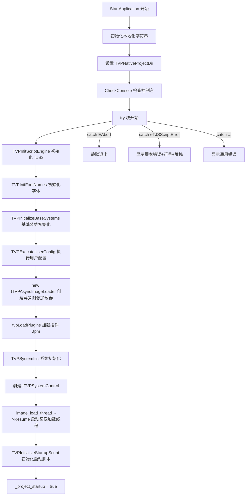

# Application 生命周期与消息系统

> **所属模块：** M03-平台抽象层解析
> **前置知识：** [01-environ模块总览与架构](./01-environ模块总览与架构.md)、[02-Platform接口与平台实现对比](./02-Platform接口与平台实现对比.md)、C++ 基础（std::mutex、std::function、std::tuple）
> **预计阅读时间：** 45 分钟（按每分钟 200 字估算）

## 本节目标

读完本节后，你将能够：

1. 理解 `tTVPApplication` 类的完整设计——成员变量、消息队列、活动事件注册表的作用
2. 掌握 KrKr2 从 `StartApplication()` 到 `Run()` 再到 `OnExit()` 的完整生命周期流程
3. 理解自定义消息队列（`PostUserMessage` / `ProcessMessages`）的线程安全实现
4. 理解 OOM（内存不足）恢复机制——预留内存 + Compact 事件 + 重试对话框
5. 能够对照项目源码，独立分析 Application 层的任何一个方法的执行逻辑
6. 理解活动/非活动事件如何驱动音频混合器锁定和 Compact 缓存清理

---

## 1. tTVPApplication 类总览

### 1.1 类的定位

`tTVPApplication` 是 KrKr2 引擎的**核心应用类**，承担以下职责：

| 职责 | 说明 |
|------|------|
| 生命周期管理 | 启动、运行主循环、退出 |
| 消息队列 | 跨线程的自定义消息投递与分发 |
| 活动状态管理 | 前后台切换时的音频/缓存控制 |
| 异步图像加载 | 管理 `tTVPAsyncImageLoader` 线程 |
| OOM 恢复 | 预留内存 + compact 事件 + 用户交互 |
| 控制台管理 | 日志输出通道的打开/关闭 |

全局单例在 `Application.cpp` 第 39 行直接构造：

```cpp
// cpp/core/environ/Application.cpp 第 39 行
tTVPApplication *Application = new tTVPApplication;  // 全局唯一实例
```

> **注意：** 这不是"懒加载单例"，而是在程序加载阶段（`main()` 之前）就被全局初始化器构造。这意味着构造函数中不能依赖任何运行时初始化的资源。

### 1.2 成员变量解析

下面逐一解读 `Application.h` 中 `tTVPApplication` 类的私有成员（第 72-203 行）：

```cpp
// cpp/core/environ/Application.h 第 72-204 行（关键摘录）
class tTVPApplication {
    ttstr title_;                    // 应用标题（显示在窗口/控制台）
    bool is_attach_console_;         // 是否已附加控制台输出
    ttstr console_title_;            // 控制台原始标题（用于恢复）
    bool tarminate_;                 // 终止标志（注意拼写：不是 terminate）
    bool application_activating_;    // 当前是否处于前台活动状态
    bool has_map_report_process_;    // 是否为 map 报告子进程
    class tTVPAsyncImageLoader *image_load_thread_;  // 异步图像加载线程

private:
    std::mutex m_msgQueueLock;       // 消息队列互斥锁
    // 消息队列：每个消息是 (宿主指针, 消息ID, 回调函数) 的三元组
    std::vector<std::tuple<void *, int, tMsg>> m_lstUserMsg;
    // 活动事件监听器注册表：宿主指针 → 回调函数
    std::map<void *, std::function<void(void *, eTVPActiveEvent)>> m_activeEvents;
};
```

关键点：

- **`tarminate_`** 的拼写是项目历史遗留（日文开发者拼写偏差），不要"修正"它
- **`application_activating_`** 默认为 `true`（构造函数中初始化），表示启动时默认为活动状态
- **`m_lstUserMsg`** 是自定义消息队列的核心数据结构，用 `std::vector` 而非 `std::queue`，这是为了支持 `FilterUserMessage()` 的随机访问过滤

### 1.3 消息类型定义

```cpp
// cpp/core/environ/Application.h 第 152 行
typedef std::function<void()> tMsg;  // 消息就是一个无参无返回值的回调函数
```

这个设计非常简洁——消息不是"数据"，而是"行为"。发送消息就是投递一个待执行的函数，接收消息就是调用这个函数。这种模式也被称为 **Command Pattern（命令模式）**。

### 1.4 枚举类型

```cpp
// cpp/core/environ/Application.h 第 19-39 行
// 对话框返回值
enum {
    mrOk,           // 用户点击确定
    mrAbort,        // 用户点击中止
    mrCancel,       // 用户点击取消
};

// 消息框图标类型（沿用 Windows MB_ICON* 数值）
enum {
    mtWarning      = 0x00000030L,  // 警告图标
    mtError        = 0x00000010L,  // 错误图标
    mtInformation  = 0x00000040L,  // 信息图标
    mtConfirmation = 0x00000020L,  // 询问图标
    mtStop         = 0x00000010L,  // 停止图标（与 Error 相同）
    mtCustom       = 0             // 自定义
};

// 活动事件类型
enum class eTVPActiveEvent {
    onActive,     // 应用进入前台
    onDeactive,   // 应用进入后台（注意拼写：不是 onDeactivate）
};
```

> **跨平台设计考量：** 虽然枚举数值沿用了 Windows `MB_ICON*` 的值，但这只是为了与原版 KiriKiri 保持兼容。实际的消息框显示由 `TVPShowSimpleMessageBox()` 实现，每个平台有自己的实现。

---

## 2. 启动流程：StartApplication() 深度解析

`StartApplication()` 是整个引擎的启动入口（第 296-396 行），由平台层调用。下面我们用流程图和逐段分析来完整理解它。

### 2.1 启动流程总览



### 2.2 第一阶段：环境准备（第 296-310 行）

```cpp
// cpp/core/environ/Application.cpp 第 296-310 行
bool tTVPApplication::StartApplication(ttstr path) {
    ArgC = 0;
    ArgV = nullptr;
    TVPTerminateCode = 0;                              // 退出码清零
    LocaleConfigManager *mgr = LocaleConfigManager::GetInstance();
    _retry = mgr->GetText("retry");                    // 从本地化配置获取"重试"文本
    _cancel = mgr->GetText("cancel");                  // 从本地化配置获取"取消"文本
    _msg = mgr->GetText("err_no_memory");              // OOM 错误消息文本
    _title = mgr->GetText("err_occured");              // 错误对话框标题文本
    TVPNativeProjectDir = path;                        // 设置项目根目录
    CheckConsole();                                    // 检查是否从控制台启动
```

这里可以看到，引擎启动的**第一步不是加载脚本或渲染**，而是准备好错误处理所需的本地化字符串。这是一个防御性编程的好实践——确保即使后续初始化失败，也能用正确的语言显示错误信息。

### 2.3 第二阶段：核心初始化（第 312-353 行）

```cpp
// cpp/core/environ/Application.cpp 第 312-353 行（简化注释版）
    try {
        TVPProjectDir = TVPNormalizeStorageName(path);  // 规范化存储路径
        TVPInitScriptEngine();        // 初始化 TJS2 脚本引擎（词法器/解析器/VM）
        TVPInitFontNames();           // 扫描系统可用字体

        // 打印启动日志横幅
        TVPAddImportantLog(TVPFormatMessage(
            TVPProgramStartedOn, TVPGetOSName(), TVPGetPlatformName()));

        TVPInitializeBaseSystems();   // 初始化基础子系统（存储、事件等）
        Initialize();                 // 空函数，预留给子类扩展

        if (TVPCheckPrintDataPath()) return true;   // 如果只是打印数据路径就退出
        if (TVPExecuteUserConfig()) return true;    // 执行用户配置脚本

        image_load_thread_ = new tTVPAsyncImageLoader();  // 创建异步图像加载器
        tvpLoadPlugins();             // 加载 .tpm 插件模块
        TVPSystemInit();              // 系统级初始化

        if (TVPCheckAbout()) return true;  // 如果只是显示版本信息就退出

        SetTitle(TVPKirikiri.operator const tjs_char *());  // 设置窗口标题
        TVPSystemControl = new tTVPSystemControl();         // 创建系统控制器
        CheckDigitizer();             // 检查触摸屏（仅 Windows 7+）

        image_load_thread_->Resume(); // 启动异步图像加载线程
        TVPInitializeStartupScript(); // 加载并执行 startup.tjs
        _project_startup = true;      // 标记项目已完成启动
```

### 2.4 初始化顺序的重要性

初始化顺序不是随意的，每一步都依赖前一步的结果：

| 顺序 | 函数 | 依赖 | 说明 |
|------|------|------|------|
| 1 | `TVPInitScriptEngine()` | 无 | TJS2 VM 必须最先就绪 |
| 2 | `TVPInitFontNames()` | 无 | 字体名称扫描独立运行 |
| 3 | `TVPInitializeBaseSystems()` | TJS2 | 存储系统需要脚本引擎注册存储媒体 |
| 4 | `TVPExecuteUserConfig()` | 基础系统 | 用户配置可能修改系统参数 |
| 5 | `new tTVPAsyncImageLoader()` | 无 | 创建加载器但还不启动线程 |
| 6 | `tvpLoadPlugins()` | 存储系统 | 插件从存储系统读取 .tpm 文件 |
| 7 | `TVPSystemInit()` | 插件 | 系统初始化可能依赖插件提供的功能 |
| 8 | `new tTVPSystemControl()` | 全部 | 系统控制器管理事件循环 |
| 9 | `image_load_thread_->Resume()` | 加载器创建完 | 线程创建和启动分离，确保系统就绪 |
| 10 | `TVPInitializeStartupScript()` | 所有子系统 | startup.tjs 可能使用任何子系统 |

> **关键设计：** 异步图像加载线程的**创建**（步骤 5）和**启动**（步骤 9）是分离的。这确保了线程启动时所有它可能依赖的子系统都已就绪。

### 2.5 异常处理体系（第 354-395 行）

`StartApplication()` 使用了多达 **8 个** catch 子句来覆盖所有可能的异常类型：

```cpp
// cpp/core/environ/Application.cpp 第 354-393 行
    } catch (const EAbort &) {
        // EAbort 异常表示用户主动中止，不需要显示错误
    } catch (const Exception &exception) {
        TVPOnError();                            // 触发错误处理钩子
        if (!TVPSystemUninitCalled)
            ShowException(exception.what());     // 显示标准异常消息
    } catch (const TJS::eTJSScriptError &e) {
        TVPOnError();
        if (!TVPSystemUninitCalled) {
            ttstr msg;
            if (!title_.IsEmpty()) {
                msg += title_;                   // 附加应用标题
                msg += "\n";
            }
            msg += e.GetMessage();               // 脚本错误消息
            const tjs_char *pszBlockName = e.GetBlockName();
            if (pszBlockName && *pszBlockName) {
                msg += TJS_W("\n@line(");
                tjs_char tmp[34];
                msg += TJS_int_to_str(e.GetSourceLine(), tmp);  // 错误行号
                msg += TJS_W(") ");
                msg += pszBlockName;             // 脚本块名称
            }
            msg += TJS_W("\n");
            msg += e.GetTrace();                 // 调用堆栈跟踪
            ShowException(msg);
        }
    } catch (const TJS::eTJS &e) {
        TVPOnError();
        if (!TVPSystemUninitCalled)
            ShowException(e.GetMessage());        // TJS 通用异常
    } catch (const std::exception &e) {
        ShowException(e.what());                  // C++ 标准异常
    } catch (const char *e) {
        ShowException(e);                         // C 字符串异常
    } catch (const tjs_char *e) {
        ShowException(e);                         // 宽字符串异常
    } catch (...) {
        ShowException((const tjs_char *)TVPUnknownError);  // 未知异常
    }
```

异常处理的层次结构：

```mermaid
flowchart TD
    E[异常抛出] --> A{类型判断}
    A -->|EAbort| B[静默退出 — 用户主动中止]
    A -->|Exception| C[显示通用错误消息]
    A -->|eTJSScriptError| D[显示脚本错误+行号+堆栈跟踪]
    A -->|eTJS| F[显示 TJS 引擎错误]
    A -->|std::exception| G[显示 C++ 标准异常]
    A -->|char*| H[显示 C 字符串错误]
    A -->|tjs_char*| I[显示宽字符串错误]
    A -->|...| J[显示"未知错误"]
    
    C --> K[TVPOnError 错误钩子]
    D --> K
    F --> K
    K --> L{TVPSystemUninitCalled?}
    L -->|否| M[ShowException 弹出错误对话框]
    L -->|是| N[跳过 — 系统已在析构]
```

> **为什么需要这么多 catch 子句？** 因为 KrKr2 混合了多种异常源：TJS2 脚本引擎有自己的异常体系（`eTJS`、`eTJSScriptError`），C++ 标准库使用 `std::exception`，而一些老代码直接抛出 C/宽字符串。引擎必须全部捕获，否则未处理的异常会导致静默崩溃。

---

