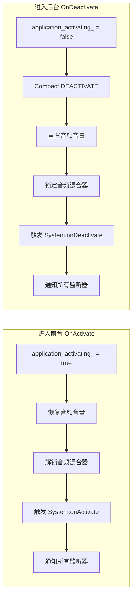

## 6. 活动状态管理

### 6.1 OnActivate —— 进入前台

```cpp
// cpp/core/environ/Application.cpp 第 739-752 行
void tTVPApplication::OnActivate() {
    application_activating_ = true;       // 标记为活动状态
    if (!_project_startup) return;        // 如果项目还没启动完成，忽略

    TVPResetVolumeToAllSoundBuffer();     // 恢复所有音频缓冲区的音量
    TVPUnlockSoundMixer();                // 解锁音频混合器

    // 触发 System.onActivate 脚本事件
    TVPPostApplicationActivateEvent();
    // 通知所有注册的活动事件监听器
    for (auto &it : m_activeEvents) {
        it.second(it.first, eTVPActiveEvent::onActive);
    }
}
```

### 6.2 OnDeactivate —— 进入后台

```cpp
// cpp/core/environ/Application.cpp 第 754-773 行
void tTVPApplication::OnDeactivate() {
    application_activating_ = false;      // 标记为非活动状态
    if (!_project_startup) return;

    // 触发 DEACTIVATE 级别的 Compact 事件
    TVPDeliverCompactEvent(TVP_COMPACT_LEVEL_DEACTIVATE);

    TVPResetVolumeToAllSoundBuffer();     // 重置音频音量（可能静音）
    TVPLockSoundMixer();                  // 锁定音频混合器（停止播放）

    // 触发 System.onDeactivate 脚本事件
    TVPPostApplicationDeactivateEvent();
    for (auto &it : m_activeEvents) {
        it.second(it.first, eTVPActiveEvent::onDeactive);
    }
}
```

### 6.3 前后台切换的联动效果



### 6.4 活动事件注册机制

```cpp
// cpp/core/environ/Application.cpp 第 827-835 行
void tTVPApplication::RegisterActiveEvent(
    void *host,
    const std::function<void(void *, eTVPActiveEvent)> &func)
{
    if (func)
        m_activeEvents.emplace(host, func);   // 非空函数 → 注册
    else
        m_activeEvents.erase(host);            // 空函数 → 注销
}
```

使用**空函数作为注销信号**的设计巧妙地将注册和注销统一到了同一个接口中，减少了 API 数量。

### 6.5 调用者：Cocos2d-x 桥接层

活动事件的实际触发来自 Cocos2d-x 的 `AppDelegate`：

```cpp
// cpp/core/environ/cocos2d/AppDelegate.cpp 第 21-29 行
void TVPAppDelegate::applicationWillEnterForeground() {
    ::Application->OnActivate();                       // 转发到 Application
    cocos2d::Director::getInstance()->startAnimation(); // 恢复渲染循环
}

void TVPAppDelegate::applicationDidEnterBackground() {
    ::Application->OnDeactivate();                     // 转发到 Application
    cocos2d::Director::getInstance()->stopAnimation();  // 暂停渲染循环
}
```

---

## 7. 退出与终止

### 7.1 Terminate —— 请求终止

```cpp
// cpp/core/environ/Application.cpp 第 611-615 行
void tTVPApplication::Terminate() {
    tarminate_ = true;        // 设置实例级终止标志
    TVPTerminated = true;     // 设置全局终止标志
}
```

`Terminate()` 只是设置标志，**不会立即退出**。实际退出发生在下一次 `Run()` 被调用时。

### 7.2 OnExit —— 执行清理

```cpp
// cpp/core/environ/Application.cpp 第 775-782 行
void tTVPApplication::OnExit() {
    TVPUninitScriptEngine();         // 反初始化 TJS2 脚本引擎
    delete TVPSystemControl;         // 销毁系统控制器
    TVPSystemControl = nullptr;
    CloseConsole();                  // 关闭控制台
}
```

### 7.3 完整的终止流程

```
脚本调用 System.terminate()
    ↓
tTVPApplication::Terminate()
    ├── tarminate_ = true
    └── TVPTerminated = true
    ↓
下一帧 Run() 被调用
    ↓
检测到 TVPTerminated == true
    ├── TVPSystemUninit()     // 系统反初始化
    └── TVPExitApplication()  // 平台退出
    ↓
AppDelegate 收到退出通知
    ↓
tTVPApplication::OnExit()
    ├── TVPUninitScriptEngine()  // 销毁 TJS2 VM
    ├── delete TVPSystemControl  // 销毁系统控制器
    └── CloseConsole()           // 关闭控制台
```

### 7.4 OnLowMemory —— 低内存通知

```cpp
// cpp/core/environ/Application.cpp 第 784-788 行
void tTVPApplication::OnLowMemory() {
    if (!_project_startup) return;
    TVPDeliverCompactEvent(TVP_COMPACT_LEVEL_MAX);  // 触发最高级别缓存清理
}
```

Android 系统的 `onLowMemory()` 回调会触发此方法，通知所有子系统尽可能释放缓存。

---

## 8. 异步图像加载

### 8.1 tTVPAsyncImageLoader 概述

`tTVPAsyncImageLoader`（定义在 `GraphicsLoadThread.h`）是一个独立线程，负责在后台加载图像：

```cpp
// cpp/core/visual/GraphicsLoadThread.h 第 31-104 行
class tTVPAsyncImageLoader : public tTVPThread {
    tTJSCriticalSection CommandQueueCS;   // 命令队列锁
    tTJSCriticalSection ImageQueueCS;     // 图像队列锁
    std::queue<tTVPImageLoadCommand *> CommandQueue;  // 待加载命令
    std::queue<tTVPImageLoadCommand *> LoadedQueue;   // 已加载结果

public:
    void LoadRequest(iTJSDispatch2 *owner, tTJSNI_Bitmap *bmp,
                     const ttstr &name);  // 提交加载请求
    void Execute() override;              // 线程主函数
};
```

### 8.2 Application 中的使用

```cpp
// cpp/core/environ/Application.cpp 第 819-825 行
void tTVPApplication::LoadImageRequest(
    class iTJSDispatch2 *owner,
    class tTJSNI_Bitmap *bmp,
    const ttstr &name)
{
    if (image_load_thread_) {
        image_load_thread_->LoadRequest(owner, bmp, name);
    }
}
```

加载流程：
1. TJS 脚本请求加载图像 → `LoadImageRequest()`
2. 请求进入 `CommandQueue`
3. 加载线程取出请求，在后台解码图像
4. 解码完成，结果进入 `LoadedQueue`
5. 主线程取出结果，设置到 Bitmap 对象，触发 `onLoaded` 事件

---

## 9. 辅助功能

### 9.1 ColorToRGB —— Windows 系统色映射

```cpp
// cpp/core/environ/Application.cpp 第 870-937 行
unsigned long ColorToRGB(unsigned int col) {
    switch (col) {
        case clScrollBar:      return 0xc8c8c8;  // 滚动条颜色
        case clBackground:     return 0;          // 桌面背景（黑色）
        case clWindow:         return 0xffffff;   // 窗口背景（白色）
        case clHighlight:      return 0xff9933;   // 高亮选中色
        case clBtnFace:        return 0xf0f0f0;   // 按钮表面色
        // ... 共 27 种 Windows 系统颜色映射 ...
        default: return col & 0xFFFFFF;            // 直接返回 RGB 值
    }
}
```

这个函数将原版 KiriKiri 中使用的 Windows 系统颜色常量（`clScrollBar`、`clWindow` 等）映射为固定的 RGB 值。在跨平台版本中，由于没有 Windows 系统颜色 API，这些值被硬编码为 Windows 10 的默认主题色。

### 9.2 ShowException —— 错误展示

```cpp
// cpp/core/environ/Application.cpp 第 486-490 行
void tTVPApplication::ShowException(const ttstr &e) {
    TVPShowSimpleMessageBox(e, TVPGetErrorDialogTitle());  // 显示消息框
    TVPSystemUninit();                                      // 系统反初始化
    TVPExitApplication(0);                                  // 退出
}
```

`ShowException` 是终极错误处理：显示消息框 → 清理 → 退出。没有恢复的可能。

---

