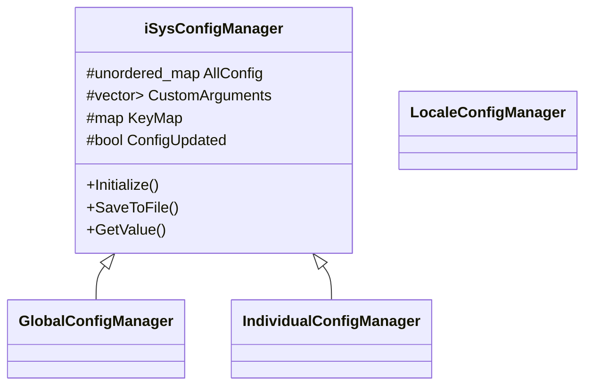
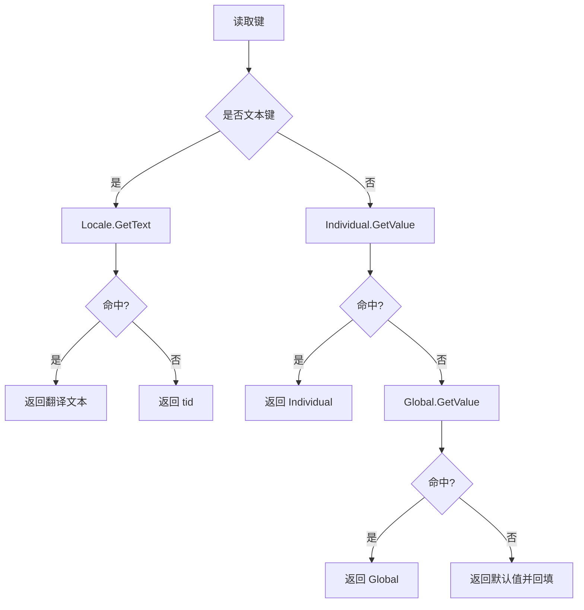

# 配置管理系统

> 所属模块：M03-平台抽象层解析  
> 前置知识：P03-跨平台 C++ 开发、M03 第3章 Application 生命周期、C++ 模板基础  
> 预计阅读时间：110 分钟

## 本节目标

读完本节后，你将能够：

1. 解释 KrKr2 为什么采用 Global / Individual / Locale 三级配置。
2. 读懂 `iSysConfigManager` 的核心数据结构和模板特化访问逻辑。
3. 逐行理解 Global、Individual、Locale 三个管理器的关键实现代码。
4. 掌握配置查找优先级链：`Locale → Individual → Global → 默认值`。
5. 理解配置何时加载、何时保存、保存到哪里，以及平台差异来源。
6. 排查并修复配置系统中的常见问题。

## 正文

### 1）为什么游戏引擎必须做多层配置

KrKr2 的场景不是“单程序单项目”，而是“同一个引擎运行多个游戏目录”。这意味着配置系统必须同时回答三个问题：

- 用户全局偏好如何持久化？
- 某个游戏的特殊设置如何覆盖全局？
- 文本本地化如何和运行参数解耦？

如果只有一个配置文件，会出现典型冲突：

1. **全局和局部冲突**：A 游戏希望音量 35，B 游戏希望 80。单层配置无法隔离。  
2. **数据语义冲突**：渲染器、音量是运行参数；按钮文案、错误提示是文本资源。  
3. **平台能力冲突**：Windows/Linux/Android 写文件路径、权限、编码处理不同。

所以 KrKr2 的设计是：

- `GlobalConfigManager`：全局默认。
- `IndividualConfigManager`：单游戏覆盖。
- `LocaleConfigManager`：国际化文本。

这三层并非“平级重复”，而是职责清晰的组合。

### 2）iSysConfigManager 基类逐行分析

源码：`cpp/core/environ/ConfigManager/GlobalConfigManager.h`

先看骨架：

```cpp
class iSysConfigManager {
protected:
    std::unordered_map<std::string, std::string> AllConfig;
    std::vector<std::pair<std::string, std::string>> CustomArguments;
    std::map<int, int> KeyMap;

    bool ConfigUpdated{};

    virtual std::string GetFilePath() = 0;

    void Initialize();

public:
    void SaveToFile();

    bool IsValueExist(const std::string &name);

    template <typename T>
    T GetValue(const std::string &name, const T &defVal);

    void SetValueInt(const std::string &name, int val);
    void SetValueFloat(const std::string &name, float val);
    void SetValue(const std::string &name, const std::string &val);

    std::vector<std::pair<std::string, std::string>> &
    GetCustomArgumentsForModify() {
        ConfigUpdated = true;
        return CustomArguments;
    }

    const std::map<int, int> &GetKeyMap() { return KeyMap; }
    void SetKeyMap(int k, int v /* 0 means remove */);

    [[nodiscard]] const std::vector<std::pair<std::string, std::string>> &
    GetCustomArguments() const {
        return CustomArguments;
    }

    std::vector<std::string> GetCustomArgumentsForPush();
};
```

逐点解释：

- `AllConfig`：统一存储配置键值。
- `CustomArguments`：可转为 `-key=value` 的自定义参数。
- `KeyMap`：输入重映射表。
- `ConfigUpdated`：脏标记，控制是否需要写盘。
- `GetFilePath()`：路径由子类确定。
- `Initialize()`：统一读取。
- `SaveToFile()`：统一保存。

#### 2.1 AllConfig 的真实类型

任务上下文提到 `std::map<std::string,std::string>`。当前仓库实现实际是 `std::unordered_map<std::string,std::string>`。这不影响“字符串键值统一存储”这一核心思想，但会影响遍历顺序（不稳定）与查找复杂度（均摊 O(1)）。

#### 2.2 为什么值统一用 std::string 而不是 std::variant

优点：

1. XML 属性天然是字符串，序列化最直接。  
2. 新增配置项不需要改联合类型。  
3. 与命令行参数模型一致。  

缺点：

1. 类型错误在运行时暴露。  
2. `atoi/atof` 对非法输入容忍过高。  

这属于“灵活性优先”的工程取舍。

#### 2.3 CustomArguments 和 KeyMap

`CustomArguments` 修改入口：

```cpp
std::vector<std::pair<std::string, std::string>> &
GetCustomArgumentsForModify() {
    ConfigUpdated = true;
    return CustomArguments;
}
```

这段代码很实用：只要拿可写引用，立刻标记脏状态。

`KeyMap` 删除语义：

```cpp
void SetKeyMap(int k, int v /* 0 means remove */);
```

约定 `v==0` 表示删除映射，不写入保留值。

### 3）iSysConfigManager 的加载流程（Initialize）逐行解析

源码：`cpp/core/environ/ConfigManager/GlobalConfigManager.cpp` 第39-85行。

```cpp
void iSysConfigManager::Initialize() {
    AllConfig.clear();
    ConfigUpdated = false;

    tinyxml2::XMLDocument doc;

    FILE *fp = nullptr;
    fp = fopen(GetFilePath().c_str(), "rb");

    if(fp && !doc.LoadFile(fp)) {
        tinyxml2::XMLElement *rootElement = doc.RootElement();
        if(rootElement) {
            for(tinyxml2::XMLElement *item =
                    rootElement->FirstChildElement("Item");
                item; item = item->NextSiblingElement("Item")) {
                const char *key = item->Attribute("key");
                const char *val = item->Attribute("value");
                if(key && val) {
                    AllConfig[key] = val;
                }
            }
            for(tinyxml2::XMLElement *item =
                    rootElement->FirstChildElement("Custom");
                item; item = item->NextSiblingElement("Custom")) {
                const char *key = item->Attribute("key");
                const char *val = item->Attribute("value");
                if(key && val) {
                    CustomArguments.emplace_back(key, val);
                }
            }
            for(tinyxml2::XMLElement *item =
                    rootElement->FirstChildElement("KeyMap");
                item; item = item->NextSiblingElement("KeyMap")) {
                int key, val;
                if(tinyxml2::XML_SUCCESS ==
                       item->QueryIntAttribute("key", &key) &&
                   tinyxml2::XML_SUCCESS ==
                       item->QueryIntAttribute("value", &val) &&
                   key && val) {
                    KeyMap.emplace(key, val);
                }
            }
        }
    }
    if(fp)
        fclose(fp);
}
```

逐行注释要点：

1. 先清空内存态，避免脏数据叠加。  
2. 配置读取失败时，保留空配置并不崩溃。  
3. `<Item>`、`<Custom>`、`<KeyMap>` 三类节点分别进入三种容器。  
4. `KeyMap` 用 `QueryIntAttribute`，并过滤掉 0 值。  

### 4）iSysConfigManager 的保存流程（SaveToFile）逐行解析

源码：`GlobalConfigManager.cpp` 第87-121行。

```cpp
void iSysConfigManager::SaveToFile() {
    if(!ConfigUpdated)
        return;
    std::string filepath = GetFilePath();
    if(filepath.empty())
        return;
    tinyxml2::XMLDocument doc;
    doc.LinkEndChild(doc.NewDeclaration());
    tinyxml2::XMLElement *rootElement = doc.NewElement("GlobalPreference");
    for(auto &it : AllConfig) {
        tinyxml2::XMLElement *item = doc.NewElement("Item");
        item->SetAttribute("key", it.first.c_str());
        item->SetAttribute("value", it.second.c_str());
        rootElement->LinkEndChild(item);
    }
    for(auto &CustomArgument : CustomArguments) {
        tinyxml2::XMLElement *item = doc.NewElement("Custom");
        item->SetAttribute("key", CustomArgument.first.c_str());
        item->SetAttribute("value", CustomArgument.second.c_str());
        rootElement->LinkEndChild(item);
    }
    for(auto &it : KeyMap) {
        if(it.first && it.second) {
            tinyxml2::XMLElement *item = doc.NewElement("KeyMap");
            item->SetAttribute("key", it.first);
            item->SetAttribute("value", it.second);
            rootElement->LinkEndChild(item);
        }
    }
    doc.LinkEndChild(rootElement);
    XMLMemPrinter stream;
    doc.Print(&stream);
    stream.SaveFile(GetFilePath());
    ConfigUpdated = false;
}
```

重点：

1. 脏写策略：未更新不写盘。  
2. 根节点统一名 `GlobalPreference`。  
3. 三类数据节点完整序列化。  
4. 保存后 `ConfigUpdated=false`。  

### 5）GetValue<T> 模板特化：行为与边界

源码：`GlobalConfigManager.cpp` 第132-170行。

```cpp
template <>
bool iSysConfigManager::GetValue<bool>(const std::string &name,
                                       const bool &defVal) {
    return !!GetValue<int>(name, defVal);
}
```

```cpp
template <>
int iSysConfigManager::GetValue<int>(const std::string &name,
                                     const int &defVal) {
    auto it = AllConfig.find(name);
    if(it == AllConfig.end()) {
        SetValueInt(name, defVal);
        return defVal;
    }
    return atoi(it->second.c_str());
}
```

```cpp
template <>
float iSysConfigManager::GetValue<float>(const std::string &name,
                                         const float &defVal) {
    auto it = AllConfig.find(name);
    if(it == AllConfig.end()) {
        SetValueFloat(name, defVal);
        return defVal;
    }
    return atof(it->second.c_str());
}
```

```cpp
template <>
std::string
iSysConfigManager::GetValue<std::string>(const std::string &name,
                                         const std::string &defVal) {
    auto it = AllConfig.find(name);
    if(it == AllConfig.end()) {
        SetValue(name, defVal);
        return defVal;
    }
    return it->second;
}
```

统一规律：

1. 缺键返回默认值。  
2. 同时回填配置并置脏。  

#### 5.1 bool 的“true/1/yes”技巧

当前实现仅稳定支持 `0/1`。若想识别 `true/1/yes`，可用增强版特化：

```cpp
template <>
bool iSysConfigManager::GetValue<bool>(const std::string &name,
                                       const bool &defVal) {
    auto it = AllConfig.find(name);
    if(it == AllConfig.end()) {
        SetValueInt(name, defVal ? 1 : 0);
        return defVal;
    }

    std::string s = it->second;
    for(char &c : s) {
        if(c >= 'A' && c <= 'Z') {
            c = static_cast<char>(c - 'A' + 'a');
        }
    }

    if(s == "1" || s == "true" || s == "yes" || s == "on") return true;
    if(s == "0" || s == "false" || s == "no" || s == "off") return false;
    return defVal;
}
```

这是改造建议，不是当前仓库现状实现。

### 6）GlobalConfigManager：全局配置层

源码文件：

- `GlobalConfigManager.h`
- `GlobalConfigManager.cpp`

#### 6.1 单例初始化

```cpp
GlobalConfigManager::GlobalConfigManager() { Initialize(); }

GlobalConfigManager *GlobalConfigManager::GetInstance() {
    static GlobalConfigManager instance;
    return &instance;
}
```

#### 6.2 文件路径

```cpp
std::string GlobalConfigManager::GetFilePath() {
    return TVPGetInternalPreferencePath() + "GlobalPreference.xml";
}
```

#### 6.3 全局配置项

源码没有集中枚举键名，但按用途可归纳：

1. 窗口尺寸与显示参数。  
2. 音量参数（BGM/SE/Voice）。  
3. 渲染模式（software/opengl）。  
4. 语言偏好 `user_language`。  
5. `KeyMap` 输入映射。  
6. `Custom` 自定义参数。  

#### 6.4 默认值策略

Global 缺键时回填默认值。好处是首次运行后配置文件会逐步自描述，升级新增键更平滑。

### 7）IndividualConfigManager：单游戏覆盖层

源码文件：

- `IndividualConfigManager.h`
- `IndividualConfigManager.cpp`

#### 7.1 与 Global 的差异

Global 是固定路径。
Individual 是“当前游戏路径 + 固定文件名”。

```cpp
#define FILENAME "Kirikiroid2Preference.xml"
```

#### 7.2 关键流程函数

```cpp
bool IndividualConfigManager::CheckExistAt(const std::string &folder) {
    std::string fullpath = folder + "/" FILENAME;
    return cocos2d::FileUtils::getInstance()->isFileExist(fullpath);
}
```

```cpp
bool IndividualConfigManager::CreatePreferenceAt(const std::string &folder) {
    std::string fullpath = folder + "/" FILENAME;
    Clear();
    CurrentPath = fullpath;
    return true;
}
```

```cpp
bool IndividualConfigManager::UsePreferenceAt(const std::string &folder) {
    std::string fullpath = folder + "/" FILENAME;
    if(CurrentPath == fullpath)
        return true;
    Clear();
    if(!cocos2d::FileUtils::getInstance()->isFileExist(fullpath))
        return false;
    CurrentPath = fullpath;
    Initialize();
    return true;
}
```

#### 7.3 覆盖优先级实现

```cpp
template <>
int IndividualConfigManager::GetValue<int>(const std::string &name,
                                           const int &defVal) {
    return inherit::GetValue<int>(
        name, GlobalConfigManager::GetInstance()->GetValue<int>(name, defVal));
}
```

这行代码等价于：

- 先取 Global 结果。
- 再让 Individual 覆盖。

#### 7.4 自定义参数回退

```cpp
std::vector<std::string> IndividualConfigManager::GetCustomArgumentsForPush() {
    if(CustomArguments.empty()) {
        return GlobalConfigManager::GetInstance()->GetCustomArgumentsForPush();
    }
    return inherit::GetCustomArgumentsForPush();
}
```

即：Individual 无参数时回退 Global。

### 8）LocaleConfigManager：区域化文本层

源码文件：

- `LocaleConfigManager.h`
- `LocaleConfigManager.cpp`

#### 8.1 路径与语言回退

```cpp
std::string LocaleConfigManager::GetFilePath() {
    std::string pathprefix = "locale/";
    std::string fullpath =
        pathprefix + currentLangCode + ".xml";
    if(!cocos2d::FileUtils::getInstance()->isFileExist(fullpath)) {
        currentLangCode = "en_us";
        return GetFilePath();
    }
    return cocos2d::FileUtils::getInstance()->fullPathForFilename(fullpath);
}
```

#### 8.2 初始化优先级

```cpp
void LocaleConfigManager::Initialize(const std::string &sysLang) {
    currentLangCode = GlobalConfigManager::GetInstance()->GetValue<std::string>(
        "user_language", "");
    if(currentLangCode.empty())
        currentLangCode = sysLang;
```

顺序：

1. 用户配置语言。  
2. 系统语言兜底。  

#### 8.3 文本读取与缺失键

```cpp
const std::string &LocaleConfigManager::GetText(const std::string &tid) {
    auto it = AllConfig.find(tid);
    if(it == AllConfig.end()) {
        AllConfig[tid] = tid;
        return AllConfig[tid];
    }
    return it->second;
}
```

缺失键返回 tid 本身，便于发现漏翻译。

#### 8.4 UI 初始化接口

```cpp
bool LocaleConfigManager::initText(cocos2d::ui::Text *ctrl,
                                   const std::string &tid) {
    if(!ctrl)
        return false;
    std::string txt = GetText(tid);
    if(txt.empty()) {
        ctrl->setString(tid);
        ctrl->setColor(cocos2d::Color3B::RED);
        return false;
    }
    ctrl->setString(txt);
    return true;
}
```

```cpp
bool LocaleConfigManager::initText(cocos2d::ui::Button *ctrl,
                                   const std::string &tid) {
    if(!ctrl)
        return false;
    std::string txt = GetText(tid);
    if(txt.empty()) {
        ctrl->setTitleText(tid);
        ctrl->setTitleColor(cocos2d::Color3B::RED);
        return false;
    }
    ctrl->setTitleText(txt);
    return true;
}
```

### 9）Application 中 ConfigManager 的使用位置

要求还包括 Application 的初始化角色。

#### 9.1 消息框本地化

源码：`Application.cpp`。

```cpp
int TVPShowSimpleMessageBox(const ttstr &text, const ttstr &caption) {
    std::vector<ttstr> normal;
    normal.emplace_back(
        LocaleConfigManager::GetInstance()->GetText("msgbox_ok"));
    return TVPShowSimpleMessageBox(text, caption, normal);
}
```

```cpp
int TVPShowSimpleMessageBoxYesNo(const ttstr &text, const ttstr &caption) {
    std::vector<ttstr> normal;
    LocaleConfigManager *mgr = LocaleConfigManager::GetInstance();
    normal.emplace_back(mgr->GetText("msgbox_yes"));
    normal.emplace_back(mgr->GetText("msgbox_no"));
    return TVPShowSimpleMessageBox(text, caption, normal);
}
```

#### 9.2 启动阶段错误文案

```cpp
LocaleConfigManager *mgr = LocaleConfigManager::GetInstance();
_retry = mgr->GetText("retry");
_cancel = mgr->GetText("cancel");
_msg = mgr->GetText("err_no_memory");
_title = mgr->GetText("err_occured");
```

说明：配置系统不是“后期功能”，而是启动期就会介入。

### 10）架构图与优先级链

#### 10.1 继承关系图



#### 10.2 查找优先级图



#### 10.3 ASCII 版

```text
文本：Locale(tid) -> text / tid
参数：Individual(key) -> Global(key) -> defVal
```

### 11）配置持久化：何时加载、何时保存、存储位置

#### 11.1 加载时机

- Global：首次 `GetInstance()`。
- Individual：`UsePreferenceAt(folder)`。
- Locale：`Initialize(sysLang)`。

#### 11.2 保存时机

- 通过 `SaveToFile()` 显式保存。
- `SetValue*` 只改内存并置脏，不自动写盘。

#### 11.3 存储位置

- Global：`TVPGetInternalPreferencePath() + GlobalPreference.xml`
- Individual：`<游戏目录>/Kirikiroid2Preference.xml`
- Locale：`locale/<lang>.xml`

#### 11.4 平台写入差异

Windows（`win32/Platform.cpp`）：

```cpp
bool TVPWriteDataToFile(const ttstr &filepath, const void *data,
                        unsigned int len) {
    FILE *handle = _wfopen(filepath.toWString().c_str(), L"wb");
    if(handle) {
        bool ret = fwrite(data, 1, len, handle) == len;
        fclose(handle);
        return ret;
    }
    return false;
}
```

Linux（`linux/Platform.cpp`）：

```cpp
bool TVPWriteDataToFile(const ttstr &filepath, const void *data,
                        unsigned int len) {
    FILE *handle = fopen(filepath.AsStdString().c_str(), "wb");
    if(handle) {
        bool ret = fwrite(data, 1, len, handle) == len;
        fclose(handle);
        return ret;
    }
    return false;
}
```

Android（`android/AndroidUtils.cpp`）：

```cpp
bool TVPWriteDataToFile(const ttstr &filepath, const void *data,
                        unsigned int size) {
    std::string filename = filepath.AsStdString();
    cocos2d::FileUtils *fileutil = cocos2d::FileUtils::getInstance();
    while(fileutil->isFileExist(filename)) {
        // 文件 API 失败时回退 Java 写入
    }
    FILE *fp = fopen(filename.c_str(), "wb");
    if(fp) {
        int writed = fwrite(data, 1, size, fp);
        fclose(fp);
        return writed == size;
    }
    return TVPWriteDataToFileJava(filename, data, size);
}
```

### 12）常见问题与解决方案

#### 问题1：bool 值读取异常

现象：`value="true"` 读取为 false。

原因：当前 bool 走 `atoi`，`atoi("true") == 0`。

解决：

1. 配置统一写 `0/1`。  
2. 或升级 bool 特化支持 `true/yes/on`。

#### 问题2：修改后重启丢失

现象：运行中值变化，重启恢复旧值。

排查：

1. 是否调用 `SaveToFile()`。  
2. `ConfigUpdated` 是否已置为 true。  
3. 路径是否可写。  
4. Android 是否受权限限制。  

#### 问题3：语言切换后 UI 不更新

现象：设置语言后页面仍显示旧文案。

原因：

1. 只保存了 `user_language`，没重新 `Locale.Initialize`。  
2. 已创建控件没重新执行 `initText`。  

#### 问题4：不同游戏设置互相影响

现象：A 游戏改动影响 B 游戏。

原因：

1. 没切换到正确 Individual 路径。  
2. 本应写 Individual 的值写到了 Global。  

