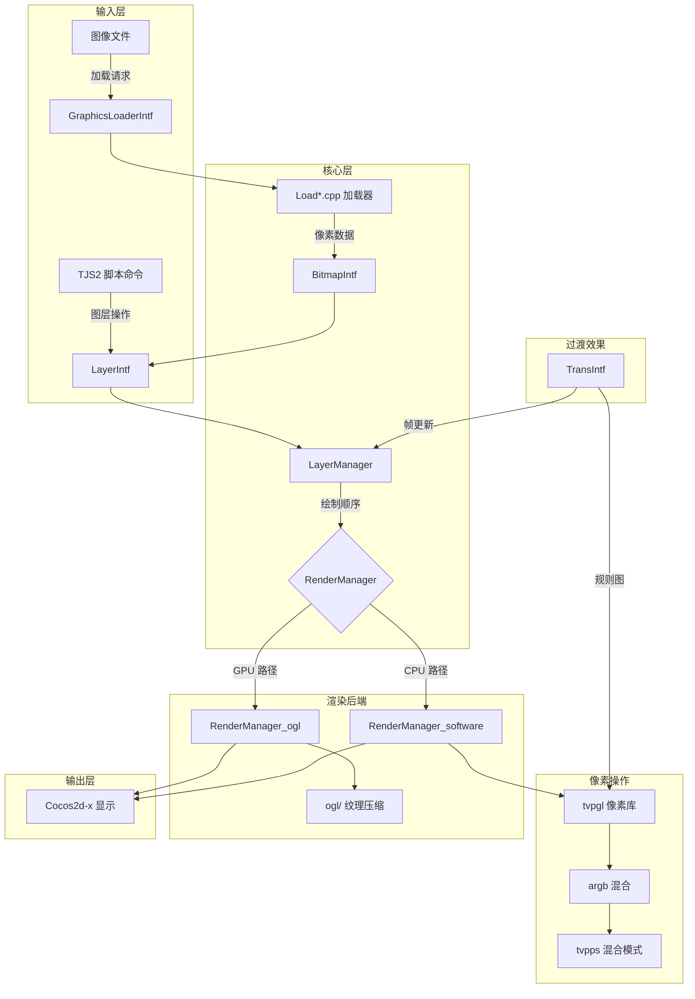

# 模块架构与文件组织

> **所属模块：** M04-渲染子系统
> **前置知识：** [M01-项目导览与环境搭建](../../M01-项目导览与环境搭建/README.md)、[P04-OpenGL图形编程](../../P04-OpenGL图形编程/README.md)
> **预计阅读时间：** 25 分钟

## 本节目标

读完本节后，你将能够：
1. 说出 `core_visual_module` 包含的所有子系统及其职责
2. 画出渲染子系统各组件之间的依赖关系图
3. 解释 CMake 构建文件中每个外部依赖的用途
4. 根据功能需求快速定位到对应的源文件

## 渲染子系统在引擎中的位置

KrKr2 引擎由 9 个核心模块组成，渲染子系统（`core_visual_module`）是其中规模最大的一个。它的职责涵盖了**从图像文件读取到最终屏幕显示**的完整渲染管线。

### 引擎模块依赖关系

```
┌─────────────────────────────────────────────────────┐
│                    krkr2core (INTERFACE)             │
│  ┌─────────┐ ┌──────────┐ ┌───────────┐            │
│  │  tjs2   │ │core_base │ │core_environ│            │
│  │(脚本VM) │ │(I/O存档) │ │(平台抽象) │            │
│  └────┬────┘ └─────┬────┘ └─────┬─────┘            │
│       │            │            │                    │
│  ┌────▼────────────▼────────────▼─────┐             │
│  │      core_visual_module  ◄─────────┤             │
│  │      (渲染子系统，本模块)          │             │
│  └────────────────────────────────────┘             │
│       ▲            ▲            ▲                    │
│  ┌────┴────┐ ┌─────┴────┐ ┌────┴─────┐             │
│  │  sound  │ │  movie   │ │  utils   │             │
│  │(音频)   │ │(视频播放)│ │(工具集)  │             │
│  └─────────┘ └──────────┘ └──────────┘             │
└─────────────────────────────────────────────────────┘
```

如上图所示，`core_visual_module` 依赖三个基础模块：
- **tjs2** — TJS2 脚本引擎，提供类型定义（`tjs_uint32` 等）和脚本绑定接口
- **core_base_module** — 提供文件 I/O、流（Stream）、存档访问等基础设施
- **core_environ_module** — 提供平台抽象层，包括 Cocos2d-x 桥接

同时，它被其他模块依赖：
- **sound** 和 **movie** 模块在音视频同步时需要渲染子系统的窗口和图层能力

### CMake 构建目标

渲染子系统对应的 CMake 目标定义在 `cpp/core/visual/CMakeLists.txt` 中：

```cmake
# 文件：cpp/core/visual/CMakeLists.txt
cmake_minimum_required(VERSION 3.19)
project(core_visual_module LANGUAGES CXX)

# 构建为 STATIC 库（注意：不是 INTERFACE）
add_library(${PROJECT_NAME} STATIC ${VISUAL_SOURCE_FILES})

# 公开头文件路径（其他模块可以 include）
target_include_directories(${PROJECT_NAME} PUBLIC
    ${VISUAL_PATH}/
    ${VISUAL_PATH}/gl
    ${VISUAL_PATH}/ogl
    ${VISUAL_PATH}/impl
)

# 依赖关系：PUBLIC = 传递给使用者，PRIVATE = 仅内部使用
target_link_libraries(${PROJECT_NAME}
    PUBLIC  tjs2                    # 脚本引擎类型和接口
    PRIVATE core_base_module        # 文件 I/O
            core_environ_module     # 平台抽象
            core_plugin_module      # 插件系统
            core_sound_module       # 音频（音视频同步）
            core_utils_module       # 工具函数
)
```

**关键设计决策**：`tjs2` 是 PUBLIC 依赖，因为渲染模块的头文件中大量使用 `tjs_uint32`、`tjs_int` 等 TJS2 类型定义。任何 include 渲染模块头文件的代码都会间接需要 tjs2 的类型定义。

## 目录结构与文件分类

渲染子系统包含约 **75 个源文件**，按功能可分为 8 个子系统：

```
cpp/core/visual/
│
├── 【图层系统】Layer*.{h,cpp}          # 核心：图层接口、位图图层、管理器
│   ├── LayerIntf.{h,cpp}              #   图层基类接口（属性、变换、事件）
│   ├── LayerBitmapIntf.{h,cpp}        #   位图图层接口（像素操作）
│   ├── LayerManager.{h,cpp}           #   图层管理器（树操作、绘制排序）
│   ├── LayerTreeOwner.h               #   图层树所有者接口
│   ├── LayerTreeOwnerImpl.{h,cpp}     #   图层树所有者实现
│   └── BitmapLayerTreeOwner.{h,cpp}   #   位图图层树所有者
│
├── 【位图管理】Bitmap*.{h,cpp}
│   ├── BitmapIntf.{h,cpp}             #   位图接口（创建、销毁、像素访问）
│   └── drawable.h                     #   可绘制对象抽象接口
│
├── 【图像加载】Load*.cpp / Save*.cpp
│   ├── GraphicsLoaderIntf.{h,cpp}     #   加载器框架（注册、分发）
│   ├── GraphicsLoadThread.{h,cpp}     #   异步加载线程池
│   ├── ImageFunction.{h,cpp}          #   图像处理函数集
│   ├── LoadPNG.cpp                    #   PNG 格式加载器
│   ├── LoadJPEG.cpp                   #   JPEG 格式加载器（libjpeg-turbo）
│   ├── LoadTLG.{cpp,h}               #   TLG 格式加载器（KiriKiri 原生）
│   ├── LoadWEBP.cpp                   #   WebP 格式加载器
│   ├── LoadBPG.cpp                    #   BPG 格式加载器（libbpg）
│   ├── LoadJXR.cpp                    #   JPEG XR 格式加载器
│   ├── LoadPVRv3.cpp                  #   PVR v3 格式加载器（移动端纹理）
│   ├── SaveTLG5.cpp                   #   TLG5 格式保存器
│   └── SaveTLG6.cpp                   #   TLG6 格式保存器
│
├── 【像素操作】tvpgl / argb
│   ├── tvpgl.{h,cpp}                  #   像素操作库（200+ 函数）
│   ├── tvpgl_asm_init.h               #   SIMD 优化初始化声明
│   ├── argb.{h,cpp}                   #   ARGB 颜色空间模板类
│   └── tvpps.inc                      #   Photoshop 混合模式宏定义
│
├── 【渲染管理】RenderManager*
│   ├── RenderManager.{h,cpp}          #   渲染管理器抽象基类 + 软件实现
│   └── RenderManager_software.h       #   软件渲染管理器头文件
│
├── 【OGL 后端】ogl/
│   ├── RenderManager_ogl.cpp          #   OpenGL 渲染管理器实现
│   ├── pvrtc.{h,cpp}                  #   PVRTC 纹理压缩
│   ├── etcpak.{h,cpp}                 #   ETC 纹理打包
│   ├── astcrt.{h,cpp}                 #   ASTC 实时纹理压缩
│   └── imagepacker.{h,cpp}            #   纹理图集打包算法
│
├── 【GL 抽象层】gl/
│   ├── blend_function.cpp             #   混合函数实现
│   ├── ResampleImage.cpp              #   图像重采样
│   └── WeightFunctor.cpp              #   权重函数（缩放算法）
│
├── 【过渡效果】Trans*
│   ├── TransIntf.{h,cpp}              #   过渡效果接口和管理
│   └── transhandler.h                 #   过渡处理器接口
│
├── 【字体系统】Font* / FreeType* / Character* / Prerendered*
│   ├── CharacterData.{h,cpp}          #   字符渲染数据缓存
│   ├── FontImpl.{h,cpp}               #   字体接口实现
│   ├── FontSystem.{h,cpp}             #   字体系统管理器
│   ├── FreeType.{h,cpp}               #   FreeType 库封装
│   ├── FreeTypeFontRasterizer.{h,cpp} #   FreeType 光栅化器
│   ├── PrerenderedFont.{h,cpp}        #   预渲染位图字体
│   └── tvpfontstruc.h                 #   字体结构定义
│
├── 【窗口与显示】Window* / Rect* / Menu* / Video*
│   ├── WindowIntf.{h,cpp}             #   窗口接口
│   ├── RectItf.{h,cpp}                #   矩形接口
│   ├── ComplexRect.{h,cpp}            #   复杂矩形运算（区域裁剪）
│   ├── MenuItemIntf.{h,cpp}           #   菜单项接口
│   ├── VideoOvlIntf.{h,cpp}           #   视频叠加接口
│   └── voMode.h                       #   视频叠加模式定义
│
├── 【平台实现】impl/
│   ├── BasicDrawDevice.cpp            #   基础绘制设备
│   ├── BitmapBitsAlloc.cpp            #   位图内存分配
│   ├── BitmapInfomation.cpp           #   位图元信息
│   ├── DInputMgn.cpp                  #   输入管理（DirectInput 兼容层）
│   ├── DrawDevice.cpp                 #   绘制设备基类
│   ├── GraphicsLoaderImpl.cpp         #   图像加载器平台实现
│   ├── LayerBitmapImpl.cpp            #   位图图层平台实现
│   ├── LayerImpl.cpp                  #   图层平台实现
│   ├── MenuItemImpl.cpp               #   菜单项平台实现
│   ├── PassThroughDrawDevice.cpp      #   直通绘制设备
│   ├── TVPScreen.cpp                  #   屏幕管理
│   ├── VideoOvlImpl.cpp               #   视频叠加实现
│   └── WindowImpl.cpp                 #   窗口平台实现
│
└── 【HAL/输入定义】
    ├── tvphal.h                       #   硬件抽象层定义
    └── tvpinputdefs.h                 #   输入设备定义
```

### 接口-实现分离模式

渲染子系统严格遵循 **接口-实现分离（Intf/Impl）模式**。以图层系统为例：

```
LayerIntf.h      — 定义接口（纯虚函数、属性声明）
  └─ LayerIntf.cpp   — 接口层的通用逻辑
  
impl/LayerImpl.cpp   — 平台相关的具体实现
```

这种分离的设计理由（Design Rationale）是：
1. **跨平台兼容** — 接口层定义统一的 API，impl/ 目录包含平台特定代码
2. **渲染后端切换** — 同一个 `LayerIntf` 可以由 OGL 后端或软件后端渲染
3. **测试友好** — 可以通过 mock 接口层来进行单元测试

```cpp
// 示例：接口-实现分离模式（简化版）
// LayerIntf.h — 接口定义
class tTVPLayerObject {
public:
    virtual ~tTVPLayerObject() = default;
    
    // 图层属性接口
    virtual void SetVisible(bool v) = 0;   // 设置可见性
    virtual bool GetVisible() const = 0;    // 获取可见性
    virtual void SetOpacity(int opa) = 0;   // 设置不透明度 (0-255)
    virtual int GetOpacity() const = 0;     // 获取不透明度
    
    // 图层树操作
    virtual void SetParent(tTVPLayerObject* parent) = 0;
    virtual tTVPLayerObject* GetParent() const = 0;
    
    // 绘制接口
    virtual void Draw(/* render context */) = 0;
};

// impl/LayerImpl.cpp — 具体实现
// 这里包含 Cocos2d-x 相关的具体绘制代码
```

## 外部依赖清单

渲染子系统的外部依赖是所有模块中最多的，共 **8 个第三方库**：

| 依赖库 | vcpkg 包名 | 链接方式 | 用途 |
|--------|-----------|---------|------|
| **Cocos2d-x** | cocos2dx | PRIVATE | OGL 渲染管线、纹理管理、场景图 |
| **libjpeg-turbo** | libjpeg-turbo | PUBLIC | JPEG 图像解码（SIMD 加速） |
| **WebP** | libwebp | INTERFACE | WebP 图像解码 |
| **OpenCV** | opencv4 (4.7.0#6) | PUBLIC | 图像处理（仿射变换、缩放） |
| **LZ4** | lz4 | PUBLIC | 纹理数据压缩（内存优化） |
| **libbpg** | (vendored) | PRIVATE | BPG 图像格式解码 |
| **JPEG XR** | jxr | PRIVATE | JPEG XR 图像格式解码 |
| **FreeType** | (via tjs2) | 间接 | 字体光栅化 |

### 常见错误：OpenCV 版本问题

```
-- 错误示例 --
CMake Error: Could not find OpenCV (missing: opencv_imgproc)
```

**原因**：项目通过 vcpkg overrides 锁定 OpenCV 为 4.7.0#6 版本。如果本地 vcpkg 中安装了其他版本，会导致查找失败。

**解决方案**：确保 `vcpkg.json` 中的 overrides 生效：

```json
{
  "overrides": [
    { "name": "opencv4", "version": "4.7.0#6" }
  ]
}
```

### 常见错误：WebP 链接方式

WebP 库使用 `INTERFACE` 链接方式（而不是 PUBLIC 或 PRIVATE），这意味着 WebP 不会在编译 `core_visual_module` 时链接，而是**传递给最终的可执行文件**。原因是 WebP 的头文件只在 `LoadWEBP.cpp` 内部使用，不暴露给其他模块，但最终链接时需要符号。

```cmake
# INTERFACE 意味着：编译本库时不链接，但使用本库的目标会自动链接
target_link_libraries(${PROJECT_NAME} INTERFACE
    WebP::webp WebP::webpdecoder WebP::webpdemux
)
```

## 子系统交互关系图

以下 Mermaid 图展示了渲染子系统内部各组件的数据流向：



### 数据流详解

1. **图像加载流** — TJS2 脚本请求加载图像 → `GraphicsLoaderIntf` 根据文件扩展名分发到对应的 `Load*.cpp` → 解码为像素数据 → 存入 `BitmapIntf` → 关联到 `LayerIntf`
2. **渲染流** — `LayerManager` 遍历图层树 → 按深度排序 → 调用 `RenderManager` → OGL 后端使用 GPU 渲染，软件后端使用 tvpgl 库 CPU 渲染
3. **过渡流** — `TransIntf` 管理过渡动画时间线 → 每帧更新过渡进度 → 通过 tvpgl 混合源/目标图层像素

## 动手实践

### 练习 1：探索模块文件统计

使用命令行统计渲染子系统的文件数量和代码行数：

```bash
# Windows (PowerShell)
Get-ChildItem -Path "cpp/core/visual" -Recurse -Include "*.cpp","*.h" |
    Measure-Object -Line |
    Select-Object Count, Lines

# Linux/macOS
find cpp/core/visual -name "*.cpp" -o -name "*.h" | wc -l
find cpp/core/visual -name "*.cpp" -o -name "*.h" | xargs wc -l | tail -1

# 预期输出：约 75 个文件，约 30000+ 行代码
```

### 练习 2：分析 CMake 依赖图

```bash
# 在构建目录下生成依赖图（需要 Graphviz）
cmake --graphviz=deps.dot --preset="Windows Debug Config"
dot -Tpng deps.dot -o deps.png

# 或者用 CMake 内置工具查看目标属性
cmake --build --preset="Windows Debug Build" --target help
```

### 练习 3：编写最小渲染模块

创建一个简化版的模块结构来理解接口-实现分离：

```cpp
// mini_visual/RenderTarget.h — 渲染目标接口
#pragma once
#include <cstdint>
#include <memory>
#include <vector>

// 像素格式枚举
enum class PixelFormat {
    Gray8,   // 8位灰度
    RGBA32   // 32位 ARGB
};

// 渲染目标接口（对应项目中的 iTVPTexture2D）
class IRenderTarget {
public:
    virtual ~IRenderTarget() = default;
    
    virtual uint32_t GetWidth() const = 0;   // 获取宽度（像素）
    virtual uint32_t GetHeight() const = 0;  // 获取高度（像素）
    virtual PixelFormat GetFormat() const = 0; // 获取像素格式
    
    // 获取指定行的像素数据指针（只读）
    virtual const void* GetScanLine(uint32_t line) const = 0;
    // 获取指定行的像素数据指针（可写）
    virtual void* GetScanLineForWrite(uint32_t line) = 0;
    // 获取行间距（字节数）
    virtual int32_t GetPitch() const = 0;
};

// 软件渲染目标实现（对应项目中的 tTVPSoftwareTexture2D）
class SoftwareRenderTarget : public IRenderTarget {
    uint32_t width_, height_;
    PixelFormat format_;
    int32_t pitch_;                // 每行字节数（含对齐填充）
    std::vector<uint8_t> buffer_;  // 像素数据缓冲区

public:
    SoftwareRenderTarget(uint32_t w, uint32_t h, PixelFormat fmt)
        : width_(w), height_(h), format_(fmt) {
        // 计算行间距：对齐到 16 字节边界（SIMD 友好）
        uint32_t bpp = (fmt == PixelFormat::RGBA32) ? 4 : 1;
        pitch_ = ((w * bpp + 15) / 16) * 16;
        buffer_.resize(pitch_ * h, 0);
    }
    
    uint32_t GetWidth() const override { return width_; }
    uint32_t GetHeight() const override { return height_; }
    PixelFormat GetFormat() const override { return format_; }
    
    const void* GetScanLine(uint32_t line) const override {
        return buffer_.data() + line * pitch_;
    }
    
    void* GetScanLineForWrite(uint32_t line) override {
        return buffer_.data() + line * pitch_;
    }
    
    int32_t GetPitch() const override { return pitch_; }
};
```

```cpp
// mini_visual/main.cpp — 测试程序
#include "RenderTarget.h"
#include <iostream>
#include <cstring>

// 模拟像素填充操作（对应项目中的 TVPFillARGB）
void FillARGB(uint32_t* dest, int width, uint32_t color) {
    for (int i = 0; i < width; ++i) {
        dest[i] = color;  // 逐像素填充颜色
    }
}

int main() {
    // 创建一个 320x240 的 RGBA 渲染目标
    SoftwareRenderTarget target(320, 240, PixelFormat::RGBA32);
    
    std::cout << "渲染目标信息：" << std::endl;
    std::cout << "  宽度: " << target.GetWidth() << " 像素" << std::endl;
    std::cout << "  高度: " << target.GetHeight() << " 像素" << std::endl;
    std::cout << "  行间距: " << target.GetPitch() << " 字节" << std::endl;
    std::cout << "  格式: RGBA32" << std::endl;
    
    // 用红色填充前 10 行（0xFFFF0000 = 不透明红色，ARGB 格式）
    uint32_t red = 0xFFFF0000;
    for (uint32_t y = 0; y < 10; ++y) {
        auto* line = static_cast<uint32_t*>(target.GetScanLineForWrite(y));
        FillARGB(line, target.GetWidth(), red);
    }
    
    // 验证填充结果
    auto* pixel = static_cast<const uint32_t*>(target.GetScanLine(5));
    std::cout << "\n第 5 行第 0 列像素值: 0x"
              << std::hex << pixel[0] << std::dec << std::endl;
    std::cout << "预期值: 0xffff0000 (不透明红色)" << std::endl;
    
    return 0;
}
```

```cmake
# mini_visual/CMakeLists.txt
cmake_minimum_required(VERSION 3.19)
project(mini_visual LANGUAGES CXX)

set(CMAKE_CXX_STANDARD 17)
set(CMAKE_CXX_STANDARD_REQUIRED ON)

add_executable(mini_visual main.cpp)
```

编译并运行：

```bash
# Windows
cmake -B build -G Ninja
cmake --build build
.\build\mini_visual.exe

# Linux/macOS
cmake -B build
cmake --build build
./build/mini_visual

# 预期输出：
# 渲染目标信息：
#   宽度: 320 像素
#   高度: 240 像素
#   行间距: 1280 字节
#   格式: RGBA32
#
# 第 5 行第 0 列像素值: 0xffff0000
# 预期值: 0xffff0000 (不透明红色)
```

## 对照项目源码

相关文件：
- `cpp/core/visual/CMakeLists.txt` 第 1-111 行 — 完整的 CMake 构建定义，包含所有源文件列表和依赖
- `cpp/core/visual/RenderManager.h` 第 99-147 行 — `iTVPTexture2D` 接口定义，对应我们的 `IRenderTarget`
- `cpp/core/visual/RenderManager.h` 第 206-298 行 — `iTVPRenderManager` 抽象基类，定义渲染操作接口
- `cpp/core/visual/RenderManager.cpp` 第 315-960 行 — `tTVPSoftwareTexture2D` 系列实现（静态/压缩/LZ4/半高度）
- `cpp/core/visual/RenderManager.h` 第 302-309 行 — `REGISTER_RENDERMANAGER` 宏，渲染管理器自动注册机制

关键代码对照：

```cpp
// 项目源码：iTVPTexture2D 接口
// 文件：cpp/core/visual/RenderManager.h 第 99-147 行
class iTVPTexture2D {
protected:
    int RefCount;
    tjs_int Width, Height;
    iTVPTexture2D(tjs_int w, tjs_int h)
        : Width(w), Height(h), RefCount(1) {}
public:
    virtual ~iTVPTexture2D() = default;
    void AddRef() { ++RefCount; }       // 引用计数 +1
    virtual void Release();             // 引用计数 -1，归零时回收
    tjs_uint GetWidth() const { return Width; }
    tjs_uint GetHeight() const { return Height; }
    
    // 纯虚函数 — 子类必须实现
    virtual TVPTextureFormat::e GetFormat() const = 0;
    virtual void Update(const void *pixel,
        TVPTextureFormat::e format,
        int pitch, const tTVPRect &rc) = 0;
    virtual uint32_t GetPoint(int x, int y) = 0;
    virtual void SetPoint(int x, int y, uint32_t clr) = 0;
    virtual bool IsStatic() = 0;
    virtual bool IsOpaque() = 0;
    virtual cocos2d::Texture2D*
        GetAdapterTexture(cocos2d::Texture2D *origTex) = 0;
};
```

## 本节小结

- 渲染子系统（`core_visual_module`）是 KrKr2 引擎中**规模最大的模块**，包含约 75 个源文件、30000+ 行代码
- 模块内部按功能分为 **8 个子系统**：图层、位图、图像加载、像素操作、渲染管理、OGL 后端、过渡效果、字体
- 采用**接口-实现分离（Intf/Impl）模式**，接口层定义在根目录，平台实现在 `impl/` 子目录
- 外部依赖 **8 个第三方库**，其中 Cocos2d-x 用于 OGL 渲染、OpenCV 用于图像变换、LZ4 用于纹理压缩
- CMake 构建为 **STATIC 库**，公开依赖 tjs2（类型定义），私有依赖其他核心模块
- `iTVPTexture2D` 是核心纹理接口，通过引用计数管理生命周期，有多个实现变体（静态/可写/压缩/半高度）

## 练习题与答案

### 题目 1：为什么 `tjs2` 是 PUBLIC 依赖而 `core_base_module` 是 PRIVATE 依赖？

<details>
<summary>查看答案</summary>

**原因**：CMake 的 PUBLIC/PRIVATE 链接方式决定了依赖是否会传递给使用者。

- **tjs2 是 PUBLIC**：因为 `core_visual_module` 的**公开头文件**（如 `RenderManager.h`、`LayerIntf.h`）中使用了 `tjs_uint32`、`tjs_int` 等 TJS2 类型定义。任何 `#include` 这些头文件的代码都需要 tjs2 的类型定义才能编译。

- **core_base_module 是 PRIVATE**：因为文件 I/O 相关的类型只在 `.cpp` 源文件内部使用（如 `GraphicsLoaderIntf.cpp` 读取文件流），不会出现在公开头文件中。使用 `core_visual_module` 的代码不需要知道文件 I/O 的细节。

```cmake
# PUBLIC: 头文件中用了 tjs2 的类型，必须传递
target_link_libraries(visual PUBLIC tjs2)

# PRIVATE: 只在 .cpp 内部使用，不传递
target_link_libraries(visual PRIVATE core_base_module)
```

这是 CMake 的**封装原则** — 只暴露必要的依赖，减少编译时间和耦合度。

</details>

### 题目 2：项目中有哪几种软件纹理实现？它们各自适用于什么场景？

<details>
<summary>查看答案</summary>

项目在 `RenderManager.cpp` 中定义了 **5 种**软件纹理实现：

| 类名 | 适用场景 | 内存策略 |
|------|---------|---------|
| `tTVPSoftwareTexture2D_static` | 外部管理的像素数据（如解码缓冲区） | 不拥有内存，只保存指针 |
| `tTVPSoftwareTexture2D` | 可读写的标准纹理（如图层位图） | 拥有 tTVPBitmap，管理完整像素缓冲 |
| `tTVPSoftwareTexture2D_half` | 大尺寸纹理的内存优化（省份图） | 行去重 + 半高度存储 |
| `tTVPSoftwareTexture2D_lz4` | 静态纹理的内存压缩 | LZ4 分块压缩，按需解压 |
| `tTVPSoftwareTexture2D_lz4_tlg5` | TLG5 格式专用压缩 | TLG5 颜色变换 + LZ4 压缩 |

继承关系：

```
iTVPTexture2D
└── iTVPSoftwareTexture2D
    └── tTVPSoftwareTexture2D_static     (基础：外部指针)
        ├── tTVPSoftwareTexture2D         (标准：拥有 Bitmap)
        └── tTVPSoftwareTexture2D_compress (压缩基类)
            ├── tTVPSoftwareTexture2D_half    (行去重)
            └── tTVPSoftwareTexture2D_lz4     (LZ4 压缩)
                └── tTVPSoftwareTexture2D_lz4_tlg5 (TLG5 专用)
```

设计目的是在**渲染质量和内存占用之间取得平衡**：
- 活跃图层使用 `tTVPSoftwareTexture2D`（快速读写）
- 静态背景使用 LZ4 压缩变体（节省内存，按需解压）
- 省份图等大尺寸低精度纹理使用 half 变体（行去重）

</details>

### 题目 3：编写一个支持 8 位灰度和 32 位 RGBA 双模式的渲染目标

<details>
<summary>查看答案</summary>

```cpp
// dual_format_target.cpp
#include <cstdint>
#include <cstring>
#include <iostream>
#include <memory>
#include <vector>

enum class PixelFormat { Gray8 = 1, RGBA32 = 4 };

class DualFormatTarget {
    uint32_t width_, height_;
    PixelFormat format_;
    int32_t pitch_;
    std::vector<uint8_t> buffer_;

public:
    DualFormatTarget(uint32_t w, uint32_t h, PixelFormat fmt)
        : width_(w), height_(h), format_(fmt) {
        // 计算每像素字节数
        uint32_t bpp = static_cast<uint32_t>(fmt);
        // 行间距对齐到 16 字节（SIMD 友好）
        pitch_ = ((w * bpp + 15) / 16) * 16;
        buffer_.resize(pitch_ * h, 0);
    }
    
    // 获取指定位置的像素值（统一返回 uint32_t）
    uint32_t GetPoint(int x, int y) const {
        const uint8_t* line = buffer_.data() + y * pitch_;
        if (format_ == PixelFormat::RGBA32) {
            return reinterpret_cast<const uint32_t*>(line)[x];
        } else {
            return line[x];  // 灰度值 0-255
        }
    }
    
    // 设置指定位置的像素值
    void SetPoint(int x, int y, uint32_t clr) {
        uint8_t* line = buffer_.data() + y * pitch_;
        if (format_ == PixelFormat::RGBA32) {
            reinterpret_cast<uint32_t*>(line)[x] = clr;
        } else {
            line[x] = static_cast<uint8_t>(clr & 0xFF);
        }
    }
    
    // 填充整行
    void FillLine(uint32_t y, uint32_t color) {
        uint8_t* line = buffer_.data() + y * pitch_;
        if (format_ == PixelFormat::RGBA32) {
            auto* pixels = reinterpret_cast<uint32_t*>(line);
            for (uint32_t x = 0; x < width_; ++x) {
                pixels[x] = color;
            }
        } else {
            uint8_t gray = static_cast<uint8_t>(color & 0xFF);
            std::memset(line, gray, width_);
        }
    }
    
    uint32_t GetWidth() const { return width_; }
    uint32_t GetHeight() const { return height_; }
    int32_t GetPitch() const { return pitch_; }
    bool Is32bit() const { return format_ == PixelFormat::RGBA32; }
};

int main() {
    // 测试 RGBA32 模式
    DualFormatTarget rgba(100, 100, PixelFormat::RGBA32);
    rgba.FillLine(0, 0xFF00FF00);  // 绿色
    rgba.SetPoint(50, 50, 0xFFFF0000);  // 红色像素
    
    std::cout << "RGBA 目标：" << std::endl;
    std::cout << "  行间距: " << rgba.GetPitch() << " 字节" << std::endl;
    std::cout << "  (0,0) = 0x" << std::hex << rgba.GetPoint(0, 0) << std::endl;
    std::cout << "  (50,50) = 0x" << rgba.GetPoint(50, 50) << std::dec << std::endl;
    
    // 测试 Gray8 模式
    DualFormatTarget gray(100, 100, PixelFormat::Gray8);
    gray.FillLine(0, 128);  // 中灰
    gray.SetPoint(50, 50, 255);  // 白色像素
    
    std::cout << "\n灰度目标：" << std::endl;
    std::cout << "  行间距: " << gray.GetPitch() << " 字节" << std::endl;
    std::cout << "  (0,0) = " << gray.GetPoint(0, 0) << std::endl;
    std::cout << "  (50,50) = " << gray.GetPoint(50, 50) << std::endl;
    
    return 0;
}
```

编译运行预期输出：
```
RGBA 目标：
  行间距: 400 字节
  (0,0) = 0xff00ff00
  (50,50) = 0xffff0000

灰度目标：
  行间距: 112 字节
  (0,0) = 128
  (50,50) = 255
```

</details>

## 下一步

[渲染管线概览](02-渲染管线概览.md) — 深入了解 RenderManager 抽象体系、OGL 和软件双后端的选择机制、以及每帧的渲染循环流程。
