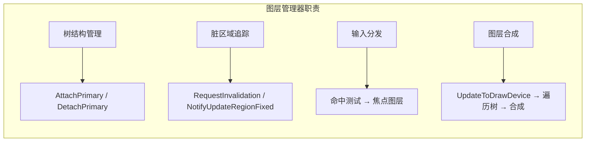
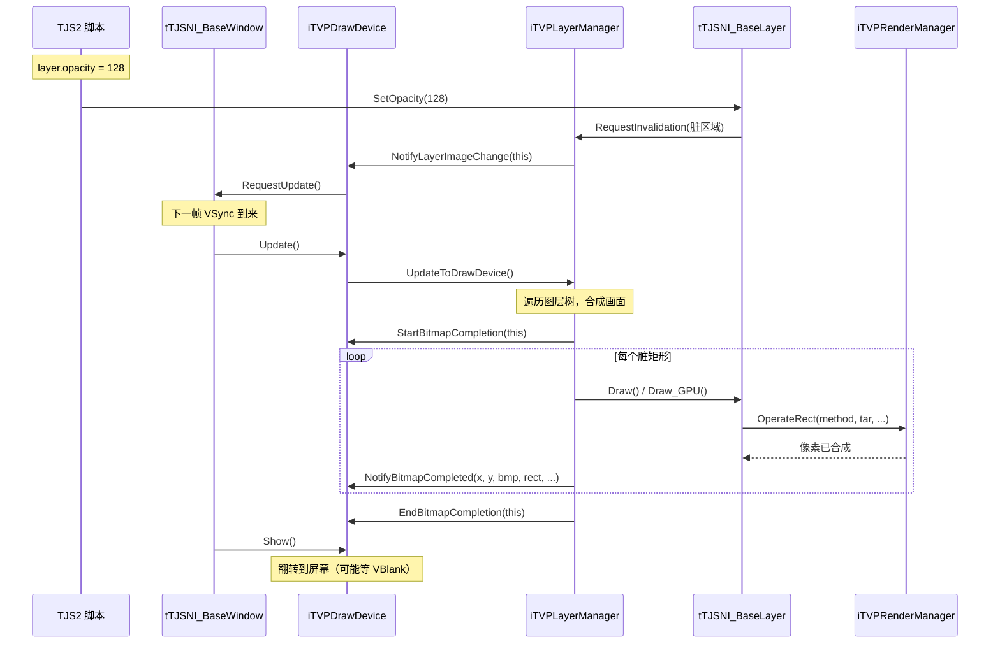

# 渲染管线概览

> **所属模块：** M04-渲染子系统
> **前置知识：** [模块架构与文件组织](01-模块架构与文件组织.md)、[P04-OpenGL图形编程](../../P04-OpenGL图形编程/README.md)、[P05-软件渲染原理](../../P05-软件渲染原理/README.md)
> **预计阅读时间：** 30 分钟

## 本节目标

读完本节后，你将能够：
1. 画出 KrKr2 渲染管线从 TJS 脚本到屏幕显示的完整数据流图
2. 说出管线中每个核心接口（iTVPWindow、iTVPDrawDevice、iTVPLayerManager、iTVPRenderManager）的职责
3. 解释 GPU 路径与 CPU 路径的分支点和选择逻辑
4. 描述一帧画面从图层合成到最终显示的完整流程
5. 根据渲染性能瓶颈快速定位到管线中对应的阶段

## 管线全貌：从脚本到屏幕

KrKr2 的渲染管线（Rendering Pipeline）是一条从 TJS2 脚本命令到屏幕像素的完整数据通路。与 Unity 或 Unreal 等现代游戏引擎的渲染管线不同，KrKr2 作为 2D 视觉小说引擎，其管线更专注于**图层合成**（Layer Compositing）和**过渡效果**（Transition Effects），而非 3D 场景渲染。管线的核心设计理念是"分层职责、可替换后端"——每一层只做一件事，且渲染后端（GPU/CPU）可以在运行时切换。

### 管线架构总览图

```
┌──────────────────────────────────────────────────────────────┐
│                     TJS2 脚本层                               │
│  var layer = new Layer(window, parent);                      │
│  layer.loadImages("bg001");                                  │
│  layer.opacity = 128;                                        │
└──────────┬───────────────────────────────────────────────────┘
           │ TJS 方法调用
           ▼
┌──────────────────────────────────────────────────────────────┐
│              tTJSNI_BaseWindow (窗口层)                       │
│  ┌─────────────────────┐  ┌──────────────────────┐          │
│  │ iTVPWindow 接口      │  │ iTVPLayerTreeOwner   │          │
│  │ · RequestUpdate()    │  │ · RegisterLayerMgr() │          │
│  │ · NotifySrcResize()  │  │ · StartBitmapCompl() │          │
│  └─────────┬───────────┘  └──────────┬───────────┘          │
└────────────┼─────────────────────────┼───────────────────────┘
             │ 更新请求                 │ 图层管理
             ▼                         ▼
┌──────────────────────────────────────────────────────────────┐
│              iTVPDrawDevice (绘制设备层)                      │
│  · Update()          — 触发一帧渲染                          │
│  · Show()            — 将离屏缓冲区翻转到屏幕                │
│  · AddLayerManager() — 管理图层管理器                        │
│  · 输入事件路由      — OnClick/OnMouseMove/OnKeyDown...      │
│  · 坐标变换          — 屏幕坐标 ↔ 图层坐标                  │
└──────────┬───────────────────────────────────────────────────┘
           │ UpdateToDrawDevice()
           ▼
┌──────────────────────────────────────────────────────────────┐
│            iTVPLayerManager (图层管理器层)                    │
│  · AttachPrimary()      — 设置主图层                         │
│  · UpdateToDrawDevice() — 遍历图层树，合成画面               │
│  · RequestInvalidation()— 标记脏区域                         │
│  · 输入事件 → 命中测试 → 分发到具体图层                     │
└──────────┬───────────────────────────────────────────────────┘
           │ 图层树遍历 + 合成
           ▼
┌──────────────────────────────────────────────────────────────┐
│         tTJSNI_BaseLayer (图层树)                             │
│  ┌────────────────────────────────────────────┐              │
│  │ Primary Layer (根图层)                      │              │
│  │  ├── Background Layer (背景)                │              │
│  │  ├── Character Layer (立绘)                 │              │
│  │  ├── Message Layer (文字框)                  │              │
│  │  └── Effect Layer (特效)                    │              │
│  └────────────────────────────────────────────┘              │
│  · Draw() / Draw_GPU()       — 绘制自身                     │
│  · MainImage (tTVPBaseTexture) — 图层像素数据                │
└──────────┬───────────────────────────────────────────────────┘
           │ 渲染操作请求
           ▼
┌──────────────────────────────────────────────────────────────┐
│         iTVPRenderManager (渲染管理器层)                      │
│  ┌────────────────┐         ┌─────────────────┐             │
│  │  GPU 后端 (OGL) │         │  CPU 后端 (软件) │             │
│  │  OperateRect()  │         │  OperateRect()   │             │
│  │  → GL 着色器    │         │  → tvpgl 像素操作│             │
│  │  → 纹理上传     │         │  → SIMD 加速     │             │
│  └────────┬───────┘         └────────┬────────┘             │
└───────────┼──────────────────────────┼───────────────────────┘
            │                          │
            ▼                          ▼
┌──────────────────────────────────────────────────────────────┐
│                    屏幕显示 (Cocos2d-x)                      │
└──────────────────────────────────────────────────────────────┘
```

### 关键设计原则

管线的设计遵循三个核心原则：

1. **接口隔离原则（Interface Segregation）**：每一层通过纯虚接口通信，上层不需要知道下层的具体实现。例如，`iTVPDrawDevice` 不关心渲染是走 GPU 还是 CPU 路径。

2. **观察者模式（Observer Pattern）**：图层内容变化时通过 `NotifyLayerImageChange()` 通知绘制设备，绘制设备在合适时机（通常是下一帧）调用 `UpdateToDrawDevice()` 拉取最新画面。这是一种**延迟渲染**策略，避免每次属性修改都立即触发重绘。

3. **可替换后端（Pluggable Backend）**：渲染管理器通过工厂注册模式 `REGISTER_RENDERMANAGER` 支持多后端，运行时可通过配置选择 OGL 或软件渲染。

## 核心接口详解

### iTVPWindow — 窗口接口

`iTVPWindow` 是渲染管线的最顶层入口，定义在 `WindowIntf.h` 中。它是 TJS2 脚本中 `Window` 对象的底层实现接口，承担两个职责：（1）接收并分发操作系统的输入事件（鼠标、键盘、触摸），（2）协调渲染更新的时序。

```cpp
// 文件：cpp/core/visual/WindowIntf.h 第 63-148 行
class iTVPWindow {
public:
    // 渲染更新相关
    virtual void NotifySrcResize() = 0;    // 源图像尺寸变化时通知窗口
    virtual void RequestUpdate() = 0;       // 请求在下一个合适时机调用 Update()

    // 鼠标光标管理
    virtual void SetDefaultMouseCursor() = 0;
    virtual void SetMouseCursor(tjs_int cursor) = 0;
    virtual void GetCursorPos(tjs_int &x, tjs_int &y) = 0;
    virtual void SetCursorPos(tjs_int x, tjs_int y) = 0;

    // 窗口级操作
    virtual void WindowReleaseCapture() = 0; // 释放鼠标捕获
    virtual void SetHintText(iTJSDispatch2 *sender,
                             const ttstr &text) = 0;    // 设置提示文本
    virtual void SetAttentionPoint(tTJSNI_BaseLayer *layer,
                                   tjs_int l, tjs_int t) = 0; // IME 注视点
    virtual iTJSDispatch2 *GetWindowDispatch() = 0; // 获取 TJS 调度接口
};
```

`tTJSNI_BaseWindow` 是 `iTVPWindow` 的具体实现类，同时也实现了 `iTVPLayerTreeOwner` 接口。这种双重继承使得窗口既是渲染管线的起点（接收更新请求），又是图层树的所有者（管理图层管理器的生命周期）。

```cpp
// 文件：cpp/core/visual/WindowIntf.h 第 158-160 行
// 多重继承：同时作为窗口和图层树所有者
class tTJSNI_BaseWindow : public tTJSNativeInstance,
                          public iTVPWindow,
                          public iTVPLayerTreeOwner {
    // ...
    iTVPDrawDevice *DrawDevice;  // 当前绑定的绘制设备
    tTVPRect WindowExposedRegion; // 窗口暴露区域
    tTVPBaseBitmap *DrawBuffer;   // 绘制缓冲区
    bool WindowUpdating;          // 是否正在更新中
};
```

### iTVPDrawDevice — 绘制设备接口

绘制设备（Draw Device）是管线中最关键的中间层，定义在 `impl/DrawDevice.h` 中。它是窗口与图层系统之间的桥梁，承担五大职责：

| 职责 | 方法 | 说明 |
|------|------|------|
| 生命周期管理 | `Destruct()`, `SetWindowInterface()` | 绑定/解绑窗口 |
| 图层管理器管理 | `AddLayerManager()`, `RemoveLayerManager()` | 维护图层管理器列表 |
| 渲染更新 | `Update()`, `Show()`, `RequestInvalidation()` | 触发渲染和显示 |
| 位图接收 | `StartBitmapCompletion()`, `NotifyBitmapCompleted()`, `EndBitmapCompletion()` | 从图层管理器接收合成结果 |
| 输入路由 | `OnClick()`, `OnMouseMove()`, `OnKeyDown()` 等 | 将输入事件分发到图层 |

```cpp
// 文件：impl/DrawDevice.h 第 25-523 行（接口定义）
class iTVPDrawDevice {
public:
    // 渲染更新流程的三个关键方法
    virtual void Update() = 0;   // 步骤1：触发离屏渲染
    virtual void Show() = 0;     // 步骤2：翻转到屏幕（可能等待 VSync）

    // 位图完成回调（图层管理器 → 绘制设备）
    virtual void StartBitmapCompletion(iTVPLayerManager *mgr) = 0;
    virtual void NotifyBitmapCompleted(
        iTVPLayerManager *mgr,
        tjs_int x, tjs_int y,           // 目标位置
        tTVPBaseTexture *bmp,            // 合成后的位图数据
        const tTVPRect &cliprect,        // 裁剪矩形
        tTVPLayerType type,              // 图层类型
        tjs_int opacity                  // 不透明度 (0-255)
    ) = 0;
    virtual void EndBitmapCompletion(iTVPLayerManager *mgr) = 0;

    // 坐标转换与显示控制
    virtual void SetDestRectangle(const tTVPRect &rect) = 0;
    virtual void GetSrcSize(tjs_int &w, tjs_int &h) = 0;

    // 全屏切换
    virtual bool SwitchToFullScreen(int window, tjs_uint w, tjs_uint h,
        tjs_uint bpp, tjs_uint color, bool changeresolution) = 0;
    virtual void RevertFromFullScreen(int window, tjs_uint w, tjs_uint h,
        tjs_uint bpp, tjs_uint color) = 0;
};
```

`tTVPDrawDevice` 是 `iTVPDrawDevice` 的基础实现类，提供了通用逻辑（坐标变换、图层管理器数组管理），但将 `Show()` 方法保留为纯虚——具体的显示实现由子类（`BasicDrawDevice` 或 OGL 设备）完成。

### iTVPLayerManager — 图层管理器接口

图层管理器负责管理一棵图层树的完整生命周期：树结构维护、脏区域追踪、输入事件的命中测试与分发、以及最终的图层合成。每个窗口至少有一个图层管理器，对应一棵以 Primary Layer 为根的图层树。



核心的渲染流程方法：

```cpp
// 文件：LayerManager.h — iTVPLayerManager 接口（简化）
class iTVPLayerManager {
public:
    // 引用计数
    virtual void AddRef() = 0;
    virtual void Release() = 0;

    // 图层树管理
    virtual void AttachPrimary(tTJSNI_BaseLayer *pri) = 0;  // 挂载主图层
    virtual void DetachPrimary() = 0;                         // 卸载主图层

    // 渲染更新
    virtual void UpdateToDrawDevice() = 0;  // 核心：遍历图层树并合成到绘制设备
    virtual void RequestInvalidation(const tTVPRect &r) = 0; // 标记脏区域

    // 输入事件处理
    virtual void NotifyMouseCursorChange(
        tTJSNI_BaseLayer *layer, tjs_int cursor) = 0;
    virtual void SetFocusedLayer(tTJSNI_BaseLayer *layer) = 0;
    virtual tTJSNI_BaseLayer *GetFocusedLayer() = 0;
};
```

### iTVPRenderManager — 渲染管理器接口

渲染管理器是管线的最底层，直接操作像素。它提供三个层次的 API：

1. **纹理管理** — 创建、更新、销毁纹理对象（`iTVPTexture2D`）
2. **渲染方法** — 获取或编译渲染方法（`iTVPRenderMethod`），类似着色器
3. **渲染操作** — 执行实际的像素操作（`OperateRect`、`OperateTriangles`、`OperatePerspective`）

```cpp
// 文件：RenderManager.h 第 206-297 行
class iTVPRenderManager {
public:
    // 纹理创建（4 种重载）
    virtual iTVPTexture2D* CreateTexture2D(
        const void *pixel, int pitch,
        unsigned int w, unsigned int h,
        TVPTextureFormat::e format,
        int flags = RENDER_CREATE_TEXTURE_FLAG_ANY) = 0;
    virtual iTVPTexture2D* CreateTexture2D(tTVPBitmap *bmp) = 0;
    virtual iTVPTexture2D* CreateTexture2D(TJS::tTJSBinaryStream *s) = 0;
    virtual iTVPTexture2D* CreateTexture2D(
        unsigned int neww, unsigned int newh, iTVPTexture2D *tex) = 0;

    // 渲染方法获取
    virtual iTVPRenderMethod* GetRenderMethod(
        const char *name, uint32_t *hint = nullptr);
    iTVPRenderMethod* CompileRenderMethod(
        const char *name, const char *glsl_script,
        int nTex, unsigned int flags = 0);

    // 核心渲染操作
    virtual void OperateRect(          // 矩形操作：dst × Tex1 × ... × TexN → dst
        iTVPRenderMethod *method,
        iTVPTexture2D *tar, iTVPTexture2D *reftar,
        const tTVPRect &rctar,
        const tRenderTexRectArray &textures) = 0;

    virtual void OperateTriangles(     // 三角形操作（仿射变换）
        iTVPRenderMethod *method, int nTriangles,
        iTVPTexture2D *target, iTVPTexture2D *reftar,
        const tTVPRect &rcclip,
        const tTVPPointD *pttar,
        const tRenderTexQuadArray &textures) = 0;

    virtual void OperatePerspective(   // 透视变换操作
        iTVPRenderMethod *method, int nQuads,
        iTVPTexture2D *target, iTVPTexture2D *reftar,
        const tTVPRect &rcclip,
        const tTVPPointD *pttar,
        const tRenderTexQuadArray &textures) = 0;

    // 后端判断
    virtual bool IsSoftware() { return false; }
    virtual const char *GetName() = 0;
};
```

## 一帧渲染的完整流程

下面以一个具体的例子，追踪一帧画面从开始到结束的完整路径：



### 详细步骤解析

**步骤 1 — 属性修改触发脏标记**

当 TJS 脚本修改图层属性（如 `opacity`、`visible`、`left`、`top`）时，图层会计算自身受影响的矩形区域，通过 `RequestInvalidation()` 上报给图层管理器。管理器维护一个**脏区域集合**（`tTVPComplexRect`，由多个不重叠矩形组成），记录本帧需要重绘的区域。

```cpp
// 伪代码：属性修改触发脏区域
void tTJSNI_BaseLayer::SetOpacity(tjs_int opa) {
    if (Opacity != opa) {
        Opacity = opa;
        // 标记自身区域为脏
        if (Manager) {
            tTVPRect rect(Left, Top, Left + Width, Top + Height);
            Manager->RequestInvalidation(rect);
        }
    }
}
```

**步骤 2 — 延迟更新请求**

图层管理器收到脏区域后，不会立即重绘，而是通过 `NotifyLayerImageChange()` 通知绘制设备"画面有变化"。绘制设备调用 `RequestUpdate()` 告诉窗口"下一帧需要更新"。这种延迟更新策略意味着：同一帧内多次属性修改只会触发一次重绘。

**步骤 3 — 帧更新触发**

当系统的渲染计时器（通常与 VSync 同步）触发时，窗口调用 `DrawDevice->Update()`。这是每帧渲染的起点。

**步骤 4 — 图层合成**

`Update()` 内部调用 `LayerManager->UpdateToDrawDevice()`，开始图层合成流程：

1. `StartBitmapCompletion()` — 通知绘制设备准备接收位图数据
2. 按深度顺序遍历图层树，对每个可见图层调用 `Draw()` 或 `Draw_GPU()`
3. 每个图层的绘制结果通过 `NotifyBitmapCompleted()` 传递给绘制设备
4. `EndBitmapCompletion()` — 通知绘制设备一帧数据传输完成

**步骤 5 — 屏幕显示**

`Show()` 将离屏缓冲区的内容翻转到屏幕。如果启用了 VSync 等待（`WaitVSync`），则会在 VBlank 期间执行翻转，避免画面撕裂。

## GPU 路径 vs CPU 路径

KrKr2 的渲染管线支持两条并行路径，通过 `iTVPRenderManager` 的工厂注册机制在启动时选择：

```
                ┌─ OGL 后端 ─── GPU 着色器 + 纹理 ──┐
渲染操作请求 ───┤                                     ├─→ 合成结果
                └─ 软件后端 ─── tvpgl 像素函数 ───────┘
```

### 后端选择机制

后端通过宏 `REGISTER_RENDERMANAGER` 注册到全局工厂表中：

```cpp
// 文件：RenderManager.h 第 302-309 行
#define REGISTER_RENDERMANAGER(MGR, NAME) \
    static iTVPRenderManager *__##MGR##Factory() { return new MGR(); } \
    static class __##MGR##AutoRegister { \
    public: \
        __##MGR##AutoRegister() { \
            TVPRegisterRenderManager(#NAME, __##MGR##Factory); \
        } \
    } __##MGR##AutoRegister_instance;

// 使用示例（OGL 后端注册）：
// REGISTER_RENDERMANAGER(tTVPOGLRenderManager, OpenGL)
```

运行时通过 `TVPGetRenderManager()` 获取当前活跃的渲染管理器：

```cpp
// 获取默认渲染管理器
iTVPRenderManager *rm = TVPGetRenderManager();

// 或按名称获取
iTVPRenderManager *ogl_rm = TVPGetRenderManager(TJS_W("OpenGL"));

// 判断当前是否为软件渲染
bool is_software = TVPIsSoftwareRenderManager();
```

### 路径对比

| 特性 | GPU 路径 (OGL) | CPU 路径 (Software) |
|------|---------------|-------------------|
| **实现文件** | `ogl/RenderManager_ogl.cpp` | `RenderManager.cpp` + `RenderManager_software.h` |
| **纹理存储** | GPU 显存（`tTVPOGLTexture2D`） | 系统内存（`tTVPSoftwareTexture2D` 系列） |
| **渲染方法** | GLSL 着色器（`tTVPOGLRenderMethod_Script`） | C++ 函数指针（`tTVPRenderMethod_Software`） |
| **合成操作** | GL draw calls + 帧缓冲对象 | 逐像素 `tvpgl` 函数 + `TVPExecThreadTask` 多线程 |
| **适用场景** | 桌面/移动设备标准场景 | 无 GPU 环境、调试、截图 |
| **纹理压缩** | PVRTC / ETC / ASTC | LZ4 / TLG5 压缩 |
| **大纹理处理** | `tTVPOGLTexture2D_split`（拆分为瓦片） | `tTVPSoftwareTexture2D_half`（行去重） |

### 渲染方法系统

渲染方法（`iTVPRenderMethod`）类似于着色器程序，定义了一次像素操作的算法。每个方法有一个名称（如 `"ConstAlphaBlend_SD"`、`"CopyColor"`）和一组参数：

```cpp
// 文件：RenderManager.h 第 149-173 行
class iTVPRenderMethod {
protected:
    std::string Name;
public:
    // 参数系统 — 通过名称获取参数 ID，再按 ID 设置值
    virtual int EnumParameterID(const char *name) { return -1; }
    virtual void SetParameterOpa(int id, int Value) {}    // 不透明度参数
    virtual void SetParameterUInt(int id, unsigned int Value) {}
    virtual void SetParameterFloat(int id, float Value) {}
    virtual void SetParameterColor4B(int id, unsigned int clr) {}

    // 混合函数配置
    virtual iTVPRenderMethod* SetBlendFuncSeparate(
        int func, int srcRGB, int dstRGB,
        int srcAlpha, int dstAlpha) { return this; }

    virtual bool IsBlendTarget() { return true; }
};
```

获取渲染方法的便捷接口：

```cpp
// 方式 1：按名称查找（带缓存 hint）
uint32_t hint = 0;
auto *method = rm->GetRenderMethod("ConstAlphaBlend_SD", &hint);

// 方式 2：按混合参数查找
auto *method2 = rm->GetRenderMethod(
    128,          // 不透明度 (0-255)
    false,        // HDA（Has Destination Alpha）标志
    bmAlpha       // 混合模式枚举
);

// 方式 3：编译 GLSL 脚本（仅 OGL 后端）
auto *custom = rm->CompileRenderMethod(
    "MyBlend",
    "vec4 Process(vec4 s, vec4 d) { return mix(d, s, s.a * opa); }",
    1,  // 输入纹理数量
    RENDER_METHOD_FLAG_NONE
);
```

## 动手实践

### 练习 1：模拟渲染管线数据流

创建一个简化版的渲染管线，实现核心接口之间的通信：

```cpp
// mini_pipeline.cpp — 模拟渲染管线
#include <cstdint>
#include <cstring>
#include <functional>
#include <iostream>
#include <vector>

// 简化的矩形类
struct Rect { int x, y, w, h; };

// 简化的纹理接口
class ITexture {
public:
    virtual ~ITexture() = default;
    virtual uint32_t* GetPixels() = 0;
    virtual int GetWidth() const = 0;
    virtual int GetHeight() const = 0;
};

// 软件纹理实现
class SoftTexture : public ITexture {
    int w_, h_;
    std::vector<uint32_t> pixels_;
public:
    SoftTexture(int w, int h) : w_(w), h_(h), pixels_(w * h, 0) {}
    uint32_t* GetPixels() override { return pixels_.data(); }
    int GetWidth() const override { return w_; }
    int GetHeight() const override { return h_; }

    void Fill(uint32_t color) {
        std::fill(pixels_.begin(), pixels_.end(), color);
    }
};

// 简化的渲染管理器
class IRenderManager {
public:
    virtual ~IRenderManager() = default;
    // 将 src 的 srcRect 区域混合到 dst 的 (dx,dy) 位置
    virtual void BlendRect(ITexture* dst, int dx, int dy,
                          ITexture* src, const Rect& srcRect,
                          int opacity) = 0;
};

// 软件渲染管理器实现
class SoftwareRenderManager : public IRenderManager {
public:
    void BlendRect(ITexture* dst, int dx, int dy,
                  ITexture* src, const Rect& srcRect,
                  int opacity) override {
        auto* dp = dst->GetPixels();
        auto* sp = src->GetPixels();
        int dw = dst->GetWidth();
        int sw = src->GetWidth();

        for (int y = 0; y < srcRect.h; ++y) {
            for (int x = 0; x < srcRect.w; ++x) {
                int si = (srcRect.y + y) * sw + (srcRect.x + x);
                int di = (dy + y) * dw + (dx + x);

                // Alpha 混合：dst = src * opa/255 + dst * (1 - src_a * opa / 255)
                uint32_t sc = sp[si];
                uint32_t dc = dp[di];
                int sa = ((sc >> 24) & 0xFF) * opacity / 255;
                int sr = (sc >> 16) & 0xFF;
                int sg = (sc >> 8) & 0xFF;
                int sb = sc & 0xFF;
                int dr = (dc >> 16) & 0xFF;
                int dg = (dc >> 8) & 0xFF;
                int db = dc & 0xFF;

                int rr = (sr * sa + dr * (255 - sa)) / 255;
                int rg = (sg * sa + dg * (255 - sa)) / 255;
                int rb = (sb * sa + db * (255 - sa)) / 255;
                dp[di] = (0xFF << 24) | (rr << 16) | (rg << 8) | rb;
            }
        }
        std::cout << "  BlendRect: src(" << srcRect.x << ","
                  << srcRect.y << " " << srcRect.w << "x" << srcRect.h
                  << ") → dst(" << dx << "," << dy
                  << ") opa=" << opacity << std::endl;
    }
};

// 简化的图层
struct Layer {
    std::string name;
    SoftTexture* texture;
    int x, y;          // 在父图层中的位置
    int opacity;        // 不透明度 (0-255)
    bool visible;
    std::vector<Layer*> children;
};

// 简化的图层管理器
class LayerManager {
    Layer* primary_ = nullptr;
    IRenderManager* rm_;
public:
    explicit LayerManager(IRenderManager* rm) : rm_(rm) {}

    void AttachPrimary(Layer* layer) { primary_ = layer; }

    // 核心：遍历图层树并合成
    void UpdateToDrawDevice(SoftTexture* target) {
        if (!primary_) return;
        std::cout << "[合成开始]" << std::endl;
        ComposeLayer(target, primary_, 0, 0, 255);
        std::cout << "[合成完成]" << std::endl;
    }

private:
    void ComposeLayer(SoftTexture* target, Layer* layer,
                      int parentX, int parentY, int parentOpa) {
        if (!layer->visible) return;

        int absX = parentX + layer->x;
        int absY = parentY + layer->y;
        int effectiveOpa = layer->opacity * parentOpa / 255;

        std::cout << "  合成图层: " << layer->name
                  << " 位置=(" << absX << "," << absY << ")"
                  << " 有效不透明度=" << effectiveOpa << std::endl;

        // 将图层内容混合到目标
        Rect srcRect{0, 0, layer->texture->GetWidth(),
                     layer->texture->GetHeight()};
        rm_->BlendRect(target, absX, absY,
                       layer->texture, srcRect, effectiveOpa);

        // 递归合成子图层
        for (auto* child : layer->children) {
            ComposeLayer(target, child, absX, absY, effectiveOpa);
        }
    }
};

int main() {
    SoftwareRenderManager rm;
    LayerManager lm(&rm);

    // 创建图层树：
    //   Primary (800x600, 黑色)
    //   ├── Background (800x600, 蓝色, opa=255)
    //   └── Character (200x300, 红色, opa=180, pos=300,150)
    SoftTexture primaryTex(800, 600);
    SoftTexture bgTex(800, 600);
    SoftTexture charTex(200, 300);

    primaryTex.Fill(0xFF000000);  // 黑色
    bgTex.Fill(0xFF003366);       // 深蓝
    charTex.Fill(0xFFCC3333);     // 红色

    Layer charLayer{"Character", &charTex, 300, 150, 180, true, {}};
    Layer bgLayer{"Background", &bgTex, 0, 0, 255, true, {}};
    Layer primaryLayer{"Primary", &primaryTex, 0, 0, 255, true,
                       {&bgLayer, &charLayer}};

    lm.AttachPrimary(&primaryLayer);

    // 合成到屏幕缓冲区
    SoftTexture screenBuffer(800, 600);
    lm.UpdateToDrawDevice(&screenBuffer);

    // 验证合成结果
    uint32_t pixel_bg = screenBuffer.GetPixels()[0];     // (0,0) = 背景色
    uint32_t pixel_char = screenBuffer.GetPixels()[200 * 800 + 350]; // 角色区域
    std::cout << "\n验证合成结果：" << std::endl;
    std::cout << "  背景像素 (0,0): 0x" << std::hex << pixel_bg << std::endl;
    std::cout << "  角色区域像素: 0x" << pixel_char << std::dec << std::endl;

    return 0;
}
```

```cmake
# mini_pipeline/CMakeLists.txt
cmake_minimum_required(VERSION 3.19)
project(mini_pipeline LANGUAGES CXX)
set(CMAKE_CXX_STANDARD 17)
add_executable(mini_pipeline mini_pipeline.cpp)
```

编译运行：

```bash
# Windows / Linux / macOS 通用
cmake -B build && cmake --build build
./build/mini_pipeline   # Linux/macOS
.\build\mini_pipeline.exe  # Windows

# 预期输出：
# [合成开始]
#   合成图层: Primary 位置=(0,0) 有效不透明度=255
#   BlendRect: src(0,0 800x600) → dst(0,0) opa=255
#   合成图层: Background 位置=(0,0) 有效不透明度=255
#   BlendRect: src(0,0 800x600) → dst(0,0) opa=255
#   合成图层: Character 位置=(300,150) 有效不透明度=180
#   BlendRect: src(0,0 200x300) → dst(300,150) opa=180
# [合成完成]
```

### 练习 2：实现渲染方法注册工厂

```cpp
// method_factory.cpp — 模拟渲染方法注册机制
#include <functional>
#include <iostream>
#include <string>
#include <unordered_map>

// 渲染方法基类
class RenderMethod {
public:
    virtual ~RenderMethod() = default;
    virtual const char* GetName() const = 0;
    virtual void Execute(uint32_t* dst, const uint32_t* src,
                        int count, int opa) const = 0;
};

// 渲染方法工厂
class RenderMethodFactory {
    std::unordered_map<std::string,
        std::function<RenderMethod*()>> registry_;

    static RenderMethodFactory& Instance() {
        static RenderMethodFactory inst;
        return inst;
    }
public:
    static void Register(const std::string& name,
                        std::function<RenderMethod*()> creator) {
        Instance().registry_[name] = std::move(creator);
        std::cout << "注册渲染方法: " << name << std::endl;
    }

    static RenderMethod* Create(const std::string& name) {
        auto it = Instance().registry_.find(name);
        if (it != Instance().registry_.end()) {
            return it->second();
        }
        return nullptr;
    }

    static void ListAll() {
        std::cout << "已注册渲染方法：" << std::endl;
        for (auto& [name, _] : Instance().registry_) {
            std::cout << "  - " << name << std::endl;
        }
    }
};

// 自动注册宏（模拟 REGISTER_RENDERMANAGER）
#define REGISTER_METHOD(CLASS, NAME) \
    static RenderMethod* __Create##CLASS() { return new CLASS(); } \
    static struct __##CLASS##Register { \
        __##CLASS##Register() { \
            RenderMethodFactory::Register(#NAME, __Create##CLASS); \
        } \
    } __##CLASS##register_instance;

// 具体渲染方法：直接拷贝
class CopyMethod : public RenderMethod {
public:
    const char* GetName() const override { return "Copy"; }
    void Execute(uint32_t* dst, const uint32_t* src,
                int count, int opa) const override {
        std::memcpy(dst, src, count * sizeof(uint32_t));
    }
};
REGISTER_METHOD(CopyMethod, Copy)

// 具体渲染方法：Alpha 混合
class AlphaBlendMethod : public RenderMethod {
public:
    const char* GetName() const override { return "AlphaBlend"; }
    void Execute(uint32_t* dst, const uint32_t* src,
                int count, int opa) const override {
        for (int i = 0; i < count; ++i) {
            uint32_t s = src[i], d = dst[i];
            int a = ((s >> 24) & 0xFF) * opa / 255;
            for (int shift = 0; shift < 24; shift += 8) {
                int sv = (s >> shift) & 0xFF;
                int dv = (d >> shift) & 0xFF;
                int rv = (sv * a + dv * (255 - a)) / 255;
                d = (d & ~(0xFF << shift)) | (rv << shift);
            }
            dst[i] = d | 0xFF000000;
        }
    }
};
REGISTER_METHOD(AlphaBlendMethod, AlphaBlend)

// 具体渲染方法：加法混合
class AdditiveBlendMethod : public RenderMethod {
public:
    const char* GetName() const override { return "AdditiveBlend"; }
    void Execute(uint32_t* dst, const uint32_t* src,
                int count, int opa) const override {
        for (int i = 0; i < count; ++i) {
            uint32_t s = src[i], d = dst[i];
            for (int shift = 0; shift < 24; shift += 8) {
                int sv = ((s >> shift) & 0xFF) * opa / 255;
                int dv = (d >> shift) & 0xFF;
                int rv = std::min(sv + dv, 255);
                d = (d & ~(0xFF << shift)) | (rv << shift);
            }
            dst[i] = d | 0xFF000000;
        }
    }
};
REGISTER_METHOD(AdditiveBlendMethod, AdditiveBlend)

int main() {
    RenderMethodFactory::ListAll();

    // 测试各种渲染方法
    uint32_t src[] = {0x80FF0000, 0x80FF0000}; // 半透明红色
    uint32_t dst[] = {0xFF0000FF, 0xFF0000FF}; // 不透明蓝色

    auto test = [&](const char* name, int opa) {
        uint32_t buf[2];
        std::memcpy(buf, dst, sizeof(buf));
        auto* method = RenderMethodFactory::Create(name);
        if (method) {
            method->Execute(buf, src, 2, opa);
            std::cout << name << "(opa=" << opa << "): 0x"
                      << std::hex << buf[0] << std::dec << std::endl;
            delete method;
        }
    };

    std::cout << "\n测试结果：" << std::endl;
    test("Copy", 255);
    test("AlphaBlend", 255);
    test("AlphaBlend", 128);
    test("AdditiveBlend", 255);

    return 0;
}
```

### 常见错误及解决方案

**错误 1：忘记调用 RequestUpdate() 导致画面不更新**

```
症状：修改了图层属性但画面没有变化
原因：图层管理器标记了脏区域，但绘制设备没有收到更新请求
```

在 KrKr2 中，更新请求是逐级传递的：Layer → LayerManager → DrawDevice → Window。如果任何一级中断（例如 DrawDevice 没有实现 `NotifyLayerImageChange`），画面就不会更新。调试时可以在 `RequestUpdate()` 加断点确认请求链路是否完整。

**错误 2：在 NotifyBitmapCompleted 中直接使用位图指针**

```
症状：显示花屏或访问已释放内存
原因：NotifyBitmapCompleted 传入的位图指针可能在 EndBitmapCompletion 后失效
```

`NotifyBitmapCompleted()` 中的 `tTVPBaseTexture *bmp` 参数是临时缓冲区，只在 `StartBitmapCompletion` 到 `EndBitmapCompletion` 之间有效。绘制设备必须在此期间完成数据拷贝或上传到 GPU，不能保存指针留到之后使用。

**错误 3：混淆坐标空间导致点击事件定位错误**

```
症状：鼠标点击位置与实际图层不对应
原因：没有正确进行 Device→LayerManager 坐标变换
```

管线中存在三个坐标空间：窗口坐标（OS 级）、设备坐标（DrawDevice 的 DestRect 内）、图层坐标（Primary Layer 的像素坐标）。`tTVPDrawDevice::TransformToPrimaryLayerManager()` 方法负责将设备坐标转换为图层坐标，考虑了缩放（zoom）和偏移（layerLeft/layerTop）。

## 对照项目源码

相关文件：
- `cpp/core/visual/WindowIntf.h` 第 63-148 行 — `iTVPWindow` 接口定义
- `cpp/core/visual/WindowIntf.h` 第 158-302 行 — `tTJSNI_BaseWindow` 实现，包含 DrawDevice 绑定和更新流程
- `cpp/core/visual/impl/DrawDevice.h` 第 25-523 行 — `iTVPDrawDevice` 完整接口（含日文注释）
- `cpp/core/visual/impl/DrawDevice.h` 第 530-668 行 — `tTVPDrawDevice` 基础实现
- `cpp/core/visual/LayerManager.h` — `iTVPLayerManager` 接口和 `tTVPLayerManager` 实现
- `cpp/core/visual/RenderManager.h` 第 99-147 行 — `iTVPTexture2D` 纹理接口
- `cpp/core/visual/RenderManager.h` 第 149-173 行 — `iTVPRenderMethod` 渲染方法接口
- `cpp/core/visual/RenderManager.h` 第 206-316 行 — `iTVPRenderManager` 渲染管理器接口 + 工厂注册宏

关键代码对照：

```cpp
// 项目源码：渲染管理器工厂注册宏
// 文件：RenderManager.h 第 300-311 行
void TVPRegisterRenderManager(const char *name, iTVPRenderManager *(*func)());
// 工厂方法返回 iTVPRenderManager 指针，由全局表管理

// 全局访问入口
iTVPRenderManager *TVPGetRenderManager();         // 获取默认管理器
iTVPRenderManager *TVPGetRenderManager(           // 按名称获取
    const TJS::tTJSString &name);
bool TVPIsSoftwareRenderManager();                // 判断是否软件渲染
```

## 本节小结

- KrKr2 渲染管线由 **5 层**组成：TJS 脚本 → 窗口（`iTVPWindow`）→ 绘制设备（`iTVPDrawDevice`）→ 图层管理器（`iTVPLayerManager`）→ 渲染管理器（`iTVPRenderManager`）
- 管线采用**延迟渲染**策略：属性修改只标记脏区域，实际渲染在下一帧的 `Update()` 调用时批量执行
- 位图传输使用**三段式协议**：`StartBitmapCompletion` → `NotifyBitmapCompleted` × N → `EndBitmapCompletion`
- 渲染后端通过 `REGISTER_RENDERMANAGER` 宏注册，运行时通过 `TVPGetRenderManager()` 选择 OGL 或软件后端
- `iTVPRenderMethod` 提供类似着色器的参数系统，支持按名称查找、按混合参数查找、或编译 GLSL 脚本三种获取方式
- 管线中存在三个坐标空间（窗口/设备/图层），`TransformToPrimaryLayerManager()` 负责坐标转换

## 练习题与答案

### 题目 1：为什么 KrKr2 选择延迟渲染而不是立即渲染？

<details>
<summary>查看答案</summary>

**延迟渲染（Deferred Rendering）** 指的是属性修改后不立即重绘，而是标记脏区域，等到下一帧统一处理。KrKr2 选择这种策略有三个原因：

1. **性能优化 — 合并重绘**：视觉小说的一帧中可能有大量属性修改（移动立绘、更新文字、切换背景），如果每次修改都触发重绘，同一区域可能被重绘数十次。延迟到帧末统一处理，每个脏区域只需重绘一次。

2. **避免中间状态闪烁**：如果 TJS 脚本在一帧内先隐藏旧背景再显示新背景，立即渲染会导致用户看到一帧"无背景"的中间状态。延迟渲染确保用户只看到最终结果。

3. **与 VSync 同步**：延迟渲染使得重绘时机可以与显示器的 VBlank 同步，避免画面撕裂（Tearing）。`RequestUpdate()` 只是设置一个标志，实际渲染在 VSync 计时器回调中执行。

代码层面的证据：

```cpp
// RequestUpdate() 只设置标志，不触发渲染
void tTJSNI_BaseWindow::RequestUpdate() {
    // 设置标志，等待事件循环调用 UpdateContent()
}

// UpdateContent() 在事件分发器中被调用（与 VSync 同步）
void tTJSNI_BaseWindow::UpdateContent() {
    if (DrawDevice) {
        DrawDevice->Update();  // 此时才真正渲染
        DrawDevice->Show();    // 翻转到屏幕
    }
}
```

</details>

### 题目 2：如果要支持一个新的渲染后端（如 Vulkan），需要实现哪些接口？

<details>
<summary>查看答案</summary>

需要实现三个核心接口：

1. **`iTVPRenderManager`** — 实现 `CreateTexture2D()`（4 种重载）、`OperateRect()`、`OperateTriangles()`、`OperatePerspective()`、`GetName()` 返回 `"Vulkan"`
2. **`iTVPTexture2D`** — 封装 `VkImage` + `VkDeviceMemory`，实现 `Update()`、`GetPoint()`、`SetPoint()`、`GetFormat()`
3. **注册**：在 .cpp 末尾使用 `REGISTER_RENDERMANAGER(tTVPVulkanRenderManager, Vulkan)` 宏注册

如果需要 GLSL→SPIR-V 着色器编译，还需重写 `GetRenderMethodFromScript()`。

</details>

### 题目 3：编写代码追踪一帧渲染中 OperateRect 的调用次数

<details>
<summary>查看答案</summary>

在 `IRenderManager` 基础上添加计数器包装：

```cpp
class CountingRenderManager {
    int operate_count_ = 0, pixel_count_ = 0;
public:
    void OperateRect(uint32_t* dst, int dstW,
                    const uint32_t* src, int srcW,
                    const Rect& dstRect, const Rect& srcRect, int opa) {
        operate_count_++;
        pixel_count_ += srcRect.w * srcRect.h;
        // ... 实际混合逻辑
    }
    void PrintStats() const {
        printf("OperateRect 调用: %d 次, 总像素: %d\n",
               operate_count_, pixel_count_);
    }
};
// 3 个图层（bg 800×600 + char 200×300 + msgbox 600×150）
// = 3 次 OperateRect，总计 57 万像素
```

**性能启示**：800×600 下一帧完整重绘处理 57 万像素。使用脏区域优化只重绘变化部分（如文字框 600×150 = 9 万像素），性能提升约 6 倍——这就是 `tTVPComplexRect` 的价值。

</details>

## 下一步

[窗口与显示管理](03-窗口与显示管理.md) — 深入了解窗口系统的平台实现、全屏切换机制、VSync 同步、以及输入事件从操作系统到图层的完整分发路径。
