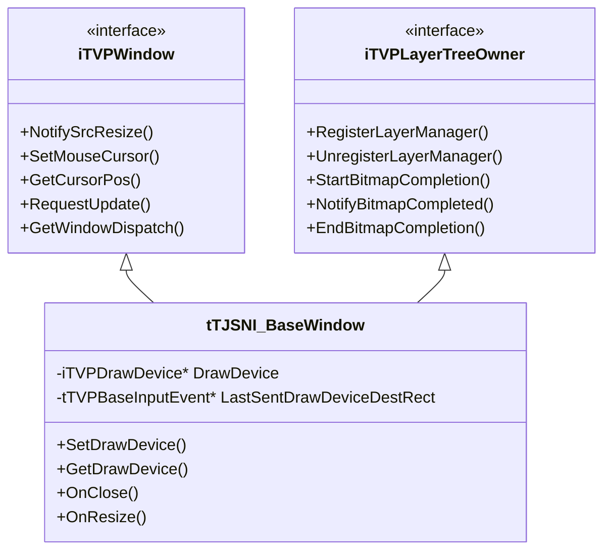
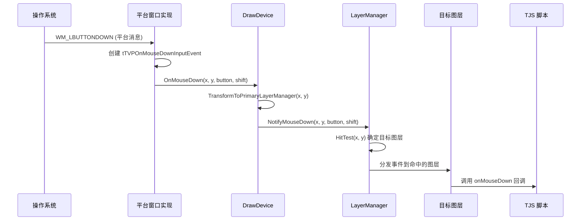

# 窗口与显示管理

> **所属模块：** M04-渲染子系统
> **前置知识：** [02-渲染管线概览](./02-渲染管线概览.md)
> **预计阅读时间：** 40 分钟

## 本节目标

读完本节后，你将能够：
1. 理解 `iTVPWindow` 接口与 `tTJSNI_BaseWindow` 的双重继承架构
2. 掌握 DrawDevice 在窗口与图层管理器之间的桥梁作用
3. 理解窗口事件系统的异步投递与处理机制
4. 掌握全屏切换、VSync、显示旋转等显示管理功能
5. 了解跨平台窗口实现的差异与平台抽象策略

## 1. 窗口接口体系

KrKr2 的窗口系统采用接口与实现分离的设计。核心接口 `iTVPWindow` 定义在 `WindowIntf.h` 中，它描述了窗口对外暴露给 TJS 脚本层的所有能力。这个接口不包含任何平台相关的代码，确保了跨平台的可移植性。具体的平台窗口实现（如 Win32 窗口、SDL 窗口、Cocos2d 窗口等）由各平台目录下的 `WindowImpl.h` 提供。

### 1.1 iTVPWindow 核心方法

`iTVPWindow` 接口定义了窗口与渲染管线交互的关键方法：

```cpp
// 源码位置：krkr2/cpp/core/visual/WindowIntf.h

class iTVPWindow {
public:
    // 通知窗口源图像尺寸发生变化
    virtual void NotifySrcResize() = 0;

    // 获取/设置鼠标光标形状
    virtual void SetMouseCursor(tjs_int handle) = 0;

    // 获取当前光标在窗口客户区中的位置
    virtual void GetCursorPos(tjs_int &x, tjs_int &y) = 0;

    // 设置光标在窗口客户区中的位置
    virtual void SetCursorPos(tjs_int x, tjs_int y) = 0;

    // 请求窗口进行一次更新
    virtual void RequestUpdate() = 0;

    // 获取窗口的 TJS 分发对象（用于脚本交互）
    virtual iTJSDispatch2 *GetWindowDispatch() = 0;
};
```

每个方法都有明确的职责。`NotifySrcResize` 在图层管理器改变主图层尺寸时被调用，窗口实现需要据此调整客户区或缩放显示。`RequestUpdate` 是渲染管线的入口——当图层内容发生变化时，通过此方法通知窗口安排一次重绘。

### 1.2 tTJSNI_BaseWindow 的双重继承

`tTJSNI_BaseWindow` 是窗口功能的核心实现基类，它同时继承了两个接口：



这种双重继承的设计理由是：窗口既需要对外提供显示能力（`iTVPWindow`），又需要作为图层树的所有者来接收渲染完成的位图数据（`iTVPLayerTreeOwner`）。DrawDevice 作为中间桥梁，将两者连接起来。

### 1.3 代码示例：窗口的创建与初始化

```cpp
// 演示 tTJSNI_BaseWindow 的典型初始化流程
#include "WindowIntf.h"
#include "DrawDevice.h"
#include "LayerManager.h"

class MyWindow : public tTJSNI_BaseWindow {
public:
    void Initialize() {
        // 1. 创建默认的绘制设备
        iTVPDrawDevice* device = CreateDefaultDrawDevice();

        // 2. 将绘制设备关联到窗口
        // DrawDevice 负责管理 LayerManager 与窗口之间的交互
        SetDrawDevice(device);

        // 3. DrawDevice 内部会创建 LayerManager
        // 并通过 iTVPLayerTreeOwner::RegisterLayerManager
        // 将其注册到窗口

        // 4. 窗口准备好后，请求首次更新
        RequestUpdate();
    }

    // iTVPWindow 实现：处理源图像尺寸变化
    void NotifySrcResize() override {
        // 获取主图层管理器的尺寸
        tjs_int w, h;
        GetDrawDevice()->GetSrcSize(w, h);
        // 调整窗口客户区尺寸以匹配
        ResizeClientArea(w, h);
    }
};
```

## 2. DrawDevice —— 窗口与渲染的桥梁

DrawDevice（绘制设备）是 KrKr2 渲染架构中最关键的中间层组件。它定义在 `DrawDevice.h` 中，通过 `iTVPDrawDevice` 接口与 `tTVPDrawDevice` 基类实现了窗口与图层系统之间的完全解耦。

### 2.1 iTVPDrawDevice 接口职责

DrawDevice 承担五大类职责：

| 职责类别 | 关键方法 | 说明 |
|---------|---------|------|
| 图层管理器关联 | `AddLayerManager` / `RemoveLayerManager` | 管理多个 LayerManager 实例 |
| 位图完成通知 | `StartBitmapCompletion` / `NotifyBitmapCompleted` / `EndBitmapCompletion` | 接收渲染完成的位图并呈现到窗口 |
| 坐标变换 | `TransformToPrimaryLayerManager` / `TransformFromPrimaryLayerManager` | 窗口坐标 ↔ 图层坐标互转 |
| 输入路由 | `OnMouseDown` / `OnMouseUp` / `OnMouseMove` / `OnKeyDown` / `OnKeyUp` 等 | 将窗口输入事件转发给正确的图层 |
| 显示控制 | `SetTargetWindow` / `SetDestRectangle` / `SwitchToFullScreen` | 控制渲染目标和显示模式 |

### 2.2 坐标变换系统

DrawDevice 负责在窗口物理坐标和图层逻辑坐标之间进行转换。这在窗口缩放、全屏拉伸等场景下至关重要：

```cpp
// 源码位置：krkr2/cpp/core/visual/impl/DrawDevice.h
// tTVPDrawDevice 基类中的坐标变换实现

void tTVPDrawDevice::TransformToPrimaryLayerManager(
    tjs_int &x, tjs_int &y) {
    // 从窗口客户区坐标转换到主图层管理器坐标
    // 考虑 DestRect（目标显示区域）的偏移和缩放
    iTVPLayerManager *manager = GetPrimaryLayerManager();
    if (manager) {
        tjs_int srcW, srcH;
        manager->GetPrimaryLayerSize(srcW, srcH);
        // 将窗口坐标映射到图层坐标
        // x = (x - destRect.left) * srcW / destWidth
        // y = (y - destRect.top) * srcH / destHeight
        x = (x - DestRect.left) * srcW / (DestRect.right - DestRect.left);
        y = (y - DestRect.top) * srcH / (DestRect.bottom - DestRect.top);
    }
}

void tTVPDrawDevice::TransformFromPrimaryLayerManager(
    tjs_int &x, tjs_int &y) {
    // 反向变换：从图层坐标到窗口坐标
    iTVPLayerManager *manager = GetPrimaryLayerManager();
    if (manager) {
        tjs_int srcW, srcH;
        manager->GetPrimaryLayerSize(srcW, srcH);
        x = x * (DestRect.right - DestRect.left) / srcW + DestRect.left;
        y = y * (DestRect.bottom - DestRect.top) / srcH + DestRect.top;
    }
}
```

### 2.3 位图完成通知流程

当图层树渲染完成后，结果通过三步回调传递给窗口：

```
LayerManager::UpdateToDrawDevice()
  → DrawDevice::StartBitmapCompletion(manager)
  → DrawDevice::NotifyBitmapCompleted(
        manager, x, y, bitmap,
        
        
        
        
        
        
        
        
        
        
        
        
        
        clipRect,
        
        
        
        
        
        
        
        
        
        
        
        
        
        
        
        
        
        
        
        
        
        
        
        
        
        
        
        
        type, opacity)   // 可多次调用
  → DrawDevice::EndBitmapCompletion(manager)
    → 窗口呈现到屏幕
```

```cpp
// 一次完整的位图完成通知序列示例
void MyDrawDevice::StartBitmapCompletion(
    iTVPLayerManager *manager) {
    // 准备接收位图数据
    // 例如：锁定后缓冲区
    LockBackBuffer();
}

void MyDrawDevice::NotifyBitmapCompleted(
    iTVPLayerManager *manager,
    tjs_int x, tjs_int y,
    const void *bits,      // 像素数据指针
    const tTVPRect &cliprect,  // 需要更新的裁剪区域
    tTVPLayerType type,    // 图层混合类型
    tjs_int opacity) {     // 不透明度
    // 将位图数据拷贝到后缓冲区的对应位置
    CopyToBackBuffer(x, y, bits, cliprect);
}

void MyDrawDevice::EndBitmapCompletion(
    iTVPLayerManager *manager) {
    // 所有脏区域已更新，提交显示
    UnlockBackBuffer();
    PresentToScreen();
}
```

## 3. 窗口事件系统

KrKr2 使用异步事件队列来处理窗口输入。每种输入事件都被封装为独立的事件类，继承自 `tTVPBaseInputEvent`。这种设计避免了事件处理中的重入问题，并允许事件在主线程中按序处理。

### 3.1 事件类层次结构

`WindowIntf.h` 中定义了超过 15 种输入事件类：

```cpp
// 所有事件类都继承自 tTVPBaseInputEvent
// 每个事件类包含：
//   1. Tag —— 指向发送者的指针，用于生命周期管理
//   2. Deliver() —— 纯虚函数，在事件循环中被调用以实际处理事件

// 鼠标事件族
class tTVPOnClickInputEvent;      // 单击
class tTVPOnDoubleClickInputEvent; // 双击
class tTVPOnMouseDownInputEvent;   // 鼠标按下（含按钮和Shift状态）
class tTVPOnMouseUpInputEvent;     // 鼠标释放
class tTVPOnMouseMoveInputEvent;   // 鼠标移动

// 键盘事件族
class tTVPOnKeyDownInputEvent;     // 按键按下
class tTVPOnKeyUpInputEvent;       // 按键释放
class tTVPOnKeyPressInputEvent;    // 字符输入

// 触摸事件族（移动平台）
class tTVPOnTouchDownInputEvent;   // 触摸开始
class tTVPOnTouchUpInputEvent;     // 触摸结束
class tTVPOnTouchMoveInputEvent;   // 触摸移动
class tTVPOnTouchScalingInputEvent;  // 双指缩放
class tTVPOnTouchRotateInputEvent;   // 双指旋转
class tTVPOnMultiTouchInputEvent;    // 多点触控

// 滚轮事件
class tTVPOnMouseWheelInputEvent;  // 鼠标滚轮
```

### 3.2 事件投递流程

事件从操作系统到 TJS 脚本的完整流程如下：



### 3.3 代码示例：处理鼠标事件

```cpp
// 事件的创建与投递
class tTVPOnMouseDownInputEvent : public tTVPBaseInputEvent {
    tjs_int X, Y;           // 鼠标位置
    tTVPMouseButton Button;  // 按钮（mbLeft/mbRight/mbMiddle）
    tjs_uint32 ShiftState;   // Shift/Ctrl/Alt 状态

public:
    tTVPOnMouseDownInputEvent(
        tTJSNI_BaseLayer *tag,  // 发送者标签
        tjs_int x, tjs_int y,
        tTVPMouseButton button,
        tjs_uint32 shift)
        : tTVPBaseInputEvent(tag),
          X(x), Y(y), Button(button), ShiftState(shift) {}

    void Deliver() override {
        // 在事件循环中被调用
        // 实际将事件传递给 TJS 脚本的 onMouseDown 处理函数
        auto *layer = static_cast<tTJSNI_BaseLayer*>(GetTag());
        if (layer) {
            layer->FireOnMouseDown(X, Y, Button, ShiftState);
        }
    }
};
```

## 4. 显示管理功能

### 4.1 全屏切换

DrawDevice 提供了全屏模式的切换能力。全屏切换涉及分辨率更改、坐标系重建、输入映射更新等多个步骤：

```cpp
// iTVPDrawDevice 全屏相关方法
class iTVPDrawDevice {
    // 获取窗口默认的客户区尺寸
    virtual void GetSrcSize(tjs_int &w, tjs_int &h) = 0;

    // 切换到全屏模式
    // width, height: 期望的全屏分辨率
    // bpp: 色深（通常为 32）
    // color: 窗口外区域填充色
    // changeresolution: 是否实际改变显示器分辨率
    virtual bool SwitchToFullScreen(
        HWND window,
        tjs_uint width, tjs_uint height,
        tjs_uint bpp, tjs_uint color,
        bool changeresolution) = 0;

    // 从全屏恢复为窗口模式
    virtual void RevertFromFullScreen(
        HWND window,
        tjs_uint width, tjs_uint height,
        tjs_uint bpp, tjs_uint color) = 0;
};
```

全屏模式在不同平台上的实现差异：

| 平台 | 实现方式 | 分辨率切换 | 注意事项 |
|------|---------|-----------|---------|
| Windows | `ChangeDisplaySettings` + 无边框窗口 | 支持 | 需要处理 Alt+Tab 恢复 |
| Linux/SDL | `SDL_SetWindowFullscreen` | 依赖桌面环境 | Wayland 下无真正全屏模式 |
| macOS | `NSWindow.toggleFullScreen` | 由系统管理 | 使用 macOS 原生全屏空间 |
| Android | 默认全屏运行 | 不适用 | 需处理状态栏/导航栏隐藏 |

### 4.2 VSync 与垂直同步

`tTJSNI_BaseWindow` 提供了 VSync 控制：

```cpp
// 源码位置：krkr2/cpp/core/visual/WindowIntf.h

class tTJSNI_BaseWindow {
    bool WaitVSync;  // 是否等待垂直同步

    // 纯虚函数——由平台实现提供具体的 VSync 线程逻辑
    virtual void UpdateVSyncThread() = 0;

    // TJS 脚本可通过属性访问
    // Window.waitVSync = true/false
};
```

VSync（Vertical Synchronization，垂直同步）是一种将渲染帧率与显示器刷新率同步的技术。启用 VSync 可以避免画面撕裂（Tearing），但可能引入输入延迟。在视觉小说这类不需要高帧率的应用中，VSync 通常是默认开启的。

### 4.3 显示旋转

窗口支持显示旋转通知，这在移动设备上尤为重要：

```cpp
// 处理显示旋转事件
void tTJSNI_BaseWindow::OnDisplayRotate(
    tjs_int orientation,  // 0/90/180/270 度
    tjs_int rotate,       // 相对旋转角度
    tjs_int bpp,          // 旋转后的色深
    tjs_int hresolution,  // 旋转后的水平分辨率
    tjs_int vresolution   // 旋转后的垂直分辨率
) {
    // 通知 DrawDevice 更新显示配置
    if (DrawDevice) {
        DrawDevice->OnDisplayRotate(
            orientation, rotate, bpp,
            hresolution, vresolution);
    }
}
```

### 4.4 窗口边框样式

KrKr2 定义了丰富的窗口边框样式枚举：

```cpp
// 窗口边框样式枚举
enum tTVPBorderStyle {
    bsNone,      // 无边框（用于启动画面等）
    bsSingle,    // 固定大小单线边框
    bsSizeable,  // 可调整大小的边框
    bsDialog,    // 对话框边框
    bsToolWindow,    // 工具窗口（小标题栏）
    bsSizeToolWin    // 可调整大小的工具窗口
};

// 鼠标光标状态
enum tTVPMouseCursorState {
    mcsVisible,     // 光标可见
    mcsTempHidden,  // 暂时隐藏（鼠标不动时自动隐藏）
    mcsHidden       // 完全隐藏
};
```

## 5. 平台窗口实现策略

### 5.1 WindowImpl.h 包含机制

`WindowIntf.h` 的末尾使用了条件包含来引入平台实现：

```cpp
// WindowIntf.h 末尾
// 此处包含平台特定的窗口实现
// 该文件必须定义 tTJSNI_Window 类
// tTJSNI_Window 继承自 tTJSNI_BaseWindow
// 并实现所有平台相关的纯虚函数
#include "WindowImpl.h"
```

每个平台需要提供的 `WindowImpl.h` 必须定义 `tTJSNI_Window` 类：

```cpp
// 各平台的实现位置：
// Windows:  cpp/core/environ/win32/WindowImpl.h
// Linux:    cpp/core/environ/sdl/WindowImpl.h
// macOS:    cpp/core/environ/apple/WindowImpl.h
// Android:  cpp/core/environ/android/WindowImpl.h
// Cocos2d:  cpp/core/environ/cocos2d/WindowImpl.h

// 示例：基于 Cocos2d 的窗口实现
class tTJSNI_Window : public tTJSNI_BaseWindow {
    // Cocos2d 场景节点作为渲染目标
    cocos2d::Scene* scene;

public:
    // 实现平台相关的纯虚函数
    void UpdateVSyncThread() override {
        // Cocos2d 由引擎管理 VSync
    }

    void NotifySrcResize() override {
        // 调整 Cocos2d 视口大小
    }

    // 实现窗口列表管理
    // TVPGetWindowListAt(), TVPGetWindowCount()
    // 由 TJS 脚本层查询
};
```

### 5.2 窗口列表管理

系统维护一个全局窗口列表，供脚本查询和管理：

```cpp
// 全局窗口管理函数
extern tTJSNI_BaseWindow* TVPMainWindow;  // 主窗口
extern int TVPGetWindowCount();            // 获取窗口总数
extern tTJSNI_BaseWindow* TVPGetWindowListAt(int index); // 按索引获取窗口
```

### 5.3 常见错误及解决方案

**错误 1：DrawDevice 未初始化就调用 RequestUpdate**

```
现象：程序启动时崩溃，调用栈指向 RequestUpdate → DrawDevice 空指针
原因：窗口创建后未调用 SetDrawDevice() 就触发了更新
解决：确保在窗口初始化流程中先创建并设置 DrawDevice
```

**错误 2：全屏切换后坐标映射错误**

```
现象：全屏模式下鼠标点击位置与实际目标不一致
原因：SwitchToFullScreen 后未更新 DestRect
解决：在全屏切换回调中调用 SetDestRectangle() 更新目标区域，
      确保 TransformToPrimaryLayerManager 使用正确的缩放比例
```

**错误 3：触摸事件在桌面平台上未处理**

```
现象：触摸屏设备上的 Windows 笔记本无法通过触摸操作游戏
原因：桌面平台的 WindowImpl 只处理了鼠标事件
解决：在 Win32 的 WindowImpl 中同时处理 WM_TOUCH 消息，
      将触摸点转换为 OnTouchDown/OnTouchMove/OnTouchUp 调用
```

## 动手实践

### 练习：追踪一次鼠标点击的完整路径

1. 在 `tTJSNI_BaseWindow::OnMouseDown` 处设置断点
2. 在 DrawDevice 的 `OnMouseDown` 处设置断点
3. 在 LayerManager 的 `NotifyMouseDown` 处设置断点
4. 运行程序，点击窗口中的某个图层元素
5. 观察调用栈，记录坐标变换前后的 (x, y) 值变化
6. 验证最终接收事件的图层是否是你点击的目标图层

```cpp
// 在调试器中观察的关键变量：
// 1. 窗口事件中的原始坐标 (rawX, rawY)
// 2. TransformToPrimaryLayerManager 后的图层坐标 (layerX, layerY)
// 3. HitTest 返回的目标图层指针
// 4. 图层的 onMouseDown TJS 回调是否被触发
```

## 对照项目源码

相关源码文件：

- `krkr2/cpp/core/visual/WindowIntf.h` 第 1-728 行 —— 完整的窗口接口定义，包含 `iTVPWindow`、`tTJSNI_BaseWindow`、所有事件类、枚举定义
- `krkr2/cpp/core/visual/impl/DrawDevice.h` 第 1-669 行 —— DrawDevice 接口与基类实现，包含坐标变换、位图完成通知、输入路由
- `krkr2/cpp/core/visual/LayerTreeOwner.h` 第 1-58 行 —— `iTVPLayerTreeOwner` 接口，窗口作为图层树所有者的最小接口
- `krkr2/cpp/core/environ/cocos2d/` —— Cocos2d 平台的窗口实现
- `krkr2/cpp/core/environ/sdl/` —— SDL 平台的窗口实现

## 本节小结

- `iTVPWindow` 是窗口对外接口，`iTVPLayerTreeOwner` 是窗口作为图层树所有者的接口
- `tTJSNI_BaseWindow` 通过双重继承同时扮演两个角色
- DrawDevice 是窗口与图层管理器之间的桥梁，负责坐标变换、位图传递、输入路由
- 事件系统采用异步队列模式，每种事件封装为独立的事件类
- 全屏切换、VSync、显示旋转等功能由平台实现类提供具体逻辑
- 平台抽象通过 `WindowImpl.h` 的条件包含实现，每个平台提供 `tTJSNI_Window` 类

## 练习题与答案

### 题目 1：为什么 tTJSNI_BaseWindow 需要同时继承 iTVPWindow 和 iTVPLayerTreeOwner？

<details>
<summary>查看答案</summary>

`iTVPWindow` 定义了窗口对外暴露的显示控制能力（光标管理、更新请求、尺寸通知等），主要由 DrawDevice 和 TJS 脚本调用。而 `iTVPLayerTreeOwner` 定义了窗口作为图层树所有者需要提供的回调接口（注册/注销 LayerManager、位图完成通知等），主要由 LayerManager 调用。

这两个接口描述的是窗口在渲染架构中的两个不同角色：
1. 作为**显示终端**，接受外界对窗口属性的查询和控制
2. 作为**渲染数据消费者**，接收图层树渲染完成的位图并呈现

将它们分开定义符合接口隔离原则（ISP），使得 DrawDevice 只需持有 `iTVPLayerTreeOwner` 指针而不需要知道窗口的全部功能。

</details>

### 题目 2：请描述 DrawDevice 坐标变换在全屏缩放场景下的工作原理

<details>
<summary>查看答案</summary>

假设游戏原始分辨率为 800×600，全屏显示在 1920×1080 的显示器上：

1. DrawDevice 内部维护一个 `DestRect`（目标显示区域）。全屏模式下可能设为 `{240, 0, 1680, 1080}`（保持 4:3 比例，左右留黑边）

2. `TransformToPrimaryLayerManager(x, y)` 将窗口坐标转换为图层坐标：
```
layerX = (windowX - 240) * 800 / (1680 - 240) = (windowX - 240) * 800 / 1440
layerY = (windowY - 0) * 600 / (1080 - 0) = windowY * 600 / 1080
```

3. `TransformFromPrimaryLayerManager(x, y)` 做反向变换：
```
windowX = layerX * 1440 / 800 + 240
windowY = layerY * 1080 / 600
```

4. 如果不更新 `DestRect`，就会导致坐标映射错误——点击位置与图层元素不对应。

</details>

### 题目 3：实现一个简单的全屏切换功能，处理坐标映射更新

<details>
<summary>查看答案</summary>

```cpp
#include "WindowIntf.h"
#include "DrawDevice.h"

class MyFullscreenManager {
    tTVPDrawDevice* device;
    tjs_int origWidth, origHeight;  // 原始分辨率
    bool isFullscreen;

public:
    MyFullscreenManager(tTVPDrawDevice* dev, tjs_int w, tjs_int h)
        : device(dev), origWidth(w), origHeight(h),
          isFullscreen(false) {}

    void ToggleFullScreen(tjs_int screenW, tjs_int screenH) {
        if (!isFullscreen) {
            // 计算保持宽高比的 DestRect
            float scaleX = (float)screenW / origWidth;
            float scaleY = (float)screenH / origHeight;
            float scale = std::min(scaleX, scaleY);

            tjs_int destW = (tjs_int)(origWidth * scale);
            tjs_int destH = (tjs_int)(origHeight * scale);
            tjs_int offsetX = (screenW - destW) / 2;
            tjs_int offsetY = (screenH - destH) / 2;

            // 更新目标区域（关键步骤！）
            tTVPRect destRect = {
                offsetX, offsetY,
                offsetX + destW, offsetY + destH
            };
            device->SetDestRectangle(destRect);

            isFullscreen = true;
        } else {
            // 恢复窗口模式
            tTVPRect destRect = {0, 0, origWidth, origHeight};
            device->SetDestRectangle(destRect);
            isFullscreen = false;
        }
    }
};
```

关键点：
- 全屏切换后**必须**更新 `DestRect`
- 使用 `std::min(scaleX, scaleY)` 保持宽高比，避免画面变形
- 偏移量确保画面居中，黑边均匀分布

</details>

## 下一步

[图层接口与继承体系](../02-图层系统/01-图层接口与继承体系.md) —— 深入图层系统的核心接口设计，理解 tTVPDrawable、图层类型枚举、位图继承体系和写时复制机制。
