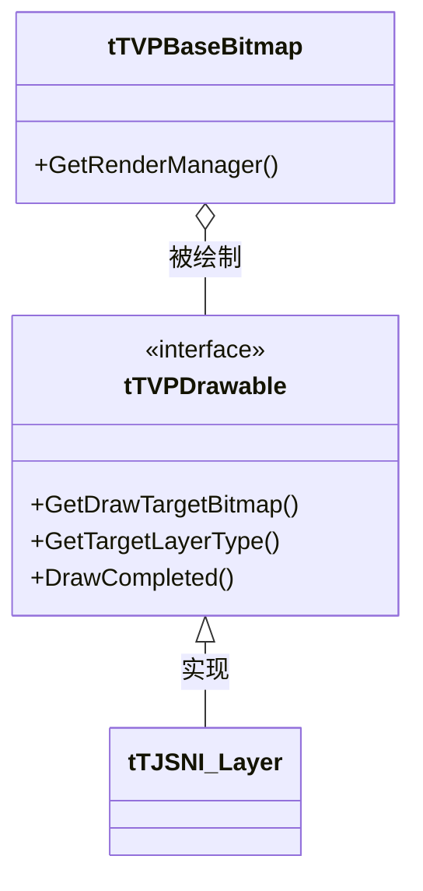
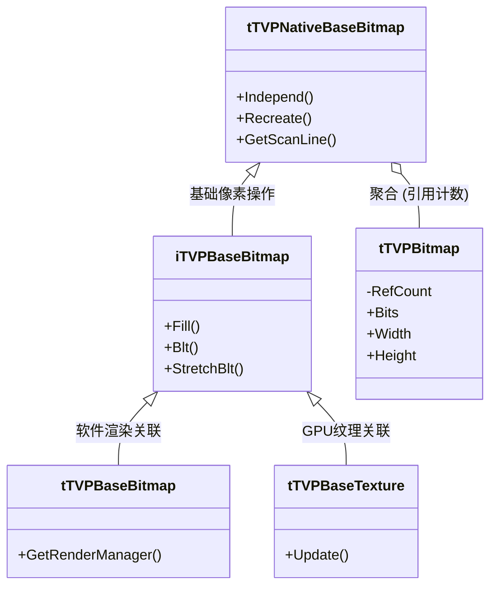

# 图层接口与继承体系

> **所属模块：** M04-渲染子系统
> **前置知识：** [M04-渲染子系统/01-visual模块总览/01-模块架构与文件组织.md](../../01-visual模块总览/01-模块架构与文件组织.md)
> **预计阅读时间：** 45 分钟

## 本节目标

读完本节后，你将能够：
1. 理解渲染子系统的核心接口 `tTVPDrawable` 及其生命周期。
2. 掌握 `tTVPLayerType` 枚举定义的各种混合模式及其用途。
3. 理清 `iTVPBaseBitmap` 到 `tTVPBitmap` 的复杂继承体系。
4. 掌握位图的写时复制（Copy-on-Write, COW）语义及其实际应用。
5. 理解绘图操作如何通过委派模式交给 `RenderManager` 执行。

## 1. 可绘制对象接口：tTVPDrawable

在 KrKr2 的渲染架构中，任何可以被绘制到屏幕上的对象（如图层、文字、视频覆盖层等）都必须实现 `tTVPDrawable` 接口。这是一个高度抽象的接口，它将具体的“绘制内容”与“绘制目标”解耦。

### 1.1 核心纯虚函数

`tTVPDrawable` 定义在 `krkr2/cpp/core/visual/drawable.h` 中，主要包含三个核心方法：

1.  **`GetDrawTargetBitmap`**: 询问该对象要在哪个位图上进行绘制。它接收一个请求区域 `rect`，并返回实际可用的 `cliprect`。
2.  **`GetTargetLayerType`**: 返回该对象的图层类型（混合模式），决定了它如何与背景合并。
3.  **`DrawCompleted`**: 这是一个回调通知，当绘制操作（由外部管理器触发）完成时被调用。它负责将绘制结果正式“提交”或同步。

### 1.2 继承关系与流程

所有的图层实现类最终都会继承自这个接口。通过这种方式，渲染引擎（如 `LayerManager`）可以统一处理各种不同类型的绘图请求。



### 1.3 代码示例：实现一个简单的 Drawable

下面的示例展示了如何实现一个自定义的 `tTVPDrawable`。虽然在项目中图层通常已经处理好了这些，但理解其内部运作对扩展引擎至关重要。

```cpp
#include "drawable.h"
#include "LayerBitmapIntf.h"

// 一个简单的自定义绘制对象，它只返回一个预定义的位图
class MySimpleDrawable : public tTVPDrawable {
    tTVPBaseTexture* targetBmp;
    tTVPLayerType layerType;

public:
    MySimpleDrawable(tTVPBaseTexture* bmp) : targetBmp(bmp), layerType(ltAlpha) {}

    // 获取绘图目标位图
    virtual tTVPBaseTexture *GetDrawTargetBitmap(const tTVPRect &rect, tTVPRect &cliprect) override {
        // 简单地返回整个位图作为裁剪区域
        cliprect = rect; 
        return targetBmp;
    }

    // 获取图层类型（混合模式）
    virtual tTVPLayerType GetTargetLayerType() override {
        return layerType;
    }

    // 当绘制完成时被调用
    virtual void DrawCompleted(const tTVPRect &destrect, tTVPBaseTexture *bmp,
                               const tTVPRect &cliprect, tTVPLayerType type,
                               tjs_int opacity) override {
        // 在这里可以进行一些清理工作或触发重绘通知
        // destrect: 目标区域
        // opacity: 不透明度 (0-255)
    }
};
```

---

## 2. 图层类型与混合模式

`tTVPLayerType` 枚举（定义在 `drawable.h`）定义了 KrKr2 支持的所有图层混合模式。这些模式不仅决定了颜色如何叠加，还涉及到 Alpha 通道的处理逻辑。

### 2.1 核心枚举值与用途

| 枚举值 | 值 | 说明 | 适用场景 |
| :--- | :--- | :--- | :--- |
| `ltBinder` | 0 | 绑定器 | 仅用于组织子图层，自身不占内存，不执行绘制。 |
| `ltOpaque` | 1 | 完全覆盖 | 背景不透明的底图或全屏背景，执行速度最快。 |
| `ltAlpha` | 2 | 标准 Alpha 混合 | 最常用的模式，支持 256 级透明度。 |
| `ltAdditive` | 3 | 加法混合 | 光效、爆炸、魔法阵等需要“发光”效果的场景。 |
| `ltSubtractive` | 4 | 减法混合 | 阴影、暗角或特殊的颜色抵消效果。 |
| `ltMultiplicative` | 5 | 乘法混合 | 正片叠底效果，常用于叠加纹理或阴影。 |
| `ltAddAlpha` | 12 | 预乘 Alpha | 现代渲染管线推荐模式，减少了混合时的边缘黑边。 |

### 2.2 Alpha 处理助手函数

在底层 C++ 代码中，我们经常需要判断一个图层是否需要开启混合。引擎提供了一些高效的内联函数：

-   **`TVPIsTypeUsingAlpha(type)`**: 判断该类型是否涉及标准 Alpha 混合。除了 `ltAlpha`，还包括大量的 `ltPs...`（Photoshop 兼容模式，如 `ltPsOverlay`, `ltPsScreen` 等）。
-   **`TVPIsTypeUsingAddAlpha(type)`**: 专门检查是否为 `ltAddAlpha`（预乘 Alpha）。
-   **`TVPIsTypeUsingAlphaChannel(type)`**: 只要涉及透明度处理（无论是标准还是预乘），均返回 true。

### 2.3 核心代码：混合模式辅助逻辑

```cpp
#include "drawable.h"

// 演示如何使用助手函数进行分支逻辑处理
void ProcessLayer(tTVPLayerType type) {
    if (TVPIsTypeUsingAlphaChannel(type)) {
        // 执行带 Alpha 混合的渲染路径
        // ...
    } else if (type == ltOpaque) {
        // 执行快速拷贝路径，忽略 Alpha
        // ...
    }
}
```

### 2.4 常见错误：混合模式设置不当

**错误表现 1**：带透明通道的 PNG 图片显示出来后，透明区域变成了黑色。
**原因**：图层的 `type` 被错误地设置为了 `ltOpaque` 或 `ltBinder`。
**解决方案**：确保 `layer->SetType(ltAlpha)` 被正确调用。

**错误表现 2**：在进行大规模图层叠加时，边缘出现细微的黑边。
**原因**：标准 Alpha 混合在插值计算时产生的精度损失（插值后 Alpha 与颜色不匹配）。
**解决方案**：考虑使用 `ltAddAlpha`（预乘 Alpha）模式，并配合对应的图片资源。

---

## 3. 位图类继承体系与生命周期管理

KrKr2 的位图系统采用了一种多层继承架构，将“原始像素存储”、“绘图操作接口”以及“纹理渲染后端”进行了有效的分离。理解这个体系是理解渲染子系统的关键。

### 3.1 类层次结构



1.  **`tTVPBitmap`**: 这是最底层的类，负责管理原始的像素内存缓冲区（`void *Bits`）。它实现了引用计数（`AddRef`/`Release`），以便支持高效的资源共享。
2.  **`tTVPNativeBaseBitmap`**: 基础包装类，持有一个 `tTVPBitmap` 的指针。它实现了“写时复制”（COW）的核心逻辑，并处理扫描线访问（`GetScanLine`）。
3.  **`iTVPBaseBitmap`**: 接口扩展类，定义了几乎所有的 2D 绘图操作，如 `Fill`, `Blt`, `StretchBlt`, `AffineBlt` 等。
4.  **`tTVPBaseBitmap` & `tTVPBaseTexture`**: 具体的实现类。前者通常用于临时的中间处理，后者则与渲染引擎后端（如 OpenGL 纹理）挂钩。

### 3.2 写时复制 (Copy-on-Write) 语义

为了优化性能，当一个位图对象被赋值给另一个对象时（`Assign`），它们会共享同一个底层像素缓冲区。只有当其中一个对象尝试修改像素时，才会触发真正的内存拷贝。

核心方法如下：
-   **`Independ()`**: 强制位图独立。如果缓冲区被共享，则创建一个副本。
-   **`IndependNoCopy()`**: 独立但丢弃旧数据。仅在重新分配大小前调用，避免不必要的拷贝。
-   **`IsIndependent()`**: 检查当前是否独占缓冲区。

### 3.3 代码示例：位图的 COW 机制验证

```cpp
#include "LayerBitmapIntf.h"
#include <iostream>

void VerifyCOW() {
    // 1. 创建原始位图 A (32x32)
    tTVPBaseBitmap* bmpA = new tTVPBaseBitmap(32, 32, 32);
    
    // 2. 将 A 赋值给 B，此时它们共享内存
    tTVPBaseBitmap* bmpB = new tTVPBaseBitmap(32, 32, 32);
    bmpB->AssignBitmap(*bmpA);
    
    // 检查独立性
    std::cout << "B is independent: " << (bmpB->IsIndependent() ? "Yes" : "No") << std::endl;
    // 输出: No (因为与 A 共享)

    // 3. 尝试修改 B 的像素，内部会自动触发 Independ()
    bmpB->SetPoint(0, 0, 0xFFFFFFFF);
    
    std::cout << "B is independent after write: " << (bmpB->IsIndependent() ? "Yes" : "No") << std::endl;
    // 输出: Yes (已经分离，互不干扰)

    delete bmpA;
    delete bmpB;
}
```

---

## 4. 核心绘图操作与委派模式

KrKr2 的绘图操作并不是在位图类内部直接完成的，而是通过**委派模式（Delegation Pattern）**交给了 `RenderManager`。这种设计使得引擎可以灵活地在软件渲染和硬件加速（OpenGL）之间切换。

### 4.1 核心绘图接口

`iTVPBaseBitmap` 提供了丰富的绘图函数：

-   **`Fill(rect, value)`**: 用单一值填充矩形。
-   **`CopyRect(x, y, ref, refrect)`**: 位图复制，通常用于不需要混合的场景。
-   **`Blt(x, y, ref, refrect, method, opa)`**: 位图传输（Bit Block Transfer），支持多种混合模式。
-   **`StretchBlt(...)`**: 带缩放的传输，支持 `stNearest`（最近邻）、`stLinear`（线性）等插值算法。
-   **`AffineBlt(...)`**: 仿射变换（旋转、斜切等），使用 `t2DAffineMatrix` 定义变换矩阵。

### 4.2 仿射变换矩阵 `t2DAffineMatrix`

```cpp
struct t2DAffineMatrix {
    double a;  // x 缩放/旋转系数
    double b;  // y 倾斜系数
    double c;  // x 倾斜系数
    double d;  // y 缩放/旋转系数
    double tx; // x 平移
    double ty; // y 平移
};
```
计算公式为：`x' = ax + cy + tx`, `y' = bx + dy + ty`。

### 4.3 渲染委派流程

当调用 `bmp->Fill()` 时，内部流程如下：
1. 位图调用自身虚函数 `GetRenderManager()`。
2. 调用 `RenderManager->OperateRect()`。
3. `RenderManager` 根据当前后端环境（如 OGL），调用底层的显卡指令或 SSE 优化的 C 函数。

### 4.4 代码示例：执行一次旋转绘图 (AffineBlt)

```cpp
#include "LayerBitmapIntf.h"
#include <cmath>

void DrawRotated(tTVPBaseBitmap* dest, tTVPBaseBitmap* src) {
    t2DAffineMatrix matrix;
    double angle = 45.0 * 3.14159 / 180.0; // 45度
    
    // 设置旋转矩阵
    matrix.a = cos(angle);
    matrix.b = sin(angle);
    matrix.c = -sin(angle);
    matrix.d = cos(angle);
    matrix.tx = 100; // 偏移到目标位置
    matrix.ty = 100;

    tTVPRect destRect(0, 0, dest->GetWidth(), dest->GetHeight());
    tTVPRect srcRect(0, 0, src->GetWidth(), src->GetHeight());

    // 调用仿射变换绘制
    dest->AffineBlt(
        destRect, src, srcRect, matrix, 
        bmAlpha, 255, // Alpha混合，不透明度255
        nullptr, true, // 不返回更新区域，保持Alpha
        stLinear // 使用线性插值
    );
}
```

---


## 5. TJS 脚本包装类：tTJSNI_Bitmap

在 TJS 脚本层，开发者使用的是 `Bitmap` 类。它的 native 实现是 `tTJSNI_Bitmap`（定义在 `BitmapIntf.h`）。这个类不仅桥接了 C++ 的位图操作，还处理了异步加载和保存逻辑。

### 5.1 主要职责

`tTJSNI_Bitmap` 作为 TJS `Bitmap` 对象的 native 实例，承担了繁重的接口转换工作：

-   **生命周期管理**: 它是 `tTJSNativeInstance` 的子类，负责管理 `tTVPBaseBitmap` 的创建和销毁。
-   **脚本接口桥接**: 暴露 `getPixel`, `setPixel`, `load`, `save` 等方法给 TJS 环境。
-   **异步加载**: 通过 `LoadAsync` 支持非阻塞的图片资源加载，这在处理大图或网络资源时非常有用。
-   **写时复制触发**: 几乎所有对脚本中 `Bitmap` 的修改操作都会通过 `Independ()` 确保数据安全。

### 5.2 常见错误：在主线程长时间操作位图

**错误表现**: 在 TJS 脚本中循环调用 `setPixel` 操作数万次，导致整个界面由于 UI 线程被阻塞而卡死。
**解决方案**: 尽量使用批量绘图函数（如 `Blt`, `Fill`）代替逐像素操作。如果必须进行大规模像素级处理，建议先在 C++ 插件层完成核心逻辑，或者在独立的 `Bitmap` 对象上离线操作后，再一次性绘制到显示层图层。

---

## 动手实践

在本实践中，我们将编写一段完整的 C++ 代码来演示如何创建一个位图，进行基本的填充和混合操作，并深入验证写时复制机制。

### 步骤 1：创建并填充位图

```cpp
#include "LayerBitmapIntf.h"
#include <iostream>

/**
 * 演示基本的位图操作：创建、填充、颜色混合
 */
void PracticeBitmapOperations() {
    // 1. 创建一个 100x100 的 32 位位图 (ARGB 格式)
    // 参数含义: 宽度, 高度, 位深 (32)
    tTVPBaseBitmap* myBmp = new tTVPBaseBitmap(100, 100, 32);

    // 2. 填充红色背景
    // 0xFFFF0000: ARGB 格式，即 Alpha=255, R=255, G=0, B=0
    tTVPRect fullRect(0, 0, 100, 100);
    myBmp->Fill(fullRect, 0xFFFF0000); // 使用 Fill 填充原始像素值

    // 3. 在中间填充一个 50x50 的半透明蓝色方块
    // 注意：FillColor 会处理 Alpha 混合逻辑，它会读取目标像素并与新颜色融合
    tTVPRect smallRect(25, 25, 75, 75);
    // 参数含义: 矩形区域, 颜色 (0x0000FF), 不透明度 (128)
    myBmp->FillColor(smallRect, 0x0000FF, 128); 

    std::cout << "Bitmap drawing completed successfully." << std::endl;
    delete myBmp; // 记得释放内存
}
```

### 步骤 2：深入验证写时复制 (COW) 机制

```cpp
/**
 * 验证两个位图对象如何共享和分离底层内存
 */
void PracticeCOWDemonstration() {
    // 创建两个 10x10 的位图
    tTVPBaseBitmap* src = new tTVPBaseBitmap(10, 10, 32);
    tTVPBaseBitmap* dst = new tTVPBaseBitmap(10, 10, 32);

    // 初始状态下，两个位图是独立的
    std::cout << "Initial: dst is independent? " << (dst->IsIndependent() ? "Yes" : "No") << std::endl;

    // 执行 AssignBitmap，这不会触发内存拷贝，而是增加引用计数
    dst->AssignBitmap(*src); 
    
    // 现在 dst 不再独立，它与 src 共享同一个 tTVPBitmap
    std::cout << "After Assign: dst is independent? " << (dst->IsIndependent() ? "Yes" : "No") << std::endl;

    // 进行一次写操作：修改 (1, 1) 处的像素
    // 引擎在执行修改前，会自动检测到 dst 不是独立的，从而触发内存拷贝
    dst->SetPoint(1, 1, 0xFFFFFFFF); 
    
    // 此时 dst 重新变得独立，拥有了自己的像素缓冲区副本
    std::cout << "After Write: dst is independent? " << (dst->IsIndependent() ? "Yes" : "No") << std::endl;

    delete src;
    delete dst;
}
```

---

## 对照项目源码

在 KrKr2 引擎内部，位图和图层的接口层设计得非常严密，通过对核心源码的阅读，可以更深刻地理解 these 概念的落地实现。

相关文件与关键路径：
- `cpp/core/visual/drawable.h`: 定义了 `tTVPDrawable` 接口（约第 79 行）和混合模式枚举。它是整个渲染链条的顶层协议。
- `cpp/core/visual/LayerBitmapIntf.h`: 这是 `iTVPBaseBitmap` 的主定义文件，包含了所有渲染委派相关的函数声明，如 `Blt`, `StretchBlt` (约第 193-203 行)。
- `cpp/core/visual/impl/LayerBitmapImpl.h`: 这里定义了 `tTVPBitmap` 结构，可以看到底层是如何管理 `void *Bits` 指针和处理引用计数 `RefCount` 的（约第 31-64 行）。
- `cpp/core/visual/BitmapIntf.h`: TJS 脚本桥接层，其中的 `tTJSNI_Bitmap` 实现了脚本中 `Bitmap.setPixel` 到底层 C++ `SetPoint` 的映射。

关键逻辑分析：
- **委派模式实现**: 注意 `iTVPBaseBitmap` 本身并没有实现具体的混合算法，它始终调用 `GetRenderManager()` 来获取当前的渲染器实例（可能是 `RenderManager_ogl`），并由后者完成实际的像素计算。
- **内存安全**: 底层 `tTVPBitmap` 在析构时会彻底清理分配的像素内存，防止内存泄漏。

---

## 本节小结

通过本节的学习，我们深入了解了 KrKr2 渲染子系统的根基：

1.  **tTVPDrawable** 是绘制协议的基石，确保了各种图形对象能以统一的方式被系统调度。
2.  **混合模式**（tTVPLayerType）为引擎提供了强大的表现力，涵盖了从简单的 Alpha 混合到复杂的 Photoshop 图层效果。
3.  **位图继承体系** 巧妙地分离了内存管理（tTVPBitmap）、安全机制（NativeBaseBitmap）与功能接口（iTVPBaseBitmap）。
4.  **写时复制 (COW)** 是渲染性能优化的秘密武器，极大地减少了不必要的内存拷贝开销。
5.  **渲染委派** 架构赋予了引擎极高的灵活性，使其能够平滑地在 CPU 和 GPU 渲染路径之间切换。

---

## 练习题与答案

### 题目 1：解释位图的引用计数与独立性

在 KrKr2 中，假设有三个 `tTVPBaseBitmap` 对象 A, B, C，它们依次通过 `AssignBitmap` 共享同一个底层 `tTVPBitmap`。
1. 此时该底层对象的 `RefCount` 是多少？
2. 如果我们对 B 进行 `SetPoint` 操作，A, B, C 的状态会发生什么变化？请详细说明 `RefCount` 的变动过程。

<details>
<summary>查看答案</summary>

1.  **RefCount**: 初始共享后，`RefCount` 为 3。
2.  **写操作变动过程**:
    -   当对 B 执行写操作时，引擎检测到 B 当前所指的 `tTVPBitmap` 的 `RefCount > 1`。
    -   引擎会为 B **创建一个新的像素缓冲区副本**，并将 B 的指针指向这个新副本，新副本的 `RefCount` 置为 1。
    -   原来的 `tTVPBitmap` 对象的 `RefCount` 会减 1（从 3 变为 2）。
    -   最终结果：B 变得独立（Independent），其 `RefCount=1`；A 和 C 依然共享原来的缓冲区，且原来的 `RefCount=2`。

</details>

### 题目 2：仿射变换参数计算

我们需要将一个正方形图片进行如下变换：
1. 顺时针旋转 90 度。
2. 在 X 轴方向拉伸 2 倍。
3. 向下（Y 轴正方向）平移 100 像素。

已知旋转 90 度的原始矩阵为 `a=0, b=1, c=-1, d=0`。请计算经过上述所有变换后， `t2DAffineMatrix` 的最终 6 个参数。

<details>
<summary>查看答案</summary>

首先处理旋转和缩放的复合（矩阵乘法或直接代入几何意义）：
1.  **旋转 90 度**: `a=0, b=1, c=-1, d=0`
2.  **X 轴拉伸 2 倍**: 作用于变换后的 X 坐标分量。在 KrKr2 的公式 `x' = ax + cy + tx` 中，`a` 和 `c` 需要乘以 2。
    -   `a' = 0 * 2 = 0`
    -   `c' = -1 * 2 = -2`
3.  **平移**: `tx = 0`, `ty = 100`

最终参数：
-   `a = 0`
-   `b = 1` (旋转产生的 y' 分量不受 x 轴拉伸影响)
-   `c = -2`
-   `d = 0`
-   `tx = 0`
-   `ty = 100`

**完整参数序列**: `{0.0, 1.0, -2.0, 0.0, 0.0, 100.0}`。

</details>

### 题目 3：图层混合模式选择

如果我们需要在游戏中实现一种“手电筒”照亮暗处的效果，使得照亮的区域颜色变亮且保持原始细节，你会优先选择哪种 `tTVPLayerType`？请说明理由。

<details>
<summary>查看答案</summary>

**推荐选择**: `ltDodge` (颜色减淡) 或 `ltAddAlpha` (预乘 Alpha)。

**理由**:
-   `ltDodge`：能有效提高背景亮度，且对较暗的背景有明显的提亮效果，非常适合模拟光照。
-   `ltAddAlpha`：如果光源图片本身带有亮度信息，通过加法混合可以产生自然的叠加发光效果。
-   不推荐 `ltAlpha`：标准混合只是简单的覆盖，无法产生“照亮”这种物理光效。

</details>

## 下一步

[M04-渲染子系统/02-图层系统/02-图层管理与图层树.md](../02-图层系统/02-图层管理与图层树.md)
我们将探讨如何将这些位图和可绘制对象组织成树状结构，并由 `LayerManager` 统一调度。
