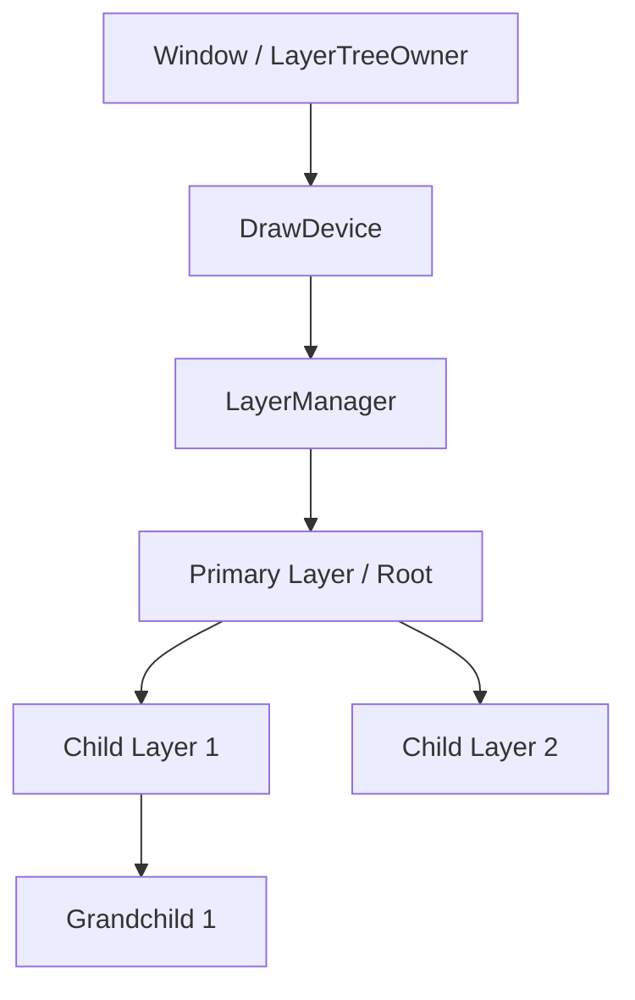

# 02-图层树与管理器

> **所属模块：** M04-渲染子系统
> **前置知识：** [01-模块架构与文件组织](../01-visual模块总览/01-模块架构与文件组织.md)
> **预计阅读时间：** 45 分钟

## 本节目标

读完本节后，你将能够：
1. 理解 KiriKiri2 图层系统的核心架构，包括 LayerTreeOwner、LayerManager 和 Layer 之间的层级关系。
2. 掌握 `iTVPLayerManager` 接口的作用，理解它如何作为图层树与渲染设备（DrawDevice）之间的桥梁。
3. 深入理解 `tTJSNI_BaseLayer` 如何通过父子关系构建图层树，并掌握图层排序（Z-Order）的实现机制。
4. 熟悉图层系统中的事件分发流程，理解鼠标、键盘和触摸输入如何从窗口路由到具体的图层。
5. 掌握局部重绘（Invalidation）的原理，了解图层管理器如何收集更新区域并驱动高效渲染。

## 1. 核心架构：所有权与层级关系

在 KiriKiri2 的渲染子系统中，图层（Layer）并不是孤立存在的。为了实现复杂的 UI 界面和游戏场景，图层被组织成一棵**图层树（Layer Tree）**。在这棵树的顶端，是负责管理这棵树及其与外部通信的**管理器（Manager）**和**所有者（Owner）**。

### 1.1 iTVPLayerTreeOwner：谁拥有这棵树？

`iTVPLayerTreeOwner`（定义于 `LayerTreeOwner.h`）是一个抽象接口，它定义了“拥有图层树的对象”所需具备的功能。通常情况下，一个 `Window` 类会实现这个接口，因为窗口是显示内容的最终载体。

该接口的主要职责包括：
*   **管理器注册**：通过 `RegisterLayerManager` 和 `UnregisterLayerManager` 管理生命周期。
*   **渲染反馈**：当渲染完成时，通过 `NotifyBitmapCompleted` 接收最终的位图数据。
*   **状态转发**：负责设置鼠标光标（`SetMouseCursor`）、处理提示信息（`SetHint`）以及 IME 输入法状态。

### 1.2 iTVPLayerManager：图层树的总管

`iTVPLayerManager`（定义于 `LayerManager.h`）是连接底层图层树与上层渲染/交互逻辑的枢纽。每一个 `LayerManager` 都会持有一个主图层（Primary Layer），作为整棵树的根节点。



`LayerManager` 的核心任务是：
1.  **持有图层树**：管理根图层的挂载（`AttachPrimary`）与卸载。
2.  **事件路由**：将来自窗口的各种输入事件（鼠标移动、点击、按键等）分发给正确的图层。
3.  **更新协调**：当某个图层内容改变时，收集脏矩形（Dirty Rect），并在合适的时机通知渲染设备进行更新。
4.  **焦点管理**：追踪当前拥有焦点的图层（`FocusedLayer`），处理 Tab 键切换等逻辑。

### 1.3 常见错误及解决方案：所有权混乱

**问题描述**：在脚本中创建了一个 Layer，但无法在屏幕上看到它，或者它无法接收任何事件。
**解决方案**：
1.  检查该图层是否已设置 `parent`。一个孤立的图层不在任何 `LayerManager` 的树中。
2.  检查其祖先节点中最顶层的节点是否已通过 `AttachPrimary` 关联到了 `LayerManager`。
3.  确保 `LayerManager` 已注册到窗口。

---

## 2. tTJSNI_BaseLayer：图层树的实现

`tTJSNI_BaseLayer` 是所有图层的基类（定义于 `LayerIntf.h`）。它不仅包含了图像数据，还包含了维护树形结构所需的各种指针和状态。

### 2.1 父子关系与生命周期

图层树是通过简单的指针关联建立的：
*   **Parent 指针**：指向当前图层的直接父节点。如果该值为 `nullptr` 且该图层不是主图层（Primary Layer），则说明该图层目前游离于渲染树之外，不会被渲染。
*   **Children 容器**：使用 `tObjectList<tTJSNI_BaseLayer>` 存储所有子图层。这是一个经过优化的对象列表，支持高效的插入和删除操作。

当设置一个图层的父节点时，内部会调用 `Join` 和 `Part` 方法，确保父子关系的双向一致性。这种双向维护机制避免了内存泄漏和悬挂指针：

```cpp
// 示例 1：图层父子关系的建立过程 (伪代码实现思路)
// 摘自 LayerIntf.cpp 的逻辑概括
void tTJSNI_BaseLayer::Join(tTJSNI_BaseLayer *parent) {
    if (Parent) Part(); // 如果已有父节点，先脱离旧的树
    
    Parent = parent;
    if (Parent) {
        // 通知父节点将自己添加进其子节点列表
        Parent->AddChild(this); 
        
        // 关键：继承父节点的管理器
        // 这使得子图层能够自动接入窗口的渲染和事件循环
        this->Manager = Parent->GetManager(); 
        
        // 触发一次全量更新，因为新加入的图层需要重新绘制
        this->Update();
    }
}
```

### 2.2 排序机制 (Z-Order) 与 AbsoluteOrderMode

图层的显示顺序（即谁遮挡谁）由其在树中的位置决定。KiriKiri2 提供了两种排序模式：

1.  **相对排序 (Default)**：根据 `OrderIndex` 决定。在同一个父节点下，索引越大，图层越靠前（最后绘制）。
2.  **绝对排序 (AbsoluteOrderMode)**：这是一个非常有用的特性。当开启此模式时，图层会忽略父节点的限制，根据全局的 `AbsoluteOrderIndex` 进行排列。这常用于将某些 UI 组件（如对话框）强制显示在所有普通图层之上。

```cpp
// 示例 2：动态调整 Z 序的完整代码
void tTJSNI_BaseLayer::BringToFront() {
    if (Parent) {
        // 将自己在父节点的子节点列表中移到最后（即最前端）
        // ChildChangeOrder 会处理内部索引的移动并更新 Parent->ChildrenOrderIndexValid
        Parent->ChildChangeOrder(GetOrderIndex(), Parent->GetCount() - 1);
        
        // 标记管理器需要重新计算全局 Z 序 (OverallOrderIndex)
        // 下一次渲染前，管理器会递归遍历树来重新分配绘制顺序
        if (Manager) Manager->InvalidateOverallIndex();
        
        // 触发重绘以应用新的叠放顺序
        Update();
    }
}
```

### 2.3 几何属性：Rect 与坐标转换

每个图层都有自己的 `Rect` 属性，它描述了图层相对于父图层左上角的范围。
*   **ToPrimaryCoordinates**：由于渲染和输入事件通常基于主图层（根节点），因此需要经常进行坐标转换。该方法会递归向上累加所有父图层的 `Left` 和 `Top` 偏移。
*   **可见性判断**：一个图层是否真正可见（`IsSeen()`），取决于其自身的 `Visible` 属性、`Opacity`（不透明度）以及其所有祖先节点的可见性。

---

## 3. 事件分发与输入路由

当用户操作窗口（如移动鼠标或按下键盘）时，`Window` 会将事件传递给 `LayerManager`，再由其路由到具体的图层。

### 3.1 命中测试 (Hit Test) 的深度递归

`LayerManager` 的 `NotifyMouseMove` 或 `NotifyMouseDown` 会调用 `GetMostFrontChildAt`。这个过程就像在树中寻找“最显眼”的那个点：

1.  **从根开始**：从 `Primary Layer` 开始向下遍历。
2.  **逆序遍历**：为了优先找到最前方的图层，它会按照 Z 序从大到小（从顶层到底层）检查子图层。
3.  **多重检查**：
    -   坐标包含：点是否在图层的 `Rect` 内？
    -   状态有效：图层是否 `Visible` 且 `Enabled`？
    -   **Alpha 测试**：如果图层设置了 `htMask` 命中类型，它会读取该像素点的 Alpha 值。如果 Alpha 为 0（透明），则“穿透”该图层，继续寻找下方的图层。

```cpp
// 示例 3：复杂的命中测试逻辑 (简化版)
bool tTJSNI_BaseLayer::HitTest(tjs_int x, tjs_int y) {
    // 1. 矩形检查
    if (!Rect.contains(x, y)) return false;
    
    // 2. 类型检查
    if (HitType == htMask) {
        // 获取像素值并检查 Alpha 通道
        tjs_uint32 pixel = GetMainPixel(x - Rect.left, y - Rect.top);
        tjs_int alpha = (pixel >> 24) & 0xFF;
        return alpha >= HitThreshold; // 只有超过阈值才算命中
    }
    
    return true; // 默认命中
}
```

### 3.2 焦点管理 (Focus Management)

焦点决定了谁能接收 `onKeyDown` 等键盘事件。
*   **焦点链 (Focus Chain)**：图层可以通过 `JoinFocusChain` 属性加入自动切换序列。
*   **模态层 (Modal Layer)**：当一个图层（如弹出菜单）调用 `SetMode()` 时，`LayerManager` 会将其推入模态栈。此时，只有栈顶图层及其子图层能接收事件，其他部分会被逻辑锁定。

---

## 4. 高效渲染：Invalidation (失效) 机制

KiriKiri2 的渲染核心原则是：**只绘制改变了的部分**。

### 4.1 失效区域的产生

任何导致画面变化的动作（修改像素、移动位置、改变透明度）都必须调用 `Update()`。这个动作并不会立即重绘，而是将对应的矩形标记为“脏（Dirty）”。

```cpp
// 示例 4：属性变化驱动的失效机制
void tTJSNI_BaseLayer::SetOpacity(tjs_int opa) {
    if (Opacity != opa) {
        Opacity = opa;
        // 整个图层区域都需要重新与下方背景混合
        Update(); 
    }
}
```

### 4.2 收集与合成 (UpdateRegion)

1.  `LayerManager` 维护一个 `UpdateRegion`，它是多个矩形的组合。
2.  各图层产生的脏矩形会被通过坐标转换汇总到 `LayerManager` 的 `UpdateRegion` 中。
3.  `LayerManager::UpdateToDrawDevice()` 被触发。
4.  它会调用渲染设备的 `StartBitmapCompletion()`，然后遍历所有与失效区域有交集的图层。
5.  每个图层仅绘制其受影响的部分到合成缓冲区，最后统一交给窗口显示。

### 4.3 常见错误：更新死循环

**错误表现**：CPU 占用率极高，画面不断刷新。
**常见原因**：在 `onPaint` 事件（每当图层重绘时触发）中又调用了 `Update()`。这会导致刚绘完又变脏，陷入无限循环。
**解决方案**：永远不要在 `onPaint` 或类似的绘制回调中修改会导致图层失效的属性。

---


## 3. 事件分发与焦点管理

当用户在窗口上点击时，事件是如何找到正确图层的？

### 3.1 命中测试 (Hit Test)

`LayerManager` 接收到 `NotifyMouseDown` 后，会启动一个深度优先（从前向后）的搜索过程，调用 `GetMostFrontChildAt`：

1.  检查图层是否可见（`Visible`）且启用（`Enabled`）。
2.  检查点击坐标是否在图层矩形内。
3.  调用 `HitTest`：根据 Alpha 通道或特定的遮罩图层（Province）判断该点是否真正“实心”。

```cpp
// 示例 3：LayerManager 寻找最前方被点击图层的逻辑
tTJSNI_BaseLayer *tTVPLayerManager::GetMostFrontChildAt(tjs_int x, tjs_int y, ...) {
    // 从根图层开始递归搜索
    if (Primary) {
        // 内部会根据全局 Z 序从大到小（从顶层到底层）遍历所有图层
        // 找到第一个满足 Rect 包含且 HitTest 成功的图层
    }
    return nullptr;
}
```

### 3.2 焦点机制

焦点（Focus）决定了键盘事件的去向。
*   `SetFocusedLayer`：使特定图层获得焦点。
*   `FocusNext/FocusPrev`：处理 Tab 键切换。
*   **模态层 (Modal Layer)**：通过 `SetMode` 设置。当存在模态层时，所有非该层（及其子层）的图层将无法接收输入。

---

## 4. 渲染驱动流：脏矩形与更新

KiriKiri2 不会每一帧都重绘整个屏幕，而是使用**失效区域（Invalidation Region）**机制。

### 4.1 标记失效

当图层内容（例如修改了像素）或属性（例如移动了位置）改变时，它会调用 `Update`：

```cpp
// 示例 4：图层位置改变时的更新逻辑
void tTJSNI_BaseLayer::SetPosition(tjs_int left, tjs_int top) {
    if (Rect.left != left || Rect.top != top) {
        // 1. 标记旧位置失效
        Update(); 
        Rect.left = left;
        Rect.top = top;
        // 2. 标记新位置失效
        Update(); 
    }
}
```

### 4.2 收集与合成

`LayerManager` 会维护一个 `UpdateRegion`（通常是 `tTVPComplexRect`，即一组不相交矩形的集合）。
1.  各图层调用 `Update`，脏矩形被汇总到 `LayerManager`。
2.  在下一帧渲染前，`LayerManager` 调用 `UpdateToDrawDevice`。
3.  渲染器遍历图层树，只绘制那些与 `UpdateRegion` 有重叠的部分。

### 4.3 常见错误：全屏闪烁或重绘过度

**原因**：
*   在循环中频繁调用 `Update()`，导致 `UpdateRegion` 变得极其复杂，增加了矩形求并集的开销。
*   使用了不支持局部更新的自定义渲染逻辑。
**解决方案**：
*   尽量合并逻辑更新，让 `LayerManager` 在每一帧结束时自动处理。
*   检查是否误设了极大的图层边界。

---

## 5. 动手实践：构建一个动态图层树

在这个练习中，我们将模拟在 C++ 中创建一个简单的图层管理器和两层图层结构，并手动触发一次位置改变。

```cpp
// 示例 5：模拟图层树的创建与更新触发
#include <iostream>
#include "LayerManager.h"
#include "LayerIntf.h"

// 模拟一个简单的 LayerTreeOwner
class MyWindow : public iTVPLayerTreeOwner {
public:
    void RegisterLayerManager(iTVPLayerManager *m) override {}
    void UnregisterLayerManager(iTVPLayerManager *m) override {}
    void NotifyBitmapCompleted(iTVPLayerManager *m, tjs_int x, tjs_int y, 
                              tTVPBaseTexture *bmp, const tTVPRect &clip, 
                              tTVPLayerType type, tjs_int opa) override {
        std::cout << "收到渲染结果，区域: [" << clip.left << ", " << clip.top 
                  << ", " << clip.right << ", " << clip.bottom << "]" << std::endl;
    }
    // ... 其他接口省略实现 ...
    iTJSDispatch2 *GetOwnerNoAddRef() const override { return nullptr; }
};

void TestLayerTree() {
    MyWindow win;
    // 1. 创建管理器
    tTVPLayerManager *mgr = new tTVPLayerManager(&win);

    // 2. 创建主图层 (根节点)
    tTJSNI_BaseLayer *root = new tTJSNI_BaseLayer();
    root->SetSize(800, 600);
    mgr->AttachPrimary(root);

    // 3. 创建子图层
    tTJSNI_BaseLayer *child = new tTJSNI_BaseLayer();
    child->SetParent(root);
    child->SetPosition(100, 100);
    child->SetSize(200, 200);

    // 4. 模拟移动子图层
    std::cout << "移动图层..." << std::endl;
    child->SetPosition(150, 150); // 这会自动触发 mgr->RequestInvalidation

    // 5. 驱动管理器完成更新
    mgr->UpdateToDrawDevice();

    // 清理 (实际项目中由智能指针或 TJS2 GC 管理)
    mgr->DetachPrimary();
    delete child;
    delete root;
    mgr->Release();
}
```

---

## 对照项目源码

为了深入理解本节内容，请参考以下核心源码：

相关文件：
- `krkr2/cpp/core/visual/LayerManager.h` 第 263-564 行 — `tTVPLayerManager` 的具体实现，包括输入事件处理函数（如 `PrimaryMouseDown`）。
- `krkr2/cpp/core/visual/LayerIntf.h` 第 207-335 行 — `tTJSNI_BaseLayer` 的树形结构管理成员（`Parent`, `Children`）及其排序方法。
- `krkr2/cpp/core/visual/LayerIntf.cpp` (需自行查阅) — `Update` 方法的实现，展示了脏矩形如何向上传递给 `LayerManager`。

## 本节小结

- **LayerTreeOwner** 是顶层宿主（如窗口），**LayerManager** 是管理图层树的中坚力量。
- **图层树** 通过 `Parent` 指针和 `Children` 列表构建。
- **Z-Order** 决定绘制顺序，可以通过 `OrderIndex` 或 `AbsoluteOrderMode` 控制。
- **事件分发** 遵循“从上往下、从前到后”的命中测试原则。
- **局部重绘** 通过失效（Invalidation）区域机制实现，极大提高了渲染效率。

## 练习题与答案

### 题目 1：什么是命中测试（Hit Test）？在图层树中它是如何进行的？

<details>
<summary>查看答案</summary>

命中测试是指判断一个坐标点（如鼠标点击位置）是否属于某个图层的过程。在 KiriKiri2 的图层树中：
1. `LayerManager` 收到原始坐标，首先在主图层（Primary Layer）范围内进行。
2. 按照全局 Z 序**从前向后**（从最顶层到底层）遍历所有图层。
3. 对每个图层，首先检查其坐标是否包含该点。
4. 如果包含，再根据图层的 `HitType` 进行细致判断：
   - 如果是 `htMask`，检查该位置的 Alpha 值是否超过阈值（`HitThreshold`）。
   - 如果是 `htProvince`，检查该位置在遮罩图层（Province Image）中的索引是否有效。
5. 第一个通过测试的可见图层即为“命中”目标。

</details>

### 题目 2：假设一个图层树结构为 Root -> A -> B（B 是 A 的子层），当 A 移动位置时，B 的显示位置会发生变化吗？为什么？

<details>
<summary>查看答案</summary>

是的，B 的显示位置会随之变化。
**原因：**
1. 在图层系统中，子图层的坐标（`left`, `top`）是相对于其**父图层**左上角的。
2. 当 A 移动时，它的本地坐标系发生了相对于 Root 的偏移。
3. 在最终渲染时，B 的绝对屏幕位置是通过递归叠加父节点坐标计算出来的（即 `ToPrimaryCoordinates` 逻辑）。
4. 此外，A 移动会触发自身及其所有子区域的失效重绘。

</details>

## 下一步

掌握了图层树的组织和管理后，我们将进入核心的图像处理环节：[03-位图操作与混合模式](../02-图层系统/03-位图操作与混合模式.md)，学习如何高效地在这些图层上进行绘图和特效合成。
