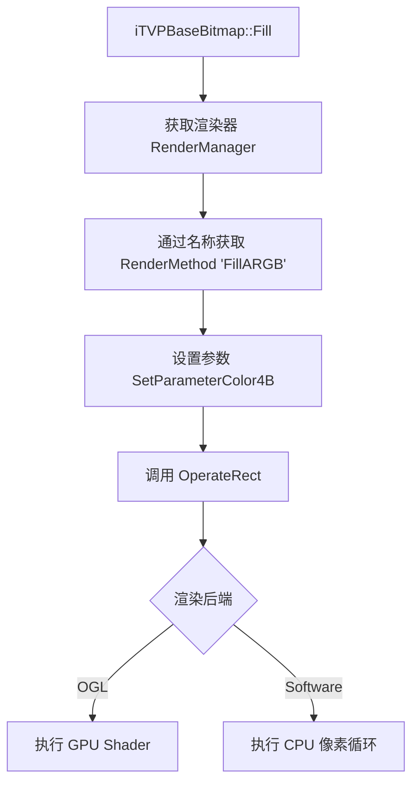

# 位图操作与绘制

> **所属模块：** M04-渲染子系统
> **前置知识：** [01-visual模块总览](../01-visual模块总览/01-模块架构与文件组织.md), [02-图层树与图层管理器](./01-图层树与图层管理器.md)
> **预计阅读时间：** 45 分钟

## 本节目标

读完本节后，你将能够：
1. 理解位图操作的核心 API 及其底层渲染委托机制（RenderManager Delegation）。
2. 掌握 `tTVPBBBltMethod` 枚举中各种混合模式（Blend Method）的含义与应用。
3. 深入理解文字渲染流水线（Font/Text Pipeline）及字形缓存（Glyph Cache）机制。
4. 识别并应用写时拷贝（Copy-on-Write）与快速路径（Quick Path）等性能优化技巧。

---

## 一、位图操作核心 API

在 KiriKiri2 引擎中，位图操作不再是简单的像素遍历，而是通过一套高度抽象的 API 接口实现的。这些操作最终会根据当前渲染器的类型（软件渲染或 OpenGL 硬件加速）委托给 `RenderManager` 处理。

### 1.1 基础填充与复制

位图最基本的操作包括填充颜色和区域复制。

*   **Fill**: 使用指定的 ARGB 值或颜色索引填充矩形区域。
*   **FillColor**: 填充颜色但保留目标 Alpha 通道。
*   **CopyRect**: 纯净的像素矩形复制，不涉及混合。

```cpp
// 示例：基础填充与复制操作
// 文件位置：krkr2/cpp/core/visual/LayerBitmapIntf.cpp
void ExampleBitmapOps(iTVPBaseBitmap* bmp, iTVPBaseBitmap* srcBmp) {
    tTVPRect rect(0, 0, 100, 100);
    
    // 1. 全色填充：0xFFFF0000 (红色)
    // 底层会调用 GetRenderMethod("FillARGB") 并通过 OperateRect 执行
    bmp->Fill(rect, 0xFFFF0000); 

    // 2. 颜色填充：保留目标 Alpha 值
    // 适用于修改图层颜色而不破坏透明度
    bmp->FillColor(rect, 0x0000FF, 128); // 填充蓝色，不透明度 128

    // 3. 矩形复制
    // 如果是全图复制且格式相同，会触发快速路径：AssignTexture
    tTVPRect srcRect(0, 0, 50, 50);
    bmp->CopyRect(10, 10, srcBmp, srcRect); 
}
```

### 1.2 高级位块传输 (Blt)

`Blt` (Bit Block Transfer) 是渲染子系统最常用的接口，它支持丰富的混合模式。

```cpp
// Blt 定义
bool Blt(tjs_int x, tjs_int y, const iTVPBaseBitmap *ref, tTVPRect refrect,
         tTVPBBBltMethod method, tjs_int opa, bool hda = true);
```

*   **method**: 混合模式（见下文）。
*   **opa**: 整体不透明度 (0-255)。
*   **hda (Hold Destination Alpha)**: 是否保持目标 Alpha 通道不变。如果为 `true`，渲染器会使用更复杂的着色器或算法确保目标透明度不被污染。

### 1.3 变换与滤镜 API

除了基础绘制，位图系统还支持仿射变换和图像处理滤镜：

*   **StretchBlt**: 拉伸缩写。支持多种插值算法：`stNearest` (近邻), `stLinear` (线性), `stCubic` (三次插值), `stLanczos3` 等。
*   **AffineBlt**: 仿射变换。支持旋转、缩放、切变。
*   **DoBoxBlur**: 均值模糊（Box Blur）。通过快速的行列分离算法实现。
*   **AdjustGamma**: 伽马校正。用于调整图像亮度和对比度。
*   **UDFlip / LRFlip**: 上下/左右翻转。

---

## 二、混合模式 (tTVPBBBltMethod)

KiriKiri2 提供了超过 30 种混合模式，涵盖了从基础 Alpha 合成到 Photoshop 级别的艺术效果。

### 2.1 常用混合模式分类

| 模式 | 描述 | 应用场景 |
| :--- | :--- | :--- |
| `bmCopy` | 直接覆盖 | 快速背景切换 |
| `bmAlpha` | 标准 Alpha 合成 | 普通立绘绘制 |
| `bmAdd` | 线性减淡 (Add) | 发光、高光效果 |
| `bmMul` | 正片叠底 (Multiply) | 阴影、着色 |
| `bmScreen` | 滤色 (Screen) | 柔和的光效 |
| `bmAddAlpha` | 预乘 Alpha 合成 | 现代 3D 风格素材 |

### 2.2 Photoshop 兼容模式

引擎为了支持高级美术素材，内置了大量 `bmPs*` 前缀的混合模式：
*   **bmPsOverlay**: 叠加。
*   **bmPsHardLight / bmPsSoftLight**: 强光 / 柔光。
*   **bmPsColorDodge / bmPsColorBurn**: 颜色减淡 / 颜色加深。
*   **bmPsDifference / bmPsExclusion**: 差值 / 排除。

---

## 三、渲染委托机制 (RenderManager Delegation)

位图对象的绘制方法（如 `Fill`, `Blt`, `CopyRect`）并不直接操作像素内存，而是充当 **“任务发起者”**。

### 3.1 委托流程示意图



### 3.2 核心数据结构

*   **iTVPRenderMethod**: 渲染方法对象。它定义了具体的操作逻辑（如 Shader 或 CPU 函数），并管理参数（Opacity, Color, Matrix 等）。
*   **GetTextureForRender()**: 获取目标纹理。在写入前，系统会检查是否需要调用 `Independ()` 执行写时拷贝。
*   **tRenderTexRectArray**: 源纹理矩形数组。允许一次性传递多个源区域给渲染器进行处理（例如文字渲染中的字形组合）。

```cpp
// 源码剖析：Fill 的委托实现
// 文件位置：krkr2/cpp/core/visual/LayerBitmapIntf.cpp 第 274 行
bool tTVPBaseBitmap::Fill(tTVPRect rect, tjs_uint32 value) {
    BOUND_CHECK(false); // 边界检查宏

    // 1. 获取渲染方法
    static iTVPRenderMethod *method = GetRenderManager()->GetRenderMethod("FillARGB");
    
    // 2. 设置颜色参数
    static int paramid = method->EnumParameterID("color");
    method->SetParameterColor4B(paramid, value);

    // 3. 准备目标纹理（可能触发 COW）
    iTVPTexture2D *reftex = GetTexture();
    
    // 4. 委托执行
    GetRenderManager()->OperateRect(
        method, 
        GetTextureForRender(method->IsBlendTarget(), &rect), 
        reftex,
        rect, 
        tRenderTexRectArray() // Fill 没有源纹理
    );
    return true;
}
```

### 3.3 纹理更新与局部操作

位图系统支持局部更新。当你使用 `Update` 方法时，底层渲染器会只上传改变的区域，而不是重新上传整个位图。这对于高性能的 UI 动画至关重要。

```cpp
// 局部更新示例
void PartialTextureUpdate(tTVPBaseTexture* tex, const void* pixels, tjs_int x, tjs_int y, tjs_int w, tjs_int h) {
    // 这里的 Update 会直接调用底层 OGL 接口的 glTexSubImage2D
    // 避免了昂贵的全局显存分配和完整拷贝
    tex->Update(pixels, tex->GetPitchBytes(), x, y, w, h);
}
```

---

## 四、文字渲染管线 (Font/Text Pipeline)

文字渲染是渲染子系统中最复杂的模块之一，它结合了矢量光栅化和高效的缓存机制。

### 4.1 渲染流程

1.  **TVPGetCharacter**: 根据字体属性（Face, Height, Angle）和字符代码查找缓存。
2.  **Glyph Cache (TVPFontCache)**: 如果未命中，调用 `FontRasterizer`（通常是 FreeType）生成字形位图。
3.  **上传纹理**: 将字形位图（通常是 8-bit Alpha Mask）上传到临时纹理 `_CharacterTexture`。
4.  **OperateRect**: 调用渲染方法 `ApplyColorMap`，将 Alpha Mask 与指定的文字颜色混合，绘制到目标位图。

### 4.2 字形缓存与管理

引擎维护了一个全局的 `TVPFontCache`，默认容量为 1300 个字符。

*   **_CharacterTexture**: 用于存放 8-bit 灰度字形的静态纹理。
*   **_CharacterTextureRGBA**: 用于存放已经预处理为预乘 Alpha 格式的字形（用于快速 GPU 路径）。

### 4.3 仿射变换支持

文字渲染还支持旋转（Escaped Text）。通过计算 `RadianAngle`，系统可以根据字体的 Angle 属性自动调整字形的 OriginX/Y，并生成旋转后的渲染矩形。

```cpp
// 仿射文字渲染逻辑 (LayerBitmapImpl.cpp)
tjs_int ascent = GetCurrentRasterizer()->GetAscentHeight();
RadianAngle = Font.Angle * (M_PI / 1800);
double angle90 = RadianAngle + M_PI_2;
AscentOfsX = static_cast<tjs_int>(-cos(angle90) * ascent);
AscentOfsY = static_cast<tjs_int>(sin(angle90) * ascent);
```


```cpp
// 源码分析：文字渲染中的 OperatRect 调用
// 文件位置：krkr2/cpp/core/visual/impl/LayerBitmapImpl.cpp 第 901 行
tRenderTexRectArray::Element src_tex[] = { 
    tRenderTexRectArray::Element(pTexSrc, tTVPRect(0, 0, w, h)) 
};
TVPGetRenderManager()->OperateRect(
    method, 
    GetTextureForRender(method->IsBlendTarget(), &drect), 
    nullptr,
    drect, 
    tRenderTexRectArray(src_tex)
);
```

---

## 五、性能优化技巧

### 5.1 写时拷贝 (Copy-on-Write)

当一个位图对象被多个图层共享（如通过 `Assign` 引用）时，底层的纹理数据是共享的。
只有在发起 **修改操作**（如 `Fill`, `SetPoint`, `GetScanLineForWrite`）时，才会调用 `Independ()`：

```cpp
void tTVPNativeBaseBitmap::Independ() {
    if(Bitmap->IsIndependent() && !Bitmap->IsStatic()) return;
    
    // 引用计数大于1或为静态纹理时，创建新的拷贝
    iTVPTexture2D *newb = GetRenderManager()->CreateTexture2D(
        Bitmap->GetWidth(), Bitmap->GetHeight(), Bitmap);
    Bitmap->Release();
    Bitmap = newb;
}
```

### 5.2 快速路径 (Quick Path)

系统会对特定操作执行“短路”优化：

*   **AssignTexture**: 在执行 `CopyRect` 时，如果源矩形是整个图像，且目标矩形也是整个图像，且格式一致，系统会直接增加纹理引用计数而不进行像素复制。
*   **Skip Rendering**: 如果 `opa == 0`（完全透明），`Blt` 操作会立即返回，节省渲染开销。
*   **Fast GPU Route**: 在 OpenGL 模式下，系统会优先尝试将字形转换为预乘 Alpha 纹理，利用单次 Draw Call 完成渲染，避开复杂的混合流水线。

---
(内容待续，下一部分将涵盖动手实践、对照项目源码、常见错误、小结及练习题)

---

## 六、动手实践

在本节实践中，我们将模拟一个简单的水印绘制过程，展示如何利用 `Blt` 接口和不透明度控制。

### 6.1 准备背景与水印
假设我们有两个位图对象，一个背景图 `bg`，一个水印图 `watermark`。

```cpp
// 完整的位图混合示例
#include "LayerBitmapIntf.h"
#include "RenderManager.h"

void DrawWatermark(iTVPBaseBitmap* bg, iTVPBaseBitmap* logo) {
    // 1. 定义水印绘制区域（放置在背景右下角，留 10 像素边距）
    tjs_int margin = 10;
    tjs_int x = bg->GetWidth() - logo->GetWidth() - margin;
    tjs_int y = bg->GetHeight() - logo->GetHeight() - margin;

    tTVPRect srcRect(0, 0, logo->GetWidth(), logo->GetHeight());

    // 2. 使用 bmAlpha 模式以 50% 的不透明度绘制水印
    // bmAlpha 会根据水印自身的 Alpha 通道进行合成
    bg->Blt(x, y, logo, srcRect, bmAlpha, 128); 
    
    // 3. 常见错误处理：如果绘制超出边界，Blt 内部会自动裁剪
    // 但建议手动检查以优化性能
    if (x < 0 || y < 0) {
        // 记录日志或跳过
    }
}
```

### 6.2 实现动态文字渐变
利用 `FillColor` 和 `Blt` 的组合可以实现复杂的 UI 效果。

```cpp
// 在位图上绘制带阴影的渐变色文字
void DrawShadowedText(iTVPNativeBaseBitmap* bmp, const ttstr& text) {
    tjs_int x = 50, y = 50;
    tjs_uint32 textColor = 0xFFFFFF; // 白色
    tjs_uint32 shadowColor = 0x000000; // 黑色
    
    tTVPRect clipRect(0, 0, bmp->GetWidth(), bmp->GetHeight());

    // 调用 DrawTextMultiple 执行绘制
    // 这里使用了 bmAlpha 模式，阴影强度设为 255 (完全不透明)
    bmp->DrawTextMultiple(
        clipRect, 
        x, y, 
        text, 
        textColor, 
        bmAlpha, 255, 
        true, // holdalpha
        true, // aa (开启抗锯齿)
        255,  // shadow level
        shadowColor, 
        2,    // shadow width (模糊半径)
        2, 2  // shadow offset (阴影偏移)
    );
}
```

---

## 七、常见错误及解决方案

### 7.1 写时拷贝失效
**问题描述**：修改一个图层后，发现另一个引用它的图层也跟着变了。
**解决方案**：确保在直接操作像素（如 `GetScanLineForWrite`）前手动调用了 `Independ()`。如果是通过 `Fill` 等高级 API 操作，检查 `GetTextureForRender` 内部逻辑是否被意外跳过。

### 7.2 混合模式效果异常
**问题描述**：使用 `bmAdd` 时，边缘出现明显的黑色或白色边缘。
**解决方案**：检查素材是否为 **“预乘 Alpha” (Premultiplied Alpha)**。如果是，需要使用 `bmAddAlpha` 或在加载时进行转换。KiriKiri2 默认更倾向于非预乘 Alpha，但硬件加速模式下转换预乘 Alpha 能提供更好的性能。

### 7.3 文字渲染性能低下
**问题描述**：实时刷新大量文字时出现掉帧。
**解决方案**：
1.  **复用 Bitmap**：不要在每一帧重新创建文字 Bitmap。
2.  **检查缓存命中率**：如果文字频繁变化，可能导致 `TVPFontCache` 频繁淘汰。考虑增加缓存容量。
3.  **使用层混合**：尽量利用图层树的合成能力，而不是在一个位图上反复擦除重绘。

---

## 八、对照项目源码

在 `krkr2core` 项目中，位图绘制逻辑分布在以下关键位置：

*   **`krkr2/cpp/core/visual/LayerBitmapIntf.cpp`**:
    *   `Blt()` (1401行): 混合绘制的入口，包含了复杂的参数预处理和边界裁剪逻辑。
    *   `GetRenderMethod(opa, hda, method)` (未在片段展示，由 RenderManager 提供): 根据不透明度和混合模式选择对应的 Shader。
*   **`krkr2/cpp/core/visual/impl/LayerBitmapImpl.cpp`**:
    *   `TVPGetCharacter()` (244行): 实现了字形缓存查找和 FreeType 光栅化的衔接。
    *   `InternalBlendText()` (774行): 负责将字形 Alpha 蒙版通过 `ApplyColorMap` 渲染方法绘制到纹理上。

相关文件路径：
- `krkr2/cpp/core/visual/LayerBitmapIntf.h`
- `krkr2/cpp/core/visual/LayerBitmapIntf.cpp`
- `krkr2/cpp/core/visual/impl/LayerBitmapImpl.cpp`

---

## 九、本节小结

*   **API 抽象**：位图操作是基于“任务-执行”模式的，位图对象发起请求，`RenderManager` 负责最终绘制。
*   **混合模式**：掌握 `tTVPBBBltMethod` 是实现丰富视觉效果的基础。
*   **缓存为王**：文字渲染高度依赖字形缓存，理解 `TVPGetCharacter` 的工作流程对性能调优至关重要。
*   **优化意识**：利用快速路径（如全图复制的引用计数优化）和写时拷贝（COW）能显著降低内存与带宽压力。

---

## 练习题与答案

### 题目 1：简述 KiriKiri2 文字渲染的流程，并解释字形缓存的作用。

<details>
<summary>查看答案</summary>

**流程描述：**
1.  **查询阶段**：根据字符编码和字体样式（大小、抗锯齿等）在 `TVPFontCache` 中查找。
2.  **生成阶段**：如果缓存未命中，调用光栅化引擎（如 FreeType）生成 8-bit 的 Alpha 蒙版数据。
3.  **上传阶段**：将蒙版数据上传到临时的 GPU 纹理 `_CharacterTexture`。
4.  **合成阶段**：通过 `OperateRect` 调用 `ApplyColorMap` 渲染方法，将蒙版与文字颜色结合绘制到目标位图。

**字形缓存的作用：**
由于矢量字体光栅化是非常耗时的操作，字形缓存可以将渲染过的字符位图保存起来。在文字显示频率极高的 AVG 游戏中，这能极大减少 CPU 负担，确保文字滚动的流畅度。
</details>

### 题目 2：编写一段 C++ 代码，演示如何将 `srcBmp` 的中心区域以“叠加 (Overlay)”模式、70% 的不透明度绘制到 `dstBmp` 上。

<details>
<summary>查看答案</summary>

```cpp
#include "LayerBitmapIntf.h"

void DrawOverlayCenter(iTVPBaseBitmap* dst, iTVPBaseBitmap* src) {
    // 1. 获取源位图的中心 100x100 区域
    tjs_int sw = src->GetWidth();
    tjs_int sh = src->GetHeight();
    tTVPRect srcRect(sw/2 - 50, sh/2 - 50, sw/2 + 50, sh/2 + 50);

    // 2. 获取目标位图的中心坐标
    tjs_int dw = dst->GetWidth();
    tjs_int dh = dst->GetHeight();
    tjs_int dx = dw/2 - 50;
    tjs_int dy = dh/2 - 50;

    // 3. 计算 70% 的不透明度 (255 * 0.7 ≈ 178)
    tjs_int opa = 178;

    // 4. 执行 Blt 操作
    // bmPsOverlay 对应 Photoshop 的叠加模式
    dst->Blt(dx, dy, src, srcRect, bmPsOverlay, opa, true);
}
```
</details>

### 题目 3：什么是“写时拷贝 (Copy-on-Write)”，在位图系统中它是如何触发的？

<details>
<summary>查看答案</summary>

**概念：**
写时拷贝是一种资源管理优化技术。当多个对象引用同一个大块数据（如位图像素）时，它们共享同一份内存。只有当某个对象尝试修改数据时，系统才会为该对象创建一份私有的副本，以防止影响其他引用者。

**触发机制：**
在 `tTVPNativeBaseBitmap` 中，任何具有“副作用”的方法都会触发 `Independ()`：
1.  **显式触发**：调用 `GetScanLineForWrite()` 获取可写行指针时。
2.  **隐式触发**：在调用 `Fill()`, `SetPoint()`, `Blt()` 作为目标位图时，这些方法内部会调用 `GetTextureForRender()`，后者会根据当前纹理的引用计数决定是否执行 `Independ()`。
</details>

---

## 下一步

现在你已经掌握了单个位图的绘制技巧，接下来我们将进入 [04-渲染器后端实现](../03-渲染器后端/01-抽象渲染接口.md)，学习 `RenderManager` 究竟是如何通过 OpenGL 或软件算法实现这些混合模式的。

