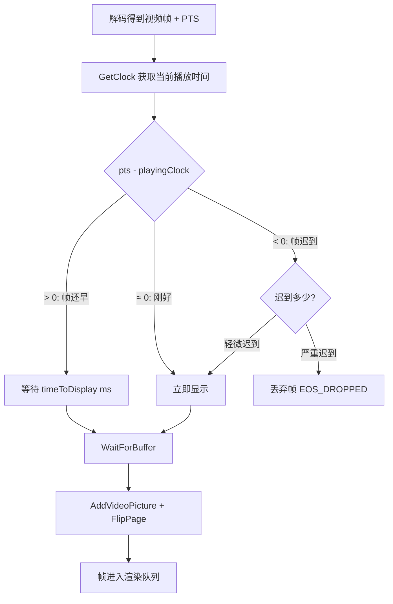

# PTS 校正与时间戳转换

> **所属模块：** M06-视频播放器
> **前置知识：** [CDVDClock 主时钟](./01-CDVDClock主时钟.md)、[CDVDDemuxFFmpeg 解封装器](../02-解封装与解码流水线/01-CDVDDemuxFFmpeg解封装器.md)
> **预计阅读时间：** 25 分钟

## 本节目标

读完本节后，你将能够：
1. 理解 ConvertTimestamp() 如何将 FFmpeg 时间戳转换为 DVD_TIME_BASE 播放时间
2. 掌握 ErrorAdjust() 的误差校正算法及其与 VSync 的交互
3. 理解 Discontinuity() 时钟跳变的触发场景和内部实现
4. 分析音频同步中 SYNC_DISCON 和 SYNC_RESAMPLE 两种模式的工作原理
5. 能够诊断常见的时间戳异常问题（时钟跳变、PTS 不连续等）

## ConvertTimestamp() —— FFmpeg → DVD 时间戳转换

### 为什么需要时间戳转换？

FFmpeg 的 `AVPacket` 中的 PTS/DTS 使用 `AVStream::time_base` 作为单位。不同的媒体容器和流使用不同的 time_base：

| 容器格式 | 典型 time_base | 说明 |
|----------|---------------|------|
| MPEG-TS | 1/90000 | 固定 90kHz 时钟 |
| MP4/MOV | 1/视频帧率 或 1/音频采样率 | 可变 |
| AVI | 1/帧率 | 简单整数比 |
| MKV | 1/1000 | 毫秒精度 |
| FLV | 1/1000 | 毫秒精度 |

KrKr2 播放器内部统一使用 `DVD_TIME_BASE`（1,000,000 微秒）。`ConvertTimestamp()` 负责将各种 time_base 转换为统一单位：

```cpp
// 源码位置：cpp/core/movie/ffmpeg/DemuxFFmpeg.cpp 第 701-724 行

double CDVDDemuxFFmpeg::ConvertTimestamp(int64_t pts, int den, int num) {
    // 1. 处理无效时间戳
    if (pts == (int64_t)AV_NOPTS_VALUE)
        return DVD_NOPTS_VALUE;

    // 2. 将 pts 从 time_base 单位转为秒
    //    time_base = num/den，所以 pts_seconds = pts * num / den
    //    使用浮点避免整数溢出
    double timestamp = (double)pts * num / den;

    // 3. 减去起始时间（start_time）
    //    注意：KrKr2 中 starttime 被硬编码为 0.0
    //    原版 Kodi 会使用 m_pFormatContext->start_time / AV_TIME_BASE
    double starttime = 0.0f;

    if (timestamp > starttime)
        timestamp -= starttime;       // 正常情况：偏移到从 0 开始
    else if (timestamp + 0.5f > starttime)
        timestamp = 0;                // 容差：允许 PTS 略小于 starttime
    // else: PTS 远小于 starttime，保持原值（异常情况）

    // 4. 转换为 DVD_TIME_BASE 微秒单位
    return timestamp * DVD_TIME_BASE;
}
```

### 调用位置

`ConvertTimestamp()` 在 `CDVDDemuxFFmpeg::Read()` 中被调用，每读取一个 AVPacket 就转换其 PTS 和 DTS：

```cpp
// Read() 中的转换调用模式（简化版）

DemuxPacket* CDVDDemuxFFmpeg::Read() {
    AVPacket avpkt;
    av_read_frame(m_pFormatContext, &avpkt);

    CDVDDemuxStream* stream = GetStream(avpkt.stream_index);
    AVStream* avStream = m_pFormatContext->streams[avpkt.stream_index];

    // 获取 time_base 的分子和分母
    int den = avStream->time_base.den;  // 分母（如 90000）
    int num = avStream->time_base.num;  // 分子（如 1）

    DemuxPacket* pkt = AllocateDemuxPacket(avpkt.size);

    // 转换 PTS 和 DTS
    pkt->pts = ConvertTimestamp(avpkt.pts, den, num);
    pkt->dts = ConvertTimestamp(avpkt.dts, den, num);
    pkt->duration = DVD_TIME_BASE * (double)avpkt.duration * num / den;

    return pkt;
}
```

### 转换公式的数学推导

```
输入：
  pts = 45000          （AVPacket 的原始 PTS，单位为 time_base）
  time_base = 1/90000  （MPEG-TS 的典型值，num=1, den=90000）

步骤 1：转为秒
  timestamp = pts * num / den
            = 45000 * 1 / 90000
            = 0.5 秒

步骤 2：减去 starttime（KrKr2 中为 0）
  timestamp = 0.5 - 0.0 = 0.5 秒

步骤 3：转为 DVD_TIME_BASE
  result = 0.5 * 1000000 = 500000 μs
```

```cpp
// 完整示例：模拟不同容器的时间戳转换

#include <cstdio>
#include <cstdint>

#define DVD_TIME_BASE 1000000
#define DVD_NOPTS_VALUE 0xFFF0000000000000
#define AV_NOPTS_VALUE ((int64_t)0x8000000000000000LL)

double ConvertTimestamp(int64_t pts, int den, int num) {
    if (pts == AV_NOPTS_VALUE)
        return DVD_NOPTS_VALUE;

    double timestamp = (double)pts * num / den;
    double starttime = 0.0;

    if (timestamp > starttime)
        timestamp -= starttime;
    else if (timestamp + 0.5 > starttime)
        timestamp = 0;

    return timestamp * DVD_TIME_BASE;
}

int main() {
    // MPEG-TS: time_base = 1/90000
    double ts1 = ConvertTimestamp(45000, 90000, 1);
    printf("MPEG-TS: pts=45000, tb=1/90000 → %.0f μs (%.3f s)\n",
           ts1, ts1 / DVD_TIME_BASE);
    // 输出：MPEG-TS: pts=45000, tb=1/90000 → 500000 μs (0.500 s)

    // MP4 视频: time_base = 1/24000 (24fps * 1000)
    double ts2 = ConvertTimestamp(24000, 24000, 1);
    printf("MP4 vid: pts=24000, tb=1/24000 → %.0f μs (%.3f s)\n",
           ts2, ts2 / DVD_TIME_BASE);
    // 输出：MP4 vid: pts=24000, tb=1/24000 → 1000000 μs (1.000 s)

    // MKV: time_base = 1/1000 (毫秒)
    double ts3 = ConvertTimestamp(5500, 1000, 1);
    printf("MKV:     pts=5500, tb=1/1000  → %.0f μs (%.3f s)\n",
           ts3, ts3 / DVD_TIME_BASE);
    // 输出：MKV:     pts=5500, tb=1/1000  → 5500000 μs (5.500 s)

    // MP4 音频: time_base = 1/44100 (采样率)
    double ts4 = ConvertTimestamp(44100, 44100, 1);
    printf("MP4 aud: pts=44100, tb=1/44100 → %.0f μs (%.3f s)\n",
           ts4, ts4 / DVD_TIME_BASE);
    // 输出：MP4 aud: pts=44100, tb=1/44100 → 1000000 μs (1.000 s)

    // 无效时间戳
    double ts5 = ConvertTimestamp(AV_NOPTS_VALUE, 90000, 1);
    printf("无效 PTS: result = %.0f (DVD_NOPTS_VALUE = %.0f)\n",
           ts5, (double)DVD_NOPTS_VALUE);
    // 输出：无效 PTS: result 等于 DVD_NOPTS_VALUE

    return 0;
}
```

> ⚠️ **常见错误 1**：将 `num` 和 `den` 搞反。FFmpeg 的 `AVRational time_base = {num, den}` 表示 `num/den` 秒。例如 `{1, 90000}` 表示每个 tick 是 1/90000 秒。

> ⚠️ **常见错误 2**：使用整数运算做转换导致溢出。`pts * num` 对于 MPEG-TS 的 90kHz 时钟，长视频的 PTS 可以达到数十亿，乘以 num 后可能溢出 int64。所以代码使用 `(double)pts * num / den` 浮点运算。

### KrKr2 的 start_time 简化

原版 Kodi 在转换时会减去容器的 `start_time`：

```cpp
// 原版 Kodi 代码（被注释掉了）：
if (m_pFormatContext->start_time != (int64_t)AV_NOPTS_VALUE)
    starttime = (double)m_pFormatContext->start_time / AV_TIME_BASE;
```

KrKr2 将 `starttime` 硬编码为 0.0，因为 KiriKiri 游戏使用的视频文件（通常是 MPEG 或 WMV）一般从 0 开始，不存在复杂的 start_time 偏移问题。

## ErrorAdjust() —— 音视频同步误差校正

当音频和视频出现偏差时，`ErrorAdjust()` 通过调整时钟来修正。这是音视频同步的核心修正机制：

```cpp
// 源码位置：cpp/core/movie/ffmpeg/Clock.cpp 第 134-169 行

double CDVDClock::ErrorAdjust(double error, const char* log) {
    CSingleLock lock(m_critSection);

    double clock, absolute, adjustment;
    clock = GetClock(absolute);

    // 当 SpeedAdjust 正在工作时，跳过小于 100ms 的误差
    // 因为 SpeedAdjust 正在慢慢修正，不需要急躁跳变
    if (m_speedAdjust != 0 && error < DVD_MSEC_TO_TIME(100)) {
        return 0;
    }

    adjustment = error;

    // VSync 模式下的特殊处理
    if (m_vSyncAdjust != 0) {
        // 音频提前比音频落后更明显（人耳对"声先于像"更敏感）
        // 规则：
        //   音频超前 >20ms → 向后调整一帧时间
        //   音频落后 >27ms → 向前调整一帧时间
        //   否则不调整（在容忍范围内）
        if (error > 0.02 * DVD_TIME_BASE)       // >20ms 音频超前
            adjustment = m_frameTime;
        else if (error < -0.027 * DVD_TIME_BASE) // >27ms 音频落后
            adjustment = -m_frameTime;
        else
            adjustment = 0;                       // 容忍范围内
    }

    if (adjustment == 0)
        return 0;

    // 通过 Discontinuity 跳变时钟来修正
    Discontinuity(clock + adjustment, absolute);

    return adjustment;
}
```

### ErrorAdjust 的调用链

```
音频线程 (CVideoPlayerAudio)
  │
  ├── OutputPacket(audioframe)
  │   │
  │   ├── syncerror = m_dvdAudio.GetSyncError()
  │   │   // 计算音频实际输出时间与时钟的偏差
  │   │
  │   ├── 判断：SYNC_DISCON 模式 && |syncerror| > 10ms
  │   │
  │   └── correction = m_pClock->ErrorAdjust(syncerror, "...")
  │       │
  │       ├── 如果 correction != 0：
  │       │   └── m_dvdAudio.SetSyncErrorCorrection(-correction)
  │       │       // 通知音频设备校正
  │       │
  │       └── ErrorAdjust 内部：
  │           └── Discontinuity(clock + adjustment, absolute)
  │               // 直接跳变时钟
```

```cpp
// 源码位置：cpp/core/movie/ffmpeg/VideoPlayerAudio.cpp 第 525-538 行

bool CVideoPlayerAudio::OutputPacket(DVDAudioFrame& audioframe) {
    double syncerror = m_dvdAudio.GetSyncError();
    // syncerror > 0：音频超前于时钟（音频播放得太快）
    // syncerror < 0：音频落后于时钟（音频播放得太慢）

    if (m_synctype == SYNC_DISCON && fabs(syncerror) > DVD_MSEC_TO_TIME(10)) {
        // 误差超过 10ms 阈值，需要校正
        double correction =
            m_pClock->ErrorAdjust(syncerror, "CVideoPlayerAudio::OutputPacket");
        if (correction != 0) {
            // 将校正量反向应用给音频设备
            m_dvdAudio.SetSyncErrorCorrection(-correction);
        }
    }
    m_dvdAudio.AddPackets(audioframe);
    return true;
}
```

### ErrorAdjust 的数学分析

```
场景：音频超前 50ms（syncerror = 50000 μs）

非 VSync 模式（m_vSyncAdjust == 0）：
  adjustment = error = 50000 μs
  → Discontinuity(clock + 50000)
  → 时钟向前跳 50ms，让视频追上音频

VSync 模式（m_vSyncAdjust != 0）：
  error = 50000 μs > 20000 (0.02 * DVD_TIME_BASE)
  → adjustment = m_frameTime（比如 41708 μs for 23.976fps）
  → 只调整一帧时间，而不是全部 50ms
  → 更温和的校正，避免画面抖动

阈值不对称的原因：
  人类对"声先于像"（音频超前）的感知阈值约 45ms
  人类对"像先于声"（音频落后）的感知阈值约 125ms
  所以音频超前时（>20ms）就需要校正
  而音频落后时容忍更多（>27ms 才校正）
```

## Discontinuity() —— 时钟跳变

`Discontinuity()` 是时钟修正的底层机制。它直接设置播放时间，跳过正常的时间流逝计算：

```cpp
// 源码位置：cpp/core/movie/ffmpeg/Clock.cpp 第 171-180 行

void CDVDClock::Discontinuity(double clock, double absolute) {
    CSingleLock lock(m_critSection);
    m_startClock = AbsoluteToSystem(absolute); // 以当前绝对时间为新起点
    if (m_pauseClock)
        m_pauseClock = m_startClock;           // 暂停中也要同步更新
    m_iDisc = clock;                           // 设置新的播放时间偏移
    m_bReset = false;                          // 取消重置标志
    m_systemAdjust = 0;                        // 清除微调积分
    m_speedAdjust = 0;                         // 清除微调速率
}

// 便捷重载：不指定 absolute 时使用当前绝对时间
void Discontinuity(double clock = 0LL) {
    Discontinuity(clock, GetAbsoluteClock());
}
```

### Discontinuity 的触发场景

| 触发位置 | 场景 | 目的 |
|----------|------|------|
| `ErrorAdjust()` | 音频同步误差超过阈值 | 微调时钟对齐音频 |
| `BasePlayer::Process()` | 用户执行 Seek 操作 | 将时钟跳到新位置 |
| `BasePlayer::Process()` | 流切换（GENERAL_STREAMCHANGE） | 重新同步新流的时间线 |
| `BasePlayer::HandlePlaySpeed()` | 首次开始播放 | 初始化时钟到起始 PTS |

```cpp
// Seek 时的 Discontinuity 调用（简化版）
// 来自 BasePlayer 的消息处理

void BasePlayer::HandleMessages() {
    CDVDMsg* pMsg;
    while (m_messenger.Get(&pMsg, 0) != MSGQ_TIMEOUT) {
        if (pMsg->IsType(CDVDMsg::PLAYER_SEEK)) {
            double seekTarget = /* ... */;

            // 执行 seek
            m_demuxer->SeekTime(seekTarget);

            // 跳变时钟到新位置
            m_clock.Discontinuity(seekTarget);

            // 刷新解码器缓冲
            FlushBuffers(false);
        }
    }
}
```

### Discontinuity 后 SystemToPlaying 的行为

```
Discontinuity 前：
  m_startClock = old_start
  m_iDisc = old_disc
  playing = (current - old_start) / freq * TB + old_disc = T_old

Discontinuity(new_clock, absolute)：
  m_startClock = AbsoluteToSystem(absolute)  // ≈ current
  m_iDisc = new_clock

Discontinuity 后立即调用 SystemToPlaying：
  playing = (current - current) / freq * TB + new_clock
          = 0 + new_clock
          = new_clock  ← 精确跳转到目标时间！

1 秒后：
  playing = (current+freq - current) / freq * TB + new_clock
          = 1.0 * TB + new_clock
          = new_clock + 1秒  ← 从新位置继续正常流逝
```

## 两种音频同步模式

KrKr2 支持两种音频同步策略，通过 `SetSyncType()` 配置：

### SYNC_DISCON（不连续校正）

```
原理：发现误差 → ErrorAdjust → Discontinuity → 时钟跳变
特点：简单粗暴，校正立即生效
缺点：时钟跳变可能导致视频帧重复或跳过
适用：直播输出、非实时场景

工作流：
  音频输出 → GetSyncError() → |error| > 10ms?
    → Yes → ErrorAdjust(error) → Discontinuity(clock+error)
              → 时钟立即跳到对齐位置
    → No  → 不做任何事，在容忍范围内
```

```cpp
// SYNC_DISCON 模式的实现
// 源码位置：VideoPlayerAudio.cpp 第 525-538 行

bool CVideoPlayerAudio::OutputPacket(DVDAudioFrame& audioframe) {
    double syncerror = m_dvdAudio.GetSyncError();

    // SYNC_DISCON：直接跳变时钟
    if (m_synctype == SYNC_DISCON && fabs(syncerror) > DVD_MSEC_TO_TIME(10)) {
        double correction = m_pClock->ErrorAdjust(syncerror,
            "CVideoPlayerAudio::OutputPacket");
        if (correction != 0) {
            m_dvdAudio.SetSyncErrorCorrection(-correction);
        }
    }
    m_dvdAudio.AddPackets(audioframe);
    return true;
}
```

### SYNC_RESAMPLE（重采样校正）

```
原理：调整音频采样率来匹配时钟，而非跳变时钟
特点：平滑无感知，音频质量略有影响
缺点：大偏差时收敛慢
适用：正常播放、高质量场景

工作流：
  音频输出 → 计算偏差
    → 设置 m_pClock->SetSpeedAdjust(微调值)
    → 音频设备启用重采样模式
    → 音频输出速率微调，逐渐追上/等待时钟
```

```cpp
// SYNC_RESAMPLE 模式的配置
// 源码位置：VideoPlayerAudio.cpp 第 498-523 行

void CVideoPlayerAudio::SetSyncType(bool passthrough) {
    m_synctype = m_setsynctype;

    // 直通模式不支持重采样（硬件解码的比特流不能重采样）
    if (passthrough && m_synctype == SYNC_RESAMPLE)
        m_synctype = SYNC_DISCON;  // 回退到不连续校正

    double maxspeedadjust = 0.0;
    if (m_synctype == SYNC_RESAMPLE)
        maxspeedadjust = m_maxspeedadjust;  // 允许时钟速度微调

    m_pClock->SetMaxSpeedAdjust(maxspeedadjust);

    if (m_synctype != m_prevsynctype) {
        m_prevsynctype = m_synctype;
        if (m_synctype == SYNC_RESAMPLE)
            m_dvdAudio.SetResampleMode(1);   // 启用音频重采样
        else
            m_dvdAudio.SetResampleMode(0);   // 禁用音频重采样
    }
}
```

### 两种模式的对比

| 特性 | SYNC_DISCON | SYNC_RESAMPLE |
|------|------------|---------------|
| 校正方式 | 时钟跳变 | 采样率微调 |
| 校正速度 | 立即 | 渐进（数秒） |
| 感知影响 | 可能出现画面跳动 | 几乎无感知 |
| 音频质量 | 无影响 | 轻微影响（重采样） |
| 大偏差处理 | 优秀 | 较慢 |
| 直通兼容 | 支持 | 不支持（自动回退） |
| KrKr2 默认 | ✅ 默认使用 | 可选 |

```cpp
// 示例：模拟两种同步模式的校正效果

#include <cstdio>
#include <cmath>

#define DVD_TIME_BASE 1000000
#define DVD_MSEC_TO_TIME(x) ((double)(x) * DVD_TIME_BASE / 1000)

void simulate_sync_discon(double error_us) {
    printf("SYNC_DISCON: error = %.1f ms\n", error_us / 1000.0);
    if (fabs(error_us) > DVD_MSEC_TO_TIME(10)) {
        printf("  → 时钟跳变 %.1f ms，立即校正完毕\n", error_us / 1000.0);
        error_us = 0;
    } else {
        printf("  → 误差在容忍范围内，不校正\n");
    }
    printf("  → 校正后误差: %.1f ms\n\n", error_us / 1000.0);
}

void simulate_sync_resample(double error_us) {
    printf("SYNC_RESAMPLE: 初始 error = %.1f ms\n", error_us / 1000.0);
    double speedAdjust = error_us > 0 ? 0.001 : -0.001;  // 0.1% 加减速
    for (int sec = 1; sec <= 10; sec++) {
        error_us -= speedAdjust * DVD_TIME_BASE;  // 每秒校正 speedAdjust
        printf("  第 %d 秒: 剩余误差 = %.1f ms\n", sec, error_us / 1000.0);
        if (fabs(error_us) < DVD_MSEC_TO_TIME(1)) {
            printf("  → 误差降至 1ms 以内，校正完成\n");
            break;
        }
    }
    printf("\n");
}

int main() {
    // 场景 1：50ms 音频超前
    simulate_sync_discon(50000);
    simulate_sync_resample(50000);

    // 场景 2：5ms 音频超前（在 DISCON 阈值内）
    simulate_sync_discon(5000);

    return 0;
}
```

## 视频线程的时间同步

视频线程通过 `OutputPicture()` 中的时间比较来决定显示时机：

```cpp
// 源码位置：cpp/core/movie/ffmpeg/VideoPlayerVideo.cpp 第 714-871 行（关键同步部分）

int CVideoPlayerVideo::OutputPicture(const DVDVideoPicture* src, double pts) {
    // ... 配置渲染器 ...

    // 获取当前播放时钟
    double iPlayingClock, iCurrentClock;
    iPlayingClock = m_pClock->GetClock(iCurrentClock, false);

    // 计算需要等待的时间
    int timeToDisplay = DVD_TIME_TO_MSEC(pts - iPlayingClock);
    // > 0：帧还没到显示时间，需要等待
    // < 0：帧已经过了显示时间（迟到了）
    // = 0：正好是显示时间

    // 限制等待时间在合理范围：最少 50ms，最多 500ms
    int maxWaitTime = std::min(std::max(timeToDisplay + 500, 50), 500);

    // 快进时不等待
    if (m_speed > DVD_PLAYSPEED_NORMAL)
        maxWaitTime = std::max(timeToDisplay, 0);

    // 等待渲染缓冲区可用
    int buffer = m_renderManager.WaitForBuffer(m_bAbortOutput, maxWaitTime);
    if (buffer < 0) {
        // 超时或中断，丢弃帧
        return EOS_DROPPED;
    }

    // 提交帧给渲染管理器
    int index = m_renderManager.AddVideoPicture(*pPicture);
    m_renderManager.FlipPage(m_bAbortOutput, pts,
                             (m_syncState == ESyncState::SYNC_STARTING));
    return result;
}
```

### 视频同步流程图



## 常见错误及解决方案

### 错误 1：ConvertTimestamp 中 num/den 参数颠倒导致时间戳错误

**现象**：视频播放速度异常——如果原始时间基（time_base）是 `1/90000`，颠倒后变成 `90000/1`，时间戳被放大 `90000²` 倍，画面要么闪退要么完全卡死。

**原因**：`ConvertTimestamp()` 内部调用 `av_rescale_q()` 进行时间基转换，参数顺序为 `av_rescale_q(pts, src_time_base, dst_time_base)`。如果把 `num`（分子）和 `den`（分母）写反了，比如把 `{1, 90000}` 写成 `{90000, 1}`，时间戳值会偏差 81 亿倍。

**解决**：

```cpp
// ❌ 错误：num 和 den 颠倒
AVRational src_tb = {stream->time_base.den, stream->time_base.num}; // 反了！

// ✅ 正确：直接使用 stream 的 time_base
AVRational src_tb = stream->time_base; // {num=1, den=90000}

// 转换到 DVD_TIME_BASE（即微秒级时间基 {1, 1000000}）
int64_t converted = av_rescale_q(pts, src_tb, AV_TIME_BASE_Q);
```

> 💡 **调试技巧**：在 `ConvertTimestamp` 入口打印 `src_tb.num` 和 `src_tb.den`，确认 `num < den`（对于视频流几乎总是如此）。

### 错误 2：ErrorAdjust 阈值设置不当导致频繁时钟跳变（画面抖动）

**现象**：播放过程中画面周期性地轻微卡顿或抖动，日志中可以看到时钟频繁被"校正"（ErrorAdjust 反复触发），每秒触发几十次。

**原因**：`ErrorAdjust`（误差校正）的触发阈值设得太小。比如阈值设为 `1ms`，而正常的解码抖动就有 `2-5ms`，导致每一帧都触发时钟校正。每次校正都会造成一个微小的时间跳变，视觉上表现为画面抖动。

**解决**：设置合理的死区（dead zone），只有偏差超过一定阈值才触发校正：

```cpp
// 时钟校正的合理配置
const double kErrorThreshold = 0.020;  // 20ms — 低于此值的误差不校正
const double kMaxError = 0.200;        // 200ms — 超过此值认为是 seek/跳转，不渐进校正

void ApplyErrorAdjust(double error) {
    double absError = std::abs(error);

    if (absError < kErrorThreshold) {
        // 死区内：误差太小，不值得校正，忽略
        return;
    }

    if (absError > kMaxError) {
        // 误差过大：可能是 seek 后的首帧，直接硬同步
        ForceSyncClock();
        return;
    }

    // 正常范围：使用渐进式校正（SYNC_RESAMPLE）
    GradualAdjust(error);
}
```

### 错误 3：SYNC_RESAMPLE 模式下大偏差收敛极慢，未及时切换到 SYNC_DISCON

**现象**：seek 之后音画不同步持续好几秒才恢复，用户体验很差。日志显示偏差从 `500ms` 缓慢递减到 `0`，耗时 `3-5` 秒。

**原因**：`SYNC_RESAMPLE`（重采样同步）通过微调音频采样率来渐进式消除偏差，适合小偏差（<50ms）。但 seek 后偏差通常在 `200ms-1s` 级别，靠每帧微调 `0.1%` 的采样率来追赶，收敛速度远远不够。应该在大偏差时切换到 `SYNC_DISCON`（断续同步，直接跳到正确位置）。

**解决**：

```cpp
enum SyncMode { SYNC_DISCON, SYNC_RESAMPLE, SYNC_SKIPDUP };

SyncMode ChooseSyncMode(double currentError) {
    // > 80ms：偏差太大，直接跳（丢帧/插帧）
    if (std::abs(currentError) > 0.080) {
        return SYNC_DISCON;
    }
    // 20ms-80ms：用重采样渐进追赶
    if (std::abs(currentError) > 0.020) {
        return SYNC_RESAMPLE;
    }
    // < 20ms：已同步，不需要任何校正
    return SYNC_SKIPDUP;  // 维持当前状态
}
```

> ⚠️ 实际项目中 `CDVDPlayerAudio::HandleSyncError()` 就实现了类似逻辑——当偏差超过 `DVD_MSEC_TO_TIME(80)` 时切换到 `SYNC_DISCON`。修改阈值时要同时调整音频端和视频端，否则两端策略不一致会互相打架。

---

## 动手实践

### 实验：完整的时间戳转换与同步模拟

```cpp
// 模拟从解封装到同步的完整时间戳流水线

#include <cstdio>
#include <cstdint>
#include <cmath>
#include <vector>

#define DVD_TIME_BASE 1000000
#define DVD_NOPTS_VALUE 0xFFF0000000000000
#define DVD_TIME_TO_MSEC(x) ((int)((double)(x) * 1000 / DVD_TIME_BASE))
#define DVD_MSEC_TO_TIME(x) ((double)(x) * DVD_TIME_BASE / 1000)

struct DemuxPacket {
    double pts;       // DVD_TIME_BASE 单位
    double dts;
    double duration;
    bool isVideo;
};

// 模拟 ConvertTimestamp
double ConvertTimestamp(int64_t pts, int den, int num) {
    if (pts == (int64_t)0x8000000000000000LL) // AV_NOPTS_VALUE
        return DVD_NOPTS_VALUE;
    double timestamp = (double)pts * num / den;
    return timestamp * DVD_TIME_BASE;
}

// 模拟时钟
struct Clock {
    double playingTime = 0;
    double Discontinuity_offset = 0;

    void Discontinuity(double clock) {
        Discontinuity_offset = clock - playingTime;
        playingTime = clock;
    }

    double ErrorAdjust(double error) {
        if (fabs(error) > DVD_MSEC_TO_TIME(10)) {
            Discontinuity(playingTime + error);
            return error;
        }
        return 0;
    }

    void Advance(double dt) {
        playingTime += dt;
    }
};

int main() {
    Clock clock;

    // 模拟 MPEG-TS 流：视频 25fps，time_base = 1/90000
    int den = 90000, num = 1;
    int64_t frame_ticks = 3600;  // 90000/25 = 3600 ticks per frame

    printf("=== 阶段 1：正常播放 ===\n");
    for (int i = 0; i < 5; i++) {
        int64_t pts = i * frame_ticks;
        DemuxPacket pkt;
        pkt.pts = ConvertTimestamp(pts, den, num);
        pkt.isVideo = true;

        double diff = pkt.pts - clock.playingTime;
        printf("帧 %d: PTS=%.1fms, Clock=%.1fms, diff=%.1fms %s\n",
               i, pkt.pts/1000.0, clock.playingTime/1000.0, diff/1000.0,
               fabs(diff) < DVD_MSEC_TO_TIME(20) ? "✓" : "⚠");

        clock.Advance(DVD_TIME_BASE / 25.0);  // 时钟前进一帧
    }

    printf("\n=== 阶段 2：音频偏差校正 ===\n");
    double audioError = 30000;  // 音频超前 30ms
    printf("音频同步误差: %.1f ms\n", audioError / 1000.0);
    double correction = clock.ErrorAdjust(audioError);
    printf("ErrorAdjust 校正: %.1f ms\n", correction / 1000.0);
    printf("时钟跳变后: %.1f ms\n\n", clock.playingTime / 1000.0);

    printf("=== 阶段 3：Seek 跳转 ===\n");
    double seekTarget = 30.0 * DVD_TIME_BASE;
    printf("Seek 到 30.0 秒\n");
    clock.Discontinuity(seekTarget);
    printf("时钟跳转后: %.3f 秒\n", clock.playingTime / DVD_TIME_BASE);

    // Seek 后的新帧
    for (int i = 0; i < 3; i++) {
        int64_t pts = (750 + i) * frame_ticks;  // 第 750 帧开始
        DemuxPacket pkt;
        pkt.pts = ConvertTimestamp(pts, den, num);

        double diff = pkt.pts - clock.playingTime;
        printf("帧 %d: PTS=%.3fs, Clock=%.3fs, diff=%.1fms\n",
               750+i, pkt.pts/DVD_TIME_BASE,
               clock.playingTime/DVD_TIME_BASE, diff/1000.0);

        clock.Advance(DVD_TIME_BASE / 25.0);
    }

    return 0;
}
```

## 对照项目源码

相关文件：
- `cpp/core/movie/ffmpeg/DemuxFFmpeg.cpp` 第 701-724 行 — `ConvertTimestamp()` 时间戳转换函数
- `cpp/core/movie/ffmpeg/Clock.cpp` 第 134-169 行 — `ErrorAdjust()` 误差校正
- `cpp/core/movie/ffmpeg/Clock.cpp` 第 171-180 行 — `Discontinuity()` 时钟跳变
- `cpp/core/movie/ffmpeg/VideoPlayerAudio.cpp` 第 498-523 行 — `SetSyncType()` 同步模式选择
- `cpp/core/movie/ffmpeg/VideoPlayerAudio.cpp` 第 525-538 行 — `OutputPacket()` 音频同步校正入口
- `cpp/core/movie/ffmpeg/VideoPlayerVideo.cpp` 第 714-871 行 — `OutputPicture()` 视频帧同步显示

## 本节小结

- **ConvertTimestamp()** 将 FFmpeg 的 `pts * num / den` 转为 `DVD_TIME_BASE` 微秒，KrKr2 中 starttime 简化为 0
- **ErrorAdjust()** 是音视频同步的修正入口：非 VSync 模式直接跳变全部误差，VSync 模式每次只调整一帧时间
- **Discontinuity()** 通过重设 `m_startClock` 和 `m_iDisc` 实现时钟跳变，用于 Seek、同步校正等场景
- **SYNC_DISCON** 模式：误差 >10ms 时通过 ErrorAdjust + Discontinuity 立即跳变时钟
- **SYNC_RESAMPLE** 模式：通过 SpeedAdjust 微调音频采样率，渐进收敛误差
- 视频同步通过比较帧 PTS 与 `GetClock()` 的差值来决定等待、显示或丢弃
- 人耳对"声先于像"更敏感（阈值 ~45ms），所以 ErrorAdjust 的阈值设计是不对称的

## 练习题与答案

### 题目 1：如果一个 MPEG-TS 视频流的 time_base 是 1/90000，PTS 值为 8100000，对应的播放时间是多少秒？

<details>
<summary>查看答案</summary>

```
timestamp = pts * num / den = 8100000 * 1 / 90000 = 90 秒
dvd_time = timestamp * DVD_TIME_BASE = 90 * 1000000 = 90000000 μs
```

所以 PTS 8100000 对应播放时间 **90 秒**（1 分 30 秒）。

验证：90000 Hz × 90 秒 = 8,100,000 ticks ✓

</details>

### 题目 2：为什么 VSync 模式下 ErrorAdjust 每次只调整一帧时间（m_frameTime），而不是直接调整全部误差？

<details>
<summary>查看答案</summary>

VSync 模式下每次只调整一帧时间有三个原因：

1. **避免视觉跳动**：VSync 模式追求画面平滑，如果一次跳变 50ms，可能导致某一帧重复显示或跳过，造成肉眼可见的卡顿。每次调整一帧时间（~41.7ms for 23.976fps），相当于让某一帧早显示或晚显示一个 VBlank 周期，观感更自然。

2. **匹配显示器刷新周期**：VSync 模式下帧的显示时机与显示器 VBlank 对齐。调整量以帧时间为单位，确保调整后帧仍然落在 VBlank 边界上。

3. **渐进收敛**：大误差会在多次 ErrorAdjust 调用中逐步消化，而不是一步到位。这种"每帧修正一点"的方式虽然慢，但对用户完全透明。

```
假设误差 = 100ms，帧时间 = 41.7ms：
  第 1 次 ErrorAdjust：调整 41.7ms → 剩余 58.3ms
  第 2 次 ErrorAdjust：调整 41.7ms → 剩余 16.6ms
  第 3 次 ErrorAdjust：16.6ms < 20ms 阈值 → 不调整
  → 最终在 2 次调整后收敛到可接受范围
```

</details>

### 题目 3：编写一个函数，判断给定的 sync error 在当前配置下是否需要校正，以及校正量是多少。

<details>
<summary>查看答案</summary>

```cpp
#include <cstdio>
#include <cmath>

#define DVD_TIME_BASE 1000000
#define DVD_MSEC_TO_TIME(x) ((double)(x) * DVD_TIME_BASE / 1000)

struct SyncConfig {
    bool vsyncMode;        // 是否使用 VSync 模式
    double frameTime;      // 帧间隔（μs）
    double speedAdjust;    // 当前速度微调
};

struct CorrectionResult {
    bool needsCorrection;
    double adjustment;     // 校正量（μs），0 = 不校正
    const char* reason;
};

CorrectionResult CalcCorrection(double syncError, const SyncConfig& config) {
    CorrectionResult result = {false, 0, "在容忍范围内"};

    // 规则 1：speedAdjust 工作中，小误差交给它处理
    if (config.speedAdjust != 0 && syncError < DVD_MSEC_TO_TIME(100)) {
        result.reason = "SpeedAdjust 正在工作，跳过小误差";
        return result;
    }

    if (config.vsyncMode) {
        // VSync 模式：帧级调整
        if (syncError > 0.02 * DVD_TIME_BASE) {
            result.needsCorrection = true;
            result.adjustment = config.frameTime;
            result.reason = "VSync: 音频超前 >20ms，向前调整一帧";
        } else if (syncError < -0.027 * DVD_TIME_BASE) {
            result.needsCorrection = true;
            result.adjustment = -config.frameTime;
            result.reason = "VSync: 音频落后 >27ms，向后调整一帧";
        } else {
            result.reason = "VSync: 误差在 [-27ms, +20ms] 容忍范围";
        }
    } else {
        // SYNC_DISCON 模式：直接跳变
        if (fabs(syncError) > DVD_MSEC_TO_TIME(10)) {
            result.needsCorrection = true;
            result.adjustment = syncError;
            result.reason = "DISCON: 误差 >10ms，全量跳变";
        } else {
            result.reason = "DISCON: 误差 <10ms，在容忍范围";
        }
    }

    return result;
}

int main() {
    SyncConfig discon = {false, DVD_TIME_BASE / 23.976, 0};
    SyncConfig vsync  = {true,  DVD_TIME_BASE / 23.976, 0};

    double errors[] = {5000, 15000, 25000, 50000, -30000, -10000};
    const char* labels[] = {"5ms", "15ms", "25ms", "50ms", "-30ms", "-10ms"};

    printf("%-8s %-10s %-12s %s\n", "Error", "Mode", "Adjustment", "Reason");
    printf("%-8s %-10s %-12s %s\n", "-----", "----", "----------", "------");

    for (int i = 0; i < 6; i++) {
        auto r1 = CalcCorrection(errors[i], discon);
        printf("%-8s %-10s %-12.1f %s\n",
               labels[i], "DISCON", r1.adjustment/1000.0, r1.reason);

        auto r2 = CalcCorrection(errors[i], vsync);
        printf("%-8s %-10s %-12.1f %s\n\n",
               labels[i], "VSYNC", r2.adjustment/1000.0, r2.reason);
    }

    return 0;
}
```

</details>

## 下一步

[帧丢弃策略](./03-帧丢弃策略.md) —— 深入分析当系统来不及显示所有帧时，视频播放器如何决定丢弃哪些帧，包括 CalcDropRequirement() 的丢帧算法和 CRenderManager::PrepareNextRender() 的跳帧逻辑。
