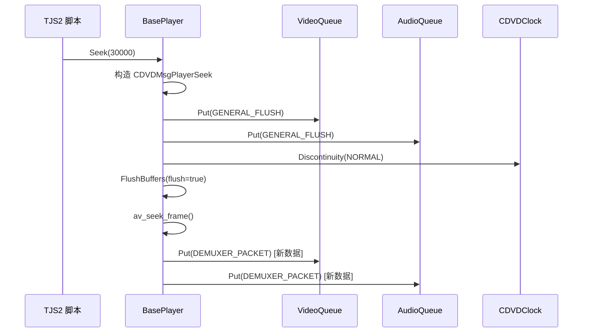

# 5.1 CDVDMsg 消息系统

## 本节目标

- 理解 CDVDMsg 消息类型层次结构及其在播放器线程间通信中的核心地位
- 掌握 CDVDMessageQueue 双链表优先级队列的实现原理
- 学会 IRef\<T\> 原子引用计数模板的设计思路
- 了解 CDVDMsgGeneralSynchronize 多线程屏障同步机制
- 能够在调试中定位消息流转路径、诊断消息丢失与队列阻塞问题

---

## 5.1.1 消息系统在播放器中的角色

KrKr2 的视频播放器继承自 XBMC/Kodi 的 CDVDPlayer 架构，其核心设计理念是
**多线程协作通过消息传递而非共享状态**。在这套体系中，主控线程（BasePlayer）、
视频解码线程（CVideoPlayerVideo）、音频解码线程（CVideoPlayerAudio）之间的
所有控制指令——播放、暂停、Seek、切换音轨——全部通过 CDVDMsg 消息对象投递到
各自的 CDVDMessageQueue 中异步处理。

这种设计带来三个关键优势：

1. **解耦**：发送方不关心接收方的执行时机，只需 Put() 消息即可
2. **优先级**：紧急控制指令（如 Seek）可以插队到普通数据包之前
3. **流量控制**：队列自带数据量/时间量统计，支持背压（backpressure）机制

```
┌─────────────────────────────────────────────────────────┐
│                    BasePlayer (主控线程)                   │
│  ┌──────────┐    ┌──────────┐    ┌──────────┐           │
│  │ 用户操作  │───▶│ 构造Msg  │───▶│  Put()   │           │
│  └──────────┘    └──────────┘    └────┬─────┘           │
│                                       │                  │
│              ┌────────────────────────┼────────────┐     │
│              ▼                        ▼            │     │
│  ┌───────────────────┐   ┌───────────────────┐    │     │
│  │ VideoPlayerVideo   │   │ VideoPlayerAudio   │    │     │
│  │ m_messageQueue     │   │ m_messageQueue     │    │     │
│  │   .Get() ─▶ 处理  │   │   .Get() ─▶ 处理  │    │     │
│  └───────────────────┘   └───────────────────┘    │     │
│              │                        │            │     │
│              ▼                        ▼            │     │
│         解码视频帧              解码音频帧          │     │
└─────────────────────────────────────────────────────────┘
```

### 源码位置

| 文件 | 路径 | 说明 |
|------|------|------|
| Message.h | `cpp/core/movie/ffmpeg/Message.h` | 消息类型定义，211 行 |
| MessageQueue.h | `cpp/core/movie/ffmpeg/MessageQueue.h` | 队列接口，119 行 |
| MessageQueue.cpp | `cpp/core/movie/ffmpeg/MessageQueue.cpp` | 队列实现，277 行 |
| Ref.h | `cpp/core/movie/ffmpeg/Ref.h` | 引用计数模板，35 行 |

---

## 5.1.2 CDVDMsg 消息类型层次结构

### 消息类型枚举

CDVDMsg 是所有消息的基类，通过 `Message` 枚举定义了 30+ 种消息类型，
按功能分为 6 大类别：

```cpp
// 源码：Message.h
class CDVDMsg : public IRef<CDVDMsg>
{
public:
    // ===== 消息类型枚举（6 大分类） =====
    enum Message {
        // 1. 通用控制消息
        NONE                    = 1000,  // 空消息 / 通配符
        GENERAL_EOF,                     // 流结束
        GENERAL_FLUSH,                   // 刷新缓冲区
        GENERAL_PAUSE,                   // 暂停
        GENERAL_STREAMCHANGE,            // 流格式变更
        GENERAL_SYNCHRONIZE,             // 多线程同步屏障（重要！）
        GENERAL_DELAY,                   // 延时等待
        GENERAL_RESET,                   // 重置状态

        // 2. 播放器控制消息
        PLAYER_SET_AUDIOSTREAM,          // 切换音轨
        PLAYER_SET_VIDEOSTREAM,          // 切换视频轨
        PLAYER_CHANNEL_NEXT,             // 下一频道
        PLAYER_CHANNEL_PREV,             // 上一频道
        PLAYER_CHANNEL_SELECT_NUMBER,    // 选择频道号
        PLAYER_SET_SPEED,                // 设置播放速度
        PLAYER_SEEK,                     // Seek 跳转（最复杂的消息）
        PLAYER_DISPLAYTIME,              // 显示时间更新

        // 3. 解封装器消息
        DEMUXER_PACKET,                  // 数据包（最高频的消息）
        DEMUXER_RESET,                   // 解封装器重置

        // 4. 视频消息
        VIDEO_NOSKIP,                    // 禁止跳帧
        VIDEO_SET_ASPECT,                // 设置宽高比

        // 5. 音频消息
        AUDIO_SILENCE,                   // 静音

        // 6. 字幕消息（KrKr2 中已禁用）
        SUBTITLE_CLUTCHANGE,             // 字幕 CLUT 变更
        SUBTITLE_ADDFILE,                // 添加字幕文件
    };

    CDVDMsg(Message msg) : m_message(msg) {}
    virtual ~CDVDMsg() {}

    Message GetMessageType() const { return m_message; }
    bool IsType(Message msg) const { return m_message == msg; }

private:
    Message m_message;
};
```

### 消息分类详解

每个消息类别对应播放器的不同子系统，理解这些分类对调试消息流转至关重要：

| 分类 | 枚举范围 | 发送方 | 接收方 | 典型场景 |
|------|---------|--------|--------|---------|
| GENERAL_* | 1000-1007 | BasePlayer | Video/Audio | 暂停、刷新、同步 |
| PLAYER_* | 自动递增 | 用户操作/脚本 | BasePlayer | Seek、切换音轨 |
| DEMUXER_* | 自动递增 | Demuxer | Video/Audio | 数据包投递 |
| VIDEO_* | 自动递增 | BasePlayer | Video | 跳帧控制 |
| AUDIO_* | 自动递增 | BasePlayer | Audio | 静音控制 |
| SUBTITLE_* | 自动递增 | BasePlayer | Subtitle | KrKr2 中已禁用 |

### CDVDMsgType\<T\> 泛型消息模板

对于需要携带简单数据的消息，Kodi 提供了泛型模板，避免为每种数据类型
创建独立子类：

```cpp
// 源码：Message.h
template <typename T>
class CDVDMsgType : public CDVDMsg
{
public:
    CDVDMsgType(Message type, const T& value)
        : CDVDMsg(type), m_value(value) {}

    // 运算符重载 —— 让消息对象可以像原始值一样使用
    operator T() const { return m_value; }  // 隐式转换
    T m_value;
};
```

使用示例——发送播放速度消息：

```cpp
// 发送方：设置 2 倍速播放
auto* msg = new CDVDMsgType<int>(
    CDVDMsg::PLAYER_SET_SPEED,
    DVD_PLAYSPEED_NORMAL * 2  // 2x speed
);
m_messenger.Put(msg);

// 接收方：读取速度值
CDVDMsg* pMsg = nullptr;
if (m_messageQueue.Get(&pMsg, 0) == MSGQ_OK) {
    if (pMsg->IsType(CDVDMsg::PLAYER_SET_SPEED)) {
        // 直接用隐式转换获取 int 值
        int speed = *static_cast<CDVDMsgType<int>*>(pMsg);
        SetSpeed(speed);
    }
    pMsg->Release();  // 别忘了释放引用！
}
```

---

## 5.1.3 CDVDMsgPlayerSeek —— 最复杂的消息类型

Seek 操作涉及时间戳计算、缓冲区刷新、时钟重设等多个步骤，因此
CDVDMsgPlayerSeek 是整个消息系统中最复杂的消息类型。它内嵌了一个
CMode 结构体来描述 Seek 的各种模式：

```cpp
// 源码：Message.h
class CDVDMsgPlayerSeek : public CDVDMsg
{
public:
    struct CMode {
        double  time       = 0;     // 目标时间（毫秒）
        bool    relative   = false; // true=相对当前位置, false=绝对位置
        bool    backward   = false; // true=向后搜索关键帧
        bool    flush      = true;  // true=清空解码缓冲区
        bool    accurate   = true;  // true=精确到目标帧
        bool    sync       = true;  // true=同步等待 Seek 完成
        bool    restore    = false; // true=恢复播放状态（暂停→暂停）
        bool    trickplay  = false; // true=快进/快退模式
    };

    CDVDMsgPlayerSeek(CMode&& mode)
        : CDVDMsg(PLAYER_SEEK)
        , m_mode(std::move(mode))
    {}

    CMode m_mode;
};
```

### Seek 模式组合示例

不同的 Seek 场景需要不同的 CMode 参数组合：

```cpp
// 场景 1：用户拖动进度条到 30 秒处
CDVDMsgPlayerSeek::CMode mode;
mode.time     = 30000.0;   // 30 秒 = 30000 毫秒
mode.relative = false;     // 绝对位置
mode.backward = false;     // 向前方向
mode.flush    = true;      // 清空缓冲区
mode.accurate = true;      // 精确定位
mode.sync     = true;      // 等待完成
auto* msg = new CDVDMsgPlayerSeek(std::move(mode));
m_messenger.Put(msg);

// 场景 2：快退 5 秒
CDVDMsgPlayerSeek::CMode mode2;
mode2.time      = -5000.0;  // 相对偏移 -5 秒
mode2.relative  = true;     // 相对模式
mode2.backward  = true;     // 向后搜索关键帧
mode2.flush     = true;     // 清空缓冲区
mode2.accurate  = false;    // 可以不精确（快退模式）
mode2.trickplay = true;     // 快进快退标记
auto* msg2 = new CDVDMsgPlayerSeek(std::move(mode2));
m_messenger.Put(msg2);

// 场景 3：恢复暂停状态的 Seek（KrKr2 脚本调用）
CDVDMsgPlayerSeek::CMode mode3;
mode3.time    = 10000.0;
mode3.restore = true;  // Seek 完成后恢复暂停状态
mode3.sync    = true;
auto* msg3 = new CDVDMsgPlayerSeek(std::move(mode3));
m_messenger.Put(msg3);
```

### Seek 消息的处理流程



---

## 5.1.4 CDVDMsgDemuxerPacket —— 数据包消息

这是播放器中**最高频**的消息类型。每一个从 FFmpeg 解封装器读取的
AVPacket 都会被包装成 CDVDMsgDemuxerPacket 投递到对应的解码线程队列：

```cpp
// 源码：Message.h
class CDVDMsgDemuxerPacket : public CDVDMsg
{
public:
    CDVDMsgDemuxerPacket(DemuxPacket* packet, bool drop = false)
        : CDVDMsg(DEMUXER_PACKET)
        , m_packet(packet)
        , m_drop(drop)
    {}

    virtual ~CDVDMsgDemuxerPacket() {
        // DemuxPacket 的释放由消息析构负责
        if (m_packet) CDVDDemuxUtils::FreeDemuxPacket(m_packet);
    }

    DemuxPacket* GetPacket()  { return m_packet; }
    bool         GetDrop()    { return m_drop; }
    unsigned int GetPacketSize() {
        return m_packet ? m_packet->iSize : 0;
    }

    DemuxPacket* m_packet;
    bool         m_drop;  // true = 只解码不显示（快进跳帧）
};
```

### 数据包的生命周期

理解数据包从创建到销毁的完整路径对调试内存问题至关重要：

```
1. CDVDDemuxFFmpeg::Read()
   └─ av_read_frame() → AVPacket
   └─ 包装为 DemuxPacket (含 pts, dts, iSize, iStreamId)

2. BasePlayer::Process() 主循环
   └─ new CDVDMsgDemuxerPacket(pPacket)
   └─ m_CurrentVideo.dvdNavResult.Put(msg)  // 投递到视频队列
                                             // 引用计数 = 1

3. CVideoPlayerVideo::Process() 解码循环
   └─ m_messageQueue.Get(&msg)             // 取出消息
   └─ packet = ((CDVDMsgDemuxerPacket*)msg)->GetPacket()
   └─ Decode(packet)                        // 送入解码器
   └─ msg->Release()                        // 引用计数 → 0
                                             // ~CDVDMsgDemuxerPacket()
                                             // FreeDemuxPacket(m_packet)
```

### m_drop 标志的作用

当播放器需要快进或 Seek 时，需要解码参考帧（I帧）但不需要显示它们。
此时 `m_drop = true` 告诉解码器："解码这个包，但不要把结果送去渲染"：

```cpp
// BasePlayer::Process() 中的快进逻辑
if (m_playSpeed != DVD_PLAYSPEED_NORMAL) {
    // 非正常速度时，非关键帧标记为 drop
    bool drop = !(pPacket->iFlags & AV_PKT_FLAG_KEY);
    auto* msg = new CDVDMsgDemuxerPacket(pPacket, drop);
    videoQueue.Put(msg);
}
```

---

## 5.1.5 IRef\<T\> 原子引用计数模板

所有 CDVDMsg 消息对象都通过 IRef\<T\> 模板进行引用计数管理，这是
Kodi 遗产代码中的一个轻量级智能指针替代方案。与 `std::shared_ptr`
不同，IRef\<T\> 采用**侵入式引用计数**（intrusive reference counting），
计数器嵌入对象本身，避免额外的控制块分配：

```cpp
// 源码：Ref.h —— 完整代码仅 35 行
template <typename T>
class IRef
{
public:
    IRef() : m_refs(0) {}
    virtual ~IRef() {}

    // 增加引用计数（原子操作，线程安全）
    T* AddRef() {
        m_refs.fetch_add(1, std::memory_order_relaxed);
        return static_cast<T*>(this);
    }

    // 减少引用计数，到 0 时自动删除
    T* Release() {
        if (m_refs.fetch_sub(1, std::memory_order_acq_rel) == 1) {
            delete static_cast<T*>(this);
            return nullptr;
        }
        return static_cast<T*>(this);
    }

private:
    std::atomic<int> m_refs;
};
```

### 引用计数使用模式

```cpp
// 模式 1：单次使用（最常见）
CDVDMsg* msg = new CDVDMsgType<int>(CDVDMsg::PLAYER_SET_SPEED, 2);
// 此时 m_refs = 0（注意：初始值为 0，不是 1！）
queue.Put(msg);   // Put() 内部 msg->AddRef()  → m_refs = 1
// ...
queue.Get(&msg);  // Get() 内部不改变引用计数
// 使用完毕
msg->Release();   // m_refs: 1 → 0 → delete

// 模式 2：多队列共享（同步场景）
CDVDMsg* sync = new CDVDMsgGeneralSynchronize(5000, 0);
sync->AddRef();    // m_refs = 1（为 videoQueue 准备）
sync->AddRef();    // m_refs = 2（为 audioQueue 准备）
videoQueue.Put(sync);   // Put() 再 AddRef → m_refs = 3
audioQueue.Put(sync);   // Put() 再 AddRef → m_refs = 4
// 两个队列各自 Get + Release → 最终 m_refs → 0 → delete
```

### 常见错误：忘记 Release

这是使用 IRef\<T\> 最常见的 bug。每次从队列 Get() 取出消息后，
处理完毕**必须**调用 Release()，否则消息永远不会被释放：

```cpp
// ❌ 错误：内存泄漏
CDVDMsg* pMsg;
if (m_messageQueue.Get(&pMsg, 0) == MSGQ_OK) {
    if (pMsg->IsType(CDVDMsg::GENERAL_FLUSH)) {
        FlushBuffers();
    }
    // 忘记 pMsg->Release() —— 泄漏！
}

// ✅ 正确：始终 Release
CDVDMsg* pMsg;
if (m_messageQueue.Get(&pMsg, 0) == MSGQ_OK) {
    if (pMsg->IsType(CDVDMsg::GENERAL_FLUSH)) {
        FlushBuffers();
    }
    pMsg->Release();  // 必须释放
}
```

### 跨平台注意事项

| 平台 | std::atomic 实现 | 性能特征 |
|------|-----------------|---------|
| Windows | InterlockedIncrement/Decrement | 原生支持，零开销 |
| Linux | GCC __atomic_* 内建函数 | 原生支持 |
| macOS | OSAtomicIncrement32 (旧) / __atomic_* (新) | Clang 优化良好 |
| Android (ARM) | LDREX/STREX 指令对 | ARMv7+ 原生支持，ARMv6 退化为锁 |

---

## 5.1.6 CDVDMessageQueue 双链表优先级队列

CDVDMessageQueue 是消息系统的核心数据结构。它采用**双链表架构**：
一个普通消息列表和一个优先级消息列表，配合条件变量实现线程安全的
生产者-消费者模式：

```cpp
// 源码：MessageQueue.h（关键成员）
class CDVDMessageQueue
{
    // 双链表：普通消息 + 优先级消息
    std::list<DVDMessageListItem> m_messages;      // 普通队列
    std::list<DVDMessageListItem> m_prioMessages;   // 优先级队列

    // 同步原语
    std::recursive_mutex          m_section;
    std::condition_variable_any   m_cond;

    // 流量控制
    int      m_iDataSize;        // 当前数据量（字节）
    int      m_iMaxDataSize;     // 最大数据量
    double   m_TimeSize;         // 最大时间量（秒的倒数）
    double   m_TimeFront;        // 队头时间戳
    double   m_TimeBack;         // 队尾时间戳

    // 状态控制
    bool     m_bAbort;           // 中止标志
    bool     m_drain;            // 排空标志
    bool     m_bInitialized;     // 初始化标志
};
```

### DVDMessageListItem 包装结构

每个消息在队列中被包装为 DVDMessageListItem，除了消息指针外
还携带优先级信息：

```cpp
// 源码：MessageQueue.h
struct DVDMessageListItem
{
    DVDMessageListItem(CDVDMsg* msg, int priority)
        : m_message(msg->AddRef())  // 入队时增加引用计数
        , m_priority(priority)
    {}

    ~DVDMessageListItem() {
        m_message->Release();  // 出队时释放引用计数
    }

    CDVDMsg* m_message;
    int      m_priority;
};
```

### Put() —— 消息入队

Put() 方法的核心逻辑是**根据优先级选择目标队列**：

```cpp
// 源码：MessageQueue.cpp（简化注释版）
MsgQueueReturnCode CDVDMessageQueue::Put(CDVDMsg* pMsg, int priority)
{
    std::unique_lock<std::recursive_mutex> lock(m_section);

    if (!m_bInitialized || m_bAbort) {
        // 未初始化或已中止 → 拒绝入队
        return MSGQ_NOT_INITIALIZED;
    }

    // === 关键分支：优先级路由 ===
    if (priority > 0) {
        // 高优先级 → 插入 m_prioMessages（按 priority 降序排列）
        auto it = m_prioMessages.begin();
        while (it != m_prioMessages.end() &&
               it->m_priority >= priority) {
            ++it;
        }
        m_prioMessages.emplace(it, pMsg, priority);
    } else {
        // 普通优先级 → 插入 m_messages
        // priority == 0: 尾部插入（FIFO 正常顺序）
        // priority <  0: 头部插入（插队到最前面）
        if (priority == 0)
            m_messages.emplace_back(pMsg, priority);
        else
            m_messages.emplace_front(pMsg, priority);
    }

    // 更新数据量统计（仅 DEMUXER_PACKET 消息）
    if (pMsg->IsType(CDVDMsg::DEMUXER_PACKET)) {
        CDVDMsgDemuxerPacket* packet =
            static_cast<CDVDMsgDemuxerPacket*>(pMsg);
        m_iDataSize += packet->GetPacketSize();
        // 更新时间窗口
        DemuxPacket* p = packet->GetPacket();
        if (p && p->dts != DVD_NOPTS_VALUE) {
            if (m_TimeBack == DVD_NOPTS_VALUE)
                m_TimeBack = p->dts;
            m_TimeFront = p->dts;
        }
    }

    // 唤醒等待的消费者
    m_cond.notify_all();
    return MSGQ_OK;
}
```

### Get() —— 消息出队

Get() 方法优先从高优先级队列取消息，普通队列从尾部取（LIFO 语义）：

```cpp
// 源码：MessageQueue.cpp（简化注释版）
MsgQueueReturnCode CDVDMessageQueue::Get(
    CDVDMsg** pMsg, unsigned int iTimeoutInMilliSeconds,
    int priority)
{
    std::unique_lock<std::recursive_mutex> lock(m_section);

    *pMsg = nullptr;

    if (!m_bInitialized) return MSGQ_NOT_INITIALIZED;
    if (m_bAbort)        return MSGQ_ABORT;

    // === 核心取出逻辑 ===
    while (!m_bAbort) {
        // 1. 优先检查高优先级队列
        if (!m_prioMessages.empty() &&
            (priority > 0 || m_prioMessages.back().m_priority >= priority))
        {
            auto& item = m_prioMessages.back();
            *pMsg = item.m_message->AddRef();  // 增加引用
            m_prioMessages.pop_back();          // 移除
            return MSGQ_OK;
        }

        // 2. 检查普通队列
        if (!m_messages.empty()) {
            auto& item = m_messages.back();  // 注意：从尾部取！
            *pMsg = item.m_message->AddRef();
            m_messages.pop_back();

            // 更新数据量统计
            if ((*pMsg)->IsType(CDVDMsg::DEMUXER_PACKET)) {
                CDVDMsgDemuxerPacket* packet =
                    static_cast<CDVDMsgDemuxerPacket*>(*pMsg);
                m_iDataSize -= packet->GetPacketSize();
            }
            return MSGQ_OK;
        }

        // 3. 队列为空 → 等待或超时
        if (iTimeoutInMilliSeconds == 0)
            return MSGQ_TIMEOUT;

        m_cond.wait_for(lock,
            std::chrono::milliseconds(iTimeoutInMilliSeconds));
        iTimeoutInMilliSeconds = 0;  // 只等一次
    }

    return MSGQ_ABORT;
}
```

> **注意**：Get() 从尾部取出（pop_back），而 Put() 普通消息从尾部插入
> （emplace_back）。这意味着**普通消息实际上是 FIFO 顺序**（先入先出）。
> 但如果用 priority < 0 插入到头部，该消息会最后被取出（延迟处理）。

### GetLevel() —— 队列填充度

GetLevel() 返回一个 0-100 的百分比值，用于流量控制判断：

```cpp
// 源码：MessageQueue.cpp
int CDVDMessageQueue::GetLevel() const
{
    std::unique_lock<std::recursive_mutex> lock(m_section);

    if (m_iDataSize > m_iMaxDataSize)
        return 100;  // 已超限

    if (m_iDataSize == 0)
        return 0;

    // 优先使用时间维度计算（更准确）
    if (m_TimeBack != DVD_NOPTS_VALUE &&
        m_TimeFront != DVD_NOPTS_VALUE &&
        m_TimeFront > m_TimeBack)
    {
        return (int)std::ceil(
            100.0 * m_TimeSize *
            (m_TimeFront - m_TimeBack) / DVD_TIME_BASE
        );
    }

    // 退化为数据维度计算
    return std::min(100, (int)(100.0 * m_iDataSize / m_iMaxDataSize));
}
```

> **设计解读**：时间维度比数据维度更准确，因为不同编码率的视频包大小
> 差异很大。一个 4K 视频的 1 秒数据可能是 1080p 视频的 4 倍，但它们
> 都只需要 1 秒的缓冲时间。

---

## 5.1.7 CDVDMsgGeneralSynchronize —— 多线程屏障

CDVDMsgGeneralSynchronize 实现了一种**屏障同步**（barrier synchronization）
机制，用于确保多个线程在继续执行前都到达了指定的同步点：

```cpp
// 源码：Message.h
class CDVDMsgGeneralSynchronize : public CDVDMsg
{
public:
    CDVDMsgGeneralSynchronize(unsigned int timeout, unsigned int sources)
        : CDVDMsg(GENERAL_SYNCHRONIZE)
        , m_sources(sources)
        , m_timeout(timeout)
    {}

    // 等待所有源完成
    bool Wait(unsigned int timeout, unsigned int source);
    void Reply(unsigned int source);

private:
    unsigned int      m_sources;   // 需要同步的源位掩码
    unsigned int      m_timeout;   // 超时时间（毫秒）
    CEvent            m_event;     // 条件变量
    CCriticalSection   m_section;  // 互斥锁
};
```

### 屏障同步工作原理

```
时间轴 ──────────────────────────────────────────▶

BasePlayer:  创建 Sync(sources=VIDEO|AUDIO)
             │
             ├──▶ videoQueue.Put(sync)
             ├──▶ audioQueue.Put(sync)
             └──▶ sync.Wait(5000, NONE)  // 等待所有源回复
                       │
VideoThread:           │  Get(sync) → sync.Reply(VIDEO)
                       │          │
AudioThread:           │          │  Get(sync) → sync.Reply(AUDIO)
                       │          │       │
                       ▼          ▼       ▼
                   所有源已回复 ─── Wait() 返回 true
```

### 在 WaitUntilEmpty() 中的应用

CDVDMessageQueue::WaitUntilEmpty() 利用同步消息实现"等待队列排空"：

```cpp
// 源码：MessageQueue.cpp
void CDVDMessageQueue::WaitUntilEmpty()
{
    // 设置排空标志
    {
        std::unique_lock<std::recursive_mutex> lock(m_section);
        m_drain = true;
    }

    // 创建同步消息并投递
    CDVDMsgGeneralSynchronize* msg =
        new CDVDMsgGeneralSynchronize(40000, 0);
    Put(msg, 1);  // priority=1，确保在所有普通消息之后处理

    // 等待同步消息被消费者处理
    // （当消费者取出并处理了这条消息，说明它之前的所有消息都已处理完毕）
    msg->Wait(40000, 0);
    msg->Release();

    // 清除排空标志
    {
        std::unique_lock<std::recursive_mutex> lock(m_section);
        m_drain = false;
    }
}
```

> **设计精妙之处**：同步消息被放入优先级队列（priority=1），但优先级值很低。
> 这确保它会在所有普通 DEMUXER_PACKET 消息处理完毕后才被取出。当消费者线程
> 取出并处理了这条同步消息，就证明队列中所有先前的消息都已经被处理过了。

---

## 5.1.8 Flush() —— 按类型选择性刷新

Flush() 方法支持按消息类型选择性地移除队列中的消息，这在 Seek 操作中
尤为重要——需要清空旧的 DEMUXER_PACKET 但保留控制消息：

```cpp
// 源码：MessageQueue.cpp
void CDVDMessageQueue::Flush(CDVDMsg::Message type)
{
    std::unique_lock<std::recursive_mutex> lock(m_section);

    auto predicate = [type](const DVDMessageListItem& item) {
        // NONE = 通配符，移除所有消息
        return type == CDVDMsg::NONE ||
               item.m_message->IsType(type);
    };

    // 从两个队列中移除匹配的消息
    m_messages.remove_if(predicate);
    m_prioMessages.remove_if(predicate);

    // 如果刷新了数据包消息，重置统计
    if (type == CDVDMsg::DEMUXER_PACKET || type == CDVDMsg::NONE) {
        m_iDataSize = 0;
        m_TimeFront = DVD_NOPTS_VALUE;
        m_TimeBack  = DVD_NOPTS_VALUE;
    }
}
```

### 常见 Flush 场景

```cpp
// 场景 1：Seek 时清空所有数据包，保留控制消息
videoQueue.Flush(CDVDMsg::DEMUXER_PACKET);
audioQueue.Flush(CDVDMsg::DEMUXER_PACKET);

// 场景 2：播放器销毁时清空所有消息
videoQueue.Flush(CDVDMsg::NONE);   // NONE = 通配符
audioQueue.Flush(CDVDMsg::NONE);

// 场景 3：流格式变更时只清空数据包
// （控制消息如 GENERAL_SYNCHRONIZE 需要保留）
videoQueue.Flush(CDVDMsg::DEMUXER_PACKET);
```

---

## 动手实践

### 实践 1：追踪一条 Seek 消息的完整旅程

在源码中跟踪以下调用链，标注每一步的线程上下文和消息状态变化：

```
1. KRMoviePlayer::Seek()
   → thread: 主线程 (TJS2 脚本回调)
   → 创建 CDVDMsgPlayerSeek

2. BasePlayer 接收 Seek 消息
   → thread: BasePlayer::Process()
   → 调用 FlushBuffers()
   → 向 videoQueue/audioQueue 发送 GENERAL_FLUSH

3. CVideoPlayerVideo 处理 FLUSH
   → thread: CVideoPlayerVideo::Process()
   → 清空解码器缓冲区
   → 重置 PTS 计算器

4. BasePlayer 重新送入数据包
   → thread: BasePlayer::Process()
   → av_seek_frame() 定位到新位置
   → 读取新数据包 → Put(DEMUXER_PACKET)
```

### 实践 2：实现一个简化版消息队列

基于 CDVDMessageQueue 的设计，实现一个简化版本，理解核心机制：

```cpp
#include <list>
#include <mutex>
#include <condition_variable>
#include <atomic>

// 简化版消息基类
class SimpleMsg {
public:
    enum Type { DATA, CONTROL, SYNC };

    SimpleMsg(Type t) : m_type(t), m_refs(0) {}
    virtual ~SimpleMsg() = default;

    Type GetType() const { return m_type; }

    void AddRef() { m_refs.fetch_add(1); }
    void Release() {
        if (m_refs.fetch_sub(1) == 1) delete this;
    }

private:
    Type m_type;
    std::atomic<int> m_refs;
};

// 简化版消息队列
class SimpleMsgQueue {
public:
    void Put(SimpleMsg* msg, bool highPriority = false) {
        std::unique_lock<std::mutex> lock(m_mutex);
        msg->AddRef();
        if (highPriority)
            m_priMessages.push_back(msg);
        else
            m_messages.push_back(msg);
        m_cond.notify_one();
    }

    SimpleMsg* Get(int timeoutMs = 1000) {
        std::unique_lock<std::mutex> lock(m_mutex);

        if (m_priMessages.empty() && m_messages.empty()) {
            m_cond.wait_for(lock,
                std::chrono::milliseconds(timeoutMs));
        }

        // 优先级队列优先
        if (!m_priMessages.empty()) {
            auto* msg = m_priMessages.back();
            m_priMessages.pop_back();
            return msg;
        }

        if (!m_messages.empty()) {
            auto* msg = m_messages.back();
            m_messages.pop_back();
            return msg;
        }

        return nullptr;  // 超时
    }

private:
    std::list<SimpleMsg*> m_messages;
    std::list<SimpleMsg*> m_priMessages;
    std::mutex m_mutex;
    std::condition_variable m_cond;
};
```

---

## 对照项目源码

| 概念 | 源码位置 | 关键行 |
|------|---------|--------|
| 消息类型枚举 | `Message.h:8-40` | enum Message { ... } |
| CDVDMsgType 模板 | `Message.h:50-60` | template\<typename T\> |
| CDVDMsgPlayerSeek | `Message.h:70-100` | struct CMode { ... } |
| CDVDMsgDemuxerPacket | `Message.h:110-140` | GetPacket(), m_drop |
| IRef 引用计数 | `Ref.h:1-35` | AddRef(), Release() |
| Put() 入队 | `MessageQueue.cpp:40-100` | 优先级分支逻辑 |
| Get() 出队 | `MessageQueue.cpp:100-160` | pop_back() 取出 |
| GetLevel() | `MessageQueue.cpp:170-200` | 时间/数据维度 |
| Flush() | `MessageQueue.cpp:210-250` | remove_if 选择性刷新 |
| WaitUntilEmpty() | `MessageQueue.cpp:250-277` | 同步屏障模式 |

---

## 本节小结

- CDVDMsg 是 Kodi 遗产消息系统的基类，30+ 种消息类型分为 6 大类别
- CDVDMsgType\<T\> 泛型模板避免了为每种数据创建子类的开销
- CDVDMsgPlayerSeek 是最复杂的消息，CMode 结构体包含 8 个 Seek 参数
- CDVDMsgDemuxerPacket 是最高频的消息，负责解封装数据包的线程间传递
- IRef\<T\> 侵入式引用计数确保消息在多线程间安全共享与自动释放
- CDVDMessageQueue 双链表架构实现优先级消息插队和普通消息 FIFO
- CDVDMsgGeneralSynchronize 屏障机制用于多线程同步等待
- Flush() 支持按消息类型选择性清空，Seek 时保留控制消息、清空数据包

---

## 练习题与答案

### 练习 1：消息优先级判断

**题目**：以下三条消息依次 Put() 到同一个 CDVDMessageQueue 中，
Get() 的取出顺序是什么？

```cpp
queue.Put(msgA, 0);    // 普通优先级
queue.Put(msgB, 5);    // 高优先级
queue.Put(msgC, 0);    // 普通优先级
```

**答案**：

取出顺序为 **B → C → A**。

- msgB（priority=5）进入 m_prioMessages
- msgA、msgC（priority=0）依次进入 m_messages（A在前，C在后）
- Get() 先检查 m_prioMessages → 取出 B
- 然后从 m_messages.back() 取出 → C（后入的在尾部）
- 最后取出 A

```
m_prioMessages: [B(5)]          → Get() → B
m_messages:     [A(0), C(0)]    → Get() → C, 然后 A
```

### 练习 2：引用计数追踪

**题目**：追踪以下代码中 msg 的引用计数变化，判断是否存在内存泄漏：

```cpp
auto* msg = new CDVDMsgType<int>(CDVDMsg::PLAYER_SET_SPEED, 2);
// refs = ?
msg->AddRef();
// refs = ?
queue1.Put(msg);
// refs = ?
queue2.Put(msg);
// refs = ?

CDVDMsg* out1;
queue1.Get(&out1, 0);
// refs = ?
out1->Release();
// refs = ?

CDVDMsg* out2;
queue2.Get(&out2, 0);
// refs = ?
// 忘记了 out2->Release() 和 msg->Release()
```

**答案**：

```
new CDVDMsgType    → refs = 0  (IRef 初始值为 0)
msg->AddRef()      → refs = 1
queue1.Put(msg)    → refs = 2  (Put 内部 AddRef)
queue2.Put(msg)    → refs = 3  (Put 内部 AddRef)
queue1.Get(&out1)  → refs = 4  (Get 内部 AddRef)
--- DVDMessageListItem 从 queue1 移除 → Release → refs = 3
out1->Release()    → refs = 2
queue2.Get(&out2)  → refs = 3  (Get 内部 AddRef)
--- DVDMessageListItem 从 queue2 移除 → Release → refs = 2
```

最终 refs = 2（msg 的 AddRef 和 out2 的 AddRef 未释放），**存在内存泄漏**。
需要添加 `out2->Release()` 和 `msg->Release()` 来正确释放。

### 练习 3：设计消息过滤器

**题目**：实现一个 CDVDMessageQueue 的扩展方法 `FlushExcept()`，
清空队列中**除指定类型外**的所有消息：

```cpp
// 清空队列，但保留 GENERAL_SYNCHRONIZE 消息
queue.FlushExcept(CDVDMsg::GENERAL_SYNCHRONIZE);
```

**答案**：

```cpp
void CDVDMessageQueue::FlushExcept(CDVDMsg::Message keepType)
{
    std::unique_lock<std::recursive_mutex> lock(m_section);

    auto predicate = [keepType](const DVDMessageListItem& item) {
        // 移除所有 **不是** keepType 的消息
        return !item.m_message->IsType(keepType);
    };

    m_messages.remove_if(predicate);
    m_prioMessages.remove_if(predicate);

    // 重新计算数据统计（因为可能移除了 DEMUXER_PACKET）
    m_iDataSize = 0;
    m_TimeFront = DVD_NOPTS_VALUE;
    m_TimeBack  = DVD_NOPTS_VALUE;

    // 遍历剩余消息重建统计
    for (auto& item : m_messages) {
        if (item.m_message->IsType(CDVDMsg::DEMUXER_PACKET)) {
            auto* pkt = static_cast<CDVDMsgDemuxerPacket*>(
                item.m_message);
            m_iDataSize += pkt->GetPacketSize();
            DemuxPacket* p = pkt->GetPacket();
            if (p && p->dts != DVD_NOPTS_VALUE) {
                if (m_TimeBack == DVD_NOPTS_VALUE)
                    m_TimeBack = p->dts;
                m_TimeFront = p->dts;
            }
        }
    }
}
```

---

## 下一步

下一节 [5.2 CThread 线程模型](./02-CThread线程模型.md) 将深入分析
Kodi 遗产代码中的线程基础设施——CThread 基类、CEvent 条件变量封装、
以及 CCriticalSection/CSingleLock 互斥锁体系，了解 BasePlayer、
CVideoPlayerVideo、CVideoPlayerAudio 三个核心线程的创建与生命周期管理。
