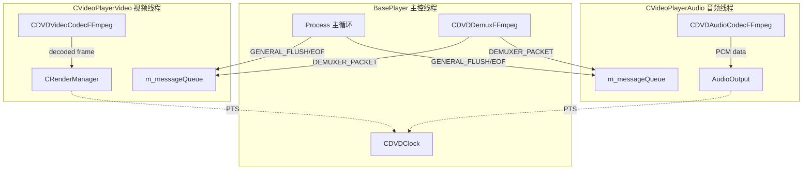

# 5.2 CThread 线程模型

## 本节目标

- 理解 CThread 基类的设计思路及其 Create/StopThread/Process 三段式生命周期
- 掌握 CEvent 条件变量封装的使用方式和超时等待机制
- 学会 CCriticalSection（std::recursive_mutex）与 CSingleLock（std::unique_lock）的配合使用
- 了解 BasePlayer、CVideoPlayerVideo、CVideoPlayerAudio 三大线程的创建顺序和依赖关系
- 能够在调试中判断线程状态、定位死锁和竞争条件问题

---

## 5.2.1 为什么需要自己的线程封装

KrKr2 的视频播放器继承自 XBMC/Kodi 的线程基础设施。在 2010 年代初期，
C++ 标准线程库（`<thread>`, `<mutex>`, `<condition_variable>`）刚纳入
C++11 标准，各平台的实现成熟度不一。Kodi 选择了自建线程封装层，
提供三个关键抽象：

1. **CThread**：线程基类，封装 std::thread 并提供可中断的 Sleep()
2. **CEvent**：条件变量封装，简化等待/通知模式
3. **CCriticalSection / CSingleLock**：递归互斥锁及其 RAII 封装

这三个组件共同构成了播放器多线程架构的基石。尽管现代 C++ 已经提供了
标准替代品，但理解这套封装对于阅读和调试 KrKr2 播放器源码仍然至关重要。

### 线程封装层次结构

```
std::thread ─────────────────── C++11 标准线程
    │
    └─ CThread ─────────────── Kodi 线程基类
         │
         ├─ BasePlayer ─────── 主控线程（解封装 + 调度）
         ├─ CVideoPlayerVideo ─ 视频解码线程
         └─ CVideoPlayerAudio ─ 音频解码线程

std::recursive_mutex ────────── C++11 标准递归互斥锁
    │
    └─ CCriticalSection ─────── Kodi 类型别名

std::unique_lock<recursive_mutex>
    │
    └─ CSingleLock ──────────── Kodi RAII 锁封装

std::condition_variable_any ─── C++11 条件变量（支持任意锁）
    │
    └─ CEvent ───────────────── Kodi 事件封装
```

### 源码位置

| 文件 | 路径 | 说明 |
|------|------|------|
| Thread.h | `cpp/core/movie/ffmpeg/Thread.h` | 线程/事件/锁定义，66 行 |
| VideoPlayer.h/cpp | `cpp/core/movie/ffmpeg/VideoPlayer.h/cpp` | BasePlayer 实现 |
| VideoPlayerVideo.h/cpp | `cpp/core/movie/ffmpeg/VideoPlayerVideo.h/cpp` | 视频线程 |
| VideoPlayerAudio.cpp | `cpp/core/movie/ffmpeg/VideoPlayerAudio.cpp` | 音频线程 |

---

## 5.2.2 CThread 基类详解

CThread 是所有播放器线程的基类。它的核心设计理念是**模板方法模式**
（Template Method Pattern）——基类控制线程的创建和销毁流程，
子类只需实现 `Process()` 纯虚函数即可：

```cpp
// 源码：Thread.h
class CThread
{
public:
    CThread() : m_bStop(false), m_bRunning(false) {}
    virtual ~CThread() {
        StopThread(true);  // 析构时确保线程已停止
    }

    // ===== 线程生命周期管理 =====

    // 创建并启动线程
    void Create(bool bAutoDelete = false) {
        m_bStop = false;
        m_bRunning = true;
        m_thread = std::thread([this]() {
            try {
                OnStartup();     // 子类可覆盖的初始化钩子
                Process();       // 子类必须实现的主循环
            } catch (...) {
                // 异常安全：确保 m_bRunning 被重置
            }
            m_bRunning = false;
            OnExit();            // 子类可覆盖的清理钩子
        });
    }

    // 请求线程停止
    void StopThread(bool bWait = true) {
        m_bStop = true;              // 设置停止标志
        m_StopEvent.Set();           // 唤醒 Sleep() 中的等待
        if (bWait && m_thread.joinable()) {
            m_thread.join();         // 等待线程结束
        }
    }

    // 可中断的 Sleep（核心设计！）
    bool Sleep(unsigned int milliseconds) {
        return m_StopEvent.WaitMSec(milliseconds);
    }

protected:
    // ===== 子类接口 =====
    virtual void Process() = 0;         // 纯虚函数：主循环
    virtual void OnStartup() {}         // 可选：启动前初始化
    virtual void OnExit() {}            // 可选：退出后清理

    // ===== 状态查询 =====
    std::atomic<bool>  m_bStop;         // 停止请求标志
    std::atomic<bool>  m_bRunning;      // 运行状态标志

private:
    std::thread        m_thread;        // 底层线程对象
    CEvent             m_StopEvent;     // 停止事件（用于中断 Sleep）
};
```

### 三段式生命周期

CThread 的生命周期严格遵循"创建 → 运行 → 停止"三段式：

```
┌────────────────────────────────────────────────────┐
│                   CThread 生命周期                   │
├────────────────────────────────────────────────────┤
│                                                    │
│  1. Create()                                       │
│     ├─ m_bStop = false                            │
│     ├─ m_bRunning = true                          │
│     └─ std::thread 启动 ──┐                       │
│                            │                       │
│  2. 线程内部执行            ▼                       │
│     ├─ OnStartup()   [初始化钩子]                  │
│     ├─ Process()     [主循环，检查 m_bStop]         │
│     │   └─ while (!m_bStop) {                     │
│     │         DoWork();                            │
│     │         Sleep(10);  // 可被 StopThread 中断  │
│     │       }                                      │
│     ├─ m_bRunning = false                         │
│     └─ OnExit()      [清理钩子]                    │
│                                                    │
│  3. StopThread(bWait)                              │
│     ├─ m_bStop = true     [请求停止]               │
│     ├─ m_StopEvent.Set()  [中断 Sleep]             │
│     └─ m_thread.join()    [等待结束]               │
│                                                    │
└────────────────────────────────────────────────────┘
```

### Sleep() 的可中断设计

CThread::Sleep() 不是简单的 `std::this_thread::sleep_for()`。
它通过 CEvent 实现**可中断等待**——当外部调用 StopThread() 时，
m_StopEvent 被 Set()，Sleep() 立即返回而不是等待完整的超时时间。
这个设计是 Kodi 线程模型的精髓：

```cpp
// 不可中断的 Sleep（错误示范）
void BadSleep(int ms) {
    std::this_thread::sleep_for(std::chrono::milliseconds(ms));
    // 问题：即使调用了 StopThread()，也要等完整的 ms 时间
    // 如果 ms = 5000，播放器关闭时会卡 5 秒！
}

// CThread 的可中断 Sleep（正确设计）
bool CThread::Sleep(unsigned int milliseconds) {
    return m_StopEvent.WaitMSec(milliseconds);
    // StopThread() 调用 m_StopEvent.Set() → 立即返回
    // 播放器关闭时几乎零延迟
}
```

### 跨平台线程创建差异

| 平台 | std::thread 底层实现 | 栈大小默认值 | 特殊注意 |
|------|---------------------|-------------|---------|
| Windows | _beginthreadex | 1 MB | COM 线程模型需要 CoInitialize |
| Linux | pthread_create | 8 MB (ulimit -s) | 可用 pthread_attr_setguardsize |
| macOS | pthread_create | 512 KB (辅助线程) | 主线程 8 MB |
| Android | pthread_create | 1 MB | JNI 线程需要 AttachCurrentThread |

---

## 5.2.3 CEvent 条件变量封装

CEvent 是对 `std::condition_variable_any` 的轻量封装，提供了
简洁的 Set/Wait/WaitMSec 接口。与原始条件变量不同，CEvent 自带
一个布尔状态标志，实现了**手动复位事件**语义：

```cpp
// 源码：Thread.h
class CEvent
{
public:
    CEvent() : m_signaled(false) {}

    // 设置事件（唤醒所有等待者）
    void Set() {
        std::unique_lock<std::recursive_mutex> lock(m_mutex);
        m_signaled = true;
        m_cond.notify_all();
    }

    // 重置事件（清除信号状态）
    void Reset() {
        std::unique_lock<std::recursive_mutex> lock(m_mutex);
        m_signaled = false;
    }

    // 无限等待
    void Wait() {
        std::unique_lock<std::recursive_mutex> lock(m_mutex);
        m_cond.wait(lock, [this]{ return m_signaled; });
        m_signaled = false;  // 自动复位
    }

    // 超时等待（返回 true 表示被信号唤醒）
    bool WaitMSec(unsigned int milliSeconds) {
        std::unique_lock<std::recursive_mutex> lock(m_mutex);
        bool result = m_cond.wait_for(
            lock,
            std::chrono::milliseconds(milliSeconds),
            [this]{ return m_signaled; }
        );
        if (result) m_signaled = false;  // 被唤醒时自动复位
        return result;
    }

private:
    bool                           m_signaled;
    std::recursive_mutex           m_mutex;
    std::condition_variable_any    m_cond;
};
```

### CEvent 与 std::condition_variable 的区别

CEvent 解决了原始条件变量的三个常见陷阱：

```cpp
// === 陷阱 1：虚假唤醒（Spurious Wakeup） ===

// ❌ 原始条件变量：可能被虚假唤醒
std::condition_variable cv;
std::mutex mtx;
bool ready = false;
{
    std::unique_lock<std::mutex> lock(mtx);
    cv.wait(lock);  // 可能在 ready 仍为 false 时返回！
}

// ✅ CEvent：内置谓词检查
CEvent event;
event.Wait();  // 内部 wait(lock, [this]{ return m_signaled; })
               // 只有 m_signaled == true 才会返回

// === 陷阱 2：信号丢失（Lost Signal） ===

// ❌ 原始条件变量：如果 notify 在 wait 之前调用，信号丢失
cv.notify_all();        // 没人在等 → 信号丢失
cv.wait(lock);          // 永远等下去

// ✅ CEvent：信号状态被保存
event.Set();            // m_signaled = true，即使没人在等
event.Wait();           // 立即返回，因为 m_signaled 已经是 true

// === 陷阱 3：锁类型不匹配 ===

// ❌ std::condition_variable 只能用 std::unique_lock<std::mutex>
std::recursive_mutex rmtx;
// std::condition_variable cv;  // 编译错误！不支持 recursive_mutex

// ✅ CEvent 使用 condition_variable_any，支持任意锁类型
// 内部使用 std::recursive_mutex，与 CCriticalSection 兼容
```

### CEvent 在播放器中的典型用法

```cpp
// 用法 1：CThread::Sleep() 中断机制
class CThread {
    CEvent m_StopEvent;

    bool Sleep(unsigned int ms) {
        // StopThread() 调用 m_StopEvent.Set() 时立即返回 true
        return m_StopEvent.WaitMSec(ms);
    }

    void StopThread(bool bWait) {
        m_bStop = true;
        m_StopEvent.Set();  // 中断任何 Sleep() 调用
        if (bWait) m_thread.join();
    }
};

// 用法 2：CDVDClock 等待时钟更新
class CDVDClock {
    CEvent m_speedEvent;

    void SetSpeed(int speed) {
        // ... 设置速度 ...
        m_speedEvent.Set();  // 通知等待者速度已变化
    }

    void WaitForSpeedChange(int timeout) {
        m_speedEvent.WaitMSec(timeout);
    }
};

// 用法 3：帧渲染同步
class CRenderManager {
    CEvent m_presentEvent;

    void FlipPage() {
        // ... 提交帧 ...
        m_presentEvent.Set();  // 通知渲染完成
    }

    bool WaitForFrame(int timeout) {
        return m_presentEvent.WaitMSec(timeout);
    }
};
```

---

## 5.2.4 CCriticalSection 与 CSingleLock

Kodi 遗产代码使用类型别名将标准库类型映射为自己的命名：

```cpp
// 源码：Thread.h
typedef std::recursive_mutex                   CCriticalSection;
typedef std::unique_lock<std::recursive_mutex> CSingleLock;
```

### 为什么使用 recursive_mutex 而非 mutex

递归互斥锁允许同一线程多次加锁而不会死锁。在 Kodi 的播放器架构中，
这是一个深思熟虑的设计选择，因为回调链经常导致同一线程重入同一把锁：

```cpp
// 场景：同一线程重入锁

class CVideoPlayerVideo {
    CCriticalSection m_section;  // = std::recursive_mutex

    void ProcessDemuxData() {
        CSingleLock lock(m_section);  // 第 1 次加锁
        // ... 处理数据 ...
        OutputPicture();  // 内部可能再次加锁！
    }

    void OutputPicture() {
        CSingleLock lock(m_section);  // 第 2 次加锁（同一线程）
        // 如果用 std::mutex → 死锁！
        // 用 std::recursive_mutex → 正常工作
        // ... 输出画面 ...
    }
};

// 如果用普通 mutex，调用链 ProcessDemuxData() → OutputPicture()
// 会在第 2 次 lock 时死锁。recursive_mutex 允许同一线程重入。
```

### CSingleLock 的 RAII 模式

CSingleLock 是 `std::unique_lock<std::recursive_mutex>` 的别名，
遵循 RAII（资源获取即初始化）模式——构造时加锁，析构时自动解锁：

```cpp
// 模式 1：作用域自动管理
void SomeFunction() {
    CCriticalSection m_section;

    {
        CSingleLock lock(m_section);  // 加锁
        // ... 临界区操作 ...
    }  // lock 析构 → 自动解锁

    // 此处 m_section 已经解锁
}

// 模式 2：条件变量配合
void WaitForData() {
    CCriticalSection m_section;
    std::condition_variable_any m_cond;

    CSingleLock lock(m_section);
    m_cond.wait(lock, [this]{ return HasData(); });
    // wait() 内部：释放锁 → 等待 → 重新获取锁
    ProcessData();
}

// 模式 3：尝试加锁（非阻塞）
void TryProcess() {
    CCriticalSection m_section;

    CSingleLock lock(m_section, std::try_to_lock);
    if (lock.owns_lock()) {
        // 成功获取锁
        DoWork();
    } else {
        // 锁被其他线程持有，跳过本次处理
    }
}
```

### 常见错误：临界区过大

```cpp
// ❌ 错误：锁的范围过大，包含了耗时操作
void ProcessFrame() {
    CSingleLock lock(m_section);
    ReadFromDisk();   // 磁盘 I/O，可能阻塞几十毫秒
    DecodeFrame();    // CPU 密集，几毫秒到几十毫秒
    UpdateState();    // 只有这一步需要锁保护
}

// ✅ 正确：最小化临界区
void ProcessFrame() {
    ReadFromDisk();   // 无需锁保护
    DecodeFrame();    // 无需锁保护

    {
        CSingleLock lock(m_section);
        UpdateState();  // 只锁保护需要同步的部分
    }
}
```

---

## 5.2.5 三大播放线程的创建与协作

KrKr2 视频播放器有三个核心线程，都继承自 CThread：

```
┌──────────────────────────────────────────────────────────────┐
│                    线程创建顺序与依赖关系                       │
├──────────────────────────────────────────────────────────────┤
│                                                              │
│  1. BasePlayer::Create()                                     │
│     └─ 主控线程启动                                           │
│         │                                                    │
│  2. BasePlayer::Process() 内部：                              │
│     ├─ OpenStream(VIDEO)                                     │
│     │   └─ CVideoPlayerVideo::OpenStream()                   │
│     │       └─ CThread::Create()  ← 视频线程启动              │
│     │                                                        │
│     ├─ OpenStream(AUDIO)                                     │
│     │   └─ CVideoPlayerAudio::OpenStream()                   │
│     │       └─ CThread::Create()  ← 音频线程启动              │
│     │                                                        │
│     └─ 主循环开始：                                           │
│         while (!m_bStop) {                                   │
│             Read() → DemuxPacket                             │
│             Route to Video/Audio Queue                       │
│         }                                                    │
│                                                              │
│  线程停止顺序（与创建相反）：                                   │
│  1. BasePlayer::CloseStream(AUDIO)                           │
│     └─ CVideoPlayerAudio::StopThread(true)                   │
│  2. BasePlayer::CloseStream(VIDEO)                           │
│     └─ CVideoPlayerVideo::StopThread(true)                   │
│  3. BasePlayer 自身退出 Process()                             │
│                                                              │
└──────────────────────────────────────────────────────────────┘
```

### BasePlayer —— 主控线程

BasePlayer（即 VideoPlayer）继承 CThread，其 Process() 方法
实现了解封装主循环：

```cpp
// 源码：VideoPlayer.cpp（简化版）
void CVideoPlayer::Process()
{
    // ===== 1. 初始化阶段 =====
    if (!OpenInputStream())  return;  // 打开输入流
    if (!OpenDemuxStream())  return;  // 打开解封装器

    // ===== 2. 启动子线程 =====
    // 视频流
    if (m_CurrentVideo.id >= 0) {
        OpenStream(m_CurrentVideo, VIDEO_INDEX);
        // 内部调用 m_VideoPlayerVideo->OpenStream()
        // 内部调用 CThread::Create()
    }

    // 音频流
    if (m_CurrentAudio.id >= 0) {
        OpenStream(m_CurrentAudio, AUDIO_INDEX);
        // 内部调用 m_VideoPlayerAudio->OpenStream()
        // 内部调用 CThread::Create()
    }

    // ===== 3. 主循环：解封装 + 分发 =====
    while (!m_bStop) {
        // 处理控制消息（Seek、暂停等）
        HandleMessages();

        // 检查队列是否已满
        if (m_CurrentVideo.started &&
            m_processInfo.GetVideoQueueLevel() > 80) {
            Sleep(10);  // 背压：等待解码消费
            continue;
        }

        // 读取下一个数据包
        DemuxPacket* pPacket = m_pDemuxer->Read();
        if (!pPacket) {
            // EOF 或错误
            if (m_pDemuxer->IsEOF()) {
                // 发送 EOF 消息给子线程
                SendEOFToAllStreams();
                break;
            }
            Sleep(1);
            continue;
        }

        // 路由到对应的队列
        if (pPacket->iStreamId == m_CurrentVideo.id) {
            auto* msg = new CDVDMsgDemuxerPacket(pPacket);
            m_CurrentVideo.dvdNavResult.Put(msg);
        }
        else if (pPacket->iStreamId == m_CurrentAudio.id) {
            auto* msg = new CDVDMsgDemuxerPacket(pPacket);
            m_CurrentAudio.dvdNavResult.Put(msg);
        }
        else {
            CDVDDemuxUtils::FreeDemuxPacket(pPacket);
        }
    }

    // ===== 4. 清理阶段（逆序停止子线程） =====
    CloseStream(m_CurrentAudio, true);  // 先停音频
    CloseStream(m_CurrentVideo, true);  // 再停视频
}
```

### CVideoPlayerVideo —— 视频解码线程

视频解码线程的 Process() 实现了一个消息驱动的解码循环：

```cpp
// 源码：VideoPlayerVideo.cpp（简化版）
void CVideoPlayerVideo::Process()
{
    while (!m_bStop) {
        CDVDMsg* pMsg = nullptr;

        // 从消息队列获取消息（超时 1 秒）
        MsgQueueReturnCode ret =
            m_messageQueue.Get(&pMsg, 1000);

        if (ret == MSGQ_TIMEOUT) {
            continue;  // 超时重试
        }
        if (ret == MSGQ_ABORT) {
            break;      // 收到中止信号
        }

        // ===== 按消息类型分派处理 =====

        if (pMsg->IsType(CDVDMsg::GENERAL_SYNCHRONIZE)) {
            // 同步屏障：回复已到达
            auto* sync = static_cast<
                CDVDMsgGeneralSynchronize*>(pMsg);
            sync->Reply(SYNCSOURCE_VIDEO);
        }
        else if (pMsg->IsType(CDVDMsg::GENERAL_FLUSH)) {
            // 刷新：清空解码器缓冲区
            m_pVideoCodec->Reset();
            m_stalled = true;
        }
        else if (pMsg->IsType(CDVDMsg::GENERAL_EOF)) {
            // EOF：标记流结束
            m_bStop = true;
        }
        else if (pMsg->IsType(CDVDMsg::VIDEO_NOSKIP)) {
            // 禁止跳帧
            auto* noskip = static_cast<
                CDVDMsgType<bool>*>(pMsg);
            m_bAllowDrop = !(*noskip);
        }
        else if (pMsg->IsType(CDVDMsg::DEMUXER_PACKET)) {
            // 数据包：送入解码器
            auto* dmsg = static_cast<
                CDVDMsgDemuxerPacket*>(pMsg);
            DemuxPacket* pPacket = dmsg->GetPacket();

            int decoderState = m_pVideoCodec->Decode(
                pPacket->pData, pPacket->iSize,
                pPacket->dts, pPacket->pts
            );

            // 获取解码后的图像
            if (decoderState & VC_PICTURE) {
                DVDVideoPicture picture;
                if (m_pVideoCodec->GetPicture(&picture)) {
                    OutputPicture(&picture);
                }
            }
        }

        pMsg->Release();  // 必须释放引用！
    }
}
```

### CVideoPlayerAudio —— 音频解码线程

音频解码线程结构与视频类似，但增加了音频特有的处理逻辑：

```cpp
// 源码：VideoPlayerAudio.cpp（简化版）
void CVideoPlayerAudio::Process()
{
    while (!m_bStop) {
        CDVDMsg* pMsg = nullptr;
        MsgQueueReturnCode ret =
            m_messageQueue.Get(&pMsg, 1000);

        if (ret != MSGQ_OK) {
            if (ret == MSGQ_ABORT) break;
            continue;
        }

        if (pMsg->IsType(CDVDMsg::GENERAL_FLUSH)) {
            // 刷新音频缓冲区
            m_pAudioCodec->Reset();
            m_audioClock = 0.0;
        }
        else if (pMsg->IsType(CDVDMsg::PLAYER_SET_SPEED)) {
            // 调整播放速度（音频变速不变调）
            int speed = *static_cast<
                CDVDMsgType<int>*>(pMsg);
            // 音频 resample 处理
        }
        else if (pMsg->IsType(CDVDMsg::DEMUXER_PACKET)) {
            auto* dmsg = static_cast<
                CDVDMsgDemuxerPacket*>(pMsg);
            DemuxPacket* pPacket = dmsg->GetPacket();

            // 解码音频
            int decoded = m_pAudioCodec->Decode(
                pPacket->pData, pPacket->iSize,
                pPacket->dts, pPacket->pts
            );

            if (decoded > 0) {
                // 获取 PCM 数据并送往音频输出
                int size = m_pAudioCodec->GetData(
                    &m_audioBuffer);
                if (size > 0) {
                    AddPacketsToOutput(
                        m_audioBuffer, size);
                }
            }
        }

        pMsg->Release();
    }
}
```

---

## 5.2.6 线程间通信模式总结

三大线程之间通过 CDVDMessageQueue 和 CDVDClock 进行通信：



### 通信方式对比

| 通信方式 | 用途 | 方向 | 阻塞行为 |
|---------|------|------|---------|
| CDVDMessageQueue.Put() | 控制指令 + 数据包 | BasePlayer → Video/Audio | 非阻塞 |
| CDVDMessageQueue.Get() | 取出消息处理 | Video/Audio ← 各自队列 | 可超时阻塞 |
| CDVDClock.GetClock() | 读取主时钟 | 任意线程 → Clock | 非阻塞 |
| CEvent.Set()/Wait() | 点对点通知 | 任意方向 | 可超时阻塞 |
| std::atomic\<bool\> | 状态标志 | 任意方向 | 非阻塞 |

---

## 5.2.7 线程安全陷阱与调试技巧

### 陷阱 1：析构顺序导致的崩溃

```cpp
// ❌ 危险：子线程引用了已析构的成员
class BadPlayer : public CThread {
    CDVDDemuxFFmpeg* m_pDemuxer;  // 被子线程引用

    ~BadPlayer() {
        delete m_pDemuxer;  // 析构在 StopThread 之前！
        // 此时 Process() 可能还在运行，访问已释放的 m_pDemuxer → 崩溃
    }

    void Process() override {
        while (!m_bStop) {
            m_pDemuxer->Read();  // 使用已释放的指针 → UB
        }
    }
};

// ✅ 正确：先停止线程，再释放资源
class GoodPlayer : public CThread {
    CDVDDemuxFFmpeg* m_pDemuxer;

    ~GoodPlayer() {
        StopThread(true);      // 1. 先等线程结束
        delete m_pDemuxer;     // 2. 再释放资源
    }
};
```

### 陷阱 2：忘记检查 m_bStop

```cpp
// ❌ 危险：长时间阻塞操作不检查 m_bStop
void Process() override {
    while (!m_bStop) {
        // 如果 BlockingRead 阻塞 10 秒，StopThread 也要等 10 秒
        auto* data = BlockingRead();
        ProcessData(data);
    }
}

// ✅ 正确：用 Sleep() 替代长时间阻塞
void Process() override {
    while (!m_bStop) {
        auto* data = TryRead();  // 非阻塞尝试
        if (!data) {
            Sleep(10);  // 可被 StopThread 中断
            continue;
        }
        ProcessData(data);
    }
}
```

### 调试技巧：线程状态检查

```cpp
// 调试辅助：打印线程状态
void DebugThreadStatus(CThread* thread, const char* name) {
    printf("[%s] Running: %s, Stop requested: %s\n",
        name,
        thread->m_bRunning ? "YES" : "NO",
        thread->m_bStop    ? "YES" : "NO"
    );
}

// 在播放器中使用
void DebugPlayerThreads(CVideoPlayer* player) {
    printf("=== Thread Status ===\n");
    DebugThreadStatus(player, "BasePlayer");
    DebugThreadStatus(player->m_VideoPlayerVideo, "Video");
    DebugThreadStatus(player->m_VideoPlayerAudio, "Audio");
    printf("Video Queue Level: %d%%\n",
        player->m_CurrentVideo.dvdNavResult.GetLevel());
    printf("Audio Queue Level: %d%%\n",
        player->m_CurrentAudio.dvdNavResult.GetLevel());
}
```

### 跨平台调试工具

| 平台 | 线程调试工具 | 用法 |
|------|------------|------|
| Windows | Visual Studio Thread Window | 调试 → 窗口 → 线程 |
| Linux | GDB `info threads` | 查看所有线程及其调用栈 |
| macOS | Xcode Thread Navigator | 左侧面板 → Debug Navigator |
| Android | Android Studio Thread View | Debugger → Threads 标签 |

---

## 动手实践

### 实践 1：追踪线程创建顺序

在 VideoPlayer.cpp 的 Process() 方法中，找到以下关键点并标注
对应的线程上下文：

```
1. OpenInputStream()      → 线程: BasePlayer
2. OpenDemuxStream()      → 线程: BasePlayer
3. OpenStream(VIDEO)      → 线程: BasePlayer（在此创建 VideoThread）
4. OpenStream(AUDIO)      → 线程: BasePlayer（在此创建 AudioThread）
5. Read() 主循环          → 线程: BasePlayer
6. VideoThread::Process() → 线程: VideoThread（独立运行）
7. AudioThread::Process() → 线程: AudioThread（独立运行）
```

验证问题：在 `CloseStream()` 中，为什么要先停音频再停视频？

### 实践 2：实现一个简化版可中断线程

```cpp
#include <thread>
#include <atomic>
#include <mutex>
#include <condition_variable>
#include <chrono>
#include <cstdio>

class SimpleEvent {
public:
    SimpleEvent() : m_signaled(false) {}

    void Set() {
        std::unique_lock<std::mutex> lock(m_mutex);
        m_signaled = true;
        m_cond.notify_all();
    }

    bool WaitMSec(unsigned int ms) {
        std::unique_lock<std::mutex> lock(m_mutex);
        bool result = m_cond.wait_for(
            lock, std::chrono::milliseconds(ms),
            [this]{ return m_signaled; });
        if (result) m_signaled = false;
        return result;
    }

private:
    bool m_signaled;
    std::mutex m_mutex;
    std::condition_variable m_cond;
};

class SimpleThread {
public:
    SimpleThread() : m_bStop(false), m_bRunning(false) {}
    virtual ~SimpleThread() { StopThread(); }

    void Create() {
        m_bStop = false;
        m_bRunning = true;
        m_thread = std::thread([this]() {
            Process();
            m_bRunning = false;
        });
    }

    void StopThread() {
        m_bStop = true;
        m_stopEvent.Set();
        if (m_thread.joinable())
            m_thread.join();
    }

    bool Sleep(unsigned int ms) {
        return m_stopEvent.WaitMSec(ms);
    }

protected:
    virtual void Process() = 0;
    std::atomic<bool> m_bStop;
    std::atomic<bool> m_bRunning;

private:
    std::thread m_thread;
    SimpleEvent m_stopEvent;
};

// 测试：创建一个每 500ms 打印一次的线程，3 秒后停止
class PrintThread : public SimpleThread {
protected:
    void Process() override {
        int count = 0;
        while (!m_bStop) {
            printf("Tick %d\n", ++count);
            if (Sleep(500)) break;  // 被中断则退出
        }
        printf("Thread stopped after %d ticks\n", count);
    }
};

int main() {
    PrintThread t;
    t.Create();

    std::this_thread::sleep_for(std::chrono::seconds(3));

    printf("Requesting stop...\n");
    t.StopThread();  // 立即中断 Sleep，不需要等 500ms
    printf("Done.\n");
    return 0;
}
```

预期输出：
```
Tick 1
Tick 2
Tick 3
Tick 4
Tick 5
Tick 6
Requesting stop...
Thread stopped after 6 ticks
Done.
```

---

## 对照项目源码

| 概念 | 源码位置 | 关键行 |
|------|---------|--------|
| CThread 定义 | `Thread.h:10-40` | Create(), StopThread(), Sleep() |
| CEvent 定义 | `Thread.h:42-58` | Set(), WaitMSec(), m_signaled |
| CCriticalSection | `Thread.h:60` | typedef std::recursive_mutex |
| CSingleLock | `Thread.h:61` | typedef std::unique_lock\<...\> |
| BasePlayer::Process | `VideoPlayer.cpp:200-500` | 主循环，子线程创建 |
| VideoThread::Process | `VideoPlayerVideo.cpp:200-400` | 消息驱动解码循环 |
| AudioThread::Process | `VideoPlayerAudio.cpp:100-300` | 音频解码循环 |
| OpenStream | `VideoPlayer.cpp:600-700` | CThread::Create() 调用点 |
| CloseStream | `VideoPlayer.cpp:700-750` | StopThread(true) 调用点 |

---

## 本节小结

- CThread 采用模板方法模式，子类只需实现 Process() 即可拥有完整的线程生命周期管理
- Sleep() 通过 CEvent 实现可中断等待，是 Kodi 线程模型的核心设计——确保 StopThread() 能快速生效
- CEvent 封装了 std::condition_variable_any，解决了虚假唤醒、信号丢失和锁类型不匹配三大陷阱
- CCriticalSection 使用 recursive_mutex 而非 mutex，允许同一线程重入加锁，避免回调链导致的死锁
- 播放器三大线程按"BasePlayer → Video → Audio"顺序创建，按"Audio → Video → BasePlayer"逆序销毁
- 线程间通过 CDVDMessageQueue（控制+数据）和 CDVDClock（时间同步）两种机制通信
- 调试时重点关注：析构顺序、m_bStop 检查、临界区范围、以及队列填充度

---

## 练习题与答案

### 练习 1：线程停止时序分析

**题目**：以下代码存在什么问题？

```cpp
class MyPlayer : public CThread {
    CVideoPlayerVideo* m_videoThread;
    CDVDDemuxFFmpeg*    m_demuxer;

    ~MyPlayer() {
        delete m_demuxer;          // (A)
        m_videoThread->StopThread(); // (B)
        delete m_videoThread;      // (C)
    }

    void Process() override {
        while (!m_bStop) {
            auto* pkt = m_demuxer->Read();  // (D)
            // ...
        }
    }
};
```

**答案**：

存在**使用已释放指针**的问题：

1. 行 (A) 释放了 m_demuxer
2. 但 Process()（行 D）可能仍在另一个线程中运行，访问已释放的 m_demuxer
3. 正确顺序应该是：
   - 先 StopThread(true) 停止自身（等待 Process 结束）
   - 再 m_videoThread->StopThread() 停止子线程
   - 最后 delete m_demuxer 和 delete m_videoThread

```cpp
~MyPlayer() {
    StopThread(true);              // 1. 先停自身
    m_videoThread->StopThread();   // 2. 再停子线程
    delete m_videoThread;          // 3. 释放子线程
    delete m_demuxer;              // 4. 最后释放资源
}
```

### 练习 2：CEvent 状态推演

**题目**：追踪以下代码执行后 event 的状态：

```cpp
CEvent event;
// 初始状态：m_signaled = false

event.Set();              // (1)
event.Set();              // (2)
bool r1 = event.WaitMSec(0);  // (3)
bool r2 = event.WaitMSec(0);  // (4)
```

r1 和 r2 的值分别是什么？

**答案**：

```
(1) Set() → m_signaled = true
(2) Set() → m_signaled = true（重复设置，无变化）
(3) WaitMSec(0):
    - m_signaled == true → 条件满足
    - 自动复位：m_signaled = false
    - 返回 true
    → r1 = true
(4) WaitMSec(0):
    - m_signaled == false → 条件不满足
    - 超时时间为 0 → 立即返回
    - 返回 false
    → r2 = false
```

**关键点**：CEvent 在 Wait/WaitMSec 成功返回后会**自动复位**（m_signaled = false），
所以第二次 WaitMSec 时信号已经被消费了。

### 练习 3：设计线程安全的帧计数器

**题目**：实现一个线程安全的帧计数器，支持多线程并发递增和查询：

```cpp
class FrameCounter {
public:
    void IncrementDecoded();    // 视频线程调用
    void IncrementDropped();    // 视频线程调用
    void IncrementRendered();   // 渲染线程调用
    void GetStats(int& decoded, int& dropped, int& rendered);  // 主线程调用
    void Reset();               // 主线程调用
};
```

**答案**：

```cpp
class FrameCounter {
public:
    FrameCounter()
        : m_decoded(0), m_dropped(0), m_rendered(0) {}

    // 原子递增 —— 无需锁，线程安全
    void IncrementDecoded() {
        m_decoded.fetch_add(1, std::memory_order_relaxed);
    }

    void IncrementDropped() {
        m_dropped.fetch_add(1, std::memory_order_relaxed);
    }

    void IncrementRendered() {
        m_rendered.fetch_add(1, std::memory_order_relaxed);
    }

    // 一致性读取 —— 需要锁保证三个值的一致性快照
    void GetStats(int& decoded, int& dropped, int& rendered) {
        // 注意：如果不需要三个值的一致性，可以直接读原子变量
        // 但如果需要"decoded == dropped + rendered"这样的不变量，
        // 则需要锁
        CSingleLock lock(m_section);
        decoded  = m_decoded.load();
        dropped  = m_dropped.load();
        rendered = m_rendered.load();
    }

    void Reset() {
        CSingleLock lock(m_section);
        m_decoded.store(0);
        m_dropped.store(0);
        m_rendered.store(0);
    }

private:
    std::atomic<int> m_decoded;
    std::atomic<int> m_dropped;
    std::atomic<int> m_rendered;
    CCriticalSection m_section;  // 仅用于一致性快照
};
```

---

## 下一步

下一节 [5.3 与原版 Kodi 的差异](./03-与原版Kodi的差异.md) 将系统性地
对比 KrKr2 播放器与原版 XBMC/Kodi 的差异——哪些功能被裁剪（#if 0 块）、
哪些 API 被降级使用、哪些模块被完全替换，帮助读者在阅读源码时快速区分
"活代码"与"死代码"。
