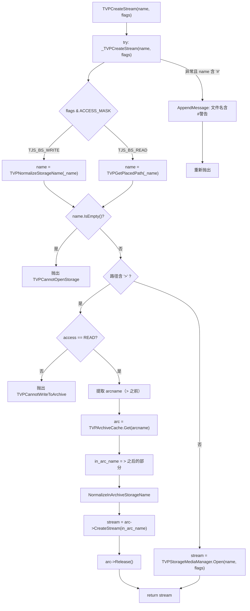

# TJS2 Storages 类与流创建工厂

> **所属模块：** M08-归档与IO系统
> **前置知识：** [存储媒体管理器](./01-存储媒体管理器.md)、[路径解析与自动搜索](./02-路径解析与自动搜索.md)、[tTJSBinaryStream 体系](../04-流与IO抽象层/01-tTJSBinaryStream体系.md)
> **预计阅读时间：** 50 分钟（约 10000 字）

## 本节目标

读完本节后，你将能够：
1. 理解 `TVPCreateStream` 函数的双层设计（内层 `_TVPCreateStream` + 外层异常包装），掌握流创建的完整路径分派逻辑
2. 解释归档路径（含 `>` 分隔符）与普通路径的处理差异，以及为何归档文件只允许只读访问
3. 掌握 `tTJSNC_Storages` 类的设计模式——纯静态工具类、不可实例化，10 个方法如何映射到底层 C++ 函数
4. 理解 TJS2 原生方法绑定宏的展开过程，包括 `TJS_BEGIN_NATIVE_MEMBERS`、`TJS_BEGIN_NATIVE_METHOD_DECL`、`TJS_END_NATIVE_STATIC_METHOD_DECL` 等
5. 编写自定义 TJS2 原生类，将 C++ 函数暴露给 TJS2 脚本

## 术语预览

本节将涉及以下术语，先有个印象，正文中会逐一详细讲解：

| 术语 | 英文 | 一句话解释 |
|------|------|-----------|
| 流创建工厂 | Stream Factory | 根据文件名和访问标志创建对应 `tTJSBinaryStream` 对象的全局函数，自动判断是归档内文件还是普通文件 |
| 归档分隔符 | Archive Delimiter | 字符 `>`（旧版为 `#`），用于分隔归档文件名和归档内文件名，如 `data.xp3>bgm/track01.ogg` |
| 原生类 | Native Class | 用 C++ 实现但注册到 TJS2 脚本引擎中的类，脚本可以像调用普通 TJS2 对象一样调用其方法 |
| 原生方法绑定宏 | Native Method Binding Macros | 一组宏（如 `TJS_BEGIN_NATIVE_METHOD_DECL`），简化将 C++ 函数注册为 TJS2 方法的流程 |
| 静态成员 | Static Member (TJS_STATICMEMBER) | TJS2 原生注册时标记为"静态"的方法，不需要对象实例即可调用（如 `Storages.addAutoPath(...)` ）|
| 缓存失效 | Cache Invalidation | 写操作发生后主动清除自动路径缓存中对应条目，确保下次查找不会返回过期结果 |

---

## 一、流创建工厂——TVPCreateStream

### 1.1 为什么需要统一的流创建入口

在前面两节中，我们分别学习了"存储媒体管理器"（负责管理不同协议的存储媒体）和"路径解析与自动搜索"（负责解析文件名、在自动路径中查找文件）。但这两个子系统是分离的——脚本要打开一个文件时，不应该手动判断"这是归档内的文件还是磁盘文件"再分别调用不同的函数。

`TVPCreateStream` 就是这个**统一入口**（Unified Entry Point）。它接受一个文件名和访问标志，自动完成以下工作：

1. **判断访问模式**——读模式走 `TVPGetPlacedPath`（在自动路径中查找文件），写模式走 `TVPNormalizeStorageName`（规范化路径）
2. **判断文件位置**——路径中含 `>` 表示归档内文件，否则是普通文件
3. **创建对应流**——归档文件通过 `tTVPArchive::CreateStream` 创建，普通文件通过 `TVPStorageMediaManager.Open` 创建
4. **异常包装**——捕获异常并追加 `#` 分隔符警告信息

### 1.2 双层设计：_TVPCreateStream + TVPCreateStream

KrKr2 的流创建采用了"内核 + 包装器"的双层设计模式：

```
TVPCreateStream (外层)
  └── _TVPCreateStream (内层)
        ├── 读模式 → TVPGetPlacedPath → 归档路径? → 是 → TVPArchiveCache.Get + CreateStream
        │                                            → 否 → TVPStorageMediaManager.Open
        └── 写模式 → TVPNormalizeStorageName → 归档路径? → 是 → 抛出异常（禁止写入归档）
                                                          → 否 → TVPStorageMediaManager.Open
```

这种设计的目的是**关注点分离**（Separation of Concerns）：
- 内层 `_TVPCreateStream` 负责核心逻辑——路径解析、归档判断、流创建
- 外层 `TVPCreateStream` 负责兼容性处理——检测旧版 `#` 分隔符并追加警告信息

### 1.3 内层 _TVPCreateStream 源码解析

> **源码位置：** `cpp/core/base/StorageIntf.cpp` 第 1130-1187 行

```cpp
// 文件：cpp/core/base/StorageIntf.cpp 第 1130-1187 行
static tTJSBinaryStream *_TVPCreateStream(
    const ttstr &_name,     // 文件名（可能包含归档分隔符 >）
    tjs_uint32 flags) {     // 访问标志（TJS_BS_READ / TJS_BS_WRITE 等）

    // 线程安全：整个流创建过程在临界区内执行
    tTJSCriticalSectionHolder cs_holder(TVPCreateStreamCS);

    ttstr name;

    // ---- 第一步：根据访问模式获取规范化路径 ----
    tjs_uint32 access = flags & TJS_BS_ACCESS_MASK;
    if(access == TJS_BS_WRITE)
        // 写模式：只做路径规范化，不要求文件已存在
        name = TVPNormalizeStorageName(_name);
    else
        // 读模式：文件必须存在，通过 TVPGetPlacedPath 查找
        name = TVPGetPlacedPath(_name);

    // 如果路径为空（文件不存在或路径无效），抛出异常
    if(name.IsEmpty()) {
        if(access >= 1)
            TVPRemoveFromStorageCache(_name);
        TVPThrowExceptionMessage(TVPCannotOpenStorage, _name);
    }

    // ---- 第二步：判断是否为归档内文件 ----
    // 在路径中搜索归档分隔符 >
    const tjs_char *sharp_pos =
        TJS_strchr(name.c_str(), TVPArchiveDelimiter);

    if(sharp_pos) {
        // 路径包含 >，说明是归档内的文件
        // 例如 "data.xp3>images/bg01.png"

        // 归档文件只允许只读访问
        if((flags & TJS_BS_ACCESS_MASK) != TJS_BS_READ)
            TVPThrowExceptionMessage(TVPCannotWriteToArchive);

        // 提取归档文件名（> 之前的部分）
        ttstr arcname(name, (int)(sharp_pos - name.c_str()));

        tTVPArchive *arc;
        tTJSBinaryStream *stream;
        // 从归档缓存获取归档对象（会增加引用计数）
        arc = TVPArchiveCache.Get(arcname);
        try {
            // 提取归档内文件名（> 之后的部分）
            ttstr in_arc_name(sharp_pos + 1);
            // 规范化归档内文件名（转小写等）
            tTVPArchive::NormalizeInArchiveStorageName(in_arc_name);
            // 调用归档对象创建流
            stream = arc->CreateStream(in_arc_name);
        } catch(...) {
            arc->Release();  // 异常时释放归档引用
            if(access >= 1)
                TVPRemoveFromStorageCache(_name);
            throw;
        }
        if(access >= 1)
            TVPRemoveFromStorageCache(_name);
        arc->Release();  // 正常释放归档引用
        return stream;
    }

    // ---- 第三步：普通文件，通过存储媒体管理器打开 ----
    tTJSBinaryStream *stream;
    try {
        stream = TVPStorageMediaManager.Open(name, flags);
    } catch(...) {
        if(access >= 1)
            TVPRemoveFromStorageCache(_name);
        throw;
    }
    if(access >= 1)
        TVPRemoveFromStorageCache(_name);
    return stream;
}
```

这段代码有几个关键设计要点值得深入理解：

#### 要点一：读 vs 写的路径解析差异

```
读模式: TVPGetPlacedPath(_name)
  → 在自动路径列表中搜索文件
  → 返回完整路径（如 "file://./data.xp3>bgm/track01.ogg"）
  → 文件必须存在，否则返回空字符串

写模式: TVPNormalizeStorageName(_name)
  → 只做路径规范化（统一分隔符、补全协议前缀等）
  → 不检查文件是否存在（因为可能是要新建的文件）
  → 返回规范化后的路径
```

为什么要区分？因为读操作需要**确定文件在哪里**（可能在磁盘上、可能在归档里），而写操作只需要**确定要写到哪里**（不需要搜索，直接用规范化路径）。

#### 要点二：归档文件的只读限制

归档格式（XP3、ZIP 等）的内部结构不支持随机写入——文件在归档中通常是经过压缩的，修改其中一个文件需要重新构建整个归档。因此 `_TVPCreateStream` 在检测到归档路径（含 `>`）时，如果访问模式不是 `TJS_BS_READ`，就会直接抛出 `TVPCannotWriteToArchive` 异常。

这是一个**提前失败**（Fail Fast）的设计——与其让写操作进入归档子系统后再失败，不如在入口处就拦截。

#### 要点三：缓存失效策略

注意代码中多处出现的 `TVPRemoveFromStorageCache(_name)` 调用。这个函数的逻辑很简单：

```cpp
// 文件：cpp/core/base/StorageIntf.cpp 第 1233-1235 行
void TVPRemoveFromStorageCache(const ttstr &name) {
    TVPAutoPathCache.Delete(name);
}
```

它只做一件事：从自动路径缓存（`TVPAutoPathCache`，上一节讲过的哈希缓存）中删除该文件名的条目。调用时机是 `access >= 1`，即只要不是 `TJS_BS_READ`（值为 0）就会触发——包括写入、追加等操作。

为什么？因为文件被修改后，缓存中记录的"文件在哪里"可能已经过期。比如：
- 缓存说 `config.txt` 在 `data.xp3>config.txt`
- 脚本通过写模式在磁盘上创建了新的 `config.txt`
- 如果不清除缓存，下次读 `config.txt` 还会去归档里找，读到的是旧版本

#### 要点四：线程安全

`_TVPCreateStream` 的第一行就创建了临界区持有者（Critical Section Holder）：

```cpp
tTJSCriticalSectionHolder cs_holder(TVPCreateStreamCS);
```

这意味着**整个流创建过程是互斥的**——同一时刻只有一个线程能创建流。这看起来像是性能瓶颈，但考虑到流创建涉及：自动路径查找（可能重建哈希表）、归档缓存访问、文件系统操作等多个可变状态的访问，使用全局锁是保证正确性的最简单方案。

### 1.4 外层 TVPCreateStream——旧分隔符兼容

> **源码位置：** `cpp/core/base/StorageIntf.cpp` 第 1189-1220 行

外层函数的唯一职责是处理**历史兼容性问题**——KrKr2 在 2.19 beta 14 版本之前使用 `#` 字符作为归档分隔符，后来改成了 `>`。如果用户的脚本或文件名中仍然包含 `#`，外层函数会在异常信息中追加警告。

```cpp
// 文件：cpp/core/base/StorageIntf.cpp 第 1189-1220 行
tTJSBinaryStream *TVPCreateStream(
    const ttstr &_name, tjs_uint32 flags) {
    try {
        return _TVPCreateStream(_name, flags);
    }
    // 分别捕获不同类型的 TJS 异常
    catch(eTJSScriptException &e) {
        if(TJS_strchr(_name.c_str(), '#'))
            // 文件名包含 #：追加"文件名包含#号"警告
            e.AppendMessage(
                TJS_W("[") +
                TVPFormatMessage(
                    TVPFilenameContainsSharpWarn, _name) +
                TJS_W("]"));
        throw;  // 重新抛出，不吞掉异常
    }
    catch(eTJSScriptError &e) {
        // 同上处理
        if(TJS_strchr(_name.c_str(), '#'))
            e.AppendMessage(/* ... */);
        throw;
    }
    catch(eTJSError &e) {
        // 同上处理
        if(TJS_strchr(_name.c_str(), '#'))
            e.AppendMessage(/* ... */);
        throw;
    }
    catch(...) {
        // 非 TJS 异常：无法 AppendMessage，只能写日志
        if(TJS_strchr(_name.c_str(), '#'))
            TVPAddLog(TVPFormatMessage(
                TVPFilenameContainsSharpWarn, _name));
        throw;
    }
}
```

为什么需要四个 catch 块而不是一个？因为 TJS2 的异常体系有层次结构：

```
std::exception
  └── (unknown)
        ├── eTJSError         ← 基础 TJS 错误
        │     └── eTJSScriptError    ← 脚本错误（含行号信息）
        │           └── eTJSScriptException ← 脚本异常（最具体）
        └── 其他 C++ 异常
```

每种异常类型都有 `AppendMessage` 方法，但需要分别捕获才能调用对应类型的方法。最后的 `catch(...)` 处理所有非 TJS 异常（比如标准库异常），这种情况下无法追加消息，只能写入日志。

### 1.5 TVPClearStorageCaches——一键清除所有存储缓存

> **源码位置：** `cpp/core/base/StorageIntf.cpp` 第 1226-1230 行

```cpp
// 文件：cpp/core/base/StorageIntf.cpp 第 1226-1230 行
void TVPClearStorageCaches() {
    // 清除所有存储相关缓存
    TVPClearXP3SegmentCache();  // 清除 XP3 分段缓存
    TVPClearAutoPathCache();    // 清除自动路径缓存
}
```

这个函数是一个**聚合清除操作**（Aggregate Clear），它一次性清除两类缓存：

1. **XP3 分段缓存**（`TVPClearXP3SegmentCache`）——XP3 归档的分段数据缓存，上一章详细讲过。每个文件可能由多个压缩段组成，解压后的数据会缓存在内存中，受 `TVPSegmentCacheLimit` 字节限制。
2. **自动路径缓存**（`TVPClearAutoPathCache`）——上一节讲过的 `TVPAutoPathCache`，缓存了"文件名 → 完整路径"的映射关系。

这个函数在以下场景被调用：
- 内存紧张时的 Compact 事件回调
- TJS2 脚本显式调用 `Storages.clearArchiveCache()`
- 系统重新加载资源时

### 1.6 流创建完整流程图

以下用 Mermaid 流程图展示 `TVPCreateStream` 的完整执行路径：



---

## 二、tTJSNC_Storages 类——脚本与存储系统的桥梁

### 2.1 类的设计定位

`tTJSNC_Storages` 是 KrKr2 中一个**纯静态工具类**（Pure Static Utility Class）——它不能被实例化，所有方法都是静态的。在 TJS2 脚本中，它以 `Storages` 为名暴露，脚本通过 `Storages.方法名(...)` 的形式调用。

这种设计模式在很多编程语言中都有对应：
- Java 的 `java.lang.Math`——所有方法都是 `static`，不能 `new Math()`
- Python 的 `os.path` 模块——虽然不是类，但功能类似
- C# 的 `System.IO.Path`——静态工具类

> **源码位置：** `cpp/core/base/StorageIntf.h` 第 290-302 行

```cpp
// 文件：cpp/core/base/StorageIntf.h 第 290-302 行
// tTJSNC_Storages : TJS Storages class
class tTJSNC_Storages : public tTJSNativeClass {
    typedef tTJSNativeClass inherited;

public:
    tTJSNC_Storages();            // 构造函数——注册所有原生方法

    static tjs_uint32 ClassID;     // 类ID，初始化为 -1

protected:
    // 创建原生实例——直接抛出异常，禁止实例化
    tTJSNativeInstance *CreateNativeInstance() override;
};

// 工厂函数：创建 Storages 类的全局实例
extern tTJSNativeClass *TVPCreateNativeClass_Storages();
```

关键点：
- `ClassID = -1`：表示这是一个"无实例"的类。正常的原生类（如 Layer、Window）会在构造时分配一个正数 ClassID，用于关联原生实例与 TJS2 对象。`-1` 意味着这个类没有原生实例关联。
- `CreateNativeInstance()` 被重写为直接抛出异常——任何试图 `new Storages()` 的脚本代码都会失败。

### 2.2 禁止实例化的实现

> **源码位置：** `cpp/core/base/StorageIntf.cpp` 第 1382-1387 行

```cpp
// 文件：cpp/core/base/StorageIntf.cpp 第 1382-1387 行
tTJSNativeInstance *tTJSNC_Storages::CreateNativeInstance() {
    // this class cannot create an instance
    TVPThrowExceptionMessage(TVPCannotCreateInstance);
    return nullptr;  // 永远不会执行到这里
}
```

当 TJS2 脚本执行 `var s = new Storages();` 时，TJS2 引擎会调用 `CreateNativeInstance()` 来创建原生实例。这个方法直接抛出异常，给出明确的错误提示"无法创建实例"。

`return nullptr;` 这一行永远不会被执行——`TVPThrowExceptionMessage` 内部会 `throw`，控制流不会回到这里。但编译器要求有返回语句（否则会产生"not all paths return a value"警告），所以保留了这行代码。

### 2.3 十大静态方法一览

`tTJSNC_Storages` 在构造函数中注册了 10 个静态方法。这些方法全部遵循相同的模式——**薄包装层**（Thin Wrapper），每个 TJS2 方法只是简单地调用对应的 C++ 全局函数，不做额外逻辑。

| 序号 | TJS2 方法名 | 对应 C++ 函数 | 返回值 | 功能简述 |
|------|-------------|---------------|--------|----------|
| 1 | `addAutoPath(path)` | `TVPAddAutoPath(path)` | void | 添加自动搜索路径 |
| 2 | `removeAutoPath(path)` | `TVPRemoveAutoPath(path)` | void | 移除自动搜索路径 |
| 3 | `getFullPath(path)` | `TVPNormalizeStorageName(path)` | string | 获取规范化完整路径 |
| 4 | `getPlacedPath(path)` | `TVPGetPlacedPath(path)` | string | 查找文件实际位置 |
| 5 | `isExistentStorage(path)` | `TVPIsExistentStorage(path)` | int | 检查文件是否存在 |
| 6 | `extractStorageExt(path)` | `TVPExtractStorageExt(path)` | string | 提取文件扩展名 |
| 7 | `extractStorageName(path)` | `TVPExtractStorageName(path)` | string | 提取文件名 |
| 8 | `extractStoragePath(path)` | `TVPExtractStoragePath(path)` | string | 提取路径部分 |
| 9 | `chopStorageExt(path)` | `TVPChopStorageExt(path)` | string | 去掉扩展名 |
| 10 | `clearArchiveCache()` | `TVPClearArchiveCache()` | void | 清除归档缓存 |

可以将这 10 个方法按功能分为三组：

**路径管理组**（方法 1-2）：控制自动搜索路径列表
```javascript
// TJS2 脚本示例
Storages.addAutoPath("data/images/");    // 添加搜索路径
Storages.addAutoPath("data.xp3>images/"); // 也可以是归档内的路径
Storages.removeAutoPath("data/images/"); // 移除搜索路径
```

**路径查询组**（方法 3-5）：查询和检查文件路径
```javascript
// TJS2 脚本示例
var full = Storages.getFullPath("bg01.png");
// 返回 "file://./data/images/bg01.png"

var placed = Storages.getPlacedPath("bg01.png");
// 返回 "file://./data.xp3>images/bg01.png"（通过自动搜索找到）

var exists = Storages.isExistentStorage("bg01.png");
// 返回 1（存在）或 0（不存在）
```

**路径工具组**（方法 6-9）：字符串级的路径操作
```javascript
// TJS2 脚本示例
var ext  = Storages.extractStorageExt("data/images/bg01.png");
// 返回 ".png"

var name = Storages.extractStorageName("data/images/bg01.png");
// 返回 "bg01.png"

var path = Storages.extractStoragePath("data/images/bg01.png");
// 返回 "data/images/"

var noext = Storages.chopStorageExt("data/images/bg01.png");
// 返回 "data/images/bg01"
```

**缓存管理组**（方法 10）：清除缓存
```javascript
// TJS2 脚本示例
Storages.clearArchiveCache();
// 清除所有归档缓存，释放内存
```

---

## 三、TJS2 原生方法绑定宏——宏展开全解析

### 3.1 为什么使用宏而不是模板

将 C++ 函数注册到 TJS2 脚本引擎需要大量样板代码（Boilerplate Code）——创建回调函数结构体、实现统一的函数签名、注册到类的方法表中。如果每个方法都手写这些代码，10 个方法就需要数百行重复代码。

KrKr2 选择用 C 预处理器宏来自动生成这些样板代码。相比 C++ 模板：
- **优点**：宏可以操作标识符名称（如拼接 `NCM_` 前缀），模板做不到
- **优点**：宏展开后的代码直观，调试时可以查看预处理结果
- **缺点**：宏没有类型检查，错误信息难以理解

> **宏定义位置：** `cpp/core/tjs2/tjsNative.h` 第 331-475 行

### 3.2 宏体系概览

TJS2 原生绑定宏构成了一个**声明式注册框架**——开发者只需按照固定格式"声明"每个方法，宏会自动生成注册代码。整个体系包含以下核心宏：

| 宏名称 | 作用 | 使用位置 |
|--------|------|----------|
| `TJS_BEGIN_NATIVE_MEMBERS(classname)` | 开始方法注册块 | 构造函数开头 |
| `TJS_DECL_EMPTY_FINALIZE_METHOD` | 声明空的 finalize 方法 | 紧跟 BEGIN 之后 |
| `TJS_BEGIN_NATIVE_METHOD_DECL(name)` | 开始声明一个方法 | 每个方法的开头 |
| `TJS_END_NATIVE_STATIC_METHOD_DECL(name)` | 结束静态方法声明 | 每个静态方法的结尾 |
| `TJS_END_NATIVE_METHOD_DECL(name)` | 结束实例方法声明 | 每个实例方法的结尾 |
| `TJS_END_NATIVE_MEMBERS` | 结束方法注册块 | 构造函数结尾 |

### 3.3 逐宏展开

让我们以 `Storages.addAutoPath` 方法为例，手动展开所有宏，看看编译器实际看到的代码。

#### 第一步：TJS_BEGIN_NATIVE_MEMBERS(Storages)

```cpp
// 宏定义（tjsNative.h 第 331-337 行）
#define TJS_BEGIN_NATIVE_MEMBERS(classname)                  \
    {                                                        \
        static const tjs_char *__classname = TJS_W(#classname); \
        static tjs_int32 TJS_NCM_CLASSID =                  \
            TJSRegisterNativeClass(__classname);             \
        TJSNativeClassSetClassID(TJS_NCM_REG_THIS, TJS_NCM_CLASSID); \
        TJS_NATIVE_SET_ClassID
```

展开 `TJS_BEGIN_NATIVE_MEMBERS(Storages)` 后：

```cpp
{
    // 类名字符串常量："Storages"
    static const tjs_char *__classname = TJS_W("Storages");
    // 注册原生类并获取全局唯一的类 ID
    static tjs_int32 TJS_NCM_CLASSID =
        TJSRegisterNativeClass(__classname);
    // 将类 ID 设置到当前类对象上
    TJSNativeClassSetClassID(this, TJS_NCM_CLASSID);
    // 设置成员变量 ClassID = TJS_NCM_CLASSID
    ClassID = TJS_NCM_CLASSID;
```

关键函数：
- `TJSRegisterNativeClass("Storages")` —— 在全局注册表中为 "Storages" 分配一个唯一的 32 位整数 ID。如果已经注册过，返回已有的 ID。
- `TJSNativeClassSetClassID` —— 将类 ID 保存到类对象内部，后续创建实例时需要用它来关联原生对象。

#### 第二步：TJS_DECL_EMPTY_FINALIZE_METHOD

```cpp
// 宏定义（tjsNative.h 第 381-383 行）
#define TJS_DECL_EMPTY_FINALIZE_METHOD                     \
    TJS_BEGIN_NATIVE_METHOD_DECL(finalize) { return TJS_S_OK; } \
    TJS_END_NATIVE_METHOD_DECL(finalize)
```

展开后生成一个名为 `finalize` 的空方法（什么都不做，返回成功）。`finalize` 是 TJS2 对象生命周期中的析构回调——当对象被垃圾回收时调用。对于 Storages 这种不可实例化的类，finalize 永远不会被调用，但 TJS2 引擎要求每个原生类都注册它。

#### 第三步：TJS_BEGIN_NATIVE_METHOD_DECL(addAutoPath)

```cpp
// 宏定义（tjsNative.h 第 339-343 行）
#define TJS_BEGIN_NATIVE_METHOD_DECL(name)                 \
    struct NCM_##name {                                    \
        static tjs_error Process(                          \
            tTJSVariant *result,                           \
            tjs_int numparams,                             \
            tTJSVariant **param,                           \
            iTJSDispatch2 *objthis) {
```

展开 `TJS_BEGIN_NATIVE_METHOD_DECL(addAutoPath)` 后：

```cpp
struct NCM_addAutoPath {
    static tjs_error Process(
        tTJSVariant *result,    // 返回值（可能为 nullptr）
        tjs_int numparams,      // 参数个数
        tTJSVariant **param,    // 参数数组
        iTJSDispatch2 *objthis  // this 对象（静态方法中通常为 nullptr）
    ) {
```

这里的关键设计：
- 宏用 `##` 运算符将方法名拼接到结构体名上，生成 `NCM_addAutoPath`
- `Process` 是一个**静态成员函数**，符合 `tTJSNativeClassMethodCallback` 的函数指针签名
- 四个参数构成了 TJS2 方法调用的标准接口

#### 第四步：方法体（开发者编写的部分）

```cpp
        // 检查参数个数
        if(numparams < 1) return TJS_E_BADPARAMCOUNT;

        // 从 TJS2 变体中提取字符串参数
        ttstr path = *param[0];

        // 调用底层 C++ 函数
        TVPAddAutoPath(path);

        // 如果调用方需要返回值，清除它（void 方法）
        if(result)
            result->Clear();

        return TJS_S_OK;  // 返回成功
```

#### 第五步：TJS_END_NATIVE_STATIC_METHOD_DECL(addAutoPath)

```cpp
// 宏定义（tjsNative.h 第 362-366 行）
#define TJS_END_NATIVE_STATIC_METHOD_DECL(name)            \
    }                                                      \
    };                                                     \
    TJSNativeClassRegisterNCM(                             \
        TJS_NCM_REG_THIS,                                  \
        TJS_W(#name),                                      \
        TJSCreateNativeClassMethod(NCM_##name::Process),   \
        __classname,                                       \
        nitMethod,                                         \
        TJS_STATICMEMBER);
```

展开 `TJS_END_NATIVE_STATIC_METHOD_DECL(addAutoPath)` 后：

```cpp
    }   // 关闭 Process 函数体
    };  // 关闭 NCM_addAutoPath 结构体

    // 将方法注册到类的方法表中
    TJSNativeClassRegisterNCM(
        this,                                    // 注册到当前类
        TJS_W("addAutoPath"),                    // TJS2 中的方法名
        TJSCreateNativeClassMethod(              // 创建方法对象
            NCM_addAutoPath::Process),           // 方法的回调函数
        __classname,                             // 所属类名
        nitMethod,                               // 类型：方法（非属性）
        TJS_STATICMEMBER);                       // 标记为静态成员
    // 注意：使用 TJS_END_NATIVE_METHOD_DECL 而不是
    // TJS_END_NATIVE_STATIC_METHOD_DECL 时，
    // 不会传入 TJS_STATICMEMBER 标志
```

`TJS_STATICMEMBER` 标志告诉 TJS2 引擎：这个方法不需要对象实例就能调用。在脚本中表现为 `Storages.addAutoPath(...)` 而不是 `storagesInstance.addAutoPath(...)`。

### 3.4 完整展开对照

将 `addAutoPath` 方法的所有宏完全展开后，编译器实际看到的代码如下：

```cpp
// === 宏展开结果（编译器实际看到的代码） ===

// TJS_BEGIN_NATIVE_METHOD_DECL(addAutoPath) 展开 →
struct NCM_addAutoPath {
    static tjs_error Process(
        tTJSVariant *result,
        tjs_int numparams,
        tTJSVariant **param,
        iTJSDispatch2 *objthis)
    {
        // 开发者编写的方法体
        if(numparams < 1) return TJS_E_BADPARAMCOUNT;
        ttstr path = *param[0];
        TVPAddAutoPath(path);
        if(result) result->Clear();
        return TJS_S_OK;

// TJS_END_NATIVE_STATIC_METHOD_DECL(addAutoPath) 展开 →
    }
};
TJSNativeClassRegisterNCM(
    this,
    TJS_W("addAutoPath"),
    TJSCreateNativeClassMethod(NCM_addAutoPath::Process),
    __classname,
    nitMethod,
    TJS_STATICMEMBER
);
```

对比原始源码（`StorageIntf.cpp` 第 1252-1264 行）：

```cpp
TJS_BEGIN_NATIVE_METHOD_DECL(/*func. name*/ addAutoPath) {
    if(numparams < 1) return TJS_E_BADPARAMCOUNT;
    ttstr path = *param[0];
    TVPAddAutoPath(path);
    if(result) result->Clear();
    return TJS_S_OK;
}
TJS_END_NATIVE_STATIC_METHOD_DECL(/*func. name*/ addAutoPath)
```

可以看到，宏隐藏了大约 15 行的样板代码，开发者只需关注 5 行核心逻辑。

### 3.5 方法注册的内部流程

`TJSNativeClassRegisterNCM` 函数（NCM = Native Class Member）的内部执行流程如下：

```
TJSNativeClassRegisterNCM(this, "addAutoPath", methodObj, "Storages", nitMethod, TJS_STATICMEMBER)
    │
    ├── 1. 在类对象的成员哈希表中查找 "addAutoPath"
    │      └── 如果不存在，创建新条目
    │
    ├── 2. 将 methodObj（由 TJSCreateNativeClassMethod 创建）绑定到该条目
    │      └── methodObj 内部持有 NCM_addAutoPath::Process 函数指针
    │
    ├── 3. 设置成员类型为 nitMethod（方法，非属性）
    │
    └── 4. 设置标志位 TJS_STATICMEMBER
           └── 脚本调用时不检查 this 对象，直接调用 Process
```

当 TJS2 脚本执行 `Storages.addAutoPath("data/images/")` 时：

```
1. TJS2 引擎解析 "Storages" → 找到全局 Storages 对象
2. 在 Storages 的成员表中查找 "addAutoPath" → 找到 methodObj
3. 检查 TJS_STATICMEMBER 标志 → 是静态方法，不需要 this
4. 准备参数：
   - result = nullptr（脚本不需要返回值）
   - numparams = 1
   - param[0] = tTJSVariant("data/images/")
   - objthis = nullptr
5. 调用 NCM_addAutoPath::Process(result, numparams, param, objthis)
6. Process 内部调用 TVPAddAutoPath("data/images/")
7. 返回 TJS_S_OK → TJS2 引擎继续执行下一条脚本指令
```

---

## 四、十大方法逐一解析

### 4.1 addAutoPath / removeAutoPath——自动路径管理

这两个方法在上一节已经详细讲过底层实现，这里关注它们在 TJS2 绑定层的模式。

> **源码位置：** `cpp/core/base/StorageIntf.cpp` 第 1252-1279 行

```cpp
// addAutoPath 方法（第 1252-1264 行）
TJS_BEGIN_NATIVE_METHOD_DECL(addAutoPath) {
    if(numparams < 1) return TJS_E_BADPARAMCOUNT;  // 至少需要1个参数
    ttstr path = *param[0];  // 从变体中提取字符串
    TVPAddAutoPath(path);    // 调用底层函数
    if(result) result->Clear();  // void 返回
    return TJS_S_OK;
}
TJS_END_NATIVE_STATIC_METHOD_DECL(addAutoPath)

// removeAutoPath 方法（第 1266-1279 行）
TJS_BEGIN_NATIVE_METHOD_DECL(removeAutoPath) {
    if(numparams < 1) return TJS_E_BADPARAMCOUNT;
    ttstr path = *param[0];
    TVPRemoveAutoPath(path);
    if(result) result->Clear();
    return TJS_S_OK;
}
TJS_END_NATIVE_STATIC_METHOD_DECL(removeAutoPath)
```

注意两个关键的编码模式：

**模式一：参数个数检查**
```cpp
if(numparams < 1) return TJS_E_BADPARAMCOUNT;
```
所有需要参数的方法都以此开头。`TJS_E_BADPARAMCOUNT` 是 TJS2 的标准错误码，引擎收到后会向脚本抛出"参数个数不足"异常。

**模式二：void 返回值处理**
```cpp
if(result) result->Clear();
```
`result` 指针可能为 `nullptr`（脚本不关心返回值时）或非空（脚本需要返回值时）。对于 void 方法，当 `result` 非空时调用 `Clear()` 将其设为 `tvtVoid` 类型（TJS2 的"无值"类型）。

### 4.2 getFullPath——路径规范化

> **源码位置：** `cpp/core/base/StorageIntf.cpp` 第 1281-1292 行

```cpp
TJS_BEGIN_NATIVE_METHOD_DECL(getFullPath) {
    if(numparams < 1) return TJS_E_BADPARAMCOUNT;
    ttstr path = *param[0];
    if(result)
        *result = TVPNormalizeStorageName(path);  // 结果写入 result
    return TJS_S_OK;
}
TJS_END_NATIVE_STATIC_METHOD_DECL(getFullPath)
```

这个方法展示了**有返回值方法**的标准模式：

```cpp
if(result)
    *result = TVPNormalizeStorageName(path);
```

只有当 `result` 非空时才计算返回值。这是一个优化——如果脚本丢弃返回值（如 `Storages.getFullPath("x");` 而不是 `var p = Storages.getFullPath("x");`），就不需要执行可能昂贵的计算。不过对于 `TVPNormalizeStorageName` 这种函数，优化效果有限。

`TVPNormalizeStorageName` 做的事情是将相对路径转换为完整的绝对路径：
- 输入：`"images/bg01.png"`
- 输出：`"file://./data/images/bg01.png"`

注意：这个函数**不检查文件是否存在**，它只做纯字符串操作。

### 4.3 getPlacedPath——文件位置查找

> **源码位置：** `cpp/core/base/StorageIntf.cpp` 第 1294-1305 行

```cpp
TJS_BEGIN_NATIVE_METHOD_DECL(getPlacedPath) {
    if(numparams < 1) return TJS_E_BADPARAMCOUNT;
    ttstr path = *param[0];
    if(result)
        *result = TVPGetPlacedPath(path);
    return TJS_S_OK;
}
TJS_END_NATIVE_STATIC_METHOD_DECL(getPlacedPath)
```

与 `getFullPath` 不同，`getPlacedPath` 会**实际搜索文件**——在自动路径列表中查找文件的真实位置。如果找到，返回完整路径；如果没找到，返回空字符串。

`getFullPath` vs `getPlacedPath` 的对比：

| 对比项 | getFullPath | getPlacedPath |
|--------|-------------|---------------|
| 底层函数 | `TVPNormalizeStorageName` | `TVPGetPlacedPath` |
| 是否搜索文件 | 否（纯路径运算） | 是（遍历自动路径） |
| 文件不存在时 | 仍返回规范化路径 | 返回空字符串 |
| 性能 | O(1) 字符串操作 | O(n) 路径搜索（有缓存） |
| 典型用途 | 构建输出路径 | 查找资源文件位置 |

### 4.4 isExistentStorage——文件存在性检查

> **源码位置：** `cpp/core/base/StorageIntf.cpp` 第 1307-1318 行

```cpp
TJS_BEGIN_NATIVE_METHOD_DECL(isExistentStorage) {
    if(numparams < 1) return TJS_E_BADPARAMCOUNT;
    ttstr path = *param[0];
    if(result)
        *result = (tjs_int)TVPIsExistentStorage(path);
    return TJS_S_OK;
}
TJS_END_NATIVE_STATIC_METHOD_DECL(isExistentStorage)
```

注意返回值的类型转换 `(tjs_int)`——`TVPIsExistentStorage` 返回 `bool`，但 TJS2 的变体类型不直接支持布尔值，而是用整数（0 = false, 1 = true）表示。显式转换为 `tjs_int` 确保变体类型被设置为整数而不是其他类型。

### 4.5 路径工具四方法

> **源码位置：** `cpp/core/base/StorageIntf.cpp` 第 1320-1370 行

这四个方法（`extractStorageExt`、`extractStorageName`、`extractStoragePath`、`chopStorageExt`）都是纯字符串操作，结构完全相同：

```cpp
// 以 extractStorageExt 为例（第 1320-1331 行）
TJS_BEGIN_NATIVE_METHOD_DECL(extractStorageExt) {
    if(numparams < 1) return TJS_E_BADPARAMCOUNT;
    ttstr path = *param[0];
    if(result)
        *result = TVPExtractStorageExt(path);
    return TJS_S_OK;
}
TJS_END_NATIVE_STATIC_METHOD_DECL(extractStorageExt)
```

四个函数的功能已经在上一节详细讲过。这里用一个完整示例展示它们的关系：

```
输入路径: "file://./data/images/bg01.scene.png"

extractStoragePath → "file://./data/images/"   （最后一个 / 之前的部分）
extractStorageName → "bg01.scene.png"          （最后一个 / 之后的部分）
extractStorageExt  → ".png"                    （最后一个 . 及之后）
chopStorageExt     → "file://./data/images/bg01.scene" （去掉最后一个 . 及之后）
```

### 4.6 clearArchiveCache——归档缓存清除

> **源码位置：** `cpp/core/base/StorageIntf.cpp` 第 1372-1376 行

```cpp
TJS_BEGIN_NATIVE_METHOD_DECL(clearArchiveCache) {
    TVPClearArchiveCache();
    return TJS_S_OK;
}
TJS_END_NATIVE_STATIC_METHOD_DECL(clearArchiveCache)
```

这是 10 个方法中最简单的一个——无参数、无返回值，直接调用 `TVPClearArchiveCache()`。

注意它调用的是 `TVPClearArchiveCache()`（清除归档对象缓存，即 `tTVPArchiveCache`），**不是** `TVPClearStorageCaches()`（清除 XP3 分段缓存 + 自动路径缓存）。两者的区别：

| 函数 | 清除内容 | 调用场景 |
|------|----------|----------|
| `TVPClearArchiveCache()` | 归档对象缓存（LRU 缓存中的 tTVPArchive 对象） | 脚本主动调用 |
| `TVPClearStorageCaches()` | XP3 分段缓存 + 自动路径缓存 | 系统内存紧张时 |

---

## 五、代码示例

### 示例 1：模拟 TVPCreateStream 的路径分派逻辑

这个示例模拟了 `_TVPCreateStream` 的核心分派逻辑——根据访问标志和路径中是否包含归档分隔符，选择不同的流创建方式。

```cpp
#include <iostream>
#include <string>
#include <stdexcept>
#include <memory>

// --- 常量定义（模拟 TJS2 的访问标志）---
constexpr uint32_t BS_READ  = 0;   // 只读
constexpr uint32_t BS_WRITE = 1;   // 只写
constexpr uint32_t BS_APPEND = 2;  // 追加
constexpr uint32_t BS_ACCESS_MASK = 0x0F;  // 低4位为访问模式

constexpr char ARCHIVE_DELIMITER = '>';  // 归档分隔符

// --- 模拟流基类 ---
class BinaryStream {
public:
    virtual ~BinaryStream() = default;
    virtual std::string describe() const = 0;  // 描述流的来源
};

// 普通文件流
class FileStream : public BinaryStream {
    std::string path_;
    uint32_t flags_;
public:
    FileStream(const std::string& path, uint32_t flags)
        : path_(path), flags_(flags) {}
    std::string describe() const override {
        return "FileStream(" + path_ + ", " +
               (flags_ == BS_READ ? "READ" :
                flags_ == BS_WRITE ? "WRITE" : "APPEND") + ")";
    }
};

// 归档内文件流
class ArchiveStream : public BinaryStream {
    std::string arcName_;    // 归档文件名
    std::string inArcName_;  // 归档内文件名
public:
    ArchiveStream(const std::string& arc, const std::string& inArc)
        : arcName_(arc), inArcName_(inArc) {}
    std::string describe() const override {
        return "ArchiveStream(" + arcName_ + " > " + inArcName_ + ")";
    }
};

// --- 模拟路径解析函数 ---
std::string normalizePath(const std::string& name) {
    // 简化版路径规范化：添加协议前缀
    if (name.find("://") == std::string::npos) {
        return "file://./" + name;
    }
    return name;
}

std::string getPlacedPath(const std::string& name) {
    // 简化版文件查找：假设几个文件存在
    // 实际实现会搜索自动路径列表
    if (name == "bg01.png") return "file://./data.xp3>images/bg01.png";
    if (name == "config.txt") return "file://./config.txt";
    if (name == "bgm01.ogg") return "file://./sound.xp3>bgm/bgm01.ogg";
    return "";  // 文件不存在
}

// --- 核心函数：模拟 _TVPCreateStream ---
std::unique_ptr<BinaryStream> createStream(
    const std::string& name, uint32_t flags) {

    uint32_t access = flags & BS_ACCESS_MASK;
    std::string resolvedName;

    // 第一步：根据访问模式获取路径
    if (access == BS_WRITE) {
        resolvedName = normalizePath(name);  // 写模式：只规范化
        std::cout << "  [写模式] 规范化路径: " << resolvedName << "\n";
    } else {
        resolvedName = getPlacedPath(name);  // 读模式：搜索文件
        std::cout << "  [读模式] 查找路径: " << resolvedName << "\n";
    }

    // 路径为空 → 文件不存在
    if (resolvedName.empty()) {
        throw std::runtime_error("无法打开存储: " + name);
    }

    // 第二步：检查是否为归档路径
    auto delimPos = resolvedName.find(ARCHIVE_DELIMITER);
    if (delimPos != std::string::npos) {
        // 归档内文件
        if (access != BS_READ) {
            throw std::runtime_error("无法写入归档文件");
        }
        std::string arcName = resolvedName.substr(0, delimPos);
        std::string inArcName = resolvedName.substr(delimPos + 1);
        std::cout << "  [归档路径] 归档=" << arcName
                  << ", 内部=" << inArcName << "\n";
        return std::make_unique<ArchiveStream>(arcName, inArcName);
    }

    // 第三步：普通文件
    std::cout << "  [普通文件] 通过存储媒体管理器打开\n";
    return std::make_unique<FileStream>(resolvedName, access);
}

int main() {
    // 测试用例 1：读取归档内文件
    std::cout << "=== 测试 1: 读取归档内图片 ===\n";
    try {
        auto s = createStream("bg01.png", BS_READ);
        std::cout << "  结果: " << s->describe() << "\n\n";
    } catch (const std::exception& e) {
        std::cout << "  错误: " << e.what() << "\n\n";
    }

    // 测试用例 2：读取普通文件
    std::cout << "=== 测试 2: 读取普通文件 ===\n";
    try {
        auto s = createStream("config.txt", BS_READ);
        std::cout << "  结果: " << s->describe() << "\n\n";
    } catch (const std::exception& e) {
        std::cout << "  错误: " << e.what() << "\n\n";
    }

    // 测试用例 3：写入新文件（非归档）
    std::cout << "=== 测试 3: 写入新文件 ===\n";
    try {
        auto s = createStream("save/slot01.dat", BS_WRITE);
        std::cout << "  结果: " << s->describe() << "\n\n";
    } catch (const std::exception& e) {
        std::cout << "  错误: " << e.what() << "\n\n";
    }

    // 测试用例 4：尝试写入归档内文件（应失败）
    std::cout << "=== 测试 4: 写入归档文件（预期失败） ===\n";
    try {
        auto s = createStream("data.xp3>test.txt", BS_WRITE);
        std::cout << "  结果: " << s->describe() << "\n\n";
    } catch (const std::exception& e) {
        std::cout << "  错误: " << e.what() << "\n\n";
    }

    // 测试用例 5：读取不存在的文件（应失败）
    std::cout << "=== 测试 5: 读取不存在的文件（预期失败） ===\n";
    try {
        auto s = createStream("nonexistent.txt", BS_READ);
        std::cout << "  结果: " << s->describe() << "\n\n";
    } catch (const std::exception& e) {
        std::cout << "  错误: " << e.what() << "\n\n";
    }

    return 0;
}
```

**预期输出：**
```
=== 测试 1: 读取归档内图片 ===
  [读模式] 查找路径: file://./data.xp3>images/bg01.png
  [归档路径] 归档=file://./data.xp3, 内部=images/bg01.png
  结果: ArchiveStream(file://./data.xp3 > images/bg01.png)

=== 测试 2: 读取普通文件 ===
  [读模式] 查找路径: file://./config.txt
  [普通文件] 通过存储媒体管理器打开
  结果: FileStream(file://./config.txt, READ)

=== 测试 3: 写入新文件 ===
  [写模式] 规范化路径: file://./save/slot01.dat
  [普通文件] 通过存储媒体管理器打开
  结果: FileStream(file://./save/slot01.dat, WRITE)

=== 测试 4: 写入归档文件（预期失败） ===
  [写模式] 规范化路径: file://./data.xp3>test.txt
  错误: 无法写入归档文件

=== 测试 5: 读取不存在的文件（预期失败） ===
  [读模式] 查找路径:
  错误: 无法打开存储: nonexistent.txt
```

### 示例 2：模拟旧分隔符兼容警告

这个示例模拟了 `TVPCreateStream` 外层的异常包装逻辑——检测文件名中的 `#` 字符并追加警告信息。

```cpp
#include <iostream>
#include <string>
#include <stdexcept>

// --- 模拟 TJS2 异常层次 ---
// 基础 TJS 错误
class TJSError : public std::runtime_error {
    std::string extraMsg_;
public:
    explicit TJSError(const std::string& msg)
        : std::runtime_error(msg) {}

    // 追加额外信息到错误消息中
    void appendMessage(const std::string& msg) {
        extraMsg_ += msg;
    }

    std::string fullMessage() const {
        return std::string(what()) + extraMsg_;
    }
};

// 脚本错误（带行号信息）
class TJSScriptError : public TJSError {
    int line_;
public:
    TJSScriptError(const std::string& msg, int line)
        : TJSError(msg), line_(line) {}
    int getLine() const { return line_; }
};

// 脚本异常（最具体的类型）
class TJSScriptException : public TJSScriptError {
public:
    TJSScriptException(const std::string& msg, int line)
        : TJSScriptError(msg, line) {}
};

// --- 内层流创建（可能抛出各种异常）---
void innerCreateStream(const std::string& name) {
    // 模拟找不到文件的情况
    throw TJSScriptException(
        "无法打开存储: " + name, 42);
}

// --- 外层流创建（添加 # 警告）---
void createStream(const std::string& name) {
    try {
        innerCreateStream(name);
    }
    // 按从具体到一般的顺序捕获
    catch (TJSScriptException& e) {
        if (name.find('#') != std::string::npos) {
            e.appendMessage(
                "[警告: 文件名 \"" + name +
                "\" 包含 '#'。在 2.19 beta 14 之前，"
                "'#' 被用作归档分隔符，现已改为 '>'。"
                "如果您尝试访问归档内的文件，"
                "请将 '#' 替换为 '>']");
        }
        throw;  // 重新抛出（不吞掉异常）
    }
    catch (TJSScriptError& e) {
        if (name.find('#') != std::string::npos) {
            e.appendMessage("[文件名包含#号警告]");
        }
        throw;
    }
    catch (TJSError& e) {
        if (name.find('#') != std::string::npos) {
            e.appendMessage("[文件名包含#号警告]");
        }
        throw;
    }
    catch (...) {
        // 非 TJS 异常：无法追加消息，只能记录日志
        if (name.find('#') != std::string::npos) {
            std::cerr << "[LOG] 文件名 " << name
                      << " 包含#号，可能需要替换为>\n";
        }
        throw;
    }
}

int main() {
    // 测试 1：不含 # 的文件名
    std::cout << "=== 测试 1: 普通文件名 ===\n";
    try {
        createStream("data.xp3>images/bg01.png");
    } catch (const TJSScriptException& e) {
        std::cout << "  异常: " << e.fullMessage() << "\n";
        std::cout << "  行号: " << e.getLine() << "\n\n";
    }

    // 测试 2：含 # 的文件名（旧格式）
    std::cout << "=== 测试 2: 含#号的文件名（旧分隔符）===\n";
    try {
        createStream("data.xp3#images/bg01.png");
    } catch (const TJSScriptException& e) {
        std::cout << "  异常: " << e.fullMessage() << "\n";
        std::cout << "  行号: " << e.getLine() << "\n\n";
    }

    // 测试 3：文件名中偶然包含 #（非分隔符用途）
    std::cout << "=== 测试 3: 文件名含#但非归档路径 ===\n";
    try {
        createStream("readme#2.txt");
    } catch (const TJSScriptException& e) {
        std::cout << "  异常: " << e.fullMessage() << "\n\n";
    }

    return 0;
}
```

**预期输出：**
```
=== 测试 1: 普通文件名 ===
  异常: 无法打开存储: data.xp3>images/bg01.png
  行号: 42

=== 测试 2: 含#号的文件名（旧分隔符）===
  异常: 无法打开存储: data.xp3#images/bg01.png[警告: 文件名 "data.xp3#images/bg01.png" 包含 '#'。在 2.19 beta 14 之前，'#' 被用作归档分隔符，现已改为 '>'。如果您尝试访问归档内的文件，请将 '#' 替换为 '>']
  行号: 42

=== 测试 3: 文件名含#但非归档路径 ===
  异常: 无法打开存储: readme#2.txt[警告: 文件名 "readme#2.txt" 包含 '#'。在 2.19 beta 14 之前，'#' 被用作归档分隔符，现已改为 '>'。如果您尝试访问归档内的文件，请将 '#' 替换为 '>']
```

### 示例 3：模拟 TJS2 原生方法绑定宏

这个示例完整模拟了 TJS2 的原生方法绑定宏体系，展示宏展开后的实际结构。

```cpp
#include <iostream>
#include <string>
#include <unordered_map>
#include <functional>
#include <variant>
#include <vector>
#include <memory>

// --- 简化版 TJS2 类型系统 ---

// 错误码
constexpr int S_OK = 0;
constexpr int E_BADPARAMCOUNT = -1;

// 变体类型：模拟 tTJSVariant
class Variant {
public:
    enum Type { Void, Int, String };
private:
    Type type_ = Void;
    int intVal_ = 0;
    std::string strVal_;
public:
    Variant() : type_(Void) {}
    Variant(int v) : type_(Int), intVal_(v) {}
    Variant(const std::string& v) : type_(String), strVal_(v) {}

    void clear() { type_ = Void; intVal_ = 0; strVal_.clear(); }

    // 隐式转换为 string
    std::string asString() const {
        if (type_ == String) return strVal_;
        if (type_ == Int) return std::to_string(intVal_);
        return "(void)";
    }

    int asInt() const { return intVal_; }
    Type getType() const { return type_; }

    Variant& operator=(const std::string& s) {
        type_ = String; strVal_ = s; return *this;
    }
    Variant& operator=(int v) {
        type_ = Int; intVal_ = v; return *this;
    }
};

// 方法回调函数签名：模拟 tTJSNativeClassMethodCallback
using MethodCallback = int(*)(
    Variant* result,       // 返回值（可能为 nullptr）
    int numparams,         // 参数个数
    Variant** param,       // 参数数组
    void* objthis          // this 对象
);

// --- 原生类注册系统 ---
struct MethodEntry {
    std::string name;
    MethodCallback callback;
    bool isStatic;
};

class NativeClass {
    std::string className_;
    std::vector<MethodEntry> methods_;
public:
    explicit NativeClass(const std::string& name) : className_(name) {}

    // 注册方法（模拟 TJSNativeClassRegisterNCM）
    void registerMethod(const std::string& name,
                       MethodCallback callback,
                       bool isStatic) {
        methods_.push_back({name, callback, isStatic});
    }

    // 调用方法（模拟 TJS2 引擎的方法分派）
    int callMethod(const std::string& name,
                   Variant* result,
                   int numparams,
                   Variant** params) {
        for (auto& m : methods_) {
            if (m.name == name) {
                std::cout << "  [引擎] 调用 " << className_
                          << "." << name << "(";
                for (int i = 0; i < numparams; i++) {
                    if (i > 0) std::cout << ", ";
                    std::cout << "\"" << params[i]->asString() << "\"";
                }
                std::cout << ")\n";
                return m.callback(result, numparams, params, nullptr);
            }
        }
        std::cerr << "  [引擎] 方法未找到: " << name << "\n";
        return -2;
    }

    void listMethods() const {
        std::cout << "类 " << className_ << " 的注册方法:\n";
        for (auto& m : methods_) {
            std::cout << "  " << (m.isStatic ? "[static] " : "")
                      << m.name << "\n";
        }
    }
};

// ============================================================
// 以下代码模拟宏展开后的结构
// 对比原始宏代码：
//   TJS_BEGIN_NATIVE_METHOD_DECL(addAutoPath) { ... }
//   TJS_END_NATIVE_STATIC_METHOD_DECL(addAutoPath)
// ============================================================

// 模拟全局状态
std::vector<std::string> g_autoPathList;

// --- 模拟底层 C++ 函数 ---
void TVPAddAutoPath(const std::string& path) {
    g_autoPathList.push_back(path);
    std::cout << "    → TVPAddAutoPath(\"" << path << "\") 完成\n";
}

std::string TVPExtractStorageExt(const std::string& path) {
    auto pos = path.rfind('.');
    if (pos != std::string::npos) return path.substr(pos);
    return "";
}

bool TVPIsExistentStorage(const std::string& path) {
    return path == "bg01.png" || path == "config.txt";
}

// --- 宏展开结构：NCM_addAutoPath ---
struct NCM_addAutoPath {
    static int Process(Variant* result, int numparams,
                       Variant** param, void* objthis) {
        if (numparams < 1) return E_BADPARAMCOUNT;
        std::string path = param[0]->asString();
        TVPAddAutoPath(path);
        if (result) result->clear();
        return S_OK;
    }
};

// --- 宏展开结构：NCM_extractStorageExt ---
struct NCM_extractStorageExt {
    static int Process(Variant* result, int numparams,
                       Variant** param, void* objthis) {
        if (numparams < 1) return E_BADPARAMCOUNT;
        std::string path = param[0]->asString();
        if (result) *result = TVPExtractStorageExt(path);
        return S_OK;
    }
};

// --- 宏展开结构：NCM_isExistentStorage ---
struct NCM_isExistentStorage {
    static int Process(Variant* result, int numparams,
                       Variant** param, void* objthis) {
        if (numparams < 1) return E_BADPARAMCOUNT;
        std::string path = param[0]->asString();
        if (result)
            *result = static_cast<int>(TVPIsExistentStorage(path));
        return S_OK;
    }
};

int main() {
    // 创建 Storages 原生类
    NativeClass storages("Storages");

    // 注册方法（模拟构造函数中的宏展开）
    storages.registerMethod("addAutoPath",
        NCM_addAutoPath::Process, true);
    storages.registerMethod("extractStorageExt",
        NCM_extractStorageExt::Process, true);
    storages.registerMethod("isExistentStorage",
        NCM_isExistentStorage::Process, true);

    // 列出所有注册的方法
    storages.listMethods();
    std::cout << "\n";

    // 模拟脚本调用 Storages.addAutoPath("data/images/")
    std::cout << "=== 调用 addAutoPath ===\n";
    Variant arg1(std::string("data/images/"));
    Variant* args1[] = {&arg1};
    int ret = storages.callMethod("addAutoPath", nullptr, 1, args1);
    std::cout << "  返回码: " << ret << "\n\n";

    // 模拟脚本调用 var ext = Storages.extractStorageExt("bg01.png")
    std::cout << "=== 调用 extractStorageExt ===\n";
    Variant arg2(std::string("scene/opening.ks"));
    Variant* args2[] = {&arg2};
    Variant result;
    ret = storages.callMethod("extractStorageExt", &result, 1, args2);
    std::cout << "  返回值: " << result.asString()
              << ", 返回码: " << ret << "\n\n";

    // 模拟脚本调用 var exists = Storages.isExistentStorage("bg01.png")
    std::cout << "=== 调用 isExistentStorage ===\n";
    Variant arg3a(std::string("bg01.png"));
    Variant* args3a[] = {&arg3a};
    Variant result3a;
    storages.callMethod("isExistentStorage", &result3a, 1, args3a);
    std::cout << "  bg01.png 存在? " << result3a.asInt() << "\n";

    Variant arg3b(std::string("missing.png"));
    Variant* args3b[] = {&arg3b};
    Variant result3b;
    storages.callMethod("isExistentStorage", &result3b, 1, args3b);
    std::cout << "  missing.png 存在? " << result3b.asInt() << "\n\n";

    // 模拟参数不足的错误
    std::cout << "=== 调用 addAutoPath（无参数，预期失败） ===\n";
    ret = storages.callMethod("addAutoPath", nullptr, 0, nullptr);
    std::cout << "  返回码: " << ret
              << (ret == E_BADPARAMCOUNT ? " (参数不足)" : "")
              << "\n";

    return 0;
}
```

**预期输出：**
```
类 Storages 的注册方法:
  [static] addAutoPath
  [static] extractStorageExt
  [static] isExistentStorage

=== 调用 addAutoPath ===
  [引擎] 调用 Storages.addAutoPath("data/images/")
    → TVPAddAutoPath("data/images/") 完成
  返回码: 0

=== 调用 extractStorageExt ===
  [引擎] 调用 Storages.extractStorageExt("scene/opening.ks")
  返回值: .ks, 返回码: 0

=== 调用 isExistentStorage ===
  [引擎] 调用 Storages.isExistentStorage("bg01.png")
  bg01.png 存在? 1
  [引擎] 调用 Storages.isExistentStorage("missing.png")
  missing.png 存在? 0

=== 调用 addAutoPath（无参数，预期失败） ===
  [引擎] 调用 Storages.addAutoPath()
  返回码: -1 (参数不足)
```

### 示例 4：缓存失效模拟器

这个示例模拟了 `TVPRemoveFromStorageCache` 的缓存失效策略——当文件被写入时，从自动路径缓存中删除对应条目。

```cpp
#include <iostream>
#include <string>
#include <unordered_map>
#include <vector>

// 模拟自动路径缓存
class AutoPathCache {
    // 文件名 -> 完整路径 的映射
    std::unordered_map<std::string, std::string> cache_;
public:
    // 查找文件（模拟 TVPGetPlacedPath 的缓存查找部分）
    std::string get(const std::string& name) const {
        auto it = cache_.find(name);
        if (it != cache_.end()) {
            std::cout << "    [缓存命中] " << name
                      << " → " << it->second << "\n";
            return it->second;
        }
        std::cout << "    [缓存未命中] " << name << "\n";
        return "";
    }

    // 添加缓存条目
    void put(const std::string& name, const std::string& fullPath) {
        cache_[name] = fullPath;
        std::cout << "    [缓存写入] " << name
                  << " → " << fullPath << "\n";
    }

    // 删除缓存条目（模拟 TVPRemoveFromStorageCache）
    void remove(const std::string& name) {
        auto it = cache_.find(name);
        if (it != cache_.end()) {
            std::cout << "    [缓存失效] 删除 " << name
                      << "（旧值: " << it->second << "）\n";
            cache_.erase(it);
        } else {
            std::cout << "    [缓存失效] " << name
                      << " 不在缓存中，无需删除\n";
        }
    }

    // 显示缓存状态
    void dump() const {
        std::cout << "    --- 缓存状态 ---\n";
        if (cache_.empty()) {
            std::cout << "    (空)\n";
            return;
        }
        for (auto& [k, v] : cache_) {
            std::cout << "    " << k << " → " << v << "\n";
        }
    }

    size_t size() const { return cache_.size(); }
};

// 访问模式常量
constexpr uint32_t BS_READ = 0;
constexpr uint32_t BS_WRITE = 1;

int main() {
    AutoPathCache cache;

    // 场景 1：首次读取文件，缓存中没有
    std::cout << "=== 场景 1: 首次读取 ===\n";
    auto result = cache.get("bg01.png");
    // 缓存未命中后，搜索自动路径找到文件，写入缓存
    cache.put("bg01.png", "file://./data.xp3>images/bg01.png");
    std::cout << "\n";

    // 场景 2：再次读取同一文件，命中缓存
    std::cout << "=== 场景 2: 再次读取（缓存命中） ===\n";
    result = cache.get("bg01.png");
    std::cout << "\n";

    // 场景 3：写入文件，触发缓存失效
    std::cout << "=== 场景 3: 写入文件，触发缓存失效 ===\n";
    std::cout << "  写入 bg01.png（写模式）\n";
    // 写操作时 access >= 1，触发 TVPRemoveFromStorageCache
    uint32_t access = BS_WRITE;
    if (access >= 1) {
        cache.remove("bg01.png");
    }
    std::cout << "\n";

    // 场景 4：再次读取，需要重新搜索
    std::cout << "=== 场景 4: 写入后再读取（需重新搜索） ===\n";
    result = cache.get("bg01.png");
    // 假设磁盘上有新版本，重新写入缓存
    cache.put("bg01.png", "file://./bg01.png");  // 现在在磁盘上
    std::cout << "\n";

    // 场景 5：多文件缓存状态
    std::cout << "=== 场景 5: 多文件缓存 ===\n";
    cache.put("config.txt", "file://./config.txt");
    cache.put("bgm01.ogg", "file://./sound.xp3>bgm/bgm01.ogg");
    cache.dump();
    std::cout << "\n";

    // 场景 6：只失效一个文件，其他不受影响
    std::cout << "=== 场景 6: 选择性失效 ===\n";
    cache.remove("config.txt");
    cache.dump();
    std::cout << "  缓存中还有 " << cache.size() << " 个条目\n";

    return 0;
}
```

**预期输出：**
```
=== 场景 1: 首次读取 ===
    [缓存未命中] bg01.png
    [缓存写入] bg01.png → file://./data.xp3>images/bg01.png

=== 场景 2: 再次读取（缓存命中） ===
    [缓存命中] bg01.png → file://./data.xp3>images/bg01.png

=== 场景 3: 写入文件，触发缓存失效 ===
  写入 bg01.png（写模式）
    [缓存失效] 删除 bg01.png（旧值: file://./data.xp3>images/bg01.png）

=== 场景 4: 写入后再读取（需重新搜索） ===
    [缓存未命中] bg01.png
    [缓存写入] bg01.png → file://./bg01.png

=== 场景 5: 多文件缓存 ===
    [缓存写入] config.txt → file://./config.txt
    [缓存写入] bgm01.ogg → file://./sound.xp3>bgm/bgm01.ogg
    --- 缓存状态 ---
    bg01.png → file://./bg01.png
    config.txt → file://./config.txt
    bgm01.ogg → file://./sound.xp3>bgm/bgm01.ogg

=== 场景 6: 选择性失效 ===
    [缓存失效] 删除 config.txt（旧值: file://./config.txt）
    --- 缓存状态 ---
    bg01.png → file://./bg01.png
    bgm01.ogg → file://./sound.xp3>bgm/bgm01.ogg
  缓存中还有 2 个条目
```

### 示例 5：Storages 路径工具完整测试套件

这个示例实现了 Storages 类全部 10 个方法的模拟版本，并提供完整的测试。

```cpp
#include <iostream>
#include <string>
#include <vector>
#include <algorithm>
#include <cassert>

// ============================================================
// 模拟 Storages 类的全部 10 个静态方法
// ============================================================

class Storages {
    // --- 内部状态 ---
    static inline std::vector<std::string> autoPathList_;
    static inline bool cacheDirty_ = true;

    // 禁止实例化
    Storages() = delete;
    Storages(const Storages&) = delete;

public:
    // ---- 路径管理组 ----

    // 方法 1: addAutoPath
    static void addAutoPath(const std::string& path) {
        // 检查路径是否已存在
        auto it = std::find(autoPathList_.begin(),
                            autoPathList_.end(), path);
        if (it == autoPathList_.end()) {
            autoPathList_.push_back(path);
            cacheDirty_ = true;
            std::cout << "  [addAutoPath] 添加: " << path << "\n";
        } else {
            std::cout << "  [addAutoPath] 已存在: " << path << "\n";
        }
    }

    // 方法 2: removeAutoPath
    static void removeAutoPath(const std::string& path) {
        auto it = std::find(autoPathList_.begin(),
                            autoPathList_.end(), path);
        if (it != autoPathList_.end()) {
            autoPathList_.erase(it);
            cacheDirty_ = true;
            std::cout << "  [removeAutoPath] 移除: " << path << "\n";
        } else {
            std::cout << "  [removeAutoPath] 未找到: " << path << "\n";
        }
    }

    // ---- 路径查询组 ----

    // 方法 3: getFullPath（路径规范化，不检查文件是否存在）
    static std::string getFullPath(const std::string& path) {
        if (path.find("://") != std::string::npos) {
            return path;  // 已经是完整路径
        }
        return "file://./" + path;
    }

    // 方法 4: getPlacedPath（搜索文件实际位置）
    static std::string getPlacedPath(const std::string& path) {
        // 简化实现：在自动路径中搜索
        for (auto& autoPath : autoPathList_) {
            std::string candidate = autoPath + path;
            // 这里应该检查文件是否存在，简化为模拟
            if (candidate.find("images/") != std::string::npos &&
                path.find(".png") != std::string::npos) {
                return getFullPath(candidate);
            }
            if (candidate.find("sound/") != std::string::npos &&
                path.find(".ogg") != std::string::npos) {
                return getFullPath(candidate);
            }
        }
        return "";  // 未找到
    }

    // 方法 5: isExistentStorage（检查文件是否存在）
    static int isExistentStorage(const std::string& path) {
        return !getPlacedPath(path).empty() ? 1 : 0;
    }

    // ---- 路径工具组 ----

    // 方法 6: extractStorageExt（提取扩展名）
    static std::string extractStorageExt(const std::string& path) {
        // 先找到文件名部分（最后一个 / 之后）
        auto slashPos = path.rfind('/');
        std::string filename = (slashPos != std::string::npos)
            ? path.substr(slashPos + 1) : path;
        // 在文件名中找最后一个 .
        auto dotPos = filename.rfind('.');
        if (dotPos != std::string::npos) {
            return filename.substr(dotPos);
        }
        return "";
    }

    // 方法 7: extractStorageName（提取文件名）
    static std::string extractStorageName(const std::string& path) {
        auto pos = path.rfind('/');
        if (pos != std::string::npos) {
            return path.substr(pos + 1);
        }
        return path;
    }

    // 方法 8: extractStoragePath（提取路径部分）
    static std::string extractStoragePath(const std::string& path) {
        auto pos = path.rfind('/');
        if (pos != std::string::npos) {
            return path.substr(0, pos + 1);  // 包含末尾 /
        }
        return "";
    }

    // 方法 9: chopStorageExt（去掉扩展名）
    static std::string chopStorageExt(const std::string& path) {
        auto ext = extractStorageExt(path);
        if (!ext.empty()) {
            return path.substr(0, path.length() - ext.length());
        }
        return path;
    }

    // ---- 缓存管理组 ----

    // 方法 10: clearArchiveCache
    static void clearArchiveCache() {
        cacheDirty_ = true;
        std::cout << "  [clearArchiveCache] 归档缓存已清除\n";
    }

    // 辅助：显示自动路径列表
    static void dumpAutoPath() {
        std::cout << "  当前自动路径列表 ("
                  << autoPathList_.size() << " 项):\n";
        for (size_t i = 0; i < autoPathList_.size(); i++) {
            std::cout << "    [" << i << "] " << autoPathList_[i] << "\n";
        }
    }
};

int main() {
    std::cout << "========== Storages 完整功能测试 ==========\n\n";

    // 测试路径管理组
    std::cout << "--- 1. 路径管理 ---\n";
    Storages::addAutoPath("data/images/");
    Storages::addAutoPath("data/sound/");
    Storages::addAutoPath("data/images/");  // 重复添加
    Storages::dumpAutoPath();
    Storages::removeAutoPath("data/sound/");
    Storages::dumpAutoPath();
    std::cout << "\n";

    // 重新添加用于后续测试
    Storages::addAutoPath("data/sound/");

    // 测试路径查询组
    std::cout << "--- 2. 路径查询 ---\n";
    std::cout << "  getFullPath(\"bg01.png\") = "
              << Storages::getFullPath("bg01.png") << "\n";
    std::cout << "  getFullPath(\"file://./x.txt\") = "
              << Storages::getFullPath("file://./x.txt") << "\n";
    std::cout << "  getPlacedPath(\"bg01.png\") = "
              << Storages::getPlacedPath("bg01.png") << "\n";
    std::cout << "  getPlacedPath(\"track01.ogg\") = "
              << Storages::getPlacedPath("track01.ogg") << "\n";
    std::cout << "  getPlacedPath(\"missing.dat\") = \""
              << Storages::getPlacedPath("missing.dat") << "\"\n";
    std::cout << "  isExistentStorage(\"bg01.png\") = "
              << Storages::isExistentStorage("bg01.png") << "\n";
    std::cout << "  isExistentStorage(\"missing.dat\") = "
              << Storages::isExistentStorage("missing.dat") << "\n";
    std::cout << "\n";

    // 测试路径工具组
    std::cout << "--- 3. 路径工具 ---\n";
    std::string testPath = "file://./data/images/bg01.scene.png";
    std::cout << "  输入路径: " << testPath << "\n";
    std::cout << "  extractStorageExt  → \""
              << Storages::extractStorageExt(testPath) << "\"\n";
    std::cout << "  extractStorageName → \""
              << Storages::extractStorageName(testPath) << "\"\n";
    std::cout << "  extractStoragePath → \""
              << Storages::extractStoragePath(testPath) << "\"\n";
    std::cout << "  chopStorageExt     → \""
              << Storages::chopStorageExt(testPath) << "\"\n";
    std::cout << "\n";

    // 边界情况测试
    std::cout << "--- 4. 边界情况 ---\n";
    std::cout << "  无扩展名: extractStorageExt(\"Makefile\") = \""
              << Storages::extractStorageExt("Makefile") << "\"\n";
    std::cout << "  无路径: extractStoragePath(\"file.txt\") = \""
              << Storages::extractStoragePath("file.txt") << "\"\n";
    std::cout << "  多个点: extractStorageExt(\"v1.2.3.tar.gz\") = \""
              << Storages::extractStorageExt("v1.2.3.tar.gz") << "\"\n";
    std::cout << "  chopStorageExt(\"v1.2.3.tar.gz\") = \""
              << Storages::chopStorageExt("v1.2.3.tar.gz") << "\"\n";
    std::cout << "\n";

    // 测试缓存管理
    std::cout << "--- 5. 缓存管理 ---\n";
    Storages::clearArchiveCache();

    std::cout << "\n========== 测试完成 ==========\n";
    return 0;
}
```

**预期输出：**
```
========== Storages 完整功能测试 ==========

--- 1. 路径管理 ---
  [addAutoPath] 添加: data/images/
  [addAutoPath] 添加: data/sound/
  [addAutoPath] 已存在: data/images/
  当前自动路径列表 (2 项):
    [0] data/images/
    [1] data/sound/
  [removeAutoPath] 移除: data/sound/
  当前自动路径列表 (1 项):
    [0] data/images/

--- 2. 路径查询 ---
  getFullPath("bg01.png") = file://./bg01.png
  getFullPath("file://./x.txt") = file://./x.txt
  getPlacedPath("bg01.png") = file://./data/images/bg01.png
  getPlacedPath("track01.ogg") = file://./data/sound/track01.ogg
  getPlacedPath("missing.dat") = ""
  isExistentStorage("bg01.png") = 1
  isExistentStorage("missing.dat") = 0

--- 3. 路径工具 ---
  输入路径: file://./data/images/bg01.scene.png
  extractStorageExt  → ".png"
  extractStorageName → "bg01.scene.png"
  extractStoragePath → "file://./data/images/"
  chopStorageExt     → "file://./data/images/bg01.scene"

--- 4. 边界情况 ---
  无扩展名: extractStorageExt("Makefile") = ""
  无路径: extractStoragePath("file.txt") = ""
  多个点: extractStorageExt("v1.2.3.tar.gz") = ".gz"
  chopStorageExt("v1.2.3.tar.gz") = "v1.2.3.tar"

--- 5. 缓存管理 ---
  [clearArchiveCache] 归档缓存已清除

========== 测试完成 ==========
```

### 示例 6：自定义 TJS2 原生类——从零构建 FileUtils 类

这个示例展示如何仿照 `tTJSNC_Storages` 的模式，创建一个全新的 TJS2 原生类 `FileUtils`，包含文件大小查询和文件复制两个方法。

```cpp
#include <iostream>
#include <string>
#include <unordered_map>
#include <functional>
#include <vector>
#include <fstream>
#include <sstream>

// ============================================================
// 最小化 TJS2 原生绑定框架（模拟版）
// ============================================================

// 错误码
constexpr int TJS_S_OK = 0;
constexpr int TJS_E_BADPARAMCOUNT = -1;
constexpr int TJS_E_FAIL = -3;

// 变体类型
class TJSVariant {
    enum Type { Void, Int, Str } type_ = Void;
    int64_t intVal_ = 0;
    std::string strVal_;
public:
    TJSVariant() = default;
    TJSVariant& operator=(const std::string& s) {
        type_ = Str; strVal_ = s; return *this;
    }
    TJSVariant& operator=(int64_t v) {
        type_ = Int; intVal_ = v; return *this;
    }
    void clear() { type_ = Void; }
    std::string asString() const { return strVal_; }
    int64_t asInt() const { return intVal_; }
    bool isVoid() const { return type_ == Void; }
};

// 方法回调签名
using NativeCallback = int(*)(TJSVariant*, int, TJSVariant**, void*);

// 原生类基类
class NativeClassBase {
protected:
    std::string className_;
    struct Method { NativeCallback cb; bool isStatic; };
    std::unordered_map<std::string, Method> methods_;
public:
    explicit NativeClassBase(const std::string& name) : className_(name) {
        std::cout << "[框架] 注册原生类: " << name << "\n";
    }
    virtual ~NativeClassBase() = default;

    void registerStaticMethod(const std::string& name, NativeCallback cb) {
        methods_[name] = {cb, true};
        std::cout << "[框架] 注册静态方法: " << className_
                  << "." << name << "\n";
    }

    int invoke(const std::string& method,
               TJSVariant* result, int nparams, TJSVariant** params) {
        auto it = methods_.find(method);
        if (it == methods_.end()) {
            std::cerr << "[框架] 方法不存在: " << method << "\n";
            return TJS_E_FAIL;
        }
        return it->second.cb(result, nparams, params, nullptr);
    }
};

// ============================================================
// 自定义原生类：FileUtils
// 仿照 tTJSNC_Storages 的设计模式
// ============================================================

// --- 底层 C++ 实现函数（类似 TVPAddAutoPath 等）---

int64_t getFileSize(const std::string& path) {
    // 模拟文件大小查询
    if (path.find(".png") != std::string::npos) return 1024 * 256;
    if (path.find(".ogg") != std::string::npos) return 1024 * 1024 * 3;
    if (path.find(".txt") != std::string::npos) return 4096;
    return -1;  // 文件不存在
}

bool copyFile(const std::string& src, const std::string& dst) {
    std::cout << "    [FileUtils] 复制文件: " << src
              << " → " << dst << "\n";
    // 模拟复制成功
    return true;
}

std::string getHumanReadableSize(int64_t bytes) {
    if (bytes < 0) return "N/A";
    if (bytes < 1024) return std::to_string(bytes) + " B";
    if (bytes < 1024*1024)
        return std::to_string(bytes/1024) + " KB";
    return std::to_string(bytes/(1024*1024)) + " MB";
}

// --- 宏展开结构（手动展开版）---

// NCM_getFileSize：查询文件大小
struct NCM_getFileSize {
    static int Process(TJSVariant* result, int numparams,
                       TJSVariant** param, void* objthis) {
        // 参数检查
        if (numparams < 1) return TJS_E_BADPARAMCOUNT;
        // 提取参数
        std::string path = param[0]->asString();
        // 调用底层函数
        if (result)
            *result = getFileSize(path);
        return TJS_S_OK;
    }
};

// NCM_copyFile：复制文件
struct NCM_copyFile {
    static int Process(TJSVariant* result, int numparams,
                       TJSVariant** param, void* objthis) {
        // 需要 2 个参数：源路径和目标路径
        if (numparams < 2) return TJS_E_BADPARAMCOUNT;
        std::string src = param[0]->asString();
        std::string dst = param[1]->asString();
        bool ok = copyFile(src, dst);
        if (result)
            *result = static_cast<int64_t>(ok ? 1 : 0);
        return TJS_S_OK;
    }
};

// NCM_getHumanReadableSize：将字节数转为可读字符串
struct NCM_getHumanReadableSize {
    static int Process(TJSVariant* result, int numparams,
                       TJSVariant** param, void* objthis) {
        if (numparams < 1) return TJS_E_BADPARAMCOUNT;
        int64_t bytes = param[0]->asInt();
        if (result)
            *result = getHumanReadableSize(bytes);
        return TJS_S_OK;
    }
};

// FileUtils 原生类
class FileUtilsNativeClass : public NativeClassBase {
public:
    FileUtilsNativeClass() : NativeClassBase("FileUtils") {
        // 在构造函数中注册所有方法
        // 对应 TJS_BEGIN_NATIVE_MEMBERS(FileUtils) ... TJS_END_NATIVE_MEMBERS
        registerStaticMethod("getFileSize",
            NCM_getFileSize::Process);
        registerStaticMethod("copyFile",
            NCM_copyFile::Process);
        registerStaticMethod("getHumanReadableSize",
            NCM_getHumanReadableSize::Process);
    }
    // CreateNativeInstance 等效：禁止实例化
    // 在实际 TJS2 中会抛出 TVPCannotCreateInstance
};

int main() {
    std::cout << "=== 创建 FileUtils 原生类 ===\n";
    FileUtilsNativeClass fileUtils;
    std::cout << "\n";

    // 模拟 TJS2 脚本调用

    // var size = FileUtils.getFileSize("background.png");
    std::cout << "=== FileUtils.getFileSize(\"background.png\") ===\n";
    TJSVariant arg1;
    arg1 = std::string("background.png");
    TJSVariant* args1[] = {&arg1};
    TJSVariant result1;
    fileUtils.invoke("getFileSize", &result1, 1, args1);
    std::cout << "  文件大小: " << result1.asInt() << " 字节\n\n";

    // var ok = FileUtils.copyFile("src.png", "dst.png");
    std::cout << "=== FileUtils.copyFile(\"src.png\", \"dst.png\") ===\n";
    TJSVariant argSrc, argDst;
    argSrc = std::string("src.png");
    argDst = std::string("dst.png");
    TJSVariant* args2[] = {&argSrc, &argDst};
    TJSVariant result2;
    fileUtils.invoke("copyFile", &result2, 2, args2);
    std::cout << "  复制成功: "
              << (result2.asInt() ? "是" : "否") << "\n\n";

    // var readable = FileUtils.getHumanReadableSize(3145728);
    std::cout << "=== FileUtils.getHumanReadableSize(3145728) ===\n";
    TJSVariant argBytes;
    argBytes = int64_t(3145728);
    TJSVariant* args3[] = {&argBytes};
    TJSVariant result3;
    fileUtils.invoke("getHumanReadableSize", &result3, 1, args3);
    std::cout << "  可读大小: " << result3.asString() << "\n\n";

    // 参数不足测试
    std::cout << "=== FileUtils.copyFile()（参数不足） ===\n";
    TJSVariant onlyOne;
    onlyOne = std::string("src.png");
    TJSVariant* args4[] = {&onlyOne};
    int ret = fileUtils.invoke("copyFile", nullptr, 1, args4);
    std::cout << "  返回码: " << ret
              << (ret == TJS_E_BADPARAMCOUNT ? " (参数不足)" : "")
              << "\n";

    return 0;
}
```

**预期输出：**
```
=== 创建 FileUtils 原生类 ===
[框架] 注册原生类: FileUtils
[框架] 注册静态方法: FileUtils.getFileSize
[框架] 注册静态方法: FileUtils.copyFile
[框架] 注册静态方法: FileUtils.getHumanReadableSize

=== FileUtils.getFileSize("background.png") ===
  文件大小: 262144 字节

=== FileUtils.copyFile("src.png", "dst.png") ===
    [FileUtils] 复制文件: src.png → dst.png
  复制成功: 是

=== FileUtils.getHumanReadableSize(3145728) ===
  可读大小: 3 MB

=== FileUtils.copyFile()（参数不足） ===
  返回码: -1 (参数不足)
```

---

## 动手实践

### 练习：为 Storages 添加 getFileSize 方法

按照以下步骤，在 `tTJSNC_Storages` 的构造函数中添加一个新的静态方法 `getFileSize`：

**第一步：编写底层 C++ 函数**

```cpp
// 在 StorageIntf.cpp 中添加
tjs_int64 TVPGetFileSize(const ttstr &name) {
    // 1. 获取文件的实际路径
    ttstr placed = TVPGetPlacedPath(name);
    if (placed.IsEmpty()) return -1;  // 文件不存在

    // 2. 创建只读流
    tTJSBinaryStream *stream = nullptr;
    try {
        stream = _TVPCreateStream(placed, TJS_BS_READ);
    } catch (...) {
        return -1;
    }

    // 3. 获取流大小
    tjs_int64 size = stream->GetSize();

    // 4. 释放流
    delete stream;

    return size;
}
```

**第二步：在构造函数中注册方法**

```cpp
// 在 tTJSNC_Storages 构造函数的 TJS_BEGIN_NATIVE_MEMBERS 块中添加
TJS_BEGIN_NATIVE_METHOD_DECL(getFileSize) {
    if(numparams < 1) return TJS_E_BADPARAMCOUNT;
    ttstr path = *param[0];
    if(result)
        *result = (tjs_int64)TVPGetFileSize(path);
    return TJS_S_OK;
}
TJS_END_NATIVE_STATIC_METHOD_DECL(getFileSize)
```

**第三步：在 TJS2 脚本中使用**

```javascript
// TJS2 脚本
var size = Storages.getFileSize("data/images/bg01.png");
if (size >= 0) {
    System.inform("文件大小: " + size + " 字节");
} else {
    System.inform("文件不存在");
}
```

这个练习的要点：
1. 先编写底层 C++ 函数（做实际工作）
2. 再编写薄包装层（参数检查 + 调用底层函数 + 设置返回值）
3. 使用 `TJS_END_NATIVE_STATIC_METHOD_DECL`（静态方法，不需要实例）

---

## 对照项目源码

本节涉及的源代码文件及关键代码位置：

### 流创建工厂

| 文件 | 行号 | 内容 |
|------|------|------|
| `cpp/core/base/StorageIntf.cpp` | 1130-1187 | `_TVPCreateStream` 内层函数：路径分派、归档判断、流创建 |
| `cpp/core/base/StorageIntf.cpp` | 1189-1220 | `TVPCreateStream` 外层函数：旧分隔符 `#` 兼容警告 |
| `cpp/core/base/StorageIntf.cpp` | 1226-1230 | `TVPClearStorageCaches`：清除 XP3 分段缓存 + 自动路径缓存 |
| `cpp/core/base/StorageIntf.cpp` | 1233-1235 | `TVPRemoveFromStorageCache`：从自动路径缓存删除单条记录 |

### tTJSNC_Storages 类

| 文件 | 行号 | 内容 |
|------|------|------|
| `cpp/core/base/StorageIntf.h` | 290-302 | 类声明：继承 `tTJSNativeClass`，`ClassID`，`CreateNativeInstance` |
| `cpp/core/base/StorageIntf.h` | 305 | 工厂函数声明 `TVPCreateNativeClass_Storages` |
| `cpp/core/base/StorageIntf.cpp` | 1240 | `ClassID = -1`（静态成员初始化） |
| `cpp/core/base/StorageIntf.cpp` | 1242-1378 | 构造函数：10 个方法的注册 |
| `cpp/core/base/StorageIntf.cpp` | 1382-1387 | `CreateNativeInstance`：抛出异常，禁止实例化 |

### TJS2 原生方法绑定宏

| 文件 | 行号 | 内容 |
|------|------|------|
| `cpp/core/tjs2/tjsNative.h` | 331-337 | `TJS_BEGIN_NATIVE_MEMBERS` 宏定义 |
| `cpp/core/tjs2/tjsNative.h` | 339-343 | `TJS_BEGIN_NATIVE_METHOD_DECL` 宏定义 |
| `cpp/core/tjs2/tjsNative.h` | 345-348 | `TJS_END_NATIVE_METHOD_DECL_INT` 宏定义 |
| `cpp/core/tjs2/tjsNative.h` | 350-354 | `TJS_END_NATIVE_METHOD_DECL` 宏定义（实例方法） |
| `cpp/core/tjs2/tjsNative.h` | 362-366 | `TJS_END_NATIVE_STATIC_METHOD_DECL` 宏定义（静态方法） |
| `cpp/core/tjs2/tjsNative.h` | 381-383 | `TJS_DECL_EMPTY_FINALIZE_METHOD` 宏定义 |
| `cpp/core/tjs2/tjsNative.h` | 475 | `TJS_END_NATIVE_MEMBERS` 宏定义 |

### 调用链全景图

```
TJS2 脚本: Storages.addAutoPath("data/images/")
    ↓
TJS2 引擎方法分派
    ↓
NCM_addAutoPath::Process(result, 1, params, nullptr)
    ↓
TVPAddAutoPath("data/images/")    [StorageIntf.cpp:910]
    ↓
TVPAutoPathList.push_back(...)    [StorageIntf.cpp:914]
TVPAutoPathTableInit = false       [StorageIntf.cpp:915]（标记哈希表需要重建）

TJS2 脚本: var path = Storages.getPlacedPath("bg01.png")
    ↓
NCM_getPlacedPath::Process(result, 1, params, nullptr)
    ↓
TVPGetPlacedPath("bg01.png")                [StorageIntf.cpp:1085]
    ↓
  ├── TVPAutoPathCache.FindAndTouch("bg01.png")  [缓存查找]
  │   └── 命中 → 返回 "file://./data.xp3>images/bg01.png"
  │   └── 未命中 → TVPSearchPlacedPath → 遍历自动路径表
    ↓
返回完整路径字符串

TJS2 脚本内部调用:
TVPCreateStream("bg01.png", TJS_BS_READ)    [StorageIntf.cpp:1189]
    ↓
_TVPCreateStream("bg01.png", TJS_BS_READ)   [StorageIntf.cpp:1130]
    ↓
name = TVPGetPlacedPath("bg01.png")
     = "file://./data.xp3>images/bg01.png"
    ↓
TJS_strchr(name, '>') → 找到 '>'
    ↓
arcname = "file://./data.xp3"
in_arc_name = "images/bg01.png"
    ↓
TVPArchiveCache.Get("file://./data.xp3")     [缓存/创建归档对象]
    ↓
arc->CreateStream("images/bg01.png")          [XP3Archive.cpp]
    ↓
返回 tTJSBinaryStream*
```

---

## 常见错误与解决方案

在使用 `Storages` 类及其底层流创建机制时，开发者经常遇到以下错误。本节逐一列出典型症状、根因分析和解决方案。

### 错误 1：尝试向归档内文件写入——"Cannot write to archive storage"

**症状：**

```
TJS2 脚本运行时抛出异常：
"Cannot write to archive storage"
```

**根因分析：**

在 `_TVPCreateStream`（`StorageIntf.cpp` 第 1155-1157 行）中，如果路径包含归档分隔符 `>`，且访问标志不是 `TJS_BS_READ`（即尝试写入），函数会立即抛出此异常：

```cpp
// StorageIntf.cpp:1155-1157
if(access >= 1) {
    TVPThrowExceptionMessage(TVPCannotWriteToArchive);
}
```

归档文件（XP3、ZIP、TAR、7z）在设计上是**只读**的——归档格式的索引结构在打包后固定，运行时无法安全地在归档内部追加或修改文件。

**解决方案：**

1. **写入到文件系统而非归档**：使用不含 `>` 的路径，让文件写到本地磁盘：

```tjs
// 错误：尝试写入归档内文件
var s = Storages.open("data.xp3>save/config.dat", "w");  // 抛出异常

// 正确：写入到本地文件系统
var s = Storages.open("save/config.dat", "w");  // 写入 ./save/config.dat
```

2. **如果确实需要修改归档内容**，必须在打包工具中重新生成整个归档文件，而非运行时修改。

3. **检查路径来源**：如果路径来自 `getPlacedPath()`，该函数可能返回含 `>` 的归档路径。在写入前先检查：

```cpp
// C++ 代码中的安全检查
ttstr path = TVPGetPlacedPath(name);
if(TJS_strchr(path.c_str(), '>') != nullptr) {
    // 路径指向归档内部，不能写入
    // 改用本地路径
    path = TVPNormalizeStorageName(name);
}
```

### 错误 2：旧分隔符 `#` 导致的路径解析失败

**症状：**

```
TJS2 脚本输出警告日志：
"'#' is used as an archive delimiter ... change it to '>'"
随后抛出文件未找到的异常。
```

**根因分析：**

KiriKiri2 在版本 2.19 beta 14 之前使用 `#` 作为归档内路径分隔符，之后改为 `>`。`TVPCreateStream`（`StorageIntf.cpp` 第 1189-1220 行）在外层包装中捕获异常后，会检查路径是否包含 `#`，如果包含则追加警告信息：

```cpp
// StorageIntf.cpp:1206-1210（简化）
if(TJS_strchr(name, '#')) {
    msg += TJS_W("'#' is used as an archive delimiter "
                 "... change it to '>'");
}
```

但 `#` 不会被自动替换为 `>`，所以如果路径中确实使用了 `#`，底层的 `_TVPCreateStream` 不会识别它为归档分隔符，导致整个路径被当作普通文件名去查找——自然找不到。

**解决方案：**

全局搜索项目中所有使用 `#` 作为归档分隔符的地方，替换为 `>`：

```tjs
// 旧写法（2.19 beta 14 之前）
var s = Storages.open("data.xp3#images/bg01.png", "r");

// 新写法
var s = Storages.open("data.xp3>images/bg01.png", "r");
```

如果维护的是跨版本兼容的工具代码，可以在调用 `TVPCreateStream` 之前手动替换：

```cpp
// 兼容层：自动将 # 替换为 >
ttstr normalizedName(name);
tjs_char *p = normalizedName.Independ();
while(*p) {
    if(*p == '#') *p = '>';
    p++;
}
// 然后使用 normalizedName 调用 TVPCreateStream
```

### 错误 3：自定义 TJS2 原生类注册后方法无法调用——"member not found"

**症状：**

```
TJS2 脚本调用自定义注册的方法时抛出：
"member 'myMethod' is not found in the class 'MyClass'"
```

**根因分析：**

这类问题通常出在 TJS2 原生方法绑定宏的使用顺序或参数不正确。常见的几种子错误：

1. **`TJS_BEGIN_NATIVE_MEMBERS` 的类名参数拼写错误**——宏内部用 `TJS_W(#classname)` 把类名字符串化，拼写必须与脚本中使用的类名完全一致（区分大小写）。

2. **忘记关闭方法声明**——在 `TJS_BEGIN_NATIVE_METHOD_DECL(name)` 之后，必须用 `TJS_END_NATIVE_STATIC_METHOD_DECL(name)` 或 `TJS_END_NATIVE_METHOD_DECL(name)` 关闭。如果使用了错误的关闭宏（比如把静态方法用实例方法的关闭宏），方法虽然注册了，但标志位不对，调用时引擎找不到匹配的方法。

3. **`TJS_END_NATIVE_MEMBERS` 遗漏**——整个方法注册块最后必须有 `TJS_END_NATIVE_MEMBERS`（展开为 `}`），否则编译不报错但注册流程不完整。

**解决方案：**

对照以下检查清单逐项验证：

```cpp
// ✅ 正确的完整注册流程
TJS_BEGIN_NATIVE_MEMBERS(MyClass)          // 1. 开始，类名准确
    TJS_DECL_EMPTY_FINALIZE_METHOD         // 2. finalize 方法

    TJS_BEGIN_NATIVE_METHOD_DECL(myMethod)  // 3. 方法声明开始
    {
        // ... 方法实现 ...
        return TJS_S_OK;
    }
    TJS_END_NATIVE_STATIC_METHOD_DECL(myMethod)  // 4. 方法声明关闭（静态！）
    //                                  ↑ 注意：静态用 STATIC，实例用非 STATIC

TJS_END_NATIVE_MEMBERS                     // 5. 结束，不要遗漏
```

```cpp
// ❌ 常见错误示范
TJS_BEGIN_NATIVE_MEMBERS(myClass)  // 类名小写开头——脚本中如果用 MyClass 就找不到
    TJS_BEGIN_NATIVE_METHOD_DECL(myMethod)
    {
        return TJS_S_OK;
    }
    TJS_END_NATIVE_METHOD_DECL(myMethod)  // 用了实例版本，但类是纯静态的
// 忘记了 TJS_END_NATIVE_MEMBERS
```

### 错误 4：缓存未失效导致旧文件被读取

**症状：**

在运行时替换了某个文件（例如覆盖了 `data/config.tjs`），但重新读取时仍然读到旧内容。

**根因分析：**

KrKr2 使用两级缓存加速文件查找：

1. **自动路径缓存**（`TVPAutoPathCache`）——缓存文件名到完整路径的映射
2. **XP3 段缓存**——缓存已解压的归档段数据

当文件被外部修改时，这两级缓存都不会自动感知。`_TVPCreateStream` 只在**写入模式**打开文件时才会调用 `TVPRemoveFromStorageCache` 来清除该文件的缓存（`StorageIntf.cpp` 第 1178 行）。如果文件是被外部程序修改的，缓存中仍是旧路径或旧数据。

**解决方案：**

在 TJS2 脚本中手动清除缓存：

```tjs
// 方法 1：清除特定文件的缓存（如果知道文件名）
// 注意：Storages 类没有直接暴露单文件缓存清除方法
// 需要使用 clearArchiveCache 清除归档缓存

// 方法 2：清除所有归档缓存
Storages.clearArchiveCache();

// 方法 3：在 C++ 层调用完整缓存清除
TVPClearStorageCaches();  // 清除 XP3 段缓存 + 自动路径缓存
```

在 C++ 代码中，如果实现了热重载功能，应在文件变更通知回调中调用：

```cpp
void OnFileChanged(const ttstr &filename) {
    // 从自动路径缓存中移除该文件
    TVPRemoveFromStorageCache(filename);
    // 同时清除归档缓存（如果文件在归档中）
    TVPClearStorageCaches();
}
```

---

## 本节小结

本节围绕 `tTJSNC_Storages` 类及其底层流创建机制，覆盖了以下核心知识点：

- **双层流创建架构**：`TVPCreateStream`（外层，负责异常包装和旧分隔符兼容警告）与 `_TVPCreateStream`（内层，负责路径解析、缓存查找、流对象创建）。两层分离使得错误处理和核心逻辑各司其职
- **归档只读约束**：路径包含 `>` 时只允许读取（`TJS_BS_READ`），写入操作会抛出 `TVPCannotWriteToArchive` 异常。这是归档格式的固有限制——索引结构在打包后不可修改
- **缓存失效策略**：写入操作自动调用 `TVPRemoveFromStorageCache` 清除目标文件的缓存；`TVPClearStorageCaches` 可手动清除所有 XP3 段缓存和自动路径缓存
- **`tTJSNC_Storages` 设计模式**：纯静态工具类，`ClassID = -1`，`CreateNativeInstance` 抛异常禁止实例化，所有 10 个方法均为静态注册
- **TJS2 原生方法绑定宏体系**：`TJS_BEGIN_NATIVE_MEMBERS` → `TJS_BEGIN_NATIVE_METHOD_DECL` → `TJS_END_NATIVE_STATIC_METHOD_DECL` → `TJS_END_NATIVE_MEMBERS`。宏展开为 `NCM_methodName` 结构体 + `TJSNativeClassRegisterNCM` 注册调用
- **十大静态方法分三组**：路径管理组（`addAutoPath`/`removeAutoPath`）、路径查询组（`getFullPath`/`getPlacedPath`/`isExistentStorage`）、路径工具组（`extractStorageExt`/`extractStorageName`/`extractStoragePath`/`chopStorageExt`/`clearArchiveCache`）
- **线程安全**：`_TVPCreateStream` 整个函数体被 `tTJSCriticalSectionHolder` 保护，确保多线程环境下流创建的原子性
- **异常层次结构**：`eTJSError` → `eTJSScriptError` → `eTJSScriptException`，`TVPCreateStream` 外层按继承关系分别捕获，并对每种异常调用 `AppendMessage()` 追加上下文信息

---

## 练习题与答案

### 题目 1：`_TVPCreateStream` 中读取路径与写入路径的处理差异

请回答以下问题：

1. 当 `flags & TJS_BS_ACCESS_MASK == 0`（读取模式）时，`_TVPCreateStream` 用哪个函数获取完整路径？该函数的特点是什么？
2. 当 `flags & TJS_BS_ACCESS_MASK >= 1`（写入模式）时，函数用哪个函数获取路径？为什么不能使用读取模式的函数？
3. 写入模式下还额外执行了什么缓存操作？为什么需要这个操作？

<details>
<summary>查看答案</summary>

1. **读取模式使用 `TVPGetPlacedPath(name)`**。该函数会在自动路径表和归档内容中搜索文件的实际存放位置，返回完整路径（可能包含归档分隔符 `>`，如 `file://./data.xp3>images/bg01.png`）。其特点是会利用 `TVPAutoPathCache` 进行缓存查找，加速重复访问。

2. **写入模式使用 `TVPNormalizeStorageName(name)`**。不能使用 `TVPGetPlacedPath` 的原因是：
   - `TVPGetPlacedPath` 可能返回归档内路径（含 `>`），而归档是只读的，无法写入
   - 写入操作需要的是文件系统上的真实路径，而非归档内的虚拟路径
   - `TVPNormalizeStorageName` 只做路径规范化（处理 `./`、`../` 等），不涉及归档查找

3. **写入模式额外调用 `TVPRemoveFromStorageCache(name)`**（`StorageIntf.cpp` 第 1178 行）。原因：当文件被写入后，其内容已经改变，但自动路径缓存中可能仍保存着旧的路径映射。如果不清除缓存，后续读取该文件时可能从缓存中获取到过期的路径信息，导致读取到旧内容或找不到文件。

</details>

---

## 下一步

至此，我们完成了统一存储系统的全部三节内容——从底层的存储媒体管理器，到中层的路径解析与自动搜索，再到上层的 TJS2 Storages 类接口。你已经掌握了 KrKr2 存储系统从脚本调用到磁盘/归档读写的完整链路。

下一章我们进入**实战环节**，动手实现一个自定义归档格式。第一节将从需求分析和格式设计开始：

**[下一节：需求分析与格式设计 →](../06-实战-自定义归档格式/01-需求分析与格式设计.md)**

假设你需要为 `Storages` 类添加一个新的静态方法 `getFileExtension`，该方法接收一个字符串参数（文件路径），返回文件扩展名（不含点号）。请使用 TJS2 原生方法绑定宏编写完整的注册代码。

要求：
1. 使用 `TJS_BEGIN_NATIVE_METHOD_DECL` 和 `TJS_END_NATIVE_STATIC_METHOD_DECL`
2. 包含参数数量检查
3. 正确处理返回值（设置到 `result`）
4. 对空路径或无扩展名的情况返回空字符串

<details>
<summary>查看答案</summary>

```cpp
// 在 tTJSNC_Storages 构造函数的 TJS_BEGIN_NATIVE_MEMBERS(Storages) 块内添加：

TJS_BEGIN_NATIVE_METHOD_DECL(getFileExtension)
{
    // 参数数量检查：至少需要 1 个参数
    if(numparams < 1)
        return TJS_E_BADPARAMCOUNT;
    
    // 获取字符串参数
    ttstr path(*param[0]);
    
    // 查找最后一个 '.' 的位置
    const tjs_char *p = path.c_str();
    const tjs_char *dot = nullptr;
    const tjs_char *sep = nullptr;
    
    // 从后向前扫描，找到最后一个点和最后一个路径分隔符
    for(const tjs_char *c = p; *c; c++) {
        if(*c == '.') dot = c;
        if(*c == '/' || *c == '\\' || *c == '>') sep = c;
    }
    
    // 如果没有找到点，或者点在最后一个分隔符之前（如 "path.to/file"），返回空字符串
    if(dot == nullptr || (sep != nullptr && dot < sep)) {
        if(result) *result = ttstr(TJS_W(""));
    } else {
        // 返回点之后的部分（不含点本身）
        if(result) *result = ttstr(dot + 1);
    }
    
    return TJS_S_OK;
}
TJS_END_NATIVE_STATIC_METHOD_DECL(getFileExtension)
```

**关键点说明：**
- 使用 `TJS_END_NATIVE_STATIC_METHOD_DECL` 而非 `TJS_END_NATIVE_METHOD_DECL`，因为 `Storages` 是纯静态类
- 返回值通过 `if(result) *result = ...` 设置——必须先检查 `result` 是否为 `nullptr`（调用方可能不关心返回值）
- 该宏会展开为 `struct NCM_getFileExtension` 结构体，其中包含 `static tjs_error Process(tTJSVariant *result, tjs_int numparams, tTJSVariant **param, iTJSDispatch2 *objthis)`

</details>

### 题目 3：异常层次结构与 TVPCreateStream 的错误处理

阅读以下简化的 `TVPCreateStream` 异常处理代码，回答问题：

```cpp
tTJSBinaryStream* TVPCreateStream(const ttstr &name, tjs_uint32 flags) {
    try {
        return _TVPCreateStream(name, flags);
    } catch(eTJSScriptException &e) {     // 捕获 A
        e.AppendMessage(extraInfo);
        throw;
    } catch(eTJSScriptError &e) {         // 捕获 B
        e.AppendMessage(extraInfo);
        throw;
    } catch(eTJSError &e) {               // 捕获 C
        e.AppendMessage(extraInfo);
        throw;
    } catch(...) {                         // 捕获 D
        throw;
    }
}
```

1. 已知继承关系为 `eTJSError` → `eTJSScriptError` → `eTJSScriptException`。如果抛出一个 `eTJSScriptError` 异常，会被哪个 `catch` 块捕获？如果把捕获 A 和捕获 B 的顺序交换，会有什么不同？
2. 为什么需要分别捕获三种异常类型，而不是只用一个 `catch(eTJSError &e)` 统一处理？
3. 捕获 D（`catch(...)`）的作用是什么？它为什么不调用 `AppendMessage`？

<details>
<summary>查看答案</summary>

1. **`eTJSScriptError` 异常会被捕获 B 捕获**。C++ 的异常匹配按 `catch` 块的书写顺序进行，第一个类型兼容的块获胜。捕获 A 要求 `eTJSScriptException` 类型，`eTJSScriptError` 不是 `eTJSScriptException` 的子类（关系是反过来的），所以捕获 A 不匹配；捕获 B 要求 `eTJSScriptError`，完全匹配。

   **如果交换 A 和 B 的顺序**（先 B 后 A），`eTJSScriptException` 异常也会被 B 捕获（因为 `eTJSScriptException` 是 `eTJSScriptError` 的子类，C++ 允许父类引用绑定子类对象）。这样捕获 A 就永远不会执行——编译器通常会发出警告（"catch block is unreachable"）。当前的顺序（先子类后父类）是正确的 C++ 异常处理模式。

2. **虽然可以用 `catch(eTJSError &e)` 统一处理**（因为三种异常都是 `eTJSError` 的子类或本身），但分别捕获有以下意义：
   - **多态精确性**：每种异常的 `AppendMessage` 实现可能不同。通过精确类型的引用调用，确保调用到正确的虚函数重写版本
   - **未来扩展性**：如果将来需要对不同类型的脚本异常做不同处理（如 `eTJSScriptException` 额外记录脚本堆栈信息），当前的结构可以直接扩展
   - **代码文档作用**：明确列出所有可能的异常类型，让维护者一目了然知道 `_TVPCreateStream` 可能抛出哪些异常

3. **`catch(...)` 捕获所有非 TJS 异常**（如 C++ 标准异常 `std::bad_alloc`、操作系统异常等）。它不调用 `AppendMessage` 是因为：`catch(...)` 捕获的异常对象是未知类型，没有任何可调用的方法——我们甚至不知道它是否是一个类对象，可能是一个整数或指针。所以只能直接 `throw` 重新抛出，交给更上层的处理逻辑。

</details>

