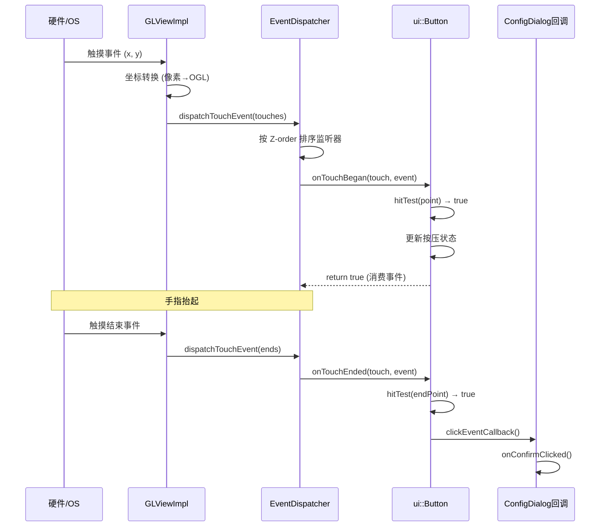

# 02 — 事件流追踪与设计缺陷分析

> **所属模块：** M13-UI框架替换实战
> **前置知识：** [01-表单源码与资源文件解析](./01-表单源码与资源文件解析.md)、[M03-平台抽象层解析](../../M03-平台抽象层解析/)
> **预计阅读时间：** 60 分钟

## 本节目标

读完本节后，你将能够：

1. 描述 Cocos2d-x 触摸事件从硬件到 UI 回调的完整分发路径
2. 解释 Cocos2d-x 事件系统中的"冒泡"（bubbling）与"捕获"（capturing）区别
3. 识别 KrKr2 现有 UI 层至少 4 个需要改进的设计缺陷
4. 绘制 KrKr2 的 UI 事件全链路流程图（从触摸事件到业务回调）

## 术语预览

| 术语 | 英文 | 一句话解释 |
|------|------|-----------|
| 事件分发 | Event Dispatch | 操作系统收到用户输入后，将事件传递给正确的 UI 组件的过程 |
| 事件冒泡 | Event Bubbling | 事件从最深层的子节点开始处理，逐级向父节点传递（子→父） |
| 事件监听器 | Event Listener | 注册在节点上等待特定事件的回调对象，Cocos2d-x 通过 `EventListenerTouchOneByOne` 实现 |
| 吞噬 | Swallow | `EventListenerTouchOneByOne` 的属性，设置为 `true` 时该监听器消费事件，不再继续传递 |
| Z-order | Z 轴顺序 | 控制节点的渲染顺序和触摸优先级，Z-order 越大越靠上，触摸优先级越高 |
| 脏矩形 | Dirty Rect | 需要重新绘制的屏幕区域，避免每帧重绘整个屏幕以提升性能 |
| 线程安全 | Thread Safety | 多线程环境下数据访问不产生竞态条件的属性；Cocos2d-x 要求所有 UI 操作在主线程执行 |

## 一、Cocos2d-x 事件系统架构

### 1.1 事件驱动模型

Cocos2d-x 使用**发布-订阅（Publish-Subscribe）**模式实现事件系统。核心组件是 `EventDispatcher`（事件分发器），它维护一个事件监听器的优先级队列，并在每帧结束时清理失效的监听器。

```
Cocos2d-x 事件系统组件关系：

Director
  └── EventDispatcher（事件分发器）
        ├── 优先级队列：[ Listener_Z1000, Listener_Z500, Listener_Z0, ... ]
        └── 节点与监听器映射表：{ Node* → [Listener*, ...] }

事件类型：
  ├── EventTouch（触摸事件）→ EventListenerTouchOneByOne / EventListenerTouchAllAtOnce
  ├── EventMouse（鼠标事件）→ EventListenerMouse
  ├── EventKeyboard（键盘事件）→ EventListenerKeyboard
  ├── EventAcceleration（加速度计）→ EventListenerAcceleration
  └── EventCustom（自定义事件）→ EventListenerCustom
```

### 1.2 触摸事件的完整分发路径

以用户点击"确定"按钮为例，追踪从手指按下到回调被调用的完整路径：

```
[ 硬件层 ]
  手指触摸屏幕
        ↓
[ 操作系统层 ]
  Android: MotionEvent → JNI → cocos2d::GLViewImpl::handleTouchesBegin()
  iOS:     UITouch → cocos2d::GLViewImpl::handleTouchesBegin()
  Windows: WM_LBUTTONDOWN → cocos2d::GLViewImpl::handleTouchesBegin()
  Linux:   X11/SDL2 Event → cocos2d::GLViewImpl::handleTouchesBegin()
        ↓
[ Cocos2d-x GL View 层 ]
  GLViewImpl::handleTouchesBegin(touches, num)
  → 将坐标从像素坐标转换为 OpenGL 坐标系
  → 创建 Touch 对象列表
  → Director::getInstance()->getEventDispatcher()->dispatchTouchEvent(touches)
        ↓
[ EventDispatcher 层 ]
  按优先级遍历所有 EventListenerTouchOneByOne（Z-order 高的优先）：
  for each listener in priority_queue:
      if listener->onTouchBegan(touch, event) == true:
          if listener->swallowTouches == true:
              break  // 事件被吞噬，不再继续传递
          // 否则继续传递给下一个监听器
        ↓
[ UI Widget 层（cocos2d::ui::Button）]
  Widget::onTouchBegan()
  → 判断触摸点是否在按钮边界内 (hitTest)
  → 如果是：标记按钮为 pressed 状态，更换按压图
  → 返回 true（消费此次 Touch 事件的后续移动/抬起）
        ↓
  手指抬起 → onTouchEnded()
  → 判断抬起位置是否仍在按钮边界内
  → 如果是：调用 clickEventCallback（用户注册的点击回调）
        ↓
[ 业务层 ]
  ConfigDialog::onConfirmClicked()
  → 读取当前控件状态，更新 ConfigManager
  → removeFromParentAndCleanup()
```

### 1.3 优先级与 Z-order

Cocos2d-x 的触摸优先级规则：

```cpp
// 有两种设置触摸优先级的方式：

// 方式 1：固定优先级（数字越小越优先，负数比所有场景节点都优先）
auto listener = EventListenerTouchOneByOne::create();
listener->setSwallowTouches(true);
listener->onTouchBegan = [](Touch* touch, Event* event) -> bool {
    // 处理触摸...
    return true;
};
// 注册时指定固定优先级
Director::getInstance()->getEventDispatcher()->addEventListenerWithFixedPriority(
    listener, -100  // 优先级为 -100，比所有场景节点都优先
);

// 方式 2：基于场景节点 Z-order（推荐方式）
auto listener2 = EventListenerTouchOneByOne::create();
listener2->setSwallowTouches(true);
listener2->onTouchBegan = [](Touch* touch, Event* event) -> bool {
    return true;
};
// 注册到节点，优先级等于节点的全局 Z-order
Director::getInstance()->getEventDispatcher()->addEventListenerWithSceneGraphPriority(
    listener2, myButton  // myButton 的 Z-order 决定优先级
);
```

**重要规则**：Z-order 相同时，后添加到父节点的子节点优先级更高（后入先出）。

## 二、KrKr2 事件流的具体追踪

### 2.1 触摸事件进入 KrKr2 的入口

在不同平台上，触摸事件进入 KrKr2 的方式不同：

```
Android 路径：
  KrkrActivity.java → onTouchEvent()
    → KrkrNDKHelper.nativeTouch()
      → JNI → cpp/core/environ/cocos2d/AppDelegate.cpp
        → Cocos2d GLView → EventDispatcher

Windows 路径：
  platforms/windows/main.cpp → WinMain()
    → Win32 消息泵 → WM_LBUTTONDOWN/WM_MOUSEMOVE/WM_LBUTTONUP
      → cocos2d::GLViewImpl (win32) → handleTouchesBegin()
        → EventDispatcher

Linux/macOS 路径：
  platforms/linux/main.cpp / platforms/apple/macos/main.cpp
    → SDL2 或 NSEvent 事件循环
      → cocos2d::GLViewImpl → handleTouchesBegin()
        → EventDispatcher
```

### 2.2 系统 UI 层如何拦截触摸

当系统 UI 对话框（如 ConfigDialog）弹出时，它必须"吃掉"所有触摸事件，防止触摸穿透到下层游戏内容。KrKr2 的实现方式：

```cpp
// ConfigDialog 使用高 Z-order 和 swallowTouches 实现触摸拦截
bool ConfigDialog::init() {
    if (!Layer::init()) return false;

    // 创建一个全屏半透明背景，同时注册 swallowTouches 监听器
    auto touchListener = EventListenerTouchOneByOne::create();
    touchListener->setSwallowTouches(true);  // 关键：吞噬所有触摸
    touchListener->onTouchBegan = [](Touch* touch, Event* event) -> bool {
        return true;  // 始终返回 true，表示"消费"此次触摸
    };
    // 注册到 EventDispatcher，优先级绑定到当前节点（高 Z-order）
    _eventDispatcher->addEventListenerWithSceneGraphPriority(touchListener, this);

    // 加载 CSB 布局
    auto root = CSLoader::createNode("ui/cocos-studio/ConfigDialog.csb");
    this->addChild(root);

    bindWidgets();
    registerCallbacks();
    return true;
}

// 显示对话框时以高 Z-order 添加到场景
void ConfigDialog::show() {
    auto scene = Director::getInstance()->getRunningScene();
    scene->addChild(this, 1000);  // Z-order 1000，高于所有游戏内容
}
```

## 三、设计缺陷分析

深入理解了现有架构后，我们来识别阻碍"用现代 UI 框架替换 Cocos2d-x UI"的技术债务。

### 缺陷 1：UI 逻辑与 Cocos2d-x 类深度耦合

**问题**：所有 UI 表单都直接继承自 `cocos2d::Layer` 或 `cocos2d::ui::Widget`，UI 业务逻辑与渲染引擎混为一谈。

```cpp
// ❌ 问题代码：ConfigDialog 直接继承 Cocos2d 类
class ConfigDialog : public cocos2d::Layer {
    cocos2d::ui::Slider* m_volumeSlider;  // 直接持有 Cocos2d 控件指针

    void onVolumeChanged(cocos2d::Ref* sender,
                         cocos2d::ui::Slider::EventType type) {
        float volume = m_volumeSlider->getPercent() / 100.0f;
        AudioEngine::getInstance()->setMasterVolume(volume);
    }
};
```

**后果**：替换 UI 框架时，必须重写所有 `ConfigDialog`、`GameStartDialog` 等类，而且业务逻辑（读取滑块值、调用 AudioEngine）也混在 Cocos2d-x 的回调签名里，难以单独测试。

**修复方向**：引入 View-Presenter 分离——UI 控件只负责显示和触发事件，业务逻辑放在与渲染引擎无关的 Presenter 类中。

### 缺陷 2：无统一的对话框管理器

**问题**：每个对话框的显示/隐藏逻辑分散在各处，没有统一的生命周期管理。

```cpp
// ❌ 问题：显示对话框的代码分散
// 在 AppDelegate 中：
configBtn->addClickEventListener([](Ref*) {
    auto dialog = ConfigDialog::create();
    Director::getInstance()->getRunningScene()->addChild(dialog, 1000);
    // 问题1：如果已经有一个 ConfigDialog 打开了，会重复创建
    // 问题2：没有动画/过渡效果
    // 问题3：销毁时没有统一清理
});
```

**修复方向**：实现 `UIManager` 单例，统一管理所有对话框的推入/弹出，支持栈式导航（类似 Android 的 Activity Back Stack）。

### 缺陷 3：事件处理与 UI 状态同步问题

**问题**：Cocos2d-x 的事件回调在渲染线程中执行，而某些后台操作（加载存档、扫描游戏目录）在工作线程中完成，回调后需要更新 UI，但不能在非主线程操作 Cocos2d-x 节点。

```cpp
// ❌ 问题代码：在工作线程中直接操作 UI（会崩溃）
std::thread([this]() {
    auto games = scanGameDirectory("/sdcard/games/");
    // 错误！不能在非主线程操作 Cocos2d-x 节点
    m_gameListView->removeAllItems();  // 崩溃风险
    for (auto& game : games) {
        m_gameListView->addItem(game.name);  // 崩溃风险
    }
}).detach();

// ✅ 正确做法：使用 scheduleOnce 切回主线程
std::thread([this]() {
    auto games = scanGameDirectory("/sdcard/games/");
    // 切回主线程更新 UI
    Director::getInstance()->getScheduler()->performFunctionInCocosThread([this, games]() {
        m_gameListView->removeAllItems();
        for (auto& game : games) {
            m_gameListView->addItem(game.name);
        }
    });
}).detach();
```

### 缺陷 4：触摸事件与鼠标事件的双套处理

**问题**：移动端使用 `EventListenerTouchOneByOne`，桌面端使用 `EventListenerMouse`，两套事件系统需要在每个表单中分别处理，大量重复代码。

```cpp
// ❌ 问题：每个对话框都要写两套输入处理
// 触摸处理（移动端）
auto touchListener = EventListenerTouchOneByOne::create();
touchListener->onTouchBegan = [](Touch* t, Event*) -> bool {
    // 处理触摸...
    return true;
};
_eventDispatcher->addEventListenerWithSceneGraphPriority(touchListener, this);

// 鼠标处理（桌面端）
auto mouseListener = EventListenerMouse::create();
mouseListener->onMouseDown = [](EventMouse* e) {
    // 处理鼠标点击...（与触摸处理几乎相同的逻辑）
};
_eventDispatcher->addEventListenerWithSceneGraphPriority(mouseListener, this);
```

**修复方向**：在抽象接口层统一为"指针事件"（Pointer Event），不区分触摸和鼠标，由适配器层负责将平台事件转换为统一格式。

### 缺陷汇总表

| 缺陷 | 根本原因 | 影响范围 | 修复优先级 |
|------|---------|---------|---------|
| UI 逻辑与 Cocos2d-x 耦合 | 直接继承 Cocos2d 类 | 所有表单 | 高（UI 替换的前提） |
| 无统一对话框管理器 | 显示逻辑分散 | 表单间切换、返回键处理 | 高 |
| 非主线程 UI 操作 | 缺少线程安全封装 | 所有异步操作 | 中 |
| 触摸/鼠标双套处理 | 缺少输入抽象 | 所有表单 | 中 |
| 不支持动态语言切换 | locale 与节点强绑定 | 国际化 | 低 |
| 固定布局不适配不同分辨率 | CSB 固定像素尺寸 | 分辨率适配 | 低 |

## 四、动手实践：为 KrKr2 绘制 UI 事件全链路图

### 步骤 1：在代码中添加日志追踪

在 `ConfigDialog::init()` 和事件回调中添加 `CCLOG` 日志：

```cpp
bool ConfigDialog::init() {
    CCLOG("=== ConfigDialog::init() 开始 ===");
    if (!Layer::init()) return false;

    auto root = CSLoader::createNode("ui/cocos-studio/ConfigDialog.csb");
    CCLOG("CSB 已加载，节点数量：%d", root->getChildrenCount());
    this->addChild(root);

    auto okButton = root->findChild<cocos2d::ui::Button*>("OkButton");
    if (okButton) {
        okButton->addClickEventListener([this](Ref*) {
            CCLOG("=== OkButton 点击事件 ===");
            this->onConfirmClicked();
        });
        CCLOG("OkButton 事件注册成功");
    } else {
        CCLOG("错误：找不到 OkButton！");
    }
    return true;
}
```

### 步骤 2：运行并观察日志

```bash
# Android 通过 adb logcat 查看（过滤 cocos2d 标签）
adb logcat -s cocos2d:V

# Windows/Linux 通过终端查看标准输出（Cocos2d-x CCLOG 输出到控制台）
cmake --build --preset="Windows Debug Build" && ./out/windows/debug/krkr2.exe
```

预期日志顺序：
```
=== ConfigDialog::init() 开始 ===
CSB 已加载，节点数量：8
OkButton 事件注册成功
[用户点击 OkButton]
=== OkButton 点击事件 ===
```

### 步骤 3：绘制事件流图

根据追踪结果，绘制以下流程图（Mermaid 格式，可在 GitHub Markdown 中渲染）：



## 五、对照项目源码

以下是追踪代码路径的关键文件：

相关文件：
- `cpp/core/environ/ui/` — 所有 UI 表单实现
- `cpp/core/environ/cocos2d/AppDelegate.cpp` — Cocos2d Director 初始化，触摸分发起点
- `platforms/android/cpp/krkr2_android.cpp` — Android JNI 层，触摸事件从 Java 传入 C++ 的桥接点
- `platforms/windows/main.cpp` — Windows 消息循环，Win32 触摸/鼠标事件的入口
- Cocos2d-x 源码（项目 third_party 中）：`cocos/base/CCEventDispatcher.cpp` — `dispatchTouchEvent()` 实现

## 本节小结

- Cocos2d-x 事件系统基于发布-订阅模式，`EventDispatcher` 按 Z-order 优先级分发触摸事件
- `EventListenerTouchOneByOne` + `swallowTouches=true` 是实现对话框触摸拦截的标准方式
- 触摸事件在各平台有不同入口，但最终都汇聚到 `GLViewImpl::handleTouchesBegin()`
- KrKr2 现有 UI 层存在 6 个设计缺陷，最关键的是：UI 逻辑与 Cocos2d-x 深度耦合 + 无统一对话框管理
- 下一章将设计平台无关的 UI 抽象接口，解决这些缺陷

## 练习题与答案

### 题目 1：事件吞噬机制

如果一个 `EventListenerTouchOneByOne` 的 `swallowTouches` 设为 `false`，且 `onTouchBegan` 返回 `true`，会发生什么？与 `swallowTouches=true` 的区别是什么？

<details>
<summary>查看答案</summary>

**`swallowTouches=false`，`onTouchBegan` 返回 `true`：**

这种情况下，`onTouchBegan` 返回 `true` 表示该监听器"认领"了这次触摸（即后续的 `onTouchMoved`/`onTouchEnded` 都会发送给这个监听器），但**不阻止**事件继续向下传递给其他监听器。

换句话说：
- `onTouchBegan` 返回 `true`：该监听器订阅此次触摸的后续事件
- `swallowTouches=true`：在`onTouchBegan` 返回 `true` 的基础上，**额外**阻止事件传递给优先级更低的其他监听器

**区别对比：**

| 配置 | 后续事件（Move/End）发给谁 | 其他监听器收到 Begin 吗 |
|------|--------------------------|----------------------|
| `swallowTouches=false` + `onTouchBegan` 返回 `true` | 该监听器 | **是**，继续传递 |
| `swallowTouches=true` + `onTouchBegan` 返回 `true` | 该监听器 | **否**，被吞噬 |
| `onTouchBegan` 返回 `false`（无论 swallowTouches） | 该监听器不会收到后续 | 是，继续传递 |

**实际应用**：对话框弹出时需要 `swallowTouches=true` 以防止触摸穿透。可拖拽的窗口内的子按钮应该 `swallowTouches=false`，让拖拽逻辑也能处理触摸移动事件。

</details>

### 题目 2：线程安全问题修复

以下代码在后台线程中更新 UI，存在严重的线程安全问题。请用 `Director::getInstance()->getScheduler()->performFunctionInCocosThread()` 修复它：

```cpp
void GameStartDialog::onScanComplete(std::vector<std::string> gameList) {
    // 在工作线程中被调用
    m_listView->removeAllItems();
    for (const auto& game : gameList) {
        auto item = cocos2d::ui::Text::create(game, "fonts/arial.ttf", 24);
        m_listView->addItem(item);
    }
    m_loadingIndicator->setVisible(false);
}
```

<details>
<summary>查看答案</summary>

```cpp
void GameStartDialog::onScanComplete(std::vector<std::string> gameList) {
    // 在工作线程中被调用 — 不能直接操作 Cocos2d-x 节点！

    // 方法：将 UI 更新操作 post 到主线程（Cocos2d 渲染线程）
    Director::getInstance()->getScheduler()->performFunctionInCocosThread(
        [this, gameList = std::move(gameList)]() {
            // 此 lambda 在主线程（Cocos2d 渲染线程）中执行 — 安全
            m_listView->removeAllItems();
            for (const auto& game : gameList) {
                auto item = cocos2d::ui::Text::create(game, "fonts/arial.ttf", 24);
                m_listView->addItem(item);
            }
            m_loadingIndicator->setVisible(false);
        }
    );
}
```

**关键点说明：**
1. `performFunctionInCocosThread()` 将 lambda 加入一个线程安全的队列，Cocos2d-x 主循环在下一帧开始时从队列中取出并执行
2. `gameList = std::move(gameList)` 使用移动语义避免 vector 的深拷贝，因为 lambda 可能在工作线程返回后才执行
3. 访问 `this` 指针时需要确保 `GameStartDialog` 在 lambda 执行时仍然存在（可以用 `std::weak_ptr` 或检查节点是否已从父节点移除）

</details>

### 题目 3：设计层次问题

Cocos2d-x 的 `EventListenerTouchOneByOne` 是基于节点 Z-order 的，而 KrKr2 使用 Z-order 1000 来显示对话框。如果同时弹出两个对话框，会出现什么问题？如何正确处理这种情况？

<details>
<summary>查看答案</summary>

**问题分析：**

如果两个对话框都使用 Z-order 1000，它们的触摸优先级相同。Cocos2d-x 会按添加到场景的顺序（后添加的优先级更高）决定哪个先响应触摸，但这是未定义行为，取决于内部实现细节，不可靠。

**可能出现的问题：**
1. 两个对话框都能响应触摸（如果都不 swallowTouches）
2. 下层对话框的触摸区域与上层重叠时，可能产生意外点击
3. 关闭逻辑混乱（关了哪个？按返回键关哪个？）

**正确方案：使用对话框栈（Dialog Stack）**

```cpp
class UIManager {
public:
    // 推入新对话框（每个对话框 Z-order 递增）
    void pushDialog(cocos2d::Layer* dialog) {
        const int BASE_Z = 1000;
        int z = BASE_Z + m_dialogStack.size() * 10;
        Director::getInstance()->getRunningScene()->addChild(dialog, z);
        m_dialogStack.push_back(dialog);
        CCLOG("UIManager: 推入对话框，当前深度=%zu，Z-order=%d",
              m_dialogStack.size(), z);
    }

    // 弹出最顶层对话框
    void popDialog() {
        if (m_dialogStack.empty()) return;
        auto top = m_dialogStack.back();
        top->removeFromParentAndCleanup(true);
        m_dialogStack.pop_back();
    }

    // 处理返回键（移动端）
    void onBackKeyPressed() {
        if (!m_dialogStack.empty()) {
            popDialog();  // 关闭最顶层对话框
        }
    }

private:
    std::vector<cocos2d::Layer*> m_dialogStack;
};
```

这样第一个对话框 Z=1000，第二个 Z=1010，确保触摸优先级正确，且返回键逻辑清晰。

</details>

## 下一步

[02-UI抽象接口设计](../02-UI抽象接口设计/01-接口定义与依赖倒置原则.md) — 基于本章发现的缺陷，设计平台无关的 UI 抽象接口，为 Flutter/Compose 替换做架构准备。
