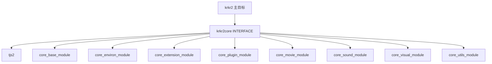
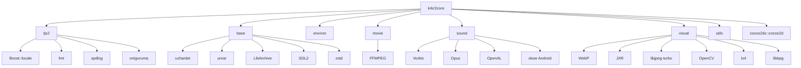

# 02-core 模块 CMake 解读

> **所属模块：** P01-现代CMake与构建工具链
> **前置知识：** [01-根CMakeLists解读.md](./01-根CMakeLists解读.md)
> **预计阅读时间：** 30 分钟
> **后续章节：** [03-平台条件编译.md](./03-平台条件编译.md)

## 元数据块

| 字段 | 内容 |
|---|---|
| 文档定位 | P01 第6章 第2节 |
| 类型 | 实战解读 |
| 目标源码 | `krkr2/cpp/core/CMakeLists.txt` 与子模块 CMakeLists |
| 核心主题 | INTERFACE 聚合、平台条件、依赖传播 |
| 平台覆盖 | Windows / Linux / macOS / Android |

## 本节目标

读完本节后，你将能够：

1. 解释 `krkr2core` 使用 `INTERFACE` 的原因。
2. 逐一读懂 `tjs2/base/environ/extension/plugin/movie/sound/visual/utils` 的构建角色。
3. 识别 core 顶层如何聚合子模块与第三方库。
4. 理解显式源文件列表与 `file(GLOB_RECURSE)` 的取舍。
5. 独立完成“新增核心子模块”的 CMake 修改。

---

## 1. core 顶层结构总览

核心文件是 `krkr2/cpp/core/CMakeLists.txt`。

```cmake
cmake_minimum_required(VERSION 3.28)
project(krkr2core)

include_directories(${CMAKE_CURRENT_SOURCE_DIR}/common)

add_library(${PROJECT_NAME} INTERFACE)

add_subdirectory(tjs2)
add_subdirectory(base)
add_subdirectory(environ)
add_subdirectory(extension)
add_subdirectory(plugin)
add_subdirectory(movie)
add_subdirectory(sound)
add_subdirectory(visual)
add_subdirectory(utils)
```

这段骨架清楚表达：

- 顶层不直接编译 `.cpp`。
- 顶层负责组织 9 个核心子模块。
- 顶层目标 `krkr2core` 是“聚合入口”。

对应关系如下。



---

## 2. `krkr2core` INTERFACE 设计原理

### 2.1 INTERFACE 的作用

`INTERFACE library` 不产出实体库文件。
它用于承载“可传播构建属性”：

1. include 目录
2. 宏定义
3. 链接依赖

### 2.2 为什么 core 顶层适合 INTERFACE

`krkr2core` 没有 `target_sources`。
它只负责编排子模块并向上游传播依赖。
所以使用 `INTERFACE` 最贴切。

### 2.3 聚合链接

```cmake
target_link_libraries(${PROJECT_NAME} INTERFACE
    tjs2
    core_base_module
    core_environ_module
    core_extension_module
    core_plugin_module
    core_movie_module
    core_sound_module
    core_visual_module
    core_utils_module
)
```

主程序只需链接 `krkr2core`，即可继承以上链路。

---

## 3. 顶层公共属性与条件编译

### 3.1 公共 include 和宏

```cmake
target_include_directories(${PROJECT_NAME} INTERFACE
    ${CMAKE_CURRENT_SOURCE_DIR}
)

target_compile_definitions(${PROJECT_NAME} INTERFACE
    -DTJS_TEXT_OUT_CRLF
    -D__STDC_CONSTANT_MACROS
    -DUSE_UNICODE_FSTRING
)
```

### 3.2 OpenMP 条件

```cmake
if(NOT APPLE)
    find_package(OpenMP REQUIRED)
    target_link_libraries(${PROJECT_NAME} INTERFACE OpenMP::OpenMP_CXX)
    target_compile_options(${PROJECT_NAME} INTERFACE ${OpenMP_CXX_FLAGS})
endif()
```

### 3.3 Android 系统库条件

```cmake
if(ANDROID)
    target_link_libraries(${PROJECT_NAME} INTERFACE
        log
        android
        EGL
        GLESv2
        GLESv1_CM
        OpenSLES
    )
endif()
```

### 3.4 cocos2dx 统一注入

```cmake
find_package(cocos2dx CONFIG REQUIRED)
target_link_libraries(${PROJECT_NAME} INTERFACE
    cocos2dx::cocos2d
    $<$<BOOL:${ANDROID}>:$<LINK_LIBRARY:WHOLE_ARCHIVE,cocos2dx::cpp_android_spec>>
)
```

Android 上使用 `WHOLE_ARCHIVE`，避免链接器误裁剪关键符号。

---

## 4. 子模块 CMake 逐一分析

### 4.1 `tjs2`

文件：`krkr2/cpp/core/tjs2/CMakeLists.txt`

特征：

1. `add_library(tjs2 STATIC)`。
2. Bison 生成 parser 代码。
3. Python 脚本生成词表。
4. 依赖 `Boost::locale/fmt/spdlog/oniguruma`。

### 4.2 `base`

文件：`krkr2/cpp/core/base/CMakeLists.txt`

特征：

1. `core_base_module STATIC`。
2. 显式列出归档、流、事件相关源码。
3. 依赖 `uchardet/unrar/LibArchive/SDL2/zstd/cocos2dx`。

### 4.3 `environ`

文件：`krkr2/cpp/core/environ/CMakeLists.txt`

特征：

1. Apple 平台启用 `OBJC/OBJCXX`。
2. 平台源文件通过生成器表达式选择。
3. 依赖 `cocos2dx/7zip/minizip`。

### 4.4 `extension`

文件：`krkr2/cpp/core/extension/CMakeLists.txt`

特征：

1. `core_extension_module STATIC`。
2. 目标较小，主要是扩展接口层。

### 4.5 `plugin`

文件：`krkr2/cpp/core/plugin/CMakeLists.txt`

特征：

1. 核心文件 `ncbind.cpp/PluginIntf.cpp/PluginImpl.cpp`。
2. 依赖脚本层与运行时模块。

### 4.6 `movie`

文件：`krkr2/cpp/core/movie/CMakeLists.txt`

特征：

1. 源文件主要位于 `ffmpeg` 子目录。
2. `find_package(FFMPEG COMPONENTS ...)` 明确组件。
3. 链接 `cocos2dx`。

### 4.7 `sound`

文件：`krkr2/cpp/core/sound/CMakeLists.txt`

特征：

1. 依赖 Vorbis、Opus、OpenAL。
2. Android 条件引入 `oboe::oboe`。

### 4.8 `visual`

文件：`krkr2/cpp/core/visual/CMakeLists.txt`

特征：

1. 源文件最多，覆盖加载器、图层、渲染实现。
2. 依赖 WebP/JXR/libjpeg/OpenCV/lz4/libbpg/cocos2dx。

### 4.9 `utils`

文件：`krkr2/cpp/core/utils/CMakeLists.txt`

特征：

1. 提供线程、计时、随机、编码与调试能力。
2. 依赖面较轻。

---

## 5. INTERFACE 聚合机制

`krkr2core` 的核心价值是传播。

主程序链接它后，能继承：

1. 子模块链接项。
2. 顶层 include 与宏。
3. 平台条件下的额外系统库。

实践建议：

- 聚合层持续保持“只编排、不实现”。
- 子模块内部依赖优先 `PRIVATE`，避免传播失控。

---

## 6. 源文件组织策略：显式列表与 `file(GLOB_RECURSE)`

当前 core 子模块基本采用显式列表。

### 6.1 显式列表优势

1. 每次新增源文件都能在 CMake Diff 里看到。
2. 可明确禁用特定文件。
3. 排错时定位直观。

### 6.2 `file(GLOB_RECURSE)` 示例

```cmake
file(GLOB_RECURSE NETWORK_SOURCES
    CONFIGURE_DEPENDS
    ${CMAKE_CURRENT_LIST_DIR}/*.cpp
    ${CMAKE_CURRENT_LIST_DIR}/*.c
)

add_library(core_network_module STATIC)
target_sources(core_network_module PRIVATE ${NETWORK_SOURCES})
```

### 6.3 取舍建议

在 core 基础层，继续显式列表更稳。
`GLOB_RECURSE` 适合边界清晰、变动频繁的新模块。

---

## 7. 条件编译启用矩阵

| 位置 | 条件 | Windows | Linux | macOS | Android |
|---|---|---|---|---|---|
| core 顶层 | `if(NOT APPLE)` OpenMP | 是 | 是 | 否 | 是 |
| core 顶层 | `if(ANDROID)` 系统库 | 否 | 否 | 否 | 是 |
| environ | 平台源文件表达式 | win32 | linux | apple | android + linux 平台实现 |
| sound | `if(ANDROID)` Oboe | 否 | 否 | 否 | 是 |
| tjs2 | `if(WINDOWS)` `/FS` | 是 | 否 | 否 | 否 |

---

## 8. 第三方库链接关系图



---

## 9. 修改指南：新增核心子模块

下面是最小可落地流程。

### 步骤 1：创建目录和源码

目录示例：`krkr2/cpp/core/network/`

`NetworkIntf.h`

```cpp
#pragma once

namespace krkr2 {
class NetworkIntf {
public:
    static const char* ModuleName();
};
}
```

`NetworkIntf.cpp`

```cpp
#include "NetworkIntf.h"

namespace krkr2 {
const char* NetworkIntf::ModuleName() {
    return "core_network_module";
}
}
```

### 步骤 2：新增 `network/CMakeLists.txt`

```cmake
cmake_minimum_required(VERSION 3.19)
project(core_network_module LANGUAGES CXX)

add_library(${PROJECT_NAME} STATIC)
target_sources(${PROJECT_NAME} PRIVATE
    ${CMAKE_CURRENT_LIST_DIR}/NetworkIntf.cpp
)
target_include_directories(${PROJECT_NAME} PUBLIC
    ${CMAKE_CURRENT_LIST_DIR}
)
target_link_libraries(${PROJECT_NAME} PUBLIC tjs2)
```

### 步骤 3：接入 `core/CMakeLists.txt`

增加子目录：

```cmake
add_subdirectory(network)
```

增加聚合链接项：

```cmake
core_network_module
```

---

## 10. 动手实践

1. 打开 `krkr2/cpp/core/CMakeLists.txt`，确认 `add_library(${PROJECT_NAME} INTERFACE)` 与聚合链接列表的对应关系。
2. 打开 `krkr2/cpp/core/environ/CMakeLists.txt`，找出平台源文件生成器表达式。
3. 打开 `krkr2/cpp/core/sound/CMakeLists.txt`，定位 Android `oboe` 条件分支。
4. 按第 9 节手动写出 `network/CMakeLists.txt` 与顶层两处接入改动。

---

## 11. 对照项目源码（重点）

重点回看：`core/CMakeLists.txt`（聚合）、`environ/CMakeLists.txt`（平台源文件选择）、`sound/CMakeLists.txt`（Android 条件链接）、`visual/CMakeLists.txt`（重依赖区）。

---

## 本节小结

- `krkr2core` 是接口聚合层，不是实现库。
- 子模块承担实际构建，顶层负责统一传播。
- 平台差异主要在条件链接与条件源文件选择。
- 显式源文件列表更契合 core 层的可维护性目标。
- 新增核心模块的关键是：注册子目录 + 注册聚合链接。

---

## 练习题与答案

### 题目 1：概念题
为什么 `krkr2core` 适合 `INTERFACE`，而 `core_visual_module` 适合 `STATIC`？

<details>
<summary>查看答案</summary>

`krkr2core` 只做依赖与属性传播，没有自身实现源码，因此用 `INTERFACE`。`core_visual_module` 包含大量真实 `.cpp` 实现，需要产出可链接静态库，因此用 `STATIC`。

</details>

### 题目 2：读码题
`environ` 中平台源文件为什么要用生成器表达式而不是拆成四套独立 CMake？

<details>
<summary>查看答案</summary>

生成器表达式可以在一份脚本中集中管理多平台源文件选择，减少重复和漂移风险，维护成本更低。它让平台差异集中在同一处，便于审查与排错。

</details>

### 题目 3：实战题
给 `core` 增加 `network` 子模块时，`core/CMakeLists.txt` 必须改哪两处？

<details>
<summary>查看答案</summary>

第一处新增子目录：

```cmake
add_subdirectory(network)
```

第二处新增聚合链接项（示例）：

```cmake
target_link_libraries(${PROJECT_NAME} INTERFACE core_network_module)
```

</details>

---

## 下一步
继续阅读：[03-平台条件编译.md](./03-平台条件编译.md)

下一节将聚焦：

1. 平台变量在项目中的定义来源。
2. `if()` 与生成器表达式的使用边界。
3. 如何让跨平台 CMake 结构保持可维护。
