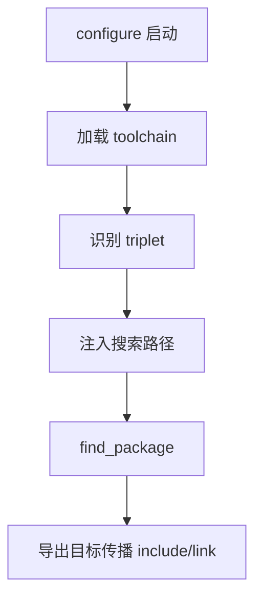

# 01-toolchain文件：将 vcpkg 注入 CMake

> **所属模块：** P02-vcpkg包管理 / 03-vcpkg与CMake集成
>
> **前置知识：** P02 前两章、P01 的 CMake 配置阶段基础
>
> **预计阅读时间：** 30-40 分钟

## 本节目标

读完本节后，你将能够：

1. 解释 `CMAKE_TOOLCHAIN_FILE` 的作用与生效时机。
2. 理解 vcpkg toolchain 的核心工作机制。
3. 使用命令行、Preset、环境变量设置 toolchain。
4. 理解 `VCPKG_CHAINLOAD_TOOLCHAIN_FILE` 叠加机制。
5. 分析 KrKr2 的 `cmake/vcpkg_android.cmake` 实际写法。
6. 写出最小可维护的自定义 toolchain 示例。

## 为什么 `find_package` 会找不到 vcpkg 安装的库

你已经会用 vcpkg 安装依赖。
但 CMake 默认并不知道 vcpkg 的安装目录。

默认情况下，CMake 优先搜索系统路径与编译器默认路径，
不会自动扫描 `vcpkg_installed/<triplet>`。

因此核心问题不是“库没装”，
而是“搜索上下文没被正确注入”。

## CMake toolchain 文件基础概念（`CMAKE_TOOLCHAIN_FILE`）

`CMAKE_TOOLCHAIN_FILE` 是一个缓存变量，
值是 `.cmake` 脚本路径。

该脚本在配置早期加载，主要负责：

1. 指定目标平台与架构。
2. 指定编译器和 sysroot。
3. 指定查找策略。
4. 注入外部依赖前缀。

简化理解：

- `CMakeLists.txt` 决定构建目标。
- toolchain 决定构建环境。

## vcpkg 的 toolchain 文件工作原理

vcpkg 入口文件：

`$VCPKG_ROOT/scripts/buildsystems/vcpkg.cmake`

它的核心不是替代业务 CMake，
而是让 CMake 在 `find_package` 前拿到正确依赖路径信息。

它通常会做这些事：

1. 读取 `VCPKG_TARGET_TRIPLET`。
2. 注入 vcpkg 安装前缀到搜索变量。
3. 调整包查找优先级。
4. 支持 manifest 场景。
5. 支持 chainload 叠加其他 toolchain。

## `CMAKE_TOOLCHAIN_FILE` 设置方式

### 方式一：命令行

```bash
cmake -S . -B out/linux/debug \
  -DCMAKE_TOOLCHAIN_FILE="$VCPKG_ROOT/scripts/buildsystems/vcpkg.cmake" \
  -DVCPKG_TARGET_TRIPLET=x64-linux
```

Windows PowerShell：

```powershell
cmake -S . -B out/windows/debug `
  -DCMAKE_TOOLCHAIN_FILE="$env:VCPKG_ROOT/scripts/buildsystems/vcpkg.cmake" `
  -DVCPKG_TARGET_TRIPLET="x64-windows-static-md"
```

### 方式二：Preset（推荐）

```json
{
  "version": 6,
  "configurePresets": [
    {
      "name": "linux-debug",
      "generator": "Ninja",
      "binaryDir": "${sourceDir}/out/linux/debug",
      "cacheVariables": {
        "CMAKE_TOOLCHAIN_FILE": "$env{VCPKG_ROOT}/scripts/buildsystems/vcpkg.cmake",
        "VCPKG_TARGET_TRIPLET": "x64-linux"
      }
    }
  ]
}
```

### 方式三：环境变量配合

```bash
export VCPKG_ROOT=/opt/vcpkg
cmake -S . -B out/linux/release \
  -DCMAKE_TOOLCHAIN_FILE="$VCPKG_ROOT/scripts/buildsystems/vcpkg.cmake"
```

## toolchain 内部做了什么

流程可简化为：



业务 CMake 示例：

```cmake
find_package(fmt CONFIG REQUIRED)
add_executable(demo main.cpp)
target_link_libraries(demo PRIVATE fmt::fmt)
```

## `VCPKG_TARGET_TRIPLET` 的作用

triplet 决定平台、架构和链接策略。

常见值：

- `x64-windows-static-md`
- `x64-linux`
- `arm64-osx`
- `arm64-android`

triplet 错误会导致找包失败或架构不匹配。

## 叠加 toolchain：`VCPKG_CHAINLOAD_TOOLCHAIN_FILE`

Android 需要 NDK toolchain，
同时也需要 vcpkg toolchain。

由于 `CMAKE_TOOLCHAIN_FILE` 只能有一个，
因此采用 chainload：

```cmake
set(CMAKE_TOOLCHAIN_FILE "$ENV{VCPKG_ROOT}/scripts/buildsystems/vcpkg.cmake" CACHE FILEPATH "")
set(VCPKG_CHAINLOAD_TOOLCHAIN_FILE "$ENV{ANDROID_NDK_HOME}/build/cmake/android.toolchain.cmake" CACHE FILEPATH "")
```

## Android NDK + vcpkg：KrKr2 实际用法

`krkr2/cmake/vcpkg_android.cmake`（99 行）可以分四段：

1. 入口开关：`if (VCPKG_TARGET_ANDROID)`。
2. 环境变量检查：`ANDROID_NDK_HOME` 与 `VCPKG_ROOT`。
3. ABI 映射 triplet。
4. 设置主从 toolchain。

ABI 映射表：

| ANDROID_ABI | VCPKG_TARGET_TRIPLET |
|---|---|
| arm64-v8a | arm64-android |
| armeabi-v7a | arm-android |
| x86_64 | x64-android |
| x86 | x86-android |

## 交叉编译注意事项

1. 每个平台独立 build 目录。
2. 不要在 `project()` 后设置 toolchain。
3. Android 下保证 `ANDROID_ABI`、`ANDROID_PLATFORM`、triplet 一致。
4. 优先使用 `find_package(Pkg CONFIG REQUIRED)`。

## 自定义 toolchain 编写指南

最小示例：

```cmake
# cmake/toolchains/linux-aarch64.cmake
set(CMAKE_SYSTEM_NAME Linux)
set(CMAKE_SYSTEM_PROCESSOR aarch64)
set(CMAKE_C_COMPILER /opt/gcc-aarch64/bin/aarch64-linux-gnu-gcc)
set(CMAKE_CXX_COMPILER /opt/gcc-aarch64/bin/aarch64-linux-gnu-g++)
set(CMAKE_SYSROOT /opt/sysroots/aarch64-linux-gnu)
set(CMAKE_FIND_ROOT_PATH /opt/sysroots/aarch64-linux-gnu)
set(CMAKE_FIND_ROOT_PATH_MODE_PACKAGE ONLY)
set(CMAKE_FIND_ROOT_PATH_MODE_LIBRARY ONLY)
set(CMAKE_FIND_ROOT_PATH_MODE_INCLUDE ONLY)
set(CMAKE_FIND_ROOT_PATH_MODE_PROGRAM NEVER)
```

Android 叠加调用示例：

```bash
cmake -S . -B out/android/arm64-v8a/debug \
  -DCMAKE_TOOLCHAIN_FILE="$VCPKG_ROOT/scripts/buildsystems/vcpkg.cmake" \
  -DVCPKG_CHAINLOAD_TOOLCHAIN_FILE="$ANDROID_NDK_HOME/build/cmake/android.toolchain.cmake" \
  -DANDROID_ABI=arm64-v8a \
  -DVCPKG_TARGET_TRIPLET=arm64-android
```

最小验证工程：

```cmake
cmake_minimum_required(VERSION 3.28)
project(toolchain_demo LANGUAGES CXX)
set(CMAKE_CXX_STANDARD 17)
find_package(fmt CONFIG REQUIRED)
add_executable(toolchain_demo main.cpp)
target_link_libraries(toolchain_demo PRIVATE fmt::fmt)
```

```cpp
#include <fmt/core.h>
int main() { fmt::print("toolchain demo ok\n"); return 0; }
```

## KrKr2 项目 toolchain 配置分析

优点：

1. 开关明确。
2. 失败前置。
3. 映射透明。
4. 叠加规范。

可优化：

1. 错误信息可补充四平台示例。
2. 增加 `ANDROID_PLATFORM` 合法性检查。

## 动手实践

### 步骤 1：设置环境变量

```bash
export VCPKG_ROOT=$HOME/dev/vcpkg
export ANDROID_NDK_HOME=$HOME/Android/Sdk/ndk/26.3.11579264
```

Windows PowerShell：

```powershell
$env:VCPKG_ROOT="C:/dev/vcpkg"
$env:ANDROID_NDK_HOME="C:/Android/Sdk/ndk/26.3.11579264"
```

### 步骤 2：配置桌面构建

```bash
cmake -S . -B out/linux/debug \
  -DCMAKE_TOOLCHAIN_FILE="$VCPKG_ROOT/scripts/buildsystems/vcpkg.cmake" \
  -DVCPKG_TARGET_TRIPLET=x64-linux
```

### 步骤 3：配置 Android 构建

```bash
cmake -S . -B out/android/arm64-v8a/debug \
  -DVCPKG_TARGET_ANDROID=ON \
  -DANDROID_ABI=arm64-v8a
```

### 步骤 4：检查缓存

确认 `CMakeCache.txt` 包含：

- `CMAKE_TOOLCHAIN_FILE`
- `VCPKG_CHAINLOAD_TOOLCHAIN_FILE`
- `VCPKG_TARGET_TRIPLET`

### 步骤 5：执行构建

```bash
cmake --build out/android/arm64-v8a/debug --target krkr2
```

## 对照项目源码

- `krkr2/cmake/vcpkg_android.cmake` 第 20-99 行：Android 叠加逻辑。
- `krkr2/docs/P02-vcpkg包管理/03-vcpkg与CMake集成/01-toolchain文件.md`：本节教程。

## 本节小结

- `CMAKE_TOOLCHAIN_FILE` 是配置入口级变量。
- vcpkg toolchain 核心是路径注入与查找重定向。
- Android 叠加依赖 `VCPKG_CHAINLOAD_TOOLCHAIN_FILE`。
- KrKr2 的脚本结构可直接复用到同类项目。

## 练习题与答案

### 题目 1：为什么 `project()` 之后设置 toolchain 通常无效？

<details>
<summary>查看答案</summary>

因为 toolchain 必须在配置早期参与编译器和平台初始化。
`project()` 之后再改值通常不会触发完整重初始化。

</details>

### 题目 2：Android 场景下 `ANDROID_ABI`、triplet、chainload 各自作用是什么？

<details>
<summary>查看答案</summary>

- `ANDROID_ABI`：目标 ABI。
- `VCPKG_TARGET_TRIPLET`：依赖二进制架构与平台。
- `VCPKG_CHAINLOAD_TOOLCHAIN_FILE`：叠加 NDK toolchain。

</details>

### 题目 3：写出 Linux Debug + vcpkg + x64-linux 的配置命令。

<details>
<summary>查看答案</summary>

```bash
cmake -S . -B out/linux/debug \
  -DCMAKE_BUILD_TYPE=Debug \
  -DCMAKE_TOOLCHAIN_FILE="$VCPKG_ROOT/scripts/buildsystems/vcpkg.cmake" \
  -DVCPKG_TARGET_TRIPLET=x64-linux
```

</details>

### 题目 4：为何 `vcpkg_android.cmake` 先检查环境变量？

<details>
<summary>查看答案</summary>

因为 ABI 映射和 toolchain 路径都依赖环境变量。
先检查可在入口快速失败，减少排查成本。

</details>

## 下一步

继续学习：[02-find_package用法.md](./02-find_package用法.md)

下一节将深入讲 `find_package` 的 CONFIG/MODULE 两种模式，
并结合 KrKr2 真实依赖给出链接实践。
