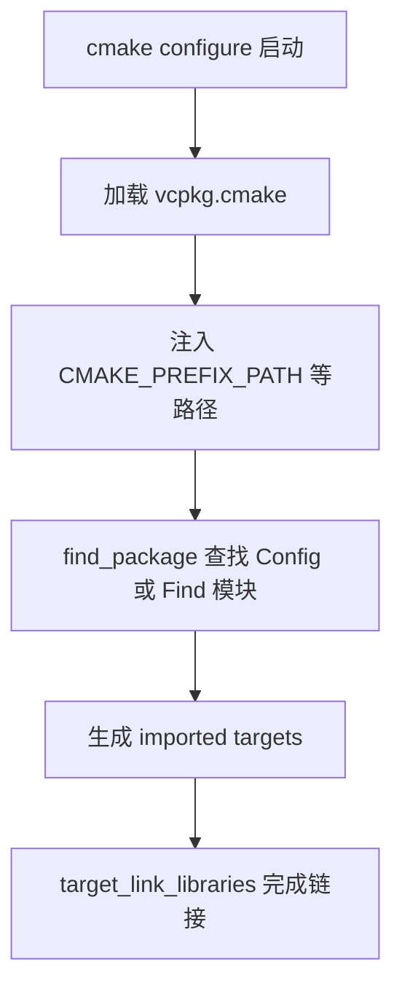

# find_package 深度用法

> **所属模块：** P02-vcpkg包管理 / 03-vcpkg与CMake集成  
> **前置知识：** [01-toolchain文件](./01-toolchain文件.md)、[02-manifest模式](../01-vcpkg基础/02-manifest模式.md)  
> **预计阅读时间：** 60-80 分钟

## 本节目标
读完本节后，你将能够：

1. 解释 `find_package()` 的职责与边界。
2. 区分 Module mode 与 Config mode 的查找机制。
3. 说明 vcpkg 通过 `CMAKE_TOOLCHAIN_FILE` 自动接入的原理。
4. 正确使用 `REQUIRED`、`COMPONENTS`、`OPTIONAL_COMPONENTS`。
5. 区分 `xxx_FOUND` / `xxx_INCLUDE_DIRS` / `xxx_LIBRARIES` 与 imported targets。
6. 理解搜索路径与优先级，并进行跨平台排查。
7. 用 spdlog、SDL2、FFmpeg 完成可运行的集成示例。
8. 解决找不到包、版本不匹配、target 不存在等典型错误。

## 一、find_package 的两种模式与心智模型
`find_package` 是“发现器”，不是“安装器”。
它只在 CMake 的 configure 阶段工作。
它做三件事：

1. 判断依赖是否存在。
2. 导出变量或导入目标。
3. 为后续 `target_link_libraries` 提供信息。

### 1.1 Module mode（模块模式）

Module mode 会查找 `Find<PackageName>.cmake`。

来源通常是：

1. CMake 自带模块目录。
2. 项目 `CMAKE_MODULE_PATH`。
3. 第三方附加模块。

示例 1：模块模式（OpenMP）。

```cmake
cmake_minimum_required(VERSION 3.28)
project(module_mode_demo LANGUAGES CXX)

find_package(OpenMP REQUIRED) # 模块模式常见用法

add_executable(module_mode_demo main.cpp)
target_link_libraries(module_mode_demo PRIVATE OpenMP::OpenMP_CXX) # 链接导入目标
```

### 1.2 Config mode（配置模式）

Config mode 会查找：

1. `<PackageName>Config.cmake`
2. `<packagename>-config.cmake`
这种模式由包作者导出配置，接口更稳定。

示例 2：配置模式（spdlog）。

```cmake
cmake_minimum_required(VERSION 3.28)
project(config_mode_demo LANGUAGES CXX)

find_package(spdlog CONFIG REQUIRED) # 强制配置模式

add_executable(config_mode_demo main.cpp)
target_link_libraries(config_mode_demo PRIVATE spdlog::spdlog) # 使用官方 target
```

### 1.3 两种模式如何选

在 vcpkg 场景下优先 Config mode。

如果库没有 Config 文件，再考虑 Module mode。

对于历史工程，可逐步迁移到 imported targets。

## 二、vcpkg 如何自动提供 Config：CMAKE_TOOLCHAIN_FILE 机制

关键入口是 `CMAKE_TOOLCHAIN_FILE`。

当你在首次 configure 时传入 vcpkg toolchain：

```bash
cmake -S . -B out/win-debug \
  -DCMAKE_TOOLCHAIN_FILE="$VCPKG_ROOT/scripts/buildsystems/vcpkg.cmake" \
  -DVCPKG_TARGET_TRIPLET=x64-windows
```

vcpkg 会把依赖前缀注入搜索路径。

`find_package` 才能在 `vcpkg_installed/<triplet>` 下命中 Config 文件。

### 2.1 自动接入流程图



### 2.2 “自动提供 Config”不是自动写 CMake

这句话的正确理解是：

1. vcpkg 安装库时附带 Config 文件。
2. toolchain 帮你把这些目录加入查找链。
3. 你仍要在项目里显式写 `find_package`。

### 2.3 搜索路径与优先级

实战上可记四层：

1. 显式路径（`<Pkg>_DIR`、`CMAKE_PREFIX_PATH`）。
2. toolchain 注入路径（含 vcpkg）。
3. 系统默认路径。
4. Module mode 的模块目录。

如果你命中系统库而不是 vcpkg 库，优先检查第 1/2 层。

### 2.4 Win/Linux/macOS/Android 差异

| 平台 | 常见 triplet | Config 目录示例 |
|---|---|---|
| Windows | `x64-windows` | `C:/dev/vcpkg_installed/x64-windows/share/spdlog` |
| Linux | `x64-linux` | `/opt/vcpkg_installed/x64-linux/share/spdlog` |
| macOS | `arm64-osx` | `/Users/me/vcpkg_installed/arm64-osx/share/spdlog` |
| Android | `arm64-android` | `/work/vcpkg_installed/arm64-android/share/spdlog` |

Android 额外注意：
1. 常需 `VCPKG_CHAINLOAD_TOOLCHAIN_FILE` 与 NDK toolchain 协同。
2. `ANDROID_ABI` 必须与 `VCPKG_TARGET_TRIPLET` 对齐。
3. ABI 不一致会导致“找到包但链接架构错误”。

## 三、关键参数详解：REQUIRED / COMPONENTS / OPTIONAL_COMPONENTS
### 3.1 REQUIRED：硬依赖

`REQUIRED` 表示找不到就终止 configure。

核心依赖推荐都加 `REQUIRED`。

```cmake
find_package(SDL2 CONFIG REQUIRED)   # SDL2 缺失则停止配置
find_package(spdlog CONFIG REQUIRED) # spdlog 缺失则停止配置
```

### 3.2 COMPONENTS：必须组件

FFmpeg 与 Boost 是典型组件化包。

示例 3：FFmpeg 必需组件。

```cmake
cmake_minimum_required(VERSION 3.28)
project(ffmpeg_components_demo LANGUAGES CXX)

find_package(FFMPEG REQUIRED COMPONENTS avcodec avutil swresample) # 必需组件

add_executable(ffmpeg_components_demo main.cpp)
target_link_libraries(ffmpeg_components_demo PRIVATE
  FFmpeg::avcodec    # 编解码
  FFmpeg::avutil     # 公共工具
  FFmpeg::swresample # 音频重采样
)
```

### 3.3 OPTIONAL_COMPONENTS：可选增强能力

当某些功能不是主流程硬依赖时，用 `OPTIONAL_COMPONENTS` 更合理。

```cmake
cmake_minimum_required(VERSION 3.28)
project(ffmpeg_optional_demo LANGUAGES CXX)

find_package(FFMPEG REQUIRED
  COMPONENTS avcodec avutil            # 核心能力
  OPTIONAL_COMPONENTS avfilter swscale # 可选增强
)

add_executable(ffmpeg_optional_demo main.cpp)
target_link_libraries(ffmpeg_optional_demo PRIVATE FFmpeg::avcodec FFmpeg::avutil)

if(TARGET FFmpeg::avfilter)
  target_link_libraries(ffmpeg_optional_demo PRIVATE FFmpeg::avfilter) # 命中后启用滤镜
endif()

if(TARGET FFmpeg::swscale)
  target_link_libraries(ffmpeg_optional_demo PRIVATE FFmpeg::swscale) # 命中后启用缩放
endif()
```

## 四、找到包后怎么消费：变量风格 vs imported targets

### 4.1 传统变量风格

旧项目里经常会看到：

- `xxx_FOUND`
- `xxx_INCLUDE_DIRS`
- `xxx_LIBRARIES`

示例 4：变量风格（兼容写法）。

```cmake
find_package(LibArchive REQUIRED)

if(LibArchive_FOUND)
  add_library(archive_wrap STATIC archive_wrap.cpp)
  target_include_directories(archive_wrap PRIVATE ${LibArchive_INCLUDE_DIRS}) # 使用 include 变量
  target_link_libraries(archive_wrap PRIVATE ${LibArchive_LIBRARIES})          # 使用库变量
endif()
```

### 4.2 现代 imported target 风格（推荐）

现代 CMake 建议尽量直接链接 target。

示例 5：spdlog + SDL2。

```cmake
cmake_minimum_required(VERSION 3.28)
project(modern_target_demo LANGUAGES CXX)
set(CMAKE_CXX_STANDARD 17)

find_package(spdlog CONFIG REQUIRED)
find_package(SDL2 CONFIG REQUIRED)

add_executable(modern_target_demo main.cpp)
target_link_libraries(modern_target_demo PRIVATE
  spdlog::spdlog # 自动传播头文件与依赖
  SDL2::SDL2     # 自动传播 SDL2 的链接信息
)
```

```cpp
#include <SDL.h>
#include <spdlog/spdlog.h>

int main() {
  if (SDL_Init(SDL_INIT_VIDEO) != 0) {
    spdlog::error("SDL 初始化失败: {}", SDL_GetError()); // 错误日志
    return 1;
  }
  spdlog::info("SDL 初始化成功"); // 成功日志
  SDL_Quit();
  return 0;
}
```

## 五、vcpkg + find_package 实战：spdlog、SDL2、FFmpeg

这一节给出三个可直接复用的最小工程片段。

### 5.1 spdlog 实战

```cmake
cmake_minimum_required(VERSION 3.28)
project(spdlog_lab LANGUAGES CXX)
set(CMAKE_CXX_STANDARD 17)

find_package(spdlog CONFIG REQUIRED)

add_executable(spdlog_lab main.cpp)
target_link_libraries(spdlog_lab PRIVATE spdlog::spdlog)
```

### 5.2 SDL2 实战

```cmake
cmake_minimum_required(VERSION 3.28)
project(sdl2_lab LANGUAGES CXX)
set(CMAKE_CXX_STANDARD 17)

find_package(SDL2 CONFIG REQUIRED)

add_executable(sdl2_lab main.cpp)
target_link_libraries(sdl2_lab PRIVATE SDL2::SDL2)
```

### 5.3 FFmpeg 实战

```cmake
cmake_minimum_required(VERSION 3.28)
project(ffmpeg_lab LANGUAGES CXX)
set(CMAKE_CXX_STANDARD 17)

find_package(FFMPEG REQUIRED COMPONENTS avcodec avutil swresample)

add_executable(ffmpeg_lab main.cpp)
target_link_libraries(ffmpeg_lab PRIVATE
  FFmpeg::avcodec
  FFmpeg::avutil
  FFmpeg::swresample
)
```

```cpp
extern "C" {
#include <libavcodec/avcodec.h>
}
#include <iostream>

int main() {
  const AVCodec* codec = avcodec_find_decoder(AV_CODEC_ID_H264); // 查找 H264
  if (!codec) {
    std::cerr << "未找到 H264 解码器\n";
    return 1;
  }
  std::cout << "FFmpeg 可用，解码器: " << codec->name << "\n";
  return 0;
}
```

## 动手实践

按以下步骤完成一次完整验证：

1. 新建实验目录，写入三组 `find_package`（spdlog、SDL2、FFMPEG）。
2. 首次 configure 必须传 `CMAKE_TOOLCHAIN_FILE`。
3. 设定对应平台 triplet（Win/Linux/macOS/Android）。
4. 开启 `CMAKE_FIND_DEBUG_MODE=ON` 观察命中路径。
5. 为 FFmpeg 增加 `OPTIONAL_COMPONENTS` 并加入 `if(TARGET ...)`。
6. 故意写错一个 target 名并修复。

推荐命令（Windows 示例）：

```bash
cmake -S . -B out/lab \
  -DCMAKE_TOOLCHAIN_FILE="$VCPKG_ROOT/scripts/buildsystems/vcpkg.cmake" \
  -DVCPKG_TARGET_TRIPLET=x64-windows \
  -DCMAKE_FIND_DEBUG_MODE=ON
cmake --build out/lab
```

## 对照项目源码

以下内容来自项目实际文件：

1. `krkr2/CMakeLists.txt` 第 17-24 行：Android 与非 Android 的 toolchain 分支。
2. `krkr2/CMakeLists.txt` 第 48-49 行：`find_package(unofficial-breakpad CONFIG REQUIRED)`。
3. `krkr2/cpp/core/CMakeLists.txt` 第 42 行：`find_package(OpenMP REQUIRED)`。
4. `krkr2/cpp/core/CMakeLists.txt` 第 60 行：`find_package(cocos2dx CONFIG REQUIRED)`。
5. `krkr2/vcpkg.json` 第 34 行：`ffmpeg` 依赖声明。
6. `krkr2/vcpkg.json` 第 76-79 行：`sdl2` 与 `spdlog` 依赖声明。

## 本节小结
- `find_package` 有 Module mode 与 Config mode 两种模式。
- vcpkg 通过 `CMAKE_TOOLCHAIN_FILE` 把 Config 目录接入 CMake 搜索路径。
- `REQUIRED`、`COMPONENTS`、`OPTIONAL_COMPONENTS` 决定失败策略与能力边界。
- 传统变量风格仍可用，但现代工程优先 imported targets。

## 练习题与答案

### 题目 1：为什么 vcpkg 场景推荐 `find_package(xxx CONFIG REQUIRED)`？

<details>
<summary>查看答案</summary>

因为 vcpkg 安装的大多数现代库会导出 `xxxConfig.cmake`。

显式使用 `CONFIG` 能让行为更可预期，并直接拿到 imported targets。

这比手写变量路径更稳，也更适合跨平台维护。

</details>

### 题目 2：`COMPONENTS` 与 `OPTIONAL_COMPONENTS` 如何划分？

<details>
<summary>查看答案</summary>

主流程必须能力放 `COMPONENTS`，缺失即失败。

增强能力放 `OPTIONAL_COMPONENTS`，缺失不阻塞构建。

链接可选组件时应先 `if(TARGET ...)` 判断是否命中。

</details>

### 题目 3：`find_package` 成功但链接时报 target 不存在，至少两种原因是什么？

<details>
<summary>查看答案</summary>

第一，target 名拼写错误（大小写或命名空间不对）。

第二，可选组件未命中却直接链接其 target。

第三，包导出的真实 target 名与你假设不同。

</details>

## 下一步

继续学习：[01-vcpkg.json解读](../04-实战-分析KrKr2的vcpkg配置/01-vcpkg.json解读.md)。

建议先把本节三个实战示例在至少两个平台跑通，再进入下一节。
