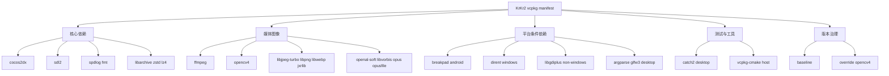

# 01-vcpkg.json解读

> **所属模块：** P02-vcpkg包管理
>
> **前置知识：** [03-Manifest模式与版本锁定.md](../03-Manifest模式与版本锁定.md)
>
> **预计阅读时间：** 40 分钟

## 元数据块

- 文档类型：实战配置解析
- 目标文件：`krkr2/vcpkg.json`
- 辅助文件：`krkr2/vcpkg-configuration.json`
- 目标读者：需要维护 KrKr2 依赖体系的开发者
- 章节定位：P02 第 4 章第 1 节

## 本节目标

1. 看懂 KrKr2 的 `vcpkg.json` 全量结构。
2. 掌握 `dependencies` 里平台条件、features、host 的使用方式。
3. 明确每个依赖在项目中的作用和模块位置。
4. 理解 `overrides` 的版本固定价值。
5. 理解 `vcpkg-configuration.json` 中 baseline 与 overlay 的意义。
6. 学会依赖变更的标准实战流程。

## 真实配置原文

### `vcpkg.json`（94 行）

```json
{
  "$schema": "https://raw.githubusercontent.com/microsoft/vcpkg-tool/main/docs/vcpkg.schema.json",
  "name": "krkr2",
  "version-string": "1.5.0",
  "dependencies": [
    "7zip",
    {
      "name": "argparse",
      "platform": "linux | windows | osx"
    },
    "boost-iostreams",
    {
      "name": "boost-locale",
      "default-features": false
    },
    "bullet3",
    "boost-phoenix",
    "boost-spirit",
    {
      "name": "breakpad",
      "default-features": false,
      "platform": "android"
    },
    {
      "name": "catch2",
      "default-features": false,
      "platform": "!android & !ios"
    },
    "cocos2dx",
    {
      "name": "dirent",
      "platform": "windows"
    },
    "ffmpeg",
    "fmt",
    {
      "name": "glfw3",
      "platform": "linux | windows | osx"
    },
    "jxrlib",
    "libarchive",
    {
      "name": "libgdiplus",
      "platform": "!windows"
    },
    "libjpeg-turbo",
    {
      "name": "libogg",
      "platform": "android"
    },
    {
      "name": "libpng",
      "platform": "!linux"
    },
    "libvorbis",
    "libwebp",
    "lz4",
    "oniguruma",
    "openal-soft",
    {
      "name": "opencv4",
      "default-features": false,
      "features": [
        "openmp"
      ]
    },
    {
      "name": "opus",
      "platform": "android"
    },
    {
      "name": "opusfile",
      "default-features": false
    },
    {
      "name": "sdl2",
      "default-features": false
    },
    "spdlog",
    "uchardet",
    "unrar",
    {
      "name": "vcpkg-cmake",
      "host": true
    },
    "zstd"
  ],
  "overrides": [
    {
      "name": "opencv4",
      "version": "4.7.0#6"
    }
  ]
}
```

### `vcpkg-configuration.json`（存在）

```json
{
  "$schema": "https://raw.githubusercontent.com/microsoft/vcpkg-tool/main/docs/vcpkg-configuration.schema.json",
  "default-registry": {
    "kind": "builtin",
    "baseline": "b1e15efef6758eaa0beb0a8732cfa66f6a68a81d"
  },
  "overlay-ports": [
    "./vcpkg/ports"
  ],
  "overlay-triplets": [
    "./vcpkg/triplets"
  ]
}
```

## vcpkg.json 结构拆解

### name

- 当前值：`krkr2`。
- 用于标识 manifest 项目。

### version-string

- 当前值：`1.5.0`。
- 仅代表项目版本，不控制依赖版本。

### dependencies

- 描述依赖集合。
- 字符串写法：简单依赖。
- 对象写法：需要 `platform`、`default-features`、`features`、`host` 等控制。

### overrides

- 当前仅锁定 `opencv4`。
- 目的是防止上游版本漂移影响构建稳定性。

## 依赖逐项分析（用途/必要性/模块）

1. `cocos2dx`：渲染和生命周期核心，多个 core 子模块直接链接。
2. `ffmpeg`：视频播放核心，`core/movie` 组件依赖。
3. `opencv4`：图像处理，`core/visual` 链接 `opencv_core` 与 `opencv_imgproc`。
4. `libjpeg-turbo`：JPEG 解码，`core/visual` 使用。
5. `libwebp`：WebP 解码，`LoadWEBP.cpp` 所在视觉模块链路。
6. `jxrlib`：JPEG XR 支持，`core/visual` 的 JXR 包查找。
7. `libpng`：PNG 支持，按 `!linux` 条件安装。
8. `openal-soft`：音频输出后端，`core/sound` 使用。
9. `libvorbis`：Vorbis 解码，`core/sound` 使用。
10. `libogg`：Android Ogg 容器支持，按 `android` 条件安装。
11. `opus`：Android Opus 支持，按 `android` 条件安装。
12. `opusfile`：Opus 文件读取层，`core/sound` 使用。
13. `libarchive`：统一归档处理，`core/base` 使用。
14. `7zip`：7z 能力，`core/environ` 使用。
15. `unrar`：RAR 解包，`core/base` 使用。
16. `zstd`：高压缩比算法，`core/base` 使用。
17. `lz4`：高速压缩解压，`core/visual` 使用。
18. `sdl2`：输入/平台抽象，`core/base` 使用。
19. `uchardet`：编码探测，`core/base` 使用。
20. `oniguruma`：正则能力，脚本/文本处理场景依赖。
21. `argparse`：CLI 参数解析，`tools/xp3` 使用。
22. `catch2`：测试框架，`tests` 使用，移动端排除。
23. `breakpad`：Android 崩溃收集，根 CMake Android 分支使用。
24. `vcpkg-cmake`：构建机工具，`host: true`。
25. `fmt`：格式化基础设施。
26. `spdlog`：日志体系，`krffmpeg.cpp` 可见 include。
27. `dirent`：Windows 下 POSIX 目录接口兼容。
28. `libgdiplus`：非 Windows 平台图形兼容。
29. `glfw3`：桌面平台窗口/输入链路补充。
30. `boost-iostreams`：流式处理扩展能力。
31. `boost-locale`：本地化与编码转换能力。
32. `boost-spirit`：解析器框架。
33. `boost-phoenix`：表达式模板配套。
34. `bullet3`：物理引擎能力预留。

## 平台条件依赖详解

### 表达式样式

- `windows`
- `android`
- `linux | windows | osx`
- `!windows`
- `!android & !ios`

### 运算规则

- `|`：或
- `&`：与
- `!`：非

### KrKr2 中的典型实践

- `catch2`：排除移动端。
- `breakpad`：只在 Android。
- `dirent`：只在 Windows。
- `libgdiplus`：非 Windows。
- `argparse`、`glfw3`：桌面三端。

## features 选择分析

### default-features 关闭策略

- 避免无关组件进入依赖图。
- 减少编译时间和冲突面。
- 对跨平台工程尤为重要。

### OpenCV 配置解释

```json
{
  "name": "opencv4",
  "default-features": false,
  "features": ["openmp"]
}
```

- 只保留项目需要的能力。
- 对齐 core 层的 OpenMP 使用逻辑。

### ffmpeg feature 建议

可改成显式写法：

```json
{
  "name": "ffmpeg",
  "default-features": false,
  "features": ["avcodec", "avformat", "swscale", "swresample"]
}
```

并和 `core/movie` 的组件列表保持一致。

## overrides 的作用

```json
"overrides": [
  {
    "name": "opencv4",
    "version": "4.7.0#6"
  }
]
```

- 固定关键依赖版本。
- 降低因上游更新导致的构建回归概率。
- 提升团队和 CI 的一致性。

## vcpkg-configuration.json 分析

### baseline

- 使用 builtin registry。
- baseline 锁定一个 commit，保证解算稳定。

### overlay-ports

- 当前是 `./vcpkg/ports`。
- 用于覆盖官方 port。

### overlay-triplets

- 当前是 `./vcpkg/triplets`。
- 用于定制编译参数和链接策略。

### registries

- 当前未配置。
- 说明当前模式是官方源 + 本地 overlay。

## 依赖关系图



## 添加新依赖的实战流程

1. 确认依赖归属模块（core/tests/tools）。
2. 修改 `vcpkg.json`（字符串或对象写法）。
3. 必要时修改 `vcpkg-configuration.json`（overlay/triplet）。
4. 修改对应 CMake（`find_package` + `target_link_libraries`）。
5. 做最小编译验证。
6. 做四平台条件复核。

## 常见修改场景

### 场景 1：升级版本

- 一次只改一个关键库。
- 优先保证可回滚。

### 场景 2：新增 feature

- 先关默认特性。
- 再开最小 feature 集。

### 场景 3：条件依赖调整

- 先白名单再排除。
- 四平台逐一验证。

### 场景 4：host/target 混淆

- 构建工具要 `host: true`。
- 运行库不要误标 host。

## 动手实践

### 实践 A：编写 ffmpeg 显式 feature 片段

```json
{
  "name": "ffmpeg",
  "default-features": false,
  "features": ["avcodec", "avformat", "swscale", "swresample"]
}
```

### 实践 B：编写桌面专用依赖片段

```json
{
  "name": "example-desktop-lib",
  "platform": "linux | windows | osx"
}
```

### 实践 C：编写 host 工具依赖片段

```json
{
  "name": "example-build-tool",
  "host": true
}
```

### 实践验收

1. 语法正确。
2. 平台语义正确。
3. host 语义正确。

## 对照项目源码

- `vcpkg.json` 第 1-94 行。
- `vcpkg-configuration.json` 第 1-13 行。
- `CMakeLists.txt` 第 46-49 行（breakpad）。
- `cpp/core/movie/CMakeLists.txt` 第 52-58 行（FFmpeg 组件）。
- `cpp/core/movie/ffmpeg/krffmpeg.cpp` 第 10-13 行与 49-63 行。
- `cpp/core/visual/CMakeLists.txt` 第 83-111 行。
- `cpp/core/sound/CMakeLists.txt` 第 40-62 行。
- `cpp/core/base/CMakeLists.txt` 第 41-57 行。
- `cpp/core/environ/CMakeLists.txt` 第 81-87 行。
- `tests/CMakeLists.txt` 第 4 行。
- `tools/xp3/CMakeLists.txt` 第 8-9 行。

## 本节小结

- KrKr2 的 `vcpkg.json` 是跨平台依赖治理中枢。
- 平台条件表达式控制了依赖边界。
- `default-features: false` 体现最小化依赖策略。
- `overrides` 用于关键库稳定版本固定。
- `vcpkg-configuration.json` 保证了可复现和可定制。

## 练习题与答案

### 题目 1

`version-string` 和 `overrides` 的职责有什么区别？

<details>
<summary>查看答案</summary>

`version-string` 是项目版本标识。
`overrides` 是依赖版本控制机制。
两者层级不同，不能互相替代。

</details>

### 题目 2

为什么 `catch2` 在 KrKr2 里写成 `!android & !ios`？

<details>
<summary>查看答案</summary>

因为当前测试链路主要在桌面端执行。
排除移动端可以减少无效依赖和构建复杂度。

</details>

### 题目 3

`host: true` 的核心作用是什么？

<details>
<summary>查看答案</summary>

它标记构建机工具依赖。
用于交叉编译时分离 host 工具和 target 运行库，防止工具链混淆。

</details>

### 题目 4

把 `ffmpeg` 改成对象写法后，最应该先检查哪个文件？

<details>
<summary>查看答案</summary>

先检查 `cpp/core/movie/CMakeLists.txt` 的 `FFMPEG COMPONENTS`。
如果组件不匹配，会在配置或链接时报错。

</details>

## 下一步

继续阅读：

- [02-overlay-ports与自定义triplet.md](./02-overlay-ports与自定义triplet.md)

下一节重点：

1. 如何覆盖官方 port。
2. 如何定制 triplet。
3. 如何在四平台上保持依赖行为一致。
