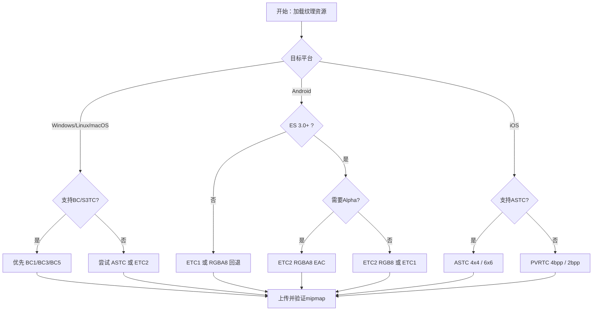

# 纹理压缩格式

> 所属模块：P04-OpenGL图形编程  
> 前置知识：06-OpenGL-ES差异、纹理采样、Mipmap（一组逐级缩小的纹理副本，用于在远距离观察时减少闪烁和提高采样效率，详见第 4 章）、着色器基础  
> 预计阅读时间：85分钟

## 本节目标

读完本节后，你将能够：
1. 解释为什么移动与桌面项目都需要 GPU 纹理压缩。
2. 区分文件压缩与 GPU 采样压缩的职责边界。
3. 理解 4×4 block、固定比特率、位深与压缩比之间的关系。
4. 说清 S3TC/DXT（BC1-BC5）、PVRTC、ETC1/ETC2、ASTC 的适用场景。
5. 使用 `glCompressedTexImage2D` 上传压缩纹理并校验 mip 链。
6. 编写运行时格式检测与回退逻辑，避免黑屏与花屏。
7. 对照 KrKr2 的 `ogl/` 源码理解真实生产实现。

## 正文：GPU纹理压缩全景与实战

### 1. 为什么必须使用 GPU 纹理压缩

先记住一句话：PNG/JPEG 解决的是“文件体积”，BC/ETC/PVRTC/ASTC 解决的是“运行时显存与带宽”。

很多项目初期只关注包体，全部资源都做 PNG/JPEG，上线后却发现内存占用高、发热高、帧率抖动。

原因很简单：PNG/JPEG 在上传纹理前会被解码，GPU 采样器不会直接采样 PNG/JPEG 比特流，最终显存里通常驻留 RGBA8 或类似未压缩布局。

举个量级例子：`2048×2048 RGBA8` 单层约 `16MB`，加完整 mipmap 约 `21.3MB`，如果一屏常驻 20 张，仅纹理就可能消耗数百 MB。

GPU 压缩的核心收益有三点：
1. 显存占用显著下降。
2. 采样带宽压力显著下降。
3. 纹理缓存利用率更好。

这也是为什么手游和跨平台引擎里，
纹理压缩不是“锦上添花”，
而是“基础设施”。

### 2. 压缩纹理基本原理

主流格式都采用块压缩。
英文是 block-based compression。

最常见块大小是 4×4。
每个块写入固定长度编码。
这就是固定比特率。

对 GPU 来说，
固定比特率非常重要：
它让随机访问变得可预测，
硬件采样路径更稳定。

4×4 RGBA8 原始数据是：
16 像素 × 4 字节 = 64 字节。

若压缩块是 8 字节，
压缩比是 8:1。

若压缩块是 16 字节，
压缩比是 4:1。

压缩格式并不是“简单砍位数”。
通常会存：
1. 颜色端点（endpoint）。
2. 像素索引或权重（selector/weight）。
3. 可选 Alpha 编码。

同样 bpp 下画质差异，
往往来自端点量化和插值策略。

```cpp
// 示例1：压缩纹理单层大小计算
#include <algorithm>
#include <cstddef>

struct BlockDesc {
    int blockWidth;      // 压缩块宽度
    int blockHeight;     // 压缩块高度
    int bytesPerBlock;   // 每块字节数
};

size_t CalcCompressedSize(int width, int height, const BlockDesc &desc) {
    const int blockCountX = std::max(1, (width + desc.blockWidth - 1) / desc.blockWidth);   // 向上取整
    const int blockCountY = std::max(1, (height + desc.blockHeight - 1) / desc.blockHeight); // 向上取整
    return static_cast<size_t>(blockCountX) * static_cast<size_t>(blockCountY) * desc.bytesPerBlock;
}
```

### 3. S3TC / DXT（BC1-BC5）

S3TC 在 OpenGL 语境常见 DXT 命名。
在 DirectX 语境常见 BC 命名。
这是桌面端最成熟的一条线。

常见子格式：
- BC1 / DXT1：4bpp，不透明为主。
- BC2 / DXT3：8bpp，显式 Alpha。
- BC3 / DXT5：8bpp，插值 Alpha。
- BC4：单通道。
- BC5：双通道，法线常用。

经验选型：
- 场景漫反射不透明：BC1。
- UI 和半透明纹理：BC3。
- 法线纹理：BC5。

平台属性：
Windows/Linux/macOS 桌面支持普遍较好。
移动端不统一，
不能只依赖 BC 包。

### 4. PVRTC

PVRTC 与 PowerVR 生态强相关。
典型使用场景是 iOS 历史设备和部分嵌入式平台。

常见模式：
- 2bpp：体积更小，失真更高。
- 4bpp：体积更大，质量更稳。

在 KrKr2 中，
PVRTC 实现文件是：
`krkr2/cpp/core/visual/ogl/pvrtc.h`
与
`krkr2/cpp/core/visual/ogl/pvrtc.cpp`。

`pvrtc.h` 对外接口很明确：
`PvrTcEncoder::EncodeRgba4Bpp(...)`。

`pvrtc.cpp` 可观察到：
1. 颜色位宽查表映射。
2. `PvrTcPacket` 位字段结构。
3. Morton 块索引。
4. 插值与调制数据构造。

```cpp
// 示例2：PVRTC 4bpp 大小估算
#include <algorithm>
#include <cstddef>

size_t EstimatePVRTC4(int width, int height) {
    const int w = std::max(width, 8);   // 常见最小尺寸保护
    const int h = std::max(height, 8);
    return static_cast<size_t>(w) * static_cast<size_t>(h) / 2; // 4bpp = 每像素0.5字节
}
```

### 5. ETC1 / ETC2

ETC1 是 ES2 时代 Android 常见标准。
它最大限制是：
不支持完整 Alpha。

所以 ETC1 适合不透明贴图。
透明纹理要么拆 Alpha，
要么回退其他格式。

ETC2 在 ES3.0+ 标准化，
补齐了 Alpha 能力。

常见 ETC2 相关格式：
- ETC2 RGB8
- ETC2 RGBA8 EAC
- ETC2 punchthrough alpha

KrKr2 相关文件：
`krkr2/cpp/core/visual/ogl/etcpak.h`
`krkr2/cpp/core/visual/ogl/etcpak.cpp`

头文件提供接口：
- `convert(...)`
- `convertWithAlpha(...)`
- `decode(...)`
- `decodeWithAlpha(...)`

`etcpak.cpp` 约 1868-1955 行，
可以看到 `edgew` / `edgeh` 边缘块处理。
这说明 NPOT 纹理在编码时做了补齐保护。

```cpp
// 示例3：ETC1/ETC2 选择逻辑
enum class ETCChoice {
    ETC1_RGB,
    ETC2_RGBA
};

ETCChoice ChooseETC(bool needAlpha, bool supportETC2) {
    if (needAlpha && supportETC2) {
        return ETCChoice::ETC2_RGBA; // 透明纹理优先 ETC2
    }
    return ETCChoice::ETC1_RGB;      // 否则回到 ETC1
}
```

### 6. ASTC

ASTC 是 Khronos 标准化的现代格式。
最大优势是块大小可调。

常见 2D 块：
- 4×4：质量高。
- 6×6：平衡常用。
- 8×8：高压缩。
- 10×10/12×12：极致压缩。

ASTC 还支持：
LDR/HDR、3D 模式、sRGB 变体。

KrKr2 对应文件：
`krkr2/cpp/core/visual/ogl/astcrt.h`
`krkr2/cpp/core/visual/ogl/astcrt.cpp`

入口函数：
`ASTCRealTimeCodec::compress_texture_4x4(...)`。

`astcrt.cpp` 约 2380-2399 行，
可见 4×4 block 压缩主循环。

```cpp
// 示例4：ASTC 4x4 单层字节数
#include <cstddef>

size_t CalcASTC4x4(int width, int height) {
    const int bx = (width + 3) / 4;
    const int by = (height + 3) / 4;
    return static_cast<size_t>(bx) * static_cast<size_t>(by) * 16; // 每块16字节
}
```

### 7. 格式选择决策树（Mermaid）



### 8. 各格式对比表

#### 8.1 压缩比、质量、Alpha 支持

| 格式 | 典型码率 | 对RGBA8压缩比 | Alpha | 质量倾向 | 典型用途 |
|---|---:|---:|---|---|---|
| BC1/DXT1 | 4bpp | 8:1 | 1-bit 变体 | 中等 | 不透明场景 |
| BC3/DXT5 | 8bpp | 4:1 | 支持 | 较好 | UI/透明贴图 |
| BC5 | 8bpp | 4:1 | 双通道 | 法线优秀 | 法线贴图 |
| PVRTC 4bpp | 4bpp | 8:1 | 支持 | 中等 | iOS兼容 |
| PVRTC 2bpp | 2bpp | 16:1 | 支持 | 偏低 | 远景低优先 |
| ETC1 | 4bpp | 8:1 | 不支持 | 中等 | Android ES2 不透明 |
| ETC2 RGBA | 8bpp | 4:1 | 支持 | 稳定 | Android ES3+ 透明 |
| ASTC 4x4 | 8bpp | 4:1 | 支持 | 高 | 角色/UI关键纹理 |
| ASTC 6x6 | 3.56bpp | 约9:1 | 支持 | 平衡 | 通用场景 |
| ASTC 8x8 | 2bpp | 16:1 | 支持 | 低频可用 | 背景远景 |

#### 8.2 跨平台支持表（Windows/Linux/macOS/Android/iOS）

| 格式族 | Windows | Linux | macOS | Android | iOS |
|---|---|---|---|---|---|
| BC/S3TC | 高 | 高 | 中高 | 低 | 低 |
| PVRTC | 低 | 低 | 低 | 低中 | 中高 |
| ETC1 | 低 | 低 | 低 | 高 | 低 |
| ETC2/EAC | 中 | 中 | 中 | 高 | 中 |
| ASTC | 中 | 中 | 中高 | 高 | 高 |

说明：
表格是经验值，
最终一定要以运行时查询结果为准。

### 9. OpenGL API：`glCompressedTexImage2D`

核心参数：
- `internalFormat`：压缩格式枚举。
- `imageSize`：当前 mip 层压缩后字节数。
- `data`：压缩块数据。

最常见错误是把 `imageSize` 写成原始像素字节。

```cpp
// 示例5：上传 ETC2 RGBA mip 链
#include <GLES3/gl3.h>
#include <vector>

struct CompressedMip {
    int width;
    int height;
    std::vector<unsigned char> bytes;
};

void UploadETC2(GLuint tex, const std::vector<CompressedMip> &mips) {
    glBindTexture(GL_TEXTURE_2D, tex);

    for (size_t level = 0; level < mips.size(); ++level) {
        const auto &m = mips[level];
        glCompressedTexImage2D(
            GL_TEXTURE_2D,
            static_cast<GLint>(level),
            0x9278, // GL_COMPRESSED_RGBA8_ETC2_EAC
            m.width,
            m.height,
            0,
            static_cast<GLsizei>(m.bytes.size()), // 压缩后字节数
            m.bytes.data());
    }

    glTexParameteri(GL_TEXTURE_2D, GL_TEXTURE_MIN_FILTER, GL_LINEAR_MIPMAP_LINEAR);
    glTexParameteri(GL_TEXTURE_2D, GL_TEXTURE_MAG_FILTER, GL_LINEAR);
}
```

### 10. 扩展检测与运行时回退

KrKr2 在 `RenderManager_ogl.cpp` 第 193-208 行，
通过 `glGetIntegerv(GL_NUM_COMPRESSED_TEXTURE_FORMATS, ...)`
和 `glGetIntegerv(GL_COMPRESSED_TEXTURE_FORMATS, ...)`
构建支持集合，再提供 `TVPIsSupportTextureFormat` 查询。

这比“只看扩展字符串”更稳健。

```cpp
// 示例6：查询支持集并做回退选择
#include <GLES3/gl3.h>
#include <set>
#include <vector>

enum class RuntimeFmt {
    ASTC4x4,
    ETC2RGBA,
    ETC1RGB,
    RGBA8
};

std::set<GLenum> QueryFormats() {
    GLint n = 0;
    glGetIntegerv(GL_NUM_COMPRESSED_TEXTURE_FORMATS, &n);
    std::set<GLenum> out;
    if (n <= 0) return out;
    std::vector<GLint> arr(static_cast<size_t>(n));
    glGetIntegerv(GL_COMPRESSED_TEXTURE_FORMATS, arr.data());
    for (GLint f : arr) out.insert(static_cast<GLenum>(f));
    return out;
}

RuntimeFmt PickFormat(const std::set<GLenum> &s, bool needAlpha) {
    const GLenum ASTC4 = 0x93B0;
    const GLenum ETC2A = 0x9278;
    const GLenum ETC1  = 0x8D64;
    if (s.count(ASTC4)) return RuntimeFmt::ASTC4x4;
    if (needAlpha && s.count(ETC2A)) return RuntimeFmt::ETC2RGBA;
    if (!needAlpha && s.count(ETC1)) return RuntimeFmt::ETC1RGB;
    return RuntimeFmt::RGBA8;
}
```

### 11. 纹理压缩工具链

常用工具：
1. texconv（BC/DDS）
2. PVRTexTool（PVRTC/ETC/ASTC）
3. astcenc（ASTC）
4. etcpak（ETC1/ETC2）

建议离线构建阶段压缩，
运行时只做加载与选择。

```bash
# 示例7：离线压缩命令示例

# BC3（桌面）
texconv -f BC3_UNORM -m 0 -y -o ./out_bc ./input/ui.png

# ASTC 6x6（移动平衡）
astcenc -cl ./input/scene.png ./out_astc/scene_6x6.astc 6x6 -medium

# ETC2 RGBA
PVRTexToolCLI -i ./input/icon.png -o ./out_etc2/icon.pvr -f ETC2_RGBA -m

# PVRTC 4bpp
PVRTexToolCLI -i ./input/effect.png -o ./out_pvrtc/effect.pvr -f PVRTC1_4,UBN,lRGB -m
```

### 12. KrKr2 实现分析

重点文件：
- `RenderManager_ogl.cpp`（能力检测与格式名映射）
- `pvrtc.cpp/.h`（PVRTC 实现）
- `etcpak.cpp/.h`（ETC 实现）
- `astcrt.cpp/.h`（ASTC 实现）

你可以观察到一条完整链路：
探测 -> 选择 -> 压缩/加载 -> 上传 -> 回退。

### 13. 常见错误与解决方案

1. 使用不支持的压缩格式：症状是 `GL_INVALID_ENUM` 或黑纹理；解决是启动时查询支持集并按优先级回退。  
2. NPOT 纹理块计算错误：症状是边缘花屏或 `GL_INVALID_VALUE`；解决是块数向上取整并补齐边缘块。  
3. mipmap 大小链不匹配：症状是远景闪烁或采样异常；解决是离线生成完整 mip 并逐层校验 `imageSize`。  
4. ETC1 用于透明纹理：症状是 Alpha 丢失与黑边；解决是改用 ETC2 RGBA 或 ETC1+Alpha 分离方案。

## 本节小结

- **GPU 纹理压缩 ≠ 文件压缩**：PNG/JPEG 解决文件体积，BC/ETC/PVRTC/ASTC 解决运行时显存占用与采样带宽。
- **块压缩原理**：主流格式都采用 4×4（或更大）固定大小块，每块编码为固定长度字节，确保 GPU 随机访问可预测。
- **四大格式族：**
  - **BC/S3TC（DXT）**：桌面端成熟标准，BC1 不透明、BC3 透明、BC5 法线。
  - **PVRTC**：PowerVR/iOS 生态，2bpp 或 4bpp。
  - **ETC1/ETC2**：Android ES2/ES3 标准，ETC1 不支持 Alpha。
  - **ASTC**：现代标准，块大小可调（4×4 到 12×12），质量最高。
- **格式选择依赖平台**：启动时通过 `glGetIntegerv(GL_COMPRESSED_TEXTURE_FORMATS, ...)` 查询实际支持集，按优先级回退。
- **KrKr2 自带三个实时编码器**：PVRTC（`pvrtc.h`）、ETC（`etcpak.h`）、ASTC（`astcrt.h`），在 `RenderManager_ogl.cpp` 中统一管理。
- 上传压缩纹理使用 `glCompressedTexImage2D`，最常见错误是 `imageSize` 参数传了未压缩字节数。

## 练习题与答案

### 题目 1：压缩纹理大小计算

一张 `1920×1080` 的纹理，分别使用以下格式存储**单层（不含 Mipmap）**，计算显存占用：

1. 未压缩 RGBA8
2. BC1（DXT1）：4bpp，块 4×4，每块 8 字节
3. ASTC 6×6：块 6×6，每块 16 字节
4. PVRTC 2bpp

<details>
<summary>查看答案</summary>

**1. 未压缩 RGBA8：**
```
1920 × 1080 × 4 字节 = 8,294,400 字节 ≈ 7.91 MB
```

**2. BC1（4bpp）：**
```
块数 X = ceil(1920 / 4) = 480
块数 Y = ceil(1080 / 4) = 270
字节数 = 480 × 270 × 8 = 1,036,800 字节 ≈ 0.99 MB
压缩比：8,294,400 / 1,036,800 = 8:1 ✅
```

**3. ASTC 6×6：**
```
块数 X = ceil(1920 / 6) = 320
块数 Y = ceil(1080 / 6) = 180
字节数 = 320 × 180 × 16 = 921,600 字节 ≈ 0.88 MB
压缩比：8,294,400 / 921,600 ≈ 9:1
```

**4. PVRTC 2bpp：**
```
字节数 = 1920 × 1080 × 2 / 8 = 518,400 字节 ≈ 0.49 MB
压缩比：8,294,400 / 518,400 = 16:1
```

**对比总结表：**

| 格式 | 大小 | 相比 RGBA8 |
|------|------|-----------|
| RGBA8 | 7.91 MB | 1× |
| BC1 | 0.99 MB | 8× 压缩 |
| ASTC 6×6 | 0.88 MB | ~9× 压缩 |
| PVRTC 2bpp | 0.49 MB | 16× 压缩 |

</details>

### 题目 2：运行时格式选择逻辑

编写一个 C++ 函数 `selectTextureFormat()`，根据以下优先级选择最佳压缩格式：
1. 优先 ASTC 4×4（如果支持）
2. 其次 ETC2 RGBA（如果支持且需要 Alpha）
3. 其次 BC3（如果支持且需要 Alpha）
4. 其次 ETC1（如果支持且不需要 Alpha）
5. 最终回退到 RGBA8（未压缩）

函数签名：`GLenum selectTextureFormat(bool needAlpha)`

<details>
<summary>查看答案</summary>

```cpp
#include <set>
#include <vector>

// 预定义 GL 枚举值
#ifndef GL_COMPRESSED_RGBA_ASTC_4x4_KHR
#define GL_COMPRESSED_RGBA_ASTC_4x4_KHR      0x93B0
#endif
#ifndef GL_COMPRESSED_RGBA8_ETC2_EAC
#define GL_COMPRESSED_RGBA8_ETC2_EAC          0x9278
#endif
#ifndef GL_COMPRESSED_RGBA_S3TC_DXT5_EXT
#define GL_COMPRESSED_RGBA_S3TC_DXT5_EXT      0x83F3
#endif
#ifndef GL_ETC1_RGB8_OES
#define GL_ETC1_RGB8_OES                      0x8D64
#endif

// 查询 GPU 支持的压缩格式集合
std::set<GLenum> getSupportedFormats() {
    GLint count = 0;
    glGetIntegerv(GL_NUM_COMPRESSED_TEXTURE_FORMATS, &count);
    std::set<GLenum> formats;
    if (count > 0) {
        std::vector<GLint> arr(static_cast<size_t>(count));
        glGetIntegerv(GL_COMPRESSED_TEXTURE_FORMATS, arr.data());
        for (GLint f : arr) {
            formats.insert(static_cast<GLenum>(f));
        }
    }
    return formats;
}

GLenum selectTextureFormat(bool needAlpha) {
    static std::set<GLenum> supported = getSupportedFormats(); // 只查询一次

    // 1. ASTC 4×4（最高质量，支持 Alpha）
    if (supported.count(GL_COMPRESSED_RGBA_ASTC_4x4_KHR)) {
        return GL_COMPRESSED_RGBA_ASTC_4x4_KHR;
    }

    // 2. ETC2 RGBA（Android ES3+ 标准）
    if (needAlpha && supported.count(GL_COMPRESSED_RGBA8_ETC2_EAC)) {
        return GL_COMPRESSED_RGBA8_ETC2_EAC;
    }

    // 3. BC3/DXT5（桌面端，支持 Alpha）
    if (needAlpha && supported.count(GL_COMPRESSED_RGBA_S3TC_DXT5_EXT)) {
        return GL_COMPRESSED_RGBA_S3TC_DXT5_EXT;
    }

    // 4. ETC1（不需要 Alpha 时）
    if (!needAlpha && supported.count(GL_ETC1_RGB8_OES)) {
        return GL_ETC1_RGB8_OES;
    }

    // 5. 最终回退：未压缩 RGBA8
    return GL_RGBA;
}
```

**关键点：**
- 使用 `static` 缓存查询结果，避免每次加载纹理都调用 `glGetIntegerv`。
- 优先级顺序考虑了跨平台覆盖面（ASTC 覆盖最广）和质量（ASTC > ETC2 > BC3）。
- 回退到 `GL_RGBA` 意味着使用未压缩纹理，显存占用会高 4-8 倍，但至少不会黑屏。

</details>

### 题目 3：分析 KrKr2 压缩格式检测

阅读 `RenderManager_ogl.cpp` 第 193-208 行的格式检测代码，回答：

1. KrKr2 使用什么方法检测 GPU 支持哪些压缩格式？
2. 为什么这比单纯检查扩展字符串更可靠？
3. KrKr2 的 `TVPIsSupportTextureFormat` 函数的作用是什么？

<details>
<summary>查看答案</summary>

1. **检测方法：** KrKr2 使用 `glGetIntegerv(GL_NUM_COMPRESSED_TEXTURE_FORMATS, ...)` 获取支持的压缩格式数量，然后用 `glGetIntegerv(GL_COMPRESSED_TEXTURE_FORMATS, ...)` 获取完整的格式枚举列表，存入一个集合中供后续查询。

2. **为什么比扩展字符串更可靠：**
   - 扩展字符串（`glGetString(GL_EXTENSIONS)`）只告诉你**哪些扩展已加载**，但同一个扩展可能包含多个格式，你无法确定具体支持哪些子格式。
   - `GL_COMPRESSED_TEXTURE_FORMATS` 返回的是 GPU 驱动实际支持的**具体格式枚举值列表**，精确到每一个格式变体。
   - 某些驱动可能支持格式但没有暴露对应扩展字符串（反之亦然，虽然少见）。
   - 直接查询格式列表是 OpenGL 规范推荐的做法。

3. **`TVPIsSupportTextureFormat` 的作用：** 这是一个查询函数，接受一个 GL 格式枚举值（如 `GL_COMPRESSED_RGBA_ASTC_4x4_KHR`），返回该格式是否在启动时检测到的支持集合中。其他模块（如纹理加载器、压缩编码器）通过调用该函数决定是否使用某种压缩格式，如果不支持则回退到其他格式或未压缩 RGBA。

</details>

## 下一步

下一节 [压缩纹理加载实战](./02-压缩纹理加载实战.md) 将详细讲解如何从文件加载压缩纹理数据（KTX、PVR、DDS 容器格式），上传到 GPU 并正确设置 Mipmap 链，以及处理加载失败时的回退策略。

