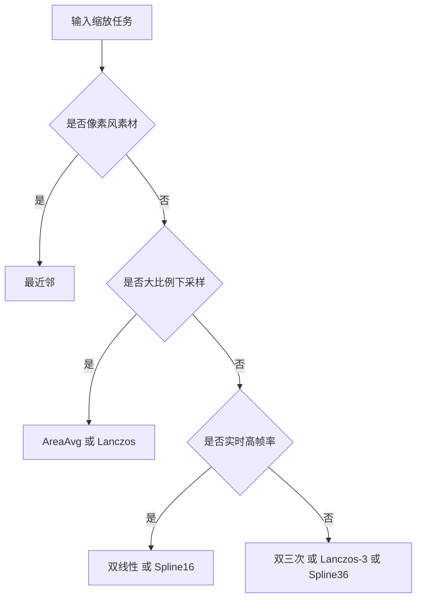

# 图像缩放与插值算法

> **所属模块：** P05-软件渲染原理 · 第 3 章 · 第 1 节
> **前置知识：** [01-像素本质与格式](../01-像素与颜色空间/01-像素本质与格式.md)、[02-预乘Alpha与颜色空间](../01-像素与颜色空间/02-预乘Alpha与颜色空间.md)、[01-Alpha通道与标准混合](../02-Alpha混合与合成/01-Alpha通道与标准混合.md)
> **预计阅读时间：** 90 分钟

## 本节目标

读完本节后，你将能够：

1. 说明图像缩放在分辨率适配、UI 缩放、动画效果中的核心作用。
2. 独立实现最近邻、双线性、双三次、Lanczos 四种 CPU 版采样器。
3. 理解 Spline16/Spline36 的权重半径与质量-性能取舍。
4. 根据对比表格和决策流程图，为不同场景选择合适的插值算法。
5. 解释像素中心对齐（pixel-center alignment）的重要性及其半像素偏移公式。
6. 说明权重归一化在边界处的作用以及忽略它会导致什么视觉缺陷。
### 1. 为什么需要图像缩放

图像缩放（Image Scaling）是 2D 渲染系统无法绕开的基础能力。
在真实项目里，它不是“可选优化”，而是“刚需功能”。

**场景一：显示分辨率适配**。
一套素材要覆盖 1280×720、1920×1080、2560×1440 甚至移动端异形屏。
如果没有缩放，画面会被裁切、拉伸变形或出现大面积留白。

**场景二：UI 缩放**。
系统 DPI 改变、窗口缩放、无障碍大字体模式都会触发 UI 资源重采样。
按钮边缘和文字底图对插值质量非常敏感，算法选择会直接影响观感。

**场景三：动画效果**。
角色进场、镜头推拉、立绘呼吸都会触发连续缩放，算法不稳就会闪烁抖动。

缩放本质是**重采样（Resampling）**：目标像素中心通常映射到源图非整数坐标，因此必须插值估算颜色。

### 2. 插值的统一表达
无论最近邻、双线性、双三次还是 Lanczos，都可以放进统一公式：

\[
I'(x, y) = \sum_j \sum_i I(i, j) \cdot w_x(x-i) \cdot w_y(y-j)
\]

其中 \(I(i,j)\) 是源像素，\(w_x,w_y\) 是权重函数，RANGE 决定邻域大小。
工程上要保证像素中心对齐、边界处理、权重归一化。

### 3. 最近邻插值（Nearest Neighbor）
最近邻的思想非常直接：把目标坐标反推到源图后，取最接近的整数像素。

映射公式：

\[
srcX = (dstX + 0.5) \cdot \frac{srcW}{dstW} - 0.5,
\quad
srcY = (dstY + 0.5) \cdot \frac{srcH}{dstH} - 0.5
\]

优点：极快、实现简单；缺点：锯齿明显。
适用：像素艺术、调试预览。

```cpp
#include <cstdint>
#include <vector>
#include <algorithm>

struct 图像缓冲 {
    int 宽;
    int 高;
    std::vector<uint32_t> 像素; // ARGB
};

static inline int 钳制(int v, int lo, int hi) {
    return std::max(lo, std::min(v, hi));
}

图像缓冲 最近邻缩放(const 图像缓冲& src, int dstW, int dstH) {
    图像缓冲 dst{dstW, dstH, std::vector<uint32_t>(dstW * dstH)};
    const float sx = static_cast<float>(src.宽) / static_cast<float>(dstW);
    const float sy = static_cast<float>(src.高) / static_cast<float>(dstH);

    for (int y = 0; y < dstH; ++y) {
        const float fy = (y + 0.5f) * sy - 0.5f; // 像素中心对齐
        const int iy = 钳制(static_cast<int>(fy + 0.5f), 0, src.高 - 1);
        for (int x = 0; x < dstW; ++x) {
            const float fx = (x + 0.5f) * sx - 0.5f;
            const int ix = 钳制(static_cast<int>(fx + 0.5f), 0, src.宽 - 1);
            dst.像素[y * dstW + x] = src.像素[iy * src.宽 + ix];
        }
    }
    return dst;
}
```

### 4. 双线性插值（Bilinear）
双线性使用 2×2 邻域四个点，把二维插值拆成“两次横向 + 一次纵向”。

设 \(x_0=\lfloor x \rfloor, x_1=x_0+1\)，
\(y_0=\lfloor y \rfloor, y_1=y_0+1\)，
\(u=x-x_0, v=y-y_0\)。

公式：

\[
I=(1-u)(1-v)I_{00}+u(1-v)I_{10}+(1-u)vI_{01}+uvI_{11}
\]

ASCII 采样示意：

```text
I00(x0,y0) ------- I10(x1,y0)
   |                  |
   |     P(x,y)       |
   |                  |
I01(x0,y1) ------- I11(x1,y1)
```

```cpp
#include <cstdint>
#include <algorithm>

static inline uint8_t 通道线性(uint8_t c00, uint8_t c10, uint8_t c01, uint8_t c11, float u, float v) {
    const float top = c00 * (1.0f - u) + c10 * u; // 上边线性插值
    const float bot = c01 * (1.0f - u) + c11 * u; // 下边线性插值
    const float out = top * (1.0f - v) + bot * v; // 纵向线性插值
    return static_cast<uint8_t>(std::max(0.0f, std::min(255.0f, out)) + 0.5f);
}

uint32_t 双线性采样ARGB(const uint32_t* src, int w, int h, float fx, float fy) {
    int x0 = static_cast<int>(fx), y0 = static_cast<int>(fy);
    const float u = fx - x0, v = fy - y0;
    int x1 = std::min(x0 + 1, w - 1), y1 = std::min(y0 + 1, h - 1);
    x0 = std::max(0, x0); y0 = std::max(0, y0);

    const uint32_t p00 = src[y0 * w + x0];
    const uint32_t p10 = src[y0 * w + x1];
    const uint32_t p01 = src[y1 * w + x0];
    const uint32_t p11 = src[y1 * w + x1];

    const uint8_t b = 通道线性(p00 & 0xFF, p10 & 0xFF, p01 & 0xFF, p11 & 0xFF, u, v);
    const uint8_t g = 通道线性((p00 >> 8) & 0xFF, (p10 >> 8) & 0xFF, (p01 >> 8) & 0xFF, (p11 >> 8) & 0xFF, u, v);
    const uint8_t r = 通道线性((p00 >> 16) & 0xFF, (p10 >> 16) & 0xFF, (p01 >> 16) & 0xFF, (p11 >> 16) & 0xFF, u, v);
    const uint8_t a = 通道线性((p00 >> 24) & 0xFF, (p10 >> 24) & 0xFF, (p01 >> 24) & 0xFF, (p11 >> 24) & 0xFF, u, v);

    return (static_cast<uint32_t>(a) << 24) |
           (static_cast<uint32_t>(r) << 16) |
           (static_cast<uint32_t>(g) << 8) |
           static_cast<uint32_t>(b);
}
```

双线性是实时路径常用基线。
质量明显好于最近邻，但边缘会稍软。

### 5. 双三次插值（Bicubic）

双三次插值在横纵两个方向上都使用三次核函数。
每个方向采样 4 个点，总计 16 个像素参与计算。

KrKr2 在 `WeightFunctor.cpp` 中给出的常量是：

- `BicubicWeight::RANGE = 2.0f`

这与 4 点支持范围完全对应。

常见双三次参数族：Catmull-Rom（锐利）与 Mitchell-Netravali（平衡）。

下面给出 Keys 形式实现示例：

```cpp
#include <cstdint>
#include <cmath>
#include <algorithm>

static inline float 三次核(float x, float a) {
    x = std::fabs(x);
    if (x < 1.0f) {
        return (a + 2.0f) * x * x * x - (a + 3.0f) * x * x + 1.0f;
    }
    if (x < 2.0f) {
        return a * x * x * x - 5.0f * a * x * x + 8.0f * a * x - 4.0f * a;
    }
    return 0.0f;
}

uint32_t 双三次采样ARGB(const uint32_t* src, int w, int h, float fx, float fy, float a = -0.5f) {
    const int cx = static_cast<int>(std::floor(fx));
    const int cy = static_cast<int>(std::floor(fy));
    float sumW = 0.0f, b = 0.0f, g = 0.0f, r = 0.0f, al = 0.0f;

    for (int j = -1; j <= 2; ++j) {
        const int sy = std::max(0, std::min(h - 1, cy + j));
        const float wy = 三次核(fy - static_cast<float>(cy + j), a);
        for (int i = -1; i <= 2; ++i) {
            const int sx = std::max(0, std::min(w - 1, cx + i));
            const float wx = 三次核(fx - static_cast<float>(cx + i), a);
            const float ww = wx * wy;
            const uint32_t p = src[sy * w + sx];
            b += (p & 0xFF) * ww;
            g += ((p >> 8) & 0xFF) * ww;
            r += ((p >> 16) & 0xFF) * ww;
            al += ((p >> 24) & 0xFF) * ww;
            sumW += ww;
        }
    }

    if (std::fabs(sumW) < 1e-8f) return 0;
    b /= sumW; g /= sumW; r /= sumW; al /= sumW; // 边界处保持亮度稳定
    auto c8 = [](float v) -> uint8_t {
        return static_cast<uint8_t>(std::max(0.0f, std::min(255.0f, v)) + 0.5f);
    };
    return (static_cast<uint32_t>(c8(al)) << 24) |
           (static_cast<uint32_t>(c8(r)) << 16) |
           (static_cast<uint32_t>(c8(g)) << 8) |
           static_cast<uint32_t>(c8(b));
}
```

### 6. Lanczos 插值

Lanczos 使用窗口化 sinc 函数，通常在下采样质量上优于双线性。

基础函数：

\[
sinc(x)=\frac{\sin(\pi x)}{\pi x},\; sinc(0)=1
\]

Lanczos-a 核：

\[
L(x)=sinc(x)\cdot sinc\left(\frac{x}{a}\right), \quad |x|<a
\]

对比：Lanczos-2 半径 2 更快；Lanczos-3 半径 3 细节更好但更重。

```cpp
#include <cstdint>
#include <cmath>
#include <algorithm>

static inline float sinc(float x) {
    if (std::fabs(x) < 1e-7f) return 1.0f;
    const float px = 3.14159265358979323846f * x;
    return std::sin(px) / px;
}

static inline float Lanczos权重(float x, int a) {
    x = std::fabs(x);
    if (x >= static_cast<float>(a)) return 0.0f; // 窗外为0
    return sinc(x) * sinc(x / static_cast<float>(a));
}

uint32_t Lanczos采样ARGB(const uint32_t* src, int w, int h, float fx, float fy, int a) {
    const int cx = static_cast<int>(std::floor(fx));
    const int cy = static_cast<int>(std::floor(fy));
    float sumW = 0.0f, b = 0.0f, g = 0.0f, r = 0.0f, al = 0.0f;

    for (int j = cy - a + 1; j <= cy + a; ++j) {
        const int sy = std::max(0, std::min(h - 1, j));
        const float wy = Lanczos权重(fy - static_cast<float>(j), a);
        for (int i = cx - a + 1; i <= cx + a; ++i) {
            const int sx = std::max(0, std::min(w - 1, i));
            const float wx = Lanczos权重(fx - static_cast<float>(i), a);
            const float ww = wx * wy;
            const uint32_t p = src[sy * w + sx];
            b += (p & 0xFF) * ww;
            g += ((p >> 8) & 0xFF) * ww;
            r += ((p >> 16) & 0xFF) * ww;
            al += ((p >> 24) & 0xFF) * ww;
            sumW += ww;
        }
    }

    if (std::fabs(sumW) < 1e-8f) return 0;
    b /= sumW; g /= sumW; r /= sumW; al /= sumW;
    auto c8 = [](float v) -> uint8_t {
        return static_cast<uint8_t>(std::max(0.0f, std::min(255.0f, v)) + 0.5f);
    };
    return (static_cast<uint32_t>(c8(al)) << 24) |
           (static_cast<uint32_t>(c8(r)) << 16) |
           (static_cast<uint32_t>(c8(g)) << 8) |
           static_cast<uint32_t>(c8(b));
}
```

### 7. Spline 插值（Spline16 / Spline36）

Spline 插值常用于“比双三次更平稳、比双线性更清晰”的折中需求。
KrKr2 的权重常量非常关键：

- `Spline16Weight::RANGE = 2.0f`
- `Spline36Weight::RANGE = 3.0f`

这意味着：

- Spline16 常见为 4 点支持。
- Spline36 常见为 6 点支持。

一般经验：实时优先 Spline16，离线高质量可用 Spline36。

### 8. 各算法质量与速度对比

| 算法 | 邻域规模 | 速度 | 清晰度 | 伪影风险 | 适用场景 |
|---|---:|---:|---:|---:|---|
| 最近邻 | 1×1 | 极快 | 低 | 锯齿高 | 像素艺术、调试预览 |
| 双线性 | 2×2 | 快 | 中 | 模糊中 | UI、实时动画 |
| 双三次 | 4×4 | 中 | 中高 | 轻振铃 | 通用高质量 |
| Lanczos-2 | 4×4近似 | 中慢 | 高 | 中 | 高质量下采样 |
| Lanczos-3 | 6×6近似 | 慢 | 很高 | 中高 | 静态导出 |
| Spline16 | 4×4近似 | 中 | 高 | 低中 | 动态高质 |
| Spline36 | 6×6近似 | 慢 | 很高 | 中 | 离线高质 |
| AreaAvg | 区域覆盖 | 中 | 高 | 低 | 大比例缩小 |

Mermaid 决策流程图：



### 9. 像素中心对齐与边界处理

在所有插值算法中，**像素中心对齐**（pixel-center alignment）是最容易被忽略但影响最大的细节。

#### 9.1 为什么需要半像素偏移

一个像素不是一个"点"，而是一个面积为 1×1 的**小方块**。像素 `(0,0)` 的中心坐标实际是 `(0.5, 0.5)`，而不是 `(0, 0)`。如果不考虑这个偏移，缩放后图像会整体往左上偏半个像素。

映射公式中的 `+0.5` 和 `-0.5` 就是在做这个校正：

```text
srcX = (dstX + 0.5) × (srcW / dstW) - 0.5
                ↑                         ↑
          目标像素中心              映射回源图像素中心坐标
```

如果去掉这两个 0.5，2× 放大时第一个目标像素会采样到源图 `(0, 0)` 而不是 `(0.25, 0.25)`，导致边缘偏移。

#### 9.2 边界处理策略

当采样坐标超出源图范围时，常见处理策略有四种：

| 策略 | 行为 | 适用场景 |
|------|------|----------|
| 钳制（Clamp） | 取最近边界像素 | 通用默认，KrKr2 使用此策略 |
| 环绕（Wrap） | 取模运算，无缝平铺 | 纹理平铺 |
| 镜像（Mirror） | 超出后翻转 | 图像滤波 |
| 透明（Zero） | 返回全透明 | 合成场景 |

```cpp
// 四种边界处理的实现
static inline int clamp_coord(int v, int size) {
    return std::max(0, std::min(v, size - 1)); // 钳制
}
static inline int wrap_coord(int v, int size) {
    return ((v % size) + size) % size; // 环绕（处理负数）
}
static inline int mirror_coord(int v, int size) {
    v = std::abs(v) % (2 * size); // 镜像
    return v >= size ? 2 * size - 1 - v : v;
}
// 透明模式：直接判断越界返回 0x00000000
```

#### 9.3 权重归一化

使用双三次或 Lanczos 等非正权重核时，在图像边界处实际参与计算的像素不足（因为部分邻域在图像外），此时权重之和不为 1。如果不做**权重归一化**（除以 `sumW`），边界区域会偏暗或偏亮。

前面代码中的 `b /= sumW; g /= sumW; ...` 就是这个目的。测试方法：把归一化注释掉，缩放一张白色图像，边缘会出现明显的亮度衰减。

### 10. 完整缩放器：串联所有步骤

下面将前面的插值函数封装为一个可切换算法的完整缩放器：

```cpp
#include <cstdint>
#include <cmath>
#include <vector>
#include <algorithm>
#include <functional>

// 前向声明（具体实现见前文各节）
extern uint32_t 最近邻采样(const uint32_t* src, int w, int h, float fx, float fy);
extern uint32_t 双线性采样ARGB(const uint32_t* src, int w, int h, float fx, float fy);
extern uint32_t 双三次采样ARGB(const uint32_t* src, int w, int h,
                             float fx, float fy, float a);
extern uint32_t Lanczos采样ARGB(const uint32_t* src, int w, int h,
                              float fx, float fy, int a);

// 插值算法枚举
enum class 插值模式 {
    最近邻,     // Nearest Neighbor
    双线性,     // Bilinear
    双三次,     // Bicubic (Keys a=-0.5)
    Lanczos2,  // Lanczos-2
    Lanczos3   // Lanczos-3
};

struct 图像 {
    int 宽 = 0, 高 = 0;
    std::vector<uint32_t> 像素; // ARGB
};

// 统一缩放入口
图像 缩放图像(const 图像& src, int dstW, int dstH, 插值模式 mode) {
    图像 dst{dstW, dstH, std::vector<uint32_t>(size_t(dstW) * dstH)};
    const float sx = static_cast<float>(src.宽) / dstW;  // X 缩放因子
    const float sy = static_cast<float>(src.高) / dstH;  // Y 缩放因子

    for (int y = 0; y < dstH; ++y) {
        // 像素中心对齐：目标像素中心 → 源图坐标
        const float fy = (y + 0.5f) * sy - 0.5f;
        for (int x = 0; x < dstW; ++x) {
            const float fx = (x + 0.5f) * sx - 0.5f;
            uint32_t pixel = 0;
            switch (mode) {
            case 插值模式::最近邻:
                pixel = 最近邻采样(src.像素.data(), src.宽, src.高, fx, fy);
                break;
            case 插值模式::双线性:
                pixel = 双线性采样ARGB(src.像素.data(), src.宽, src.高, fx, fy);
                break;
            case 插值模式::双三次:
                pixel = 双三次采样ARGB(src.像素.data(), src.宽, src.高,
                                    fx, fy, -0.5f);
                break;
            case 插值模式::Lanczos2:
                pixel = Lanczos采样ARGB(src.像素.data(), src.宽, src.高,
                                      fx, fy, 2);
                break;
            case 插值模式::Lanczos3:
                pixel = Lanczos采样ARGB(src.像素.data(), src.宽, src.高,
                                      fx, fy, 3);
                break;
            }
            dst.像素[size_t(y) * dstW + x] = pixel;
        }
    }
    return dst;
}
```

## 动手实践

### 实践 1：对比不同算法的缩放效果

1. 生成一张 64×64 测试图（包含黑白棋盘格 + 对角斜线 + 纯色渐变）。
2. 分别用最近邻、双线性、双三次、Lanczos-3 放大到 256×256。
3. 输出四张 PPM/BMP 文件，肉眼对比边缘锯齿和模糊程度。

```cpp
#include <cstdint>
#include <vector>
#include <fstream>
#include <cmath>
#include <algorithm>

// 生成测试图：左半棋盘格、右半对角线
static std::vector<uint32_t> 生成测试图(int w, int h) {
    std::vector<uint32_t> img(size_t(w) * h);
    for (int y = 0; y < h; ++y) {
        for (int x = 0; x < w; ++x) {
            uint32_t c;
            if (x < w / 2) {
                // 棋盘格：4×4 像素一格
                bool black = ((x / 4) + (y / 4)) % 2 == 0;
                c = black ? 0xFF000000 : 0xFFFFFFFF;
            } else {
                // 对角线（1 像素宽）
                c = (x - w / 2 == y % (w / 2)) ? 0xFFFF0000 : 0xFF333333;
            }
            img[size_t(y) * w + x] = c;
        }
    }
    return img;
}

// 导出 PPM（调试用，不依赖任何库）
static void 导出PPM(const uint32_t* data, int w, int h, const char* path) {
    std::ofstream f(path, std::ios::binary);
    f << "P6\n" << w << " " << h << "\n255\n";
    for (int i = 0; i < w * h; ++i) {
        uint32_t c = data[i];
        unsigned char rgb[3] = {
            (unsigned char)((c >> 16) & 0xFF),  // R
            (unsigned char)((c >> 8) & 0xFF),   // G
            (unsigned char)(c & 0xFF)            // B
        };
        f.write(reinterpret_cast<const char*>(rgb), 3);
    }
}
```

### 实践 2：测量不同算法的耗时

对一张 512×512 图像执行 2× 放大（→ 1024×1024），重复 10 次取平均：

```cpp
#include <chrono>
#include <cstdio>

void 基准测试(const char* name, 插值模式 mode,
             const 图像& src, int dstW, int dstH, int rounds) {
    auto t0 = std::chrono::high_resolution_clock::now();
    for (int i = 0; i < rounds; ++i) {
        auto result = 缩放图像(src, dstW, dstH, mode);
        // 防止编译器优化掉
        if (result.像素[0] == 0xDEADBEEF) std::printf("不可能\n");
    }
    auto t1 = std::chrono::high_resolution_clock::now();
    double ms = std::chrono::duration<double, std::milli>(t1 - t0).count();
    std::printf("%-12s: %.2f ms（%d 次平均 %.2f ms/次）\n",
                name, ms, rounds, ms / rounds);
}
```

## 常见错误及解决方案

### 错误 1：缩放后图像整体偏移半个像素

**现象：** 2× 放大后，图像内容往右下偏了大约半个像素。
**原因：** 映射公式没有做像素中心对齐，直接用了 `srcX = dstX * (srcW / dstW)`。
**解决：** 使用正确的公式 `srcX = (dstX + 0.5) * (srcW / dstW) - 0.5`。

### 错误 2：边界区域发暗或出现黑边

**现象：** 缩放后的图像边缘一圈明显变暗。
**原因：** 双三次/Lanczos 的采样邻域在边界处超出了图像范围，越界像素被当作黑色 (0,0,0)。
**解决：** 越界坐标使用钳制（clamp）处理，并且对权重做归一化（除以 `sumW`）。

### 错误 3：下采样出现闪烁和摩尔纹

**现象：** 把高分辨率图缩小到 1/4 后，细线条闪烁、棋盘格出现彩色条纹。
**原因：** 直接点采样（最近邻/双线性）无法正确处理高频信息，产生混叠（aliasing，即高于目标分辨率采样率的信号被错误折叠）。
**解决：** 使用 AreaAverage（区域平均，按源图中覆盖的像素面积加权平均）或先做高斯模糊再采样。KrKr2 的 `stAreaAvg` 分支就是这个策略。

### 错误 4：双三次插值出现"振铃"伪影

**现象：** 高对比度边缘旁出现亮/暗条带。
**原因：** 双三次核有负权重区域，在锐利边缘处会产生过冲（overshoot），这叫"振铃"（ringing）。
**解决：** 调整参数 `a` 的值（`a = -0.5` 是 Catmull-Rom，振铃较少；`a = -1.0` 振铃更明显但更锐利），或改用 Lanczos-2 做折中。

## 本节小结

- 图像缩放本质是**重采样问题**：目标像素映射到源图非整数坐标，必须插值估算颜色。
- **最近邻**最快但锯齿严重，适合像素艺术和调试预览。
- **双线性**使用 2×2 邻域，是实时路径的常用基线，但边缘会发软。
- **双三次**使用 4×4 邻域，质量显著提升但可能产生振铃伪影。
- **Lanczos** 使用窗口化 sinc 函数，在下采样质量上通常优于双三次。
- **Spline16/36** 提供"比双三次更平稳、比双线性更清晰"的折中。
- **像素中心对齐**和**权重归一化**是正确实现的两个关键细节。
- 选择算法时需综合考虑速度、质量和伪影类型，没有"万能最优"。

## 练习题与答案

### 题目 1：为什么像素艺术通常选择最近邻而不是双线性？

<details>
<summary>查看答案</summary>

像素艺术强调硬边和块状结构，每个像素都是有意放置的。双线性插值会在相邻像素之间引入中间色（平均值），导致像素边界被"糊开"，破坏了原始的像素风格。

最近邻虽然在普通照片上会产生明显锯齿，但对于像素艺术来说，它能完美保持每个像素的原始颜色不被混合，这正是我们想要的效果。例如，一个 16×16 的像素角色放大 4 倍后，最近邻会得到清晰的 64×64 方块图案，而双线性会得到一团模糊。

</details>

### 题目 2：为什么下采样前要预滤波？不预滤波会怎样？

<details>
<summary>查看答案</summary>

根据 Nyquist-Shannon 采样定理（奈奎斯特-香农采样定理），要正确采样一个信号，采样率必须大于信号最高频率的 2 倍。下采样时，目标分辨率降低意味着采样率降低。如果源图中存在高于新采样率一半的高频成分（如细线条、棋盘格），这些高频就会"折叠"到低频，产生混叠（aliasing）。

视觉表现为：细线条闪烁（动画中时隐时现）、棋盘格出现摩尔纹（moiré pattern，看起来像水波纹的假图案）、边缘出现锯齿状噪声。

预滤波就是在下采样前先做一次低通滤波（如高斯模糊），把高于目标采样率的频率去掉，从根源上消除混叠。KrKr2 使用的 `stAreaAvg`（区域平均）本质上就是一种低通滤波器。

</details>

### 题目 3：实现一个简单的 AreaAverage 下采样函数

<details>
<summary>查看答案</summary>

```cpp
#include <cstdint>
#include <vector>
#include <algorithm>

// 整数倍下采样的 AreaAverage（区域平均）实现
// 将 srcW×srcH 图像缩小到 dstW×dstH（要求 srcW/dstW 和 srcH/dstH 为整数）
std::vector<uint32_t> area_average_downscale(
    const uint32_t* src, int srcW, int srcH,
    int dstW, int dstH)
{
    std::vector<uint32_t> dst(size_t(dstW) * dstH);
    const int scaleX = srcW / dstW;  // 水平缩放因子
    const int scaleY = srcH / dstH;  // 垂直缩放因子
    const int area = scaleX * scaleY; // 每个目标像素覆盖的源像素数

    for (int dy = 0; dy < dstH; ++dy) {
        for (int dx = 0; dx < dstW; ++dx) {
            uint32_t sumA = 0, sumR = 0, sumG = 0, sumB = 0;
            // 遍历该目标像素覆盖的所有源像素
            for (int sy = dy * scaleY; sy < (dy + 1) * scaleY; ++sy) {
                for (int sx = dx * scaleX; sx < (dx + 1) * scaleX; ++sx) {
                    uint32_t p = src[sy * srcW + sx];
                    sumA += (p >> 24) & 0xFF;
                    sumR += (p >> 16) & 0xFF;
                    sumG += (p >> 8) & 0xFF;
                    sumB += p & 0xFF;
                }
            }
            // 取平均值
            uint32_t a = sumA / area;
            uint32_t r = sumR / area;
            uint32_t g = sumG / area;
            uint32_t b = sumB / area;
            dst[size_t(dy) * dstW + dx] =
                (a << 24) | (r << 16) | (g << 8) | b;
        }
    }
    return dst;
}
```

这个实现只支持整数倍缩小。非整数倍需要用加权覆盖面积计算，更复杂但思路一样：计算每个源像素对目标像素的覆盖面积，按面积加权平均。

</details>

## 下一步

下一节 [02-仿射变换与工程实践](./02-仿射变换与工程实践.md) 将学习如何用仿射矩阵统一处理旋转、缩放、平移等变换，并深入分析 KrKr2 `ResampleImage` 的工程化实现（轴分离卷积、权重预计算、多线程分发）。

