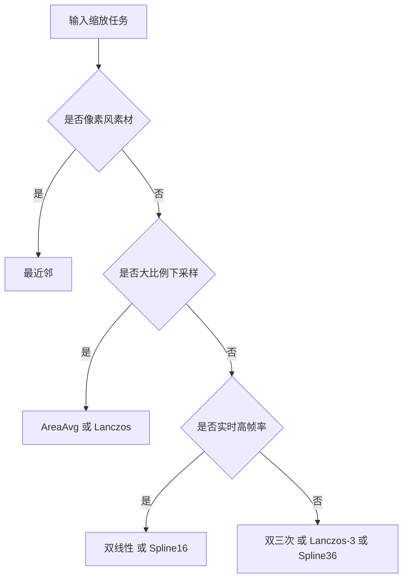

# 图像缩放与插值

> 所属模块：P05-软件渲染原理 / 前置知识：像素与颜色空间、Alpha 混合与合成 / 预计阅读时间：80 分钟

## 本节目标

读完本节后，你将能够：

1. 说明图像缩放在分辨率适配、UI 缩放、动画效果中的核心作用。
2. 独立实现最近邻、双线性、双三次、Lanczos 的 CPU 版采样器。
3. 理解 Spline16/Spline36 的权重半径与质量-性能取舍。
4. 使用旋转矩阵与仿射矩阵完成反向映射采样。
5. 解释下采样为何必须配合抗锯齿、预滤波与 Mipmap 思路。
6. 对照 KrKr2 源码读懂 `ResampleImage` 的调度与工程化细节。

## 正文
### 1. 为什么需要图像缩放

图像缩放（Image Scaling）是 2D 渲染系统无法绕开的基础能力。
在真实项目里，它不是“可选优化”，而是“刚需功能”。

**场景一：显示分辨率适配**。
一套素材要覆盖 1280×720、1920×1080、2560×1440 甚至移动端异形屏。
如果没有缩放，画面会被裁切、拉伸变形或出现大面积留白。

**场景二：UI 缩放**。
系统 DPI 改变、窗口缩放、无障碍大字体模式都会触发 UI 资源重采样。
按钮边缘和文字底图对插值质量非常敏感，算法选择会直接影响观感。

**场景三：动画效果**。
角色进场、镜头推拉、立绘呼吸都会触发连续缩放，算法不稳就会闪烁抖动。

缩放本质是**重采样（Resampling）**：目标像素中心通常映射到源图非整数坐标，因此必须插值估算颜色。

### 2. 插值的统一表达
无论最近邻、双线性、双三次还是 Lanczos，都可以放进统一公式：

\[
I'(x, y) = \sum_j \sum_i I(i, j) \cdot w_x(x-i) \cdot w_y(y-j)
\]

其中 \(I(i,j)\) 是源像素，\(w_x,w_y\) 是权重函数，RANGE 决定邻域大小。
工程上要保证像素中心对齐、边界处理、权重归一化。

### 3. 最近邻插值（Nearest Neighbor）
最近邻的思想非常直接：把目标坐标反推到源图后，取最接近的整数像素。

映射公式：

\[
srcX = (dstX + 0.5) \cdot \frac{srcW}{dstW} - 0.5,
\quad
srcY = (dstY + 0.5) \cdot \frac{srcH}{dstH} - 0.5
\]

优点：极快、实现简单；缺点：锯齿明显。
适用：像素艺术、调试预览。

```cpp
#include <cstdint>
#include <vector>
#include <algorithm>

struct 图像缓冲 {
    int 宽;
    int 高;
    std::vector<uint32_t> 像素; // ARGB
};

static inline int 钳制(int v, int lo, int hi) {
    return std::max(lo, std::min(v, hi));
}

图像缓冲 最近邻缩放(const 图像缓冲& src, int dstW, int dstH) {
    图像缓冲 dst{dstW, dstH, std::vector<uint32_t>(dstW * dstH)};
    const float sx = static_cast<float>(src.宽) / static_cast<float>(dstW);
    const float sy = static_cast<float>(src.高) / static_cast<float>(dstH);

    for (int y = 0; y < dstH; ++y) {
        const float fy = (y + 0.5f) * sy - 0.5f; // 像素中心对齐
        const int iy = 钳制(static_cast<int>(fy + 0.5f), 0, src.高 - 1);
        for (int x = 0; x < dstW; ++x) {
            const float fx = (x + 0.5f) * sx - 0.5f;
            const int ix = 钳制(static_cast<int>(fx + 0.5f), 0, src.宽 - 1);
            dst.像素[y * dstW + x] = src.像素[iy * src.宽 + ix];
        }
    }
    return dst;
}
```

### 4. 双线性插值（Bilinear）
双线性使用 2×2 邻域四个点，把二维插值拆成“两次横向 + 一次纵向”。

设 \(x_0=\lfloor x \rfloor, x_1=x_0+1\)，
\(y_0=\lfloor y \rfloor, y_1=y_0+1\)，
\(u=x-x_0, v=y-y_0\)。

公式：

\[
I=(1-u)(1-v)I_{00}+u(1-v)I_{10}+(1-u)vI_{01}+uvI_{11}
\]

ASCII 采样示意：

```text
I00(x0,y0) ------- I10(x1,y0)
   |                  |
   |     P(x,y)       |
   |                  |
I01(x0,y1) ------- I11(x1,y1)
```

```cpp
#include <cstdint>
#include <algorithm>

static inline uint8_t 通道线性(uint8_t c00, uint8_t c10, uint8_t c01, uint8_t c11, float u, float v) {
    const float top = c00 * (1.0f - u) + c10 * u; // 上边线性插值
    const float bot = c01 * (1.0f - u) + c11 * u; // 下边线性插值
    const float out = top * (1.0f - v) + bot * v; // 纵向线性插值
    return static_cast<uint8_t>(std::max(0.0f, std::min(255.0f, out)) + 0.5f);
}

uint32_t 双线性采样ARGB(const uint32_t* src, int w, int h, float fx, float fy) {
    int x0 = static_cast<int>(fx), y0 = static_cast<int>(fy);
    const float u = fx - x0, v = fy - y0;
    int x1 = std::min(x0 + 1, w - 1), y1 = std::min(y0 + 1, h - 1);
    x0 = std::max(0, x0); y0 = std::max(0, y0);

    const uint32_t p00 = src[y0 * w + x0];
    const uint32_t p10 = src[y0 * w + x1];
    const uint32_t p01 = src[y1 * w + x0];
    const uint32_t p11 = src[y1 * w + x1];

    const uint8_t b = 通道线性(p00 & 0xFF, p10 & 0xFF, p01 & 0xFF, p11 & 0xFF, u, v);
    const uint8_t g = 通道线性((p00 >> 8) & 0xFF, (p10 >> 8) & 0xFF, (p01 >> 8) & 0xFF, (p11 >> 8) & 0xFF, u, v);
    const uint8_t r = 通道线性((p00 >> 16) & 0xFF, (p10 >> 16) & 0xFF, (p01 >> 16) & 0xFF, (p11 >> 16) & 0xFF, u, v);
    const uint8_t a = 通道线性((p00 >> 24) & 0xFF, (p10 >> 24) & 0xFF, (p01 >> 24) & 0xFF, (p11 >> 24) & 0xFF, u, v);

    return (static_cast<uint32_t>(a) << 24) |
           (static_cast<uint32_t>(r) << 16) |
           (static_cast<uint32_t>(g) << 8) |
           static_cast<uint32_t>(b);
}
```

双线性是实时路径常用基线。
质量明显好于最近邻，但边缘会稍软。

### 5. 双三次插值（Bicubic）

双三次插值在横纵两个方向上都使用三次核函数。
每个方向采样 4 个点，总计 16 个像素参与计算。

KrKr2 在 `WeightFunctor.cpp` 中给出的常量是：

- `BicubicWeight::RANGE = 2.0f`

这与 4 点支持范围完全对应。

常见双三次参数族：Catmull-Rom（锐利）与 Mitchell-Netravali（平衡）。

下面给出 Keys 形式实现示例：

```cpp
#include <cstdint>
#include <cmath>
#include <algorithm>

static inline float 三次核(float x, float a) {
    x = std::fabs(x);
    if (x < 1.0f) {
        return (a + 2.0f) * x * x * x - (a + 3.0f) * x * x + 1.0f;
    }
    if (x < 2.0f) {
        return a * x * x * x - 5.0f * a * x * x + 8.0f * a * x - 4.0f * a;
    }
    return 0.0f;
}

uint32_t 双三次采样ARGB(const uint32_t* src, int w, int h, float fx, float fy, float a = -0.5f) {
    const int cx = static_cast<int>(std::floor(fx));
    const int cy = static_cast<int>(std::floor(fy));
    float sumW = 0.0f, b = 0.0f, g = 0.0f, r = 0.0f, al = 0.0f;

    for (int j = -1; j <= 2; ++j) {
        const int sy = std::max(0, std::min(h - 1, cy + j));
        const float wy = 三次核(fy - static_cast<float>(cy + j), a);
        for (int i = -1; i <= 2; ++i) {
            const int sx = std::max(0, std::min(w - 1, cx + i));
            const float wx = 三次核(fx - static_cast<float>(cx + i), a);
            const float ww = wx * wy;
            const uint32_t p = src[sy * w + sx];
            b += (p & 0xFF) * ww;
            g += ((p >> 8) & 0xFF) * ww;
            r += ((p >> 16) & 0xFF) * ww;
            al += ((p >> 24) & 0xFF) * ww;
            sumW += ww;
        }
    }

    if (std::fabs(sumW) < 1e-8f) return 0;
    b /= sumW; g /= sumW; r /= sumW; al /= sumW; // 边界处保持亮度稳定
    auto c8 = [](float v) -> uint8_t {
        return static_cast<uint8_t>(std::max(0.0f, std::min(255.0f, v)) + 0.5f);
    };
    return (static_cast<uint32_t>(c8(al)) << 24) |
           (static_cast<uint32_t>(c8(r)) << 16) |
           (static_cast<uint32_t>(c8(g)) << 8) |
           static_cast<uint32_t>(c8(b));
}
```

### 6. Lanczos 插值

Lanczos 使用窗口化 sinc 函数，通常在下采样质量上优于双线性。

基础函数：

\[
sinc(x)=\frac{\sin(\pi x)}{\pi x},\; sinc(0)=1
\]

Lanczos-a 核：

\[
L(x)=sinc(x)\cdot sinc\left(\frac{x}{a}\right), \quad |x|<a
\]

对比：Lanczos-2 半径 2 更快；Lanczos-3 半径 3 细节更好但更重。

```cpp
#include <cstdint>
#include <cmath>
#include <algorithm>

static inline float sinc(float x) {
    if (std::fabs(x) < 1e-7f) return 1.0f;
    const float px = 3.14159265358979323846f * x;
    return std::sin(px) / px;
}

static inline float Lanczos权重(float x, int a) {
    x = std::fabs(x);
    if (x >= static_cast<float>(a)) return 0.0f; // 窗外为0
    return sinc(x) * sinc(x / static_cast<float>(a));
}

uint32_t Lanczos采样ARGB(const uint32_t* src, int w, int h, float fx, float fy, int a) {
    const int cx = static_cast<int>(std::floor(fx));
    const int cy = static_cast<int>(std::floor(fy));
    float sumW = 0.0f, b = 0.0f, g = 0.0f, r = 0.0f, al = 0.0f;

    for (int j = cy - a + 1; j <= cy + a; ++j) {
        const int sy = std::max(0, std::min(h - 1, j));
        const float wy = Lanczos权重(fy - static_cast<float>(j), a);
        for (int i = cx - a + 1; i <= cx + a; ++i) {
            const int sx = std::max(0, std::min(w - 1, i));
            const float wx = Lanczos权重(fx - static_cast<float>(i), a);
            const float ww = wx * wy;
            const uint32_t p = src[sy * w + sx];
            b += (p & 0xFF) * ww;
            g += ((p >> 8) & 0xFF) * ww;
            r += ((p >> 16) & 0xFF) * ww;
            al += ((p >> 24) & 0xFF) * ww;
            sumW += ww;
        }
    }

    if (std::fabs(sumW) < 1e-8f) return 0;
    b /= sumW; g /= sumW; r /= sumW; al /= sumW;
    auto c8 = [](float v) -> uint8_t {
        return static_cast<uint8_t>(std::max(0.0f, std::min(255.0f, v)) + 0.5f);
    };
    return (static_cast<uint32_t>(c8(al)) << 24) |
           (static_cast<uint32_t>(c8(r)) << 16) |
           (static_cast<uint32_t>(c8(g)) << 8) |
           static_cast<uint32_t>(c8(b));
}
```

### 7. Spline 插值（Spline16 / Spline36）

Spline 插值常用于“比双三次更平稳、比双线性更清晰”的折中需求。
KrKr2 的权重常量非常关键：

- `Spline16Weight::RANGE = 2.0f`
- `Spline36Weight::RANGE = 3.0f`

这意味着：

- Spline16 常见为 4 点支持。
- Spline36 常见为 6 点支持。

一般经验：实时优先 Spline16，离线高质量可用 Spline36。

### 8. 各算法质量与速度对比

| 算法 | 邻域规模 | 速度 | 清晰度 | 伪影风险 | 适用场景 |
|---|---:|---:|---:|---:|---|
| 最近邻 | 1×1 | 极快 | 低 | 锯齿高 | 像素艺术、调试预览 |
| 双线性 | 2×2 | 快 | 中 | 模糊中 | UI、实时动画 |
| 双三次 | 4×4 | 中 | 中高 | 轻振铃 | 通用高质量 |
| Lanczos-2 | 4×4近似 | 中慢 | 高 | 中 | 高质量下采样 |
| Lanczos-3 | 6×6近似 | 慢 | 很高 | 中高 | 静态导出 |
| Spline16 | 4×4近似 | 中 | 高 | 低中 | 动态高质 |
| Spline36 | 6×6近似 | 慢 | 很高 | 中 | 离线高质 |
| AreaAvg | 区域覆盖 | 中 | 高 | 低 | 大比例缩小 |

Mermaid 决策流程图：



### 9. 图像旋转与仿射变换

旋转、缩放、平移、错切都属于仿射变换。

旋转矩阵：

\[
R(\theta)=\begin{bmatrix}\cos\theta & -\sin\theta \\
\sin\theta & \cos\theta\end{bmatrix}
\]

仿射矩阵：

\[
x'=ax+cy+t_x,\quad y'=bx+dy+t_y
\]

渲染时务必使用**反向映射法**：遍历目标像素，反推源坐标，再插值采样。

```cpp
#include <cstdint>
#include <cmath>

struct 仿射矩阵2D { float a, b, c, d, tx, ty; };

bool 求逆(const 仿射矩阵2D& m, 仿射矩阵2D& inv) {
    const float det = m.a * m.d - m.b * m.c;
    if (std::fabs(det) < 1e-8f) return false; // 不可逆矩阵
    const float r = 1.0f / det;
    inv.a =  m.d * r; inv.b = -m.b * r;
    inv.c = -m.c * r; inv.d =  m.a * r;
    inv.tx = -(inv.a * m.tx + inv.c * m.ty);
    inv.ty = -(inv.b * m.tx + inv.d * m.ty);
    return true;
}

extern uint32_t 双线性采样ARGB(const uint32_t*, int, int, float, float);

void 仿射重采样双线性(const uint32_t* src, int sw, int sh,
                   uint32_t* dst, int dw, int dh,
                   const 仿射矩阵2D& M) {
    仿射矩阵2D inv{};
    if (!求逆(M, inv)) return;
    for (int y = 0; y < dh; ++y) {
        for (int x = 0; x < dw; ++x) {
            const float sx = inv.a * x + inv.c * y + inv.tx; // 目标->源
            const float sy = inv.b * x + inv.d * y + inv.ty;
            if (sx >= 0 && sy >= 0 && sx < sw - 1 && sy < sh - 1)
                dst[y * dw + x] = 双线性采样ARGB(src, sw, sh, sx, sy);
            else
                dst[y * dw + x] = 0x00000000; // 越界透明
        }
    }
}
```

### 10. 抗锯齿与 Mipmap

下采样最怕混叠（Aliasing）。
细线条会闪烁、棋盘格会出现摩尔纹。
核心原因是高频信息被错误折叠。

应对策略：先低通预滤波再采样，或对长期缩小资源预生成 Mipmap。

KrKr2 的 `stAreaAvg` 分支就是典型预滤波型下采样路径。

### 11. SIMD 加速的双线性插值

双线性在实时渲染路径出现频率极高，最值得做 SIMD。
基本流程是：8 位通道展开到 16 位、并行乘加、再压回 8 位。

```cpp
#include <emmintrin.h>
#include <cstdint>

uint32_t 双线性SSE2单像素(uint32_t p00, uint32_t p10, uint32_t p01, uint32_t p11, int u8, int v8) {
    __m128i z = _mm_setzero_si128();
    __m128i a = _mm_unpacklo_epi8(_mm_cvtsi32_si128((int)p00), z);
    __m128i b = _mm_unpacklo_epi8(_mm_cvtsi32_si128((int)p10), z);
    __m128i c = _mm_unpacklo_epi8(_mm_cvtsi32_si128((int)p01), z);
    __m128i d = _mm_unpacklo_epi8(_mm_cvtsi32_si128((int)p11), z);
    const int iu = 256 - u8, iv = 256 - v8;
    __m128i wu0 = _mm_set1_epi16((short)iu), wu1 = _mm_set1_epi16((short)u8);
    __m128i wv0 = _mm_set1_epi16((short)iv), wv1 = _mm_set1_epi16((short)v8);
    __m128i top = _mm_srli_epi16(_mm_add_epi16(_mm_mullo_epi16(a, wu0), _mm_mullo_epi16(b, wu1)), 8);
    __m128i bot = _mm_srli_epi16(_mm_add_epi16(_mm_mullo_epi16(c, wu0), _mm_mullo_epi16(d, wu1)), 8);
    __m128i out = _mm_srli_epi16(_mm_add_epi16(_mm_mullo_epi16(top, wv0), _mm_mullo_epi16(bot, wv1)), 8);
    out = _mm_packus_epi16(out, z);
    return (uint32_t)_mm_cvtsi128_si32(out);
}
```

### 12. KrKr2 的 ResampleImage 实现分析

`cpp/core/visual/gl/ResampleImage.cpp` 的关键流程如下：

1. `setClipping` 先裁剪目标区域，避免无效工作。
2. `tTVPBlendParameter::setFunctionFromParam` 根据 `method/opa/hda` 选混合函数。
3. `AxisParamCalculateAxis` 预计算每个目标像素的采样起点、长度、权重。
4. `samplingVertical` + `samplingHorizontal` 采用轴分离卷积。
5. `ResampleMT` 基于像素规模启用多线程。
6. `TVPResampleImage` 用 `stLinear/stCubic/stLanczos/stSpline/stAreaAvg` 做分派。

`cpp/core/visual/gl/WeightFunctor.cpp` 给出的 RANGE 常量：

- Bilinear `1.0`
- Bicubic `2.0`
- Spline16 `2.0`
- Spline36 `3.0`
- Gaussian `2.0`
- BlackmanSinc `4.0`

`cpp/core/visual/LayerBitmapIntf.cpp` 在 `AffineBlt` 路径中会设置 `StretchType`，
旧软渲染逻辑分支可看到 `stFastLinear` 对应双线性路径的调度思路。

