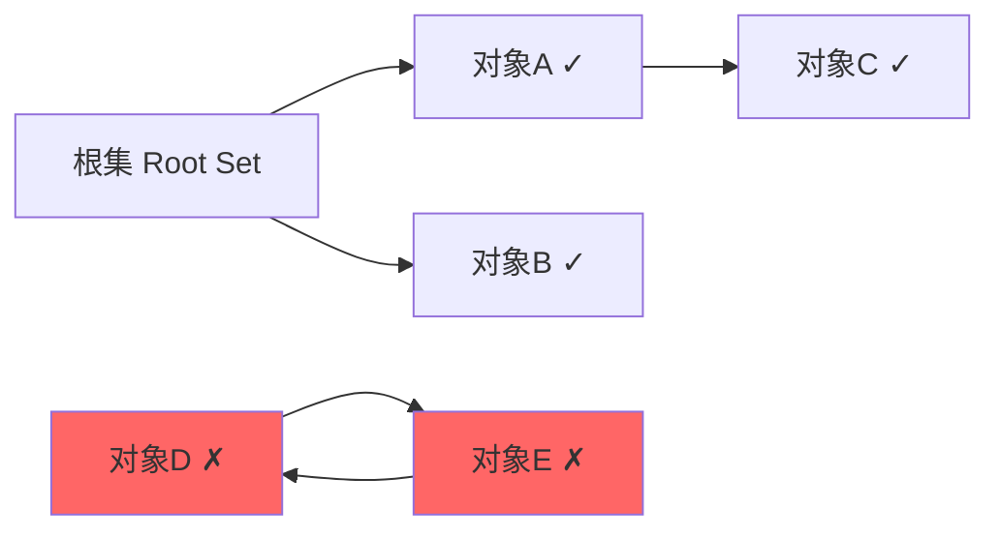

# 垃圾回收

> **所属模块：** P08-编译原理基础
> **前置知识：** [调用栈与闭包](./02-调用栈与闭包.md)、[字节码解释循环](./01-字节码解释循环.md)
> **预计阅读时间：** 20 分钟

## 本节目标

读完本节后，你将能够：

1. 理解垃圾回收（Garbage Collection, GC）的核心问题——"哪些对象已经没有人引用了？"
2. 掌握三大 GC 策略的原理与优劣：引用计数、标记-清除、分代回收
3. 用 C++ 实现一个完整的标记-清除垃圾回收器
4. 读懂 TJS2 采用的引用计数方案——`AddRef` / `Release` / `BeforeDestruction` 的完整生命周期

## 为什么需要垃圾回收

在虚拟机中，脚本代码可以随时创建对象（字符串、数组、字典、闭包等）。如果不回收不再使用的对象，内存会持续增长直到耗尽——这就是**内存泄漏**（Memory Leak）。

手动管理（如 C/C++ 的 `new` / `delete`）容易出错：忘记释放导致泄漏，过早释放导致悬空指针。因此大多数脚本语言的 VM 内置**自动垃圾回收**机制。

GC 需要回答一个核心问题：**哪些对象还在被使用（可达），哪些已经无人引用（不可达）？**

## 三大 GC 策略

### 1. 引用计数（Reference Counting）

每个对象维护一个计数器，记录有多少引用指向它。引用增加时计数 +1，引用消失时计数 -1，计数归零时立即销毁。

```
创建: obj.refCount = 1
赋值 a = obj:  obj.refCount++ → 2
a 离开作用域: obj.refCount-- → 1
原始引用消失:  obj.refCount-- → 0 → 立即释放
```

```cpp
// 引用计数的基本模式
class RefCounted {
    int refCount = 1;          // 创建时 refCount = 1
public:
    void addRef()  { ++refCount; }
    void release() {
        if (--refCount == 0)
            delete this;       // 归零时立即销毁
    }
};
```

| 优点 | 缺点 |
|------|------|
| 实现简单，直观 | **循环引用**无法回收（A→B→A，永远不归零） |
| 销毁时机确定（计数归零即销毁） | 每次赋值都要更新计数（频繁的原子操作） |
| 不需要"暂停世界"(Stop-the-World) | 对象图深时，析构链可能很长 |

### 2. 标记-清除（Mark-and-Sweep）

分两个阶段：

1. **标记阶段**：从根对象（全局变量、栈上的变量）出发，递归遍历所有可达对象，标记为"存活"
2. **清除阶段**：扫描所有已分配对象，未标记的即为垃圾，释放其内存

```
标记前:  [A✓] → [B✓] → [C✓]    [D✗] → [E✗]
                                  ↑ 不可达
清除后:  [A] → [B] → [C]        D 和 E 被释放
```



| 优点 | 缺点 |
|------|------|
| 能处理循环引用 | 需要 Stop-the-World 暂停执行 |
| 不需要每次赋值都维护计数 | 清除阶段遍历所有对象，耗时与总对象数成正比 |
| 实现较简单 | 内存碎片化（可用"压缩"阶段缓解） |

### 3. 分代回收（Generational GC）

基于**弱分代假设**（Weak Generational Hypothesis）："大部分对象在创建后很快就死亡。" 将对象按存活时间分为"新生代"和"老年代"：

- **新生代**：刚创建的对象，GC 频繁扫描，存活的晋升到老年代
- **老年代**：已经多次 GC 仍存活的对象，扫描频率低

```
新生代 (频繁 GC)           老年代 (偶尔 GC)
┌────────────────┐       ┌────────────────┐
│ 新对象1 (死)    │       │ 长寿对象A       │
│ 新对象2 (存活)→ │ ──晋升──→│ 长寿对象B       │
│ 新对象3 (死)    │       │ 新晋升: 对象2   │
└────────────────┘       └────────────────┘
```

| 代表语言 | GC 策略 |
|----------|---------|
| Python | 引用计数 + 分代标记-清除（处理循环引用） |
| Java (HotSpot) | 分代 GC（Young Gen 用复制算法，Old Gen 用标记-压缩） |
| Go | 三色标记-清除（并发，非分代） |
| Lua | 增量标记-清除 |
| TJS2 | 纯引用计数（无循环引用检测） |

## 实战：用 C++ 实现标记-清除 GC

### 定义可 GC 管理的对象

```cpp
#include <vector>
#include <iostream>
#include <string>
#include <algorithm>

// 所有 GC 管理的对象继承此基类
class GCObject {
public:
    bool marked = false;                    // GC 标记位
    std::vector<GCObject*> references;      // 指向其他对象的引用
    std::string name;                       // 调试用名称

    GCObject(const std::string& n) : name(n) {}
    virtual ~GCObject() {
        std::cout << "  释放: " << name << "\n";
    }
};
```

### 实现 GC 管理器

```cpp
class GarbageCollector {
    std::vector<GCObject*> allObjects;  // 所有已分配对象
    std::vector<GCObject*> roots;       // 根集（全局变量、栈变量）

public:
    // 分配新对象（自动注册到 allObjects）
    GCObject* allocate(const std::string& name) {
        auto* obj = new GCObject(name);
        allObjects.push_back(obj);
        return obj;
    }

    // 添加根引用
    void addRoot(GCObject* obj) { roots.push_back(obj); }
    void removeRoot(GCObject* obj) {
        roots.erase(std::remove(roots.begin(), roots.end(), obj), roots.end());
    }

    // 标记阶段：从根集出发，递归标记所有可达对象
    void mark() {
        for (auto* root : roots)
            markObject(root);
    }

    // 清除阶段：释放所有未标记对象
    void sweep() {
        auto it = allObjects.begin();
        while (it != allObjects.end()) {
            if (!(*it)->marked) {
                delete *it;              // 释放不可达对象
                it = allObjects.erase(it);
            } else {
                (*it)->marked = false;   // 重置标记，为下次 GC 做准备
                ++it;
            }
        }
    }

    // 完整 GC 周期
    void collect() {
        std::cout << "=== GC 开始 (对象总数: " << allObjects.size() << ") ===\n";
        mark();
        sweep();
        std::cout << "=== GC 完成 (存活: " << allObjects.size() << ") ===\n\n";
    }

    ~GarbageCollector() {
        for (auto* obj : allObjects) delete obj;
    }

private:
    void markObject(GCObject* obj) {
        if (!obj || obj->marked) return;  // 空指针或已标记，跳过
        obj->marked = true;
        for (auto* ref : obj->references)
            markObject(ref);              // 递归标记引用的对象
    }
};
```

### 测试：验证循环引用被正确回收

```cpp
int main() {
    GarbageCollector gc;

    // 创建对象图: root → A → B → C, 另有 D ↔ E 循环引用
    auto* a = gc.allocate("A");
    auto* b = gc.allocate("B");
    auto* c = gc.allocate("C");
    auto* d = gc.allocate("D");
    auto* e = gc.allocate("E");

    a->references.push_back(b);  // A → B
    b->references.push_back(c);  // B → C
    d->references.push_back(e);  // D → E（循环）
    e->references.push_back(d);  // E → D（循环）

    gc.addRoot(a);  // 只有 A 是根
    gc.collect();
    // 输出: 释放 D, 释放 E（循环引用被正确回收）
    // A, B, C 存活（从根可达）

    gc.removeRoot(a);  // 移除根引用
    gc.collect();
    // 输出: 释放 A, 释放 B, 释放 C（全部不可达）
    return 0;
}
```

输出：

```
=== GC 开始 (对象总数: 5) ===
  释放: D
  释放: E
=== GC 完成 (存活: 3) ===

=== GC 开始 (对象总数: 3) ===
  释放: A
  释放: B
  释放: C
=== GC 完成 (存活: 0) ===
```

引用计数无法回收 D↔E 的循环引用，但标记-清除通过"从根出发遍历"轻松解决了这个问题。

## 动手实践

1. **实现分代 GC**：在本节的标记-清除 GC 基础上实现二代分代回收。新分配的对象进入 young 代，经过 N 次（如 3 次）GC 后晋升到 old 代。young 代频繁回收，old 代偶尔全量扫描。编写测试验证短命对象被快速回收、长寿对象只在 full GC 时扫描。

2. **循环引用检测器**：编写一个函数，接受对象图（用 `std::unordered_map<string, vector<string>>` 表示引用关系），检测是否存在循环引用。使用 DFS + 栈上染色法（白/灰/黑三色标记）。测试用例包括：无环图、自引用、双向引用环、三节点环。

3. **引用计数可视化**：修改本节的 `RefCounted` 类，在 `AddRef` 和 `Release` 时打印对象名和当前计数。构造一个包含 5 个对象的引用关系图，逐步执行赋值和清除操作，观察引用计数的变化过程。对照 TJS2 的 `tTJSDispatch::Release` 实现，理解二次检查的必要性。

4. **对比 GC 暂停时间**：分别用引用计数和标记-清除管理 10000 个对象（其中 80% 短命），用 `<chrono>` 测量每种方案的总 GC 时间和最大单次暂停时间。记录结果并分析：引用计数的暂停时间是否更平稳？标记-清除是否有明显的 Stop-the-World 峰值？

## 对照项目源码：TJS2 的引用计数

TJS2 采用**纯引用计数**方案，没有标记-清除作为后备。所有对象继承自 `tTJSDispatch`，通过 `AddRef()` / `Release()` 管理生命周期。

### `tTJSDispatch::Release` 的精妙设计

```cpp
// tjsObject.cpp 第 110-130 行
tjs_uint tTJSDispatch::Release() {
    if (RefCount == 1) {
        // 计数即将归零——先调用 BeforeDestruction
        if (!BeforeDestructionCalled) {
            BeforeDestructionCalled = true;
            BeforeDestruction();  // 析构前回调（可能重新增加引用）
        }
        if (RefCount == 1) {     // 再次检查——BeforeDestruction 可能 AddRef
            delete this;
            return 0;
        }
    }
    return --RefCount;
}
```

为什么要**两次检查** `RefCount == 1`？因为 `BeforeDestruction()` 是虚函数，子类可能在其中把 `this` 传给其他对象（从而触发 `AddRef`）。如果发生这种情况，对象就不应该被销毁。

### TJS2 引用计数的应用场景

| 场景 | AddRef 时机 | Release 时机 |
|------|-------------|-------------|
| 变量赋值 | `tTJSVariant` 赋值运算符内部 | 旧值被覆盖时 |
| 函数调用 | 参数传递到被调者帧时 | 帧销毁（`Deallocate`）时清除 |
| 闭包捕获 | `VM_CHGTHIS` 绑定 objthis | 闭包对象自身被释放时 |
| 属性设置 | `PropSet` 将值存入对象成员 | 成员被覆盖或对象被 Invalidate |

### 循环引用问题

TJS2 **不处理**循环引用。如果脚本创建了 `a.ref = b; b.ref = a;`，这两个对象永远不会被回收。实际运行中，KiriKiri 游戏脚本很少创建循环引用结构（大部分是树形的 UI 层级），所以纯引用计数在实践中足够。

TJS2 另一个防线是 `Invalidate` 机制：外部代码可以主动调用 `Invalidate` 标记对象为"已失效"，即使引用计数不为零也会触发清理逻辑。这用于关闭窗口、卸载图层等场景。

## 常见错误与解决方案

### 错误 1：引用计数不配对导致泄漏

```
错误现象：对象永远不被释放，内存持续增长
原因：某处 AddRef 了但忘记对应的 Release
解决：使用 RAII 智能指针包装，确保 scope 退出时自动 Release
```

```cpp
// 用 RAII 包装 TJS2 风格的引用计数
template<typename T>
class RefPtr {
    T* ptr = nullptr;
public:
    RefPtr(T* p) : ptr(p) {}  // 不额外 AddRef（构造时已有引用）
    ~RefPtr() { if (ptr) ptr->Release(); }
    RefPtr(const RefPtr& o) : ptr(o.ptr) { if (ptr) ptr->AddRef(); }
    T* operator->() { return ptr; }
};
```

### 错误 2：标记-清除中忘记重置标记位

```
错误现象：第二次 GC 后所有对象都被误认为存活，内存不断增长
原因：sweep 阶段没有把存活对象的 marked 重置为 false
解决：在 sweep 中，存活对象 marked = false（为下次 GC 准备）
```

### 错误 3：析构顺序导致悬空指针

```
错误现象：GC 释放对象 A 时，A 的析构函数访问了已被释放的对象 B
原因：标记-清除按遍历顺序释放，不保证析构顺序
解决：析构函数不要访问其他 GC 管理的对象（TJS2 的 BeforeDestruction 正是为此设计）
```

## 本节小结

- GC 解决"自动回收不可达对象"的问题，三大策略各有优劣
- 引用计数简单高效，但无法处理循环引用；TJS2 采用此方案
- 标记-清除能处理循环引用，但需要暂停执行（Stop-the-World）
- 分代 GC 利用"大部分对象短命"的统计特性，减少全堆扫描频率
- TJS2 的 `Release` 使用二次检查模式，兼容 `BeforeDestruction` 中可能的复活操作

## 练习题与答案

### 题目 1：为标记-清除 GC 添加分配阈值触发机制

修改 `GarbageCollector`，使其在分配超过 N 个对象后自动触发 GC（而不是手动调用 `collect()`）。

<details>
<summary>查看答案</summary>

```cpp
class GarbageCollector {
    int allocThreshold = 8;  // 每分配 8 个对象触发一次 GC
    // ... 其他成员不变 ...

    GCObject* allocate(const std::string& name) {
        if (static_cast<int>(allObjects.size()) >= allocThreshold) {
            collect();
            allocThreshold = allObjects.size() * 2;  // 动态调整阈值
        }
        auto* obj = new GCObject(name);
        allObjects.push_back(obj);
        return obj;
    }
};
```

关键点：阈值设为当前存活对象数的 2 倍，避免 GC 过于频繁。这与 Go 语言 GC 的 `GOGC=100`（翻倍策略）思路相同。

</details>

### 题目 2：解释 TJS2 `BeforeDestruction` 的"复活"机制

请描述以下场景中 `Release` 的行为：对象 A 的 `BeforeDestruction` 将 `this` 注册到一个全局列表中（触发 `AddRef`），会发生什么？

<details>
<summary>查看答案</summary>

执行流程：

1. `A.Release()` 被调用，`RefCount == 1`，进入销毁分支
2. `BeforeDestruction()` 被调用，其中执行了 `globalList.push(this)` → 内部触发 `A.AddRef()`，`RefCount` 变为 2
3. 回到 `Release()`，再次检查 `RefCount == 1` → 条件为假（现在是 2）
4. 跳过 `delete this`，执行 `--RefCount`，`RefCount` 变为 1
5. 对象 A **没有被销毁**——它被"复活"了

这个设计允许对象在即将销毁时把自己"救回来"。`BeforeDestructionCalled = true` 保证回调只执行一次，避免再次 `Release` 时重复调用。

</details>

### 题目 3：引用计数 vs 标记-清除的选择

如果你设计一个脚本语言 VM，以下场景应该选择哪种 GC 策略？请说明理由。

（a）游戏脚本引擎，对象结构主要是树形（UI 层级），低延迟要求高
（b）通用编程语言，用户可能创建复杂的图数据结构，吞吐量优先

<details>
<summary>查看答案</summary>

（a）选择**引用计数**。理由：
- 游戏 UI 的树形结构不会产生循环引用
- 引用计数无 Stop-the-World 暂停，符合低延迟要求
- 对象销毁时机确定，有利于资源管理（纹理、音频句柄等需要及时释放）
- TJS2（KiriKiri 游戏引擎脚本）正是这样选择的

（b）选择**标记-清除**（最好配合分代）。理由：
- 图数据结构必然产生循环引用，引用计数无法回收
- 吞吐量优先意味着可以容忍偶尔的 GC 暂停
- 标记-清除的批量回收比逐个 Release 效率更高
- Python、Java、Go 等通用语言均采用此方案

</details>

## 下一步

[语言设计与词法器实现](../07-实战-迷你脚本语言/01-语言设计与词法器实现.md) — 进入 P08 最终实战章节，从零设计一门迷你脚本语言并实现词法分析器。