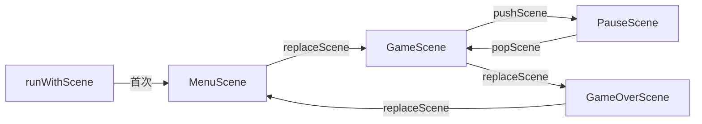

# 场景切换与过渡

> **所属模块：** P10-Cocos2d-x 框架
> **前置知识：** [01-Director与主循环](../01-Cocos2d-x架构/01-Director与主循环.md)、[02-父子关系与zOrder](02-父子关系与zOrder.md)
> **预计阅读时间：** 25 分钟

## 本节目标

读完本节后，你将能够：
1. 掌握 Director 提供的三种场景切换方式（runWithScene / replaceScene / pushScene+popScene）
2. 使用过渡动画（TransitionScene）为场景切换添加视觉效果
3. 理解场景栈（Scene Stack）的工作原理与适用场景
4. 处理场景切换中的资源预加载与生命周期管理
5. 对照 KrKr2 源码理解其 UI 表单栈的场景管理方式

## 场景切换基础

### Director 的场景管理

`Director` 单例负责管理当前运行的场景。在任何时刻，只有**一个**场景是"当前运行场景"（running scene），但 Director 内部维护了一个**场景栈**（Scene Stack）：

```
Director 场景栈示意：

┌─────────────┐
│  PauseScene  │ ← 栈顶（当前运行场景）
├─────────────┤
│  GameScene   │ ← 被暂停（pushScene 推入后）
├─────────────┤
│  MenuScene   │ ← 更早推入
└─────────────┘
```

### runWithScene — 启动首个场景

`runWithScene()` 只能在**应用启动时**调用一次，用于设置第一个场景：

```cpp
#include "cocos2d.h"
USING_NS_CC;

bool AppDelegate::applicationDidFinishLaunching() {
    auto director = Director::getInstance();
    auto glview = director->getOpenGLView();
    
    if (!glview) {
        glview = GLViewImpl::create("My Game");
        director->setOpenGLView(glview);
    }
    
    // 设置设计分辨率
    glview->setDesignResolutionSize(960, 640,
        ResolutionPolicy::SHOW_ALL);
    
    // 创建并运行第一个场景
    auto scene = MenuScene::create();
    director->runWithScene(scene);  // 仅在此处调用一次
    
    return true;
}
```

> **注意：** 如果在已有场景运行时调用 `runWithScene()`，会触发断言失败。之后的场景切换必须使用 `replaceScene()` 或 `pushScene()`。

### replaceScene — 替换当前场景

`replaceScene()` 用新场景**替换**当前场景。旧场景会被释放（引用计数归零后销毁）：

```cpp
// 从菜单场景切换到游戏场景
void MenuScene::onStartGame() {
    auto gameScene = GameScene::create();
    Director::getInstance()->replaceScene(gameScene);
    // 此时 MenuScene 将在当前帧结束后被释放
    // 注意：不要在 replaceScene 之后访问 this 的成员
}
```

`replaceScene` 的生命周期：

```
当前帧：
  MenuScene::onStartGame() 调用 replaceScene(gameScene)
  ↓ replaceScene 将 gameScene 存入 Director::_nextScene

帧结束（在 Director::drawScene() 中）：
  1. gameScene->onEnter()        ← 新场景进入
  2. gameScene->onEnterTransitionDidFinish()
  3. MenuScene->onExitTransitionDidStart()
  4. MenuScene->onExit()         ← 旧场景退出
  5. MenuScene->cleanup()        ← 清理 Action/Schedule
  6. MenuScene 引用计数 -1 → 可能触发析构
```

### pushScene / popScene — 场景栈操作

`pushScene()` 将新场景推入栈顶，旧场景**暂停但不销毁**。适合需要返回的场景（如暂停菜单、设置页面）：

```cpp
// 暂停游戏 → 显示暂停菜单
void GameScene::onPause() {
    auto pauseScene = PauseScene::create();
    Director::getInstance()->pushScene(pauseScene);
    // GameScene 被暂停，保留在栈中
    // 所有 Action 和 Schedule 自动暂停
}

// 从暂停菜单返回游戏
void PauseScene::onResume() {
    Director::getInstance()->popScene();
    // PauseScene 被弹出并释放
    // GameScene 恢复运行，Action 和 Schedule 继续
}
```

场景栈操作的生命周期对比：

```
pushScene(pauseScene):
  pauseScene->onEnter()                    ← 新场景进入
  pauseScene->onEnterTransitionDidFinish()
  gameScene->onExitTransitionDidStart()
  gameScene->onExit()                      ← 旧场景退出（但不 cleanup）

popScene():
  gameScene->onEnter()                     ← 旧场景恢复
  gameScene->onEnterTransitionDidFinish()
  pauseScene->onExitTransitionDidStart()
  pauseScene->onExit()                     ← 栈顶场景退出
  pauseScene->cleanup()                    ← cleanup 并释放
```

### 三种方式对比

| 方式 | 旧场景 | 适用场景 | 内存 |
|------|--------|----------|------|
| `runWithScene` | 无旧场景 | 仅应用启动时 | — |
| `replaceScene` | 销毁 | 场景间单向跳转（菜单→游戏） | 低（旧场景释放） |
| `pushScene` | 暂停保留 | 需要返回的叠加（游戏→暂停） | 高（两个场景共存） |



## 过渡动画（TransitionScene）

### 内置过渡效果

Cocos2d-x 提供了大量内置过渡动画效果，通过 `TransitionScene` 的子类实现：

```cpp
// 基本用法：将目标场景包装在过渡效果中
auto gameScene = GameScene::create();

// 淡入淡出（最常用）
auto transition = TransitionFade::create(
    1.0f,        // 过渡时长（秒）
    gameScene,   // 目标场景
    Color3B::BLACK  // 淡入淡出的中间颜色
);
Director::getInstance()->replaceScene(transition);
```

常用过渡效果一览：

| 类名 | 效果描述 | 适用场景 |
|------|----------|----------|
| `TransitionFade` | 淡入淡出（经典） | 通用场景切换 |
| `TransitionCrossFade` | 交叉淡入淡出 | 两场景渐变混合 |
| `TransitionSlideInL/R/T/B` | 从左/右/上/下滑入 | 菜单导航 |
| `TransitionFlipX/Y` | 沿 X/Y 轴翻转 | 翻牌效果 |
| `TransitionZoomFlipX/Y` | 缩放翻转 | 更有层次的翻转 |
| `TransitionShrinkGrow` | 缩小旧场景 + 放大新场景 | 聚焦效果 |
| `TransitionRotoZoom` | 旋转缩放 | 戏剧化切换 |
| `TransitionMoveInL/R/T/B` | 新场景从方向移入（覆盖旧场景） | 页面推入 |
| `TransitionPageTurn` | 翻书效果 | 故事/教程页面 |
| `TransitionProgressRadialCCW/CW` | 圆形擦除 | 过场动画 |
| `TransitionFadeTR/BL/Up/Down` | 方格渐变消失 | 像素风格 |
| `TransitionTurnOffTiles` | 瓦片翻转消失 | 复古效果 |

### 代码示例：多种过渡效果

```cpp
#include "cocos2d.h"
USING_NS_CC;

// 创建目标场景
auto nextScene = LevelScene::create();

// 1. 淡入淡出 — 1秒，经黑色过渡
auto fade = TransitionFade::create(1.0f, nextScene, Color3B::BLACK);

// 2. 从右侧滑入 — 0.5秒
auto slideIn = TransitionSlideInR::create(0.5f, nextScene);

// 3. X轴翻转 — 0.8秒，从左侧翻转
auto flipX = TransitionFlipX::create(0.8f, nextScene,
    TransitionScene::Orientation::LEFT_OVER);

// 4. 翻书效果 — 1.2秒，向前翻
auto pageTurn = TransitionPageTurn::create(1.2f, nextScene, false);

// 5. 交叉淡入淡出 — 1秒
auto crossFade = TransitionCrossFade::create(1.0f, nextScene);

// 选择一个使用
Director::getInstance()->replaceScene(fade);
```

### 过渡期间的注意事项

过渡动画期间，新旧两个场景**同时存在**：

```
TransitionFade 时间线（1秒过渡）：
                                            
t=0.0s    t=0.5s    t=1.0s
│         │         │
▼         ▼         ▼
旧场景 α=1.0  α=0.5  α=0.0 (释放)
新场景 α=0.0  α=0.5  α=1.0 (成为当前)
```

重要注意事项：

```cpp
// ❌ 错误：过渡期间触发另一个场景切换
auto transition = TransitionFade::create(1.0f, nextScene);
Director::getInstance()->replaceScene(transition);
// 过渡还没完成就又切换 → 未定义行为
Director::getInstance()->replaceScene(anotherScene);

// ✅ 正确：等过渡完成后再切换
// 在 nextScene::onEnterTransitionDidFinish() 中决定下一步
void LevelScene::onEnterTransitionDidFinish() {
    Scene::onEnterTransitionDidFinish();
    // 这里过渡已经完成，可以安全操作
}

// ❌ 错误：过渡期间创建大量资源导致卡顿
// ✅ 正确：在过渡开始前预加载资源
Director::getInstance()->getTextureCache()->addImageAsync(
    "level_bg.png",
    [](Texture2D* tex) {
        // 纹理加载完成后再开始过渡
        auto scene = LevelScene::create();
        auto transition = TransitionFade::create(0.5f, scene);
        Director::getInstance()->replaceScene(transition);
    });
```

### 自定义过渡效果

继承 `TransitionScene` 实现自定义过渡：

```cpp
class TransitionDiamond : public TransitionScene {
public:
    static TransitionDiamond* create(float duration, Scene* scene) {
        auto t = new TransitionDiamond();
        if (t && t->initWithDuration(duration, scene)) {
            t->autorelease();
            return t;
        }
        CC_SAFE_DELETE(t);
        return nullptr;
    }
    
    void onEnter() override {
        TransitionScene::onEnter();
        
        // 旧场景：从中心缩小消失
        _outScene->setAnchorPoint(Vec2(0.5f, 0.5f));
        _outScene->setPosition(Vec2(
            Director::getInstance()->getVisibleSize().width / 2,
            Director::getInstance()->getVisibleSize().height / 2));
        
        auto scaleOut = ScaleTo::create(_duration, 0.0f);
        auto rotateOut = RotateBy::create(_duration, 360);
        auto spawn = Spawn::create(scaleOut, rotateOut, nullptr);
        
        _outScene->runAction(Sequence::create(
            spawn,
            CallFunc::create([this]() { this->finish(); }),
            nullptr));
        
        // 新场景：从中心放大出现
        _inScene->setScale(0.0f);
        _inScene->setAnchorPoint(Vec2(0.5f, 0.5f));
        _inScene->setPosition(Vec2(
            Director::getInstance()->getVisibleSize().width / 2,
            Director::getInstance()->getVisibleSize().height / 2));
        
        auto scaleIn = ScaleTo::create(_duration, 1.0f);
        auto rotateIn = RotateBy::create(_duration, -360);
        _inScene->runAction(Spawn::create(scaleIn, rotateIn, nullptr));
    }
};
```

## 资源预加载策略

### 场景切换前的资源准备

大型场景切换时，直接 `replaceScene` 可能导致卡顿（新场景初始化时加载大量纹理）。正确做法是先预加载，再切换：

```cpp
class LoadingScene : public Scene {
    int _totalAssets = 0;
    int _loadedAssets = 0;
    Label* _progressLabel = nullptr;
    
public:
    static LoadingScene* create(
        const std::vector<std::string>& assets) {
        auto scene = new LoadingScene();
        if (scene && scene->init()) {
            scene->autorelease();
            scene->startLoading(assets);
            return scene;
        }
        CC_SAFE_DELETE(scene);
        return nullptr;
    }
    
    bool init() override {
        if (!Scene::init()) return false;
        
        auto size = Director::getInstance()->getVisibleSize();
        _progressLabel = Label::createWithSystemFont(
            "Loading... 0%", "Arial", 36);
        _progressLabel->setPosition(
            Vec2(size.width / 2, size.height / 2));
        addChild(_progressLabel);
        
        return true;
    }
    
    void startLoading(const std::vector<std::string>& assets) {
        _totalAssets = static_cast<int>(assets.size());
        _loadedAssets = 0;
        
        auto texCache = Director::getInstance()->getTextureCache();
        
        for (const auto& path : assets) {
            texCache->addImageAsync(path,
                [this](Texture2D*) {
                    _loadedAssets++;
                    float pct = 100.0f * _loadedAssets / _totalAssets;
                    _progressLabel->setString(
                        StringUtils::format("Loading... %.0f%%", pct));
                    
                    if (_loadedAssets >= _totalAssets) {
                        onLoadComplete();
                    }
                });
        }
    }
    
    void onLoadComplete() {
        // 所有资源加载完毕，切换到游戏场景
        auto gameScene = GameScene::create();
        auto transition = TransitionFade::create(0.5f, gameScene);
        Director::getInstance()->replaceScene(transition);
    }
};

// 使用方式
void MenuScene::onStartGame() {
    std::vector<std::string> assets = {
        "level1_bg.png", "player.png", "enemies.png",
        "tileset.png", "ui_atlas.png"
    };
    auto loading = LoadingScene::create(assets);
    Director::getInstance()->replaceScene(loading);
}
```

## 常见错误与解决方案

### 错误 1：在 replaceScene 后访问旧场景成员

```cpp
// ❌ 错误：replaceScene 后 this 即将被销毁
void MenuScene::onStartGame() {
    Director::getInstance()->replaceScene(GameScene::create());
    _startButton->setEnabled(false);  // 危险！this 可能已被释放
    CCLOG("Menu score: %d", _score);  // 可能访问已释放内存
}

// ✅ 正确：replaceScene 后不再访问 this 的成员
void MenuScene::onStartGame() {
    _startButton->setEnabled(false);  // 在 replaceScene 之前操作
    auto gameScene = GameScene::create();
    gameScene->setInitialScore(_score);  // 传递数据到新场景
    Director::getInstance()->replaceScene(gameScene);
    // 此处之后不再访问 this 的成员
}
```

### 错误 2：场景栈溢出

```cpp
// ❌ 错误：反复 pushScene 不 popScene
void GameScene::showDialog() {
    // 每次都 push 一个新对话框场景
    Director::getInstance()->pushScene(DialogScene::create());
    // 如果玩家反复打开对话框，栈不断增长 → 内存暴涨
}

// ✅ 正确：对话框用 addChild 而非 pushScene
void GameScene::showDialog() {
    auto dialog = DialogLayer::create();
    addChild(dialog, 1000, "Dialog");  // 作为子节点叠加
}

void GameScene::closeDialog() {
    removeChildByName("Dialog");
}
```

### 错误 3：过渡期间切换场景

```cpp
// ❌ 错误：过渡未完成就再次切换
void onButtonClick() {
    auto t1 = TransitionFade::create(1.0f, SceneA::create());
    Director::getInstance()->replaceScene(t1);
    // 用户在过渡期间又点击了按钮
    auto t2 = TransitionFade::create(1.0f, SceneB::create());
    Director::getInstance()->replaceScene(t2);  // 冲突！
}

// ✅ 正确：添加切换锁
bool _isTransitioning = false;

void onButtonClick() {
    if (_isTransitioning) return;  // 过渡中，忽略输入
    _isTransitioning = true;
    
    auto t = TransitionFade::create(1.0f, SceneA::create());
    Director::getInstance()->replaceScene(t);
}
```

## 对照项目源码

KrKr2 没有使用 Director 的场景栈（pushScene/popScene），而是实现了自己的 **UI 表单栈**（Form Stack），原因是 KrKr2 的 UI 表单需要在游戏场景**之上叠加**，而不是替换场景：

> **文件：** `cpp/core/environ/cocos2d/MainScene.cpp` 第 1827-1924 行

```cpp
// KrKr2 的 UI 表单栈管理
void TVPMainScene::pushUIForm(iTVPBaseForm* form) {
    // 不使用 Director::pushScene
    // 而是将表单作为子节点添加到 _uiNode
    Node* node = form->getNode();
    _uiNode->addChild(node);
    _formStack.push_back(form);
    
    // 播放进入动画（从右侧滑入）
    auto size = Director::getInstance()->getVisibleSize();
    node->setPositionX(size.width);  // 起始位置：屏幕右侧外
    node->runAction(MoveTo::create(0.3f, Vec2::ZERO));  // 滑入
    
    // 暂停游戏输入
    _gameNode->setTouchEnabled(false);
}

void TVPMainScene::popUIForm() {
    if (_formStack.empty()) return;
    
    auto form = _formStack.back();
    _formStack.pop_back();
    
    Node* node = form->getNode();
    auto size = Director::getInstance()->getVisibleSize();
    
    // 播放退出动画（滑出到右侧）
    node->runAction(Sequence::create(
        MoveTo::create(0.3f, Vec2(size.width, 0)),
        CallFunc::create([node]() {
            node->removeFromParent();
        }),
        nullptr));
    
    // 如果栈空了，恢复游戏输入
    if (_formStack.empty()) {
        _gameNode->setTouchEnabled(true);
    }
}
```

**KrKr2 的方式与 Director 场景栈对比：**

| 特性 | Director pushScene/popScene | KrKr2 表单栈 |
|------|----------------------------|---------------|
| 场景共存 | 旧场景暂停不可见 | 游戏场景持续运行 |
| 渲染 | 只渲染栈顶场景 | 游戏 + UI 同时渲染 |
| 动画 | 需要 TransitionScene | 自定义 Action 动画 |
| 适用场景 | 独立的全屏场景切换 | 覆盖式 UI 面板 |

## 动手实践

### 实践：实现一个场景管理器

```cpp
#include "cocos2d.h"
USING_NS_CC;

// 场景管理器 — 封装常用的场景切换操作
class SceneManager {
public:
    // 单例
    static SceneManager* getInstance() {
        static SceneManager instance;
        return &instance;
    }
    
    // 无过渡直接切换
    void goToScene(Scene* scene) {
        if (_isTransitioning) return;
        auto director = Director::getInstance();
        
        if (director->getRunningScene()) {
            director->replaceScene(scene);
        } else {
            director->runWithScene(scene);
        }
    }
    
    // 带淡入淡出过渡
    void fadeToScene(Scene* scene, float duration = 0.5f) {
        if (_isTransitioning) return;
        _isTransitioning = true;
        
        auto transition = TransitionFade::create(
            duration, scene, Color3B::BLACK);
        Director::getInstance()->replaceScene(transition);
        
        // 过渡结束后解锁
        Director::getInstance()->getScheduler()->schedule(
            [this](float) { _isTransitioning = false; },
            this, 0, 0, duration, false, "unlock_transition");
    }
    
    // 滑入切换（指定方向）
    enum class Direction { Left, Right, Up, Down };
    
    void slideToScene(Scene* scene, Direction dir,
                      float duration = 0.3f) {
        if (_isTransitioning) return;
        _isTransitioning = true;
        
        TransitionScene* transition = nullptr;
        switch (dir) {
            case Direction::Left:
                transition = TransitionSlideInL::create(
                    duration, scene);
                break;
            case Direction::Right:
                transition = TransitionSlideInR::create(
                    duration, scene);
                break;
            case Direction::Up:
                transition = TransitionSlideInT::create(
                    duration, scene);
                break;
            case Direction::Down:
                transition = TransitionSlideInB::create(
                    duration, scene);
                break;
        }
        
        Director::getInstance()->replaceScene(transition);
        
        Director::getInstance()->getScheduler()->schedule(
            [this](float) { _isTransitioning = false; },
            this, 0, 0, duration, false, "unlock_transition");
    }
    
    bool isTransitioning() const { return _isTransitioning; }
    
private:
    SceneManager() = default;
    bool _isTransitioning = false;
};

// 使用示例
void MenuScene::onPlay() {
    auto game = GameScene::create();
    SceneManager::getInstance()->fadeToScene(game, 0.8f);
}
```

## 本节小结

- **runWithScene** 只在应用启动时调用一次，设置第一个场景
- **replaceScene** 销毁旧场景，适合单向跳转（菜单→游戏→结算）
- **pushScene/popScene** 保留旧场景，适合需要返回的叠加（游戏→暂停→游戏）
- **TransitionScene** 为切换添加视觉效果，过渡期间两个场景共存
- 场景切换前应**预加载资源**，避免切换瞬间卡顿
- KrKr2 没有使用 Director 场景栈，而是在单一 Scene 上实现了自己的 UI 表单栈（addChild 到 UINode）

## 练习题与答案

### 题目 1：选择正确的场景切换方式

对于以下场景，选择最合适的切换方式（runWithScene / replaceScene / pushScene+popScene / addChild）：
1. 应用启动后显示 Logo 闪屏
2. 从主菜单进入游戏关卡
3. 游戏中打开背包界面（需要返回游戏）
4. 游戏结束后显示排行榜
5. 游戏中弹出一个确认对话框

<details>
<summary>查看答案</summary>

1. **应用启动后显示 Logo** → `runWithScene(logoScene)` — 这是第一个场景
2. **主菜单进入游戏** → `replaceScene(gameScene)` — 不需要返回菜单，释放菜单资源
3. **打开背包界面** → `pushScene(bagScene)` 或 `addChild(bagLayer)` — 需要返回游戏。如果背包是全屏的用 pushScene，如果是半透明叠加用 addChild
4. **游戏结束显示排行榜** → `replaceScene(rankScene)` — 游戏已结束，不需要保留游戏场景
5. **弹出确认对话框** → `addChild(dialogLayer)` — 对话框是小面板，不应该用 pushScene 创建完整场景

关键原则：
- 全屏、不需要返回 → `replaceScene`
- 全屏、需要返回 → `pushScene`
- 非全屏叠加、需要返回 → `addChild`（像 KrKr2 的做法）

</details>

### 题目 2：实现带进度条的加载场景

编写一个 `LoadingScene`，要求：
1. 接收一组纹理路径异步加载
2. 显示加载进度百分比
3. 加载完成后用淡入淡出效果切换到目标场景

<details>
<summary>查看答案</summary>

```cpp
#include "cocos2d.h"
USING_NS_CC;

class LoadingScene : public Scene {
    Label* _label = nullptr;
    ProgressTimer* _progressBar = nullptr;
    int _total = 0;
    int _loaded = 0;
    std::function<Scene*()> _sceneCreator;
    
public:
    // sceneCreator 是一个工厂函数，加载完成后调用来创建目标场景
    static LoadingScene* create(
        const std::vector<std::string>& textures,
        std::function<Scene*()> sceneCreator)
    {
        auto scene = new LoadingScene();
        if (scene && scene->init()) {
            scene->autorelease();
            scene->_sceneCreator = sceneCreator;
            scene->loadTextures(textures);
            return scene;
        }
        CC_SAFE_DELETE(scene);
        return nullptr;
    }
    
    bool init() override {
        if (!Scene::init()) return false;
        
        auto size = Director::getInstance()->getVisibleSize();
        auto origin = Director::getInstance()->getVisibleOrigin();
        
        // 背景
        auto bg = LayerColor::create(Color4B(30, 30, 30, 255));
        addChild(bg);
        
        // 进度条背景
        auto barBg = Sprite::create("progress_bg.png");
        // 如果没有图片资源，可以用 DrawNode 替代
        if (!barBg) {
            auto draw = DrawNode::create();
            Vec2 verts[] = {
                Vec2(-200, -10), Vec2(200, -10),
                Vec2(200, 10), Vec2(-200, 10)
            };
            draw->drawPolygon(verts, 4,
                Color4F(0.2f, 0.2f, 0.2f, 1.0f),
                1, Color4F::WHITE);
            draw->setPosition(Vec2(
                origin.x + size.width / 2,
                origin.y + size.height / 3));
            addChild(draw);
        }
        
        // 进度文本
        _label = Label::createWithSystemFont(
            "Loading... 0%", "Arial", 28);
        _label->setPosition(Vec2(
            origin.x + size.width / 2,
            origin.y + size.height / 2));
        addChild(_label);
        
        return true;
    }
    
    void loadTextures(const std::vector<std::string>& textures) {
        _total = static_cast<int>(textures.size());
        if (_total == 0) {
            onComplete();
            return;
        }
        
        _loaded = 0;
        auto cache = Director::getInstance()->getTextureCache();
        
        for (const auto& path : textures) {
            cache->addImageAsync(path,
                [this](Texture2D* tex) {
                    _loaded++;
                    float pct = 100.0f * _loaded / _total;
                    _label->setString(
                        StringUtils::format("Loading... %.0f%%", pct));
                    
                    if (_loaded >= _total) {
                        // 延迟一帧确保最后的进度显示
                        scheduleOnce([this](float) {
                            onComplete();
                        }, 0.1f, "complete");
                    }
                });
        }
    }
    
    void onComplete() {
        _label->setString("Loading Complete!");
        
        // 创建目标场景并用淡入淡出切换
        auto targetScene = _sceneCreator();
        auto transition = TransitionFade::create(0.5f,
            targetScene, Color3B::BLACK);
        Director::getInstance()->replaceScene(transition);
    }
};

// 使用：
void MenuScene::onStartGame() {
    auto loading = LoadingScene::create(
        {"bg.png", "player.png", "tileset.png", "ui.png"},
        []() -> Scene* { return GameScene::create(); }
    );
    Director::getInstance()->replaceScene(loading);
}
```

</details>

### 题目 3：分析 KrKr2 表单栈的设计优势

KrKr2 为什么不使用 Director 的 pushScene/popScene 来管理 UI 表单？请从以下方面分析：渲染、性能、用户体验。

<details>
<summary>查看答案</summary>

KrKr2 选择自建表单栈而非 Director 场景栈的原因：

**1. 渲染方面：**
- `pushScene` 后旧场景不再渲染（只渲染栈顶场景）。KrKr2 需要在显示 UI 表单的同时继续渲染游戏画面（如半透明遮罩 + 背景可见）
- 自建栈使用 `addChild` 到 UINode（zOrder=100），游戏画面在 GameNode（zOrder=0）持续渲染

**2. 性能方面：**
- `pushScene` 会暂停整个旧场景（包括其 Schedule 和 Action）。KrKr2 的游戏引擎需要持续运行 `TVPMainScene::update()` 来驱动 KiriKiri 内核（`::Application->Run()`）
- 如果使用 pushScene，游戏引擎会暂停 → 脚本不再执行 → 音频可能中断

**3. 用户体验方面：**
- 自建栈可以实现滑入/滑出动画（MoveTo Action），比 TransitionScene 更灵活
- 多个表单可以同时存在并可见（如设置面板 + 确认对话框叠加）
- Director 场景栈只能看到栈顶一个场景

**总结：** KrKr2 的架构是"单场景 + 多子节点层"，所有内容都在 TVPMainScene 中通过 zOrder 分层管理。这比多场景栈更适合需要持续运行后台逻辑的应用。

</details>

## 下一步

[01-Sprite创建与纹理管理](../03-精灵与动画/01-Sprite创建与纹理管理.md) — 学习精灵的创建方式、纹理缓存（TextureCache）和纹理格式管理。
